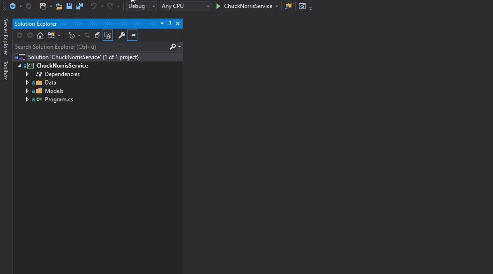
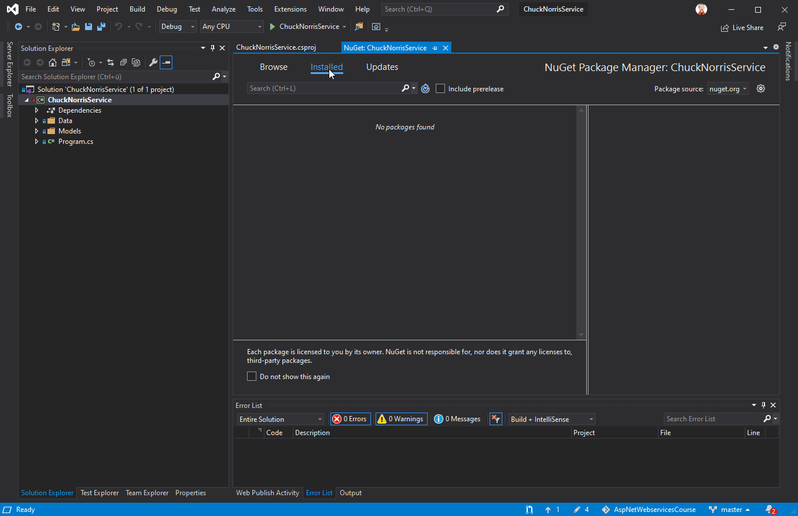
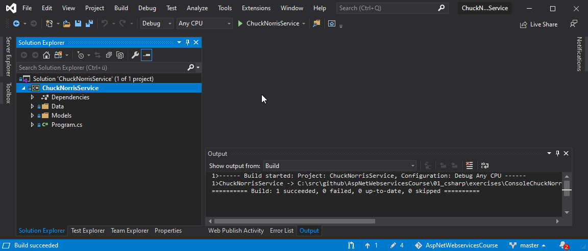
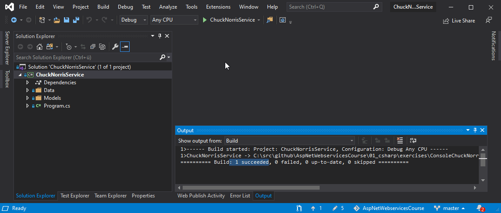
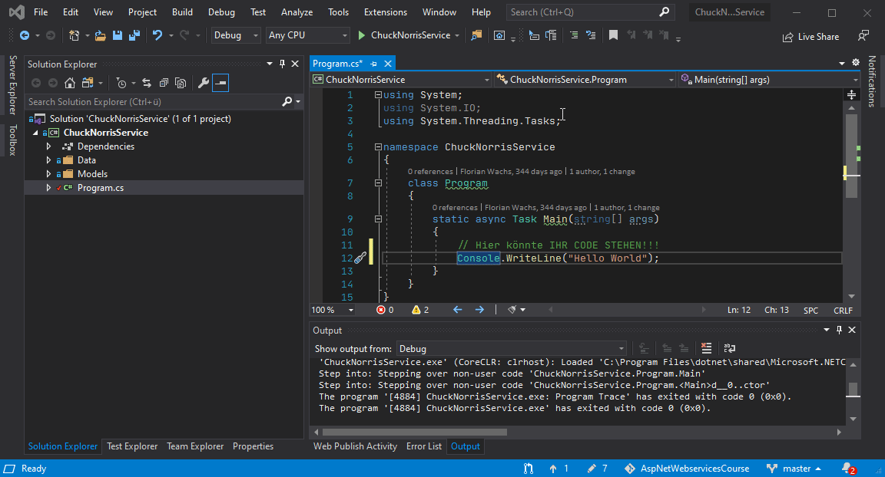

# Visual Studio Cheat-Sheet

## NuGet

### Allgemein

`NuGet` ist das Tool um Libraries von der Community oder 3rd-Parties zu finden und im Projekt nutzen zu können. Es erfüllt den gleichen Zweck wie z.B. `npm` für `nodejs`.
Es gibt verschiedene Möglichkeiten, NuGet-Pakete hinzuzufügen. Die einfachste für Visual Studio ist die Nutzung der NuGet-UI.

### NuGet in Visual Studio nutzen

Um Ihrem Projekt ein Paket hinzuzufügen, klicken Sie es mit der rechten Maustaste an. Im Kontext Menü finden Sie den Eintrag `Manage Nuget Packages`. Wählen Sie diesen aus.

Um verfügbare Pakete zu finden, wählen Sie bitte `Browse` aus. Nun können Sie nach Paketen suchen. Manche Pakete sind nur als `prerelease` verfügbar. Um diese zu finden müssen Sie den Haken `Include prerelease` auswählen. Nachdem Sie Ihr Paket gefunden und installiert haben, sollten Sie den Haken bei `Include prerelease` wieder abwählen. Man kommt sonst leicht dazu, alles immer als Preview zu installieren 😉.

### Für die Vorlesung häufig benötigte NuGet-Pakete

| Name                        | `prerelease` |
| --------------------------- | ------------ |
| System.Net.Http.Json        | Nein          |
| FluentValidation.AspNetCore | Nein         |

## Solution / Projekt builden

Im Menü `Build` kann das Projekt übersetzt werden, oder Sie nutzen den Shortcut `Strg+Shift+B`.

### Projekt mit Debugger starten

Wenn Sie das Standard Projekt mit Debugger starten wollen, drücken Sie `F5`. Alternativ über das Menü `Debug->Start Debugging`.

### Haltepunkt für Debugger setzen

Damit der Debugger an einer gewünschten Codestelle anhält, müssen Sie einen oder mehrere `Breakpoints` setzen.

