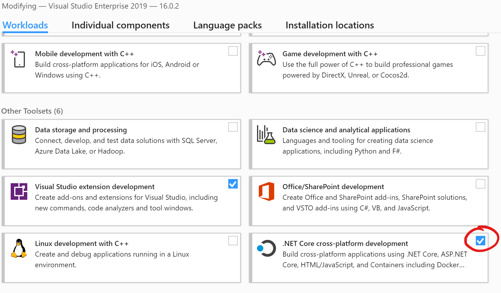

# Voraussetzungen für die Vorlesung

## Entwicklungsumgebungen
Die Übungen basieren auf .net core, Microsofts plattformunabhängige .NET Technologie (Windows, Linux, MacOS). Somit sollten alle aktuellen Tools / Betriebssysteme für die Vorlesung passen. Im folgenden werden die Tools beschrieben mit denen der Kurs erstellt wurde.

- Windows 10 (aktuelle Version)
- [Visual Studio 2019](https://visualstudio.microsoft.com/) mit dem .NET Core Payload 
- [.NET Core 3.1 SDK](https://dotnet.microsoft.com/download)
- Docker for Windows (für unsere Container-Übungen)

Mögliche Alternativen:

- JetBrains Rider (IntelliJ basiert)
- [Visual Studio Code](https://code.visualstudio.com/)
- Visual Studio for Mac
- vim, emacs... :-)

## Code-Repository

Der Code und die Artefakte müssen in einem VCS (Version Control System) abgelegt werden.
Ihr habt dazu freie Wahl, solange ich einen Zugang zum Repository bekomme 😉.

### GitLab

Die TH-Rosenheim bietet GitLab an, wer sein Projekt dort hosted kann mich mit dem User `wafl861` berechtigen.

### GitHub

Github bietet schon länger kostenlose private Repositories an, seit 2020-04-14 nun auch für Teams (https://github.blog/2020-04-14-github-is-now-free-for-teams/). Bei Github ist mein User `florianwachs`. Dort sind auch einige "Freiminuten" für eine `CI/CD` Pipeline verfügbar.

### Azure Dev Ops

Auch Azure Dev Ops erlaubt die kostenlose Nutzung für Teams unter https://azure.microsoft.com/de-de/services/devops/.