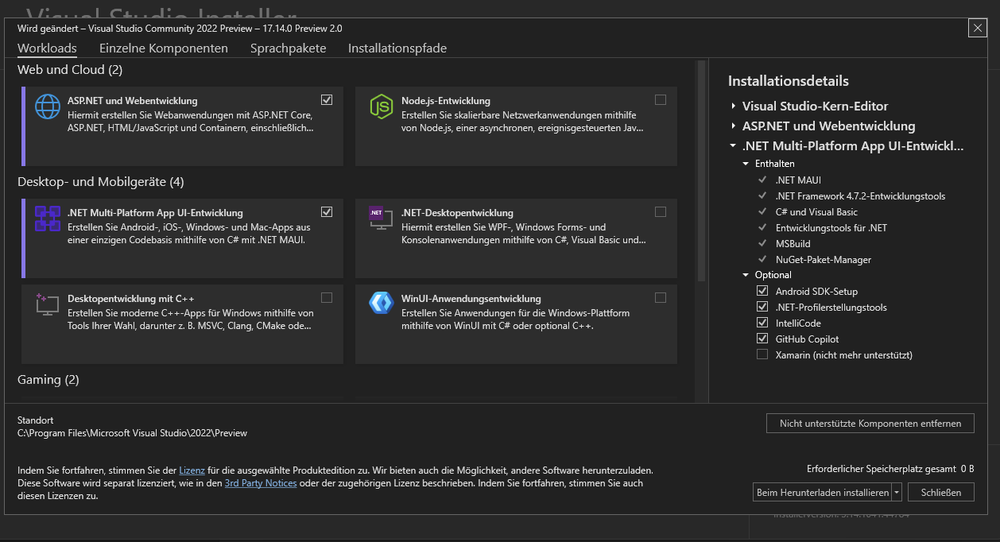

# Voraussetzungen für die Vorlesung

## Entwicklungsumgebungen

Die Übungen basieren auf .net core, Microsofts plattformunabhängige .NET Technologie (Windows, Linux, MacOS). Somit sollten alle aktuellen Tools / Betriebssysteme für die Vorlesung passen. Im folgenden werden die Tools beschrieben mit denen der Kurs erstellt wurde.

- Windows 10 (aktuelle Version)
- [Visual Studio 2019](https://visualstudio.microsoft.com/) mit dem .NET Core Payload 
- [.NET Core 3.1 SDK](https://dotnet.microsoft.com/download)
- Docker for Windows (für unsere Container-Übungen)

Mögliche Alternativen:

- JetBrains Rider (IntelliJ basiert)
- [Visual Studio Code](https://code.visualstudio.com/)
- Visual Studio for Mac
- vim, emacs... :-)

## Code-Repository

Der Code und die Artefakte müssen in einem VCS (Version Control System) abgelegt werden.
Ihr habt dazu freie Wahl, solange ich einen Zugang zum Repository bekomme 😉.

### GitLab

Die TH-Rosenheim bietet GitLab an, wer sein Projekt dort hosted kann mich mit dem User `florian.wachs` berechtigen.

### GitHub

Github bietet schon länger kostenlose private Repositories an, seit 2020-04-14 nun auch für Teams (https://github.blog/2020-04-14-github-is-now-free-for-teams/). Bei Github ist mein User `florianwachs`. Dort sind auch einige "Freiminuten" für eine `CI/CD` Pipeline verfügbar.

### Azure Dev Ops

Auch Azure Dev Ops erlaubt die kostenlose Nutzung für Teams unter https://azure.microsoft.com/de-de/services/devops/.

## HTTP Debugging Tool

Gerade bei der Entwicklung von Web-Apis hat man nicht immer auch gleich eine Oberfläche zur Hand. Folgende Tools helfen beim Erstellen und Absetzen von HTTP-Requests.

| Tool                                                                                 | Informationen                            |
| ------------------------------------------------------------------------------------ | ---------------------------------------- |
| [Postman](https://www.postman.com/downloads/)                                        | Derzeit bekanntestes Tool                |
| [Fiddler](https://www.telerik.com/fiddler)                                           | Mächtiger Debugger für alle HTTP-Belange |
| [REST Client](https://marketplace.visualstudio.com/items?itemName=humao.rest-client) | Extension für den VS Code Editor         |

## Vorschläge für Extensions

Falls Ihr Extensions habt die hier fehlen unbedingt Info an mich, Danke!

### VS Code

- https://marketplace.visualstudio.com/items?itemName=ms-dotnettools.csharp
- https://marketplace.visualstudio.com/items?itemName=josefpihrt-vscode.roslynator
- https://marketplace.visualstudio.com/items?itemName=vsls-contrib.codetour
- https://marketplace.visualstudio.com/items?itemName=alefragnani.Bookmarks
- https://marketplace.visualstudio.com/items?itemName=CoenraadS.bracket-pair-colorizer-2
- https://marketplace.visualstudio.com/items?itemName=ban.spellright
- https://marketplace.visualstudio.com/items?itemName=wayou.vscode-todo-highlight
- https://marketplace.visualstudio.com/items?itemName=VisualStudioExptTeam.vscodeintellicode
- https://marketplace.visualstudio.com/items?itemName=ms-azuretools.vscode-docker
- https://marketplace.visualstudio.com/items?itemName=usernamehw.errorlens
- https://marketplace.visualstudio.com/items?itemName=ms-vscode-remote.remote-wsl
- https://marketplace.visualstudio.com/items?itemName=eamodio.gitlens
- https://marketplace.visualstudio.com/items?itemName=yzhang.markdown-all-in-one
- https://marketplace.visualstudio.com/items?itemName=MS-vsliveshare.vsliveshare
- https://marketplace.visualstudio.com/items?itemName=vsls-contrib.gistfs
- https://marketplace.visualstudio.com/items?itemName=mhutchie.git-graph
- https://marketplace.visualstudio.com/items?itemName=ms-edgedevtools.vscode-edge-devtools
- https://marketplace.visualstudio.com/items?itemName=GitHub.vscode-pull-request-github
- https://marketplace.visualstudio.com/items?itemName=alexanderte.dainty-vscode
- https://marketplace.visualstudio.com/items?itemName=alexanderte.dainty-nord-vscode
- https://marketplace.visualstudio.com/items?itemName=sdras.night-owl

### Visual Studio

- Roslynator 2019
- Add New File

### Rider

- Markdown
- 
