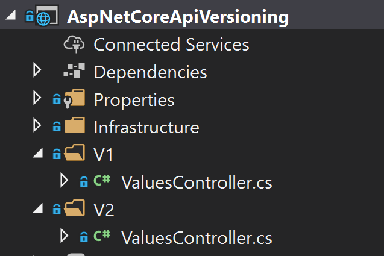

# API Versionierung und Dokumentation

In den REST-Guidelines und Beispielen von API Anbietern wie Microsoft oder Github kann man gut erkennen, dass die Versionierung einer Schnittstelle vorab geklärt werden sollte, noch bevor der erste Kunde (egal ob extern oder intern) darauf zugreift. Änderungen oder **Breaking Changes** in einer bestehenden API können verheerende Auswirkungen haben. Zusätzlich sollte eine umfassende Dokumentation vorhanden sein, welche die Möglichkeiten und Verwendung der API beschreibt. Diese mit der tatsächlichen Implementierung synchron zu halten ist seit jeher eine Herausforderung für uns Entwickler 😉.

Glücklicherweise gibt es für REST-APIs mit .NET einige hilfreiche Libraries, welche uns die meiste Arbeit abnehmen.

## API Versionierung

Wir haben bereits behandelt, wie mit `Attribute Routing` die Route und das HTTP Verb für einen Endpunkt definiert werden kann.

```csharp
[ApiController]
[Route("api/[controller]")]
public class ValuesController : ControllerBase
{
    [HttpGet]
    public ActionResult<IEnumerable<string>> Get()
    {
        // Implementierung
    }

    [HttpGet("{id}")]
    public ActionResult<string> Get(int id, ApiVersion apiVersion)
    {
        // Implementierung
    }
}
```

Das `[Route]`-Attribut über der Klasse legt das URL-Präfix unseres Controllers fest und ein Aufruf könnte so aussehen: `GET /api/values`.

Eine einfache Variante der Versionierung wäre es, die Version in das Präfix zu integrieren.

```csharp
[ApiController]
[Route("api/v1/[controller]")]
public class ValuesController : ControllerBase
{
}
```

Nun kann mit `GET /api/v1/values` zugegriffen werden. Dieser Ansatz funktioniert, hat aber einige Nachteile.
Zum einen ist `v1` ein beliebiges Literal das für das Routing System in aspnetcore keinerlei Bedeutung hat. Zum anderen haben wir in den Guidelines gesehen, dass die Version auch über andere Wege wie z.B. `queryparameter` oder `header` geliefert werden kann. Unser einfacher Ansatz funktioniert nur wenn über die URL zugegriffen wird.
Zusätzlich können Dokumentationstools wie `Swagger` aus dem Literal nicht automatisch eine Version erkennen und dies somit auch nicht festhalten.

Das [api-versioning](https://github.com/microsoft/aspnet-api-versioning/wiki) kann uns die Versionierung erheblich erleichtern.

### Nuget für API Versionierung installieren

Zuerst müssen wir das Nuget `Microsoft.AspNetCore.Mvc.Versioning` installieren, um die Versionsmöglichkeiten nachzurüsten. Entweder über den Package-Manager der IDE oder über `dotnet package add`.

### Versionierung in der Startup registrieren

Die Versionierung ist am Ende wie so oft nichts anderes als eine Middleware-Komponente welche in unserem Startup-Code registriert werden muss.

```csharp
public void ConfigureServices(IServiceCollection services)
{
    services.AddApiVersioning(
        options =>
        {
            // reporting api versions will return the headers "api-supported-versions" and "api-deprecated-versions"
            options.ReportApiVersions = true;
            options.AssumeDefaultVersionWhenUnspecified = true;
        });
}
```

Mit `ReportApiVersions` wird uns automatisch in der Response ein `api-supported-versions` Header mitgeliefert, welcher die unterstützten Versionen an den Aufrufer zurückgibt, so können auch automatisiert die veralteten Versionsnummern zurückgegeben werden. Wird keine spezifische Version angefordert, kann statt einen Fehler zu werfen auch eine Default-Version angewendet werden, z.B. immer die Aktuellste.

### Versionsattribute anwenden

Die Versionierung erfolgt mittels des `[ApiVersion]`-Attributes. Da ein Controller / Action mehr als ein `[Route]`-Attribute verwenden dürfen, können wir eine Default-Route und eine versionierte anbieten.

```csharp
[ApiController]
// 👇 Definition der API-Version
[ApiVersion("1.0")]

[Route("api/[controller]")]
//             👇 Platzhalter-Variable für API-Version
[Route("api/v{version:apiVersion}/[controller]")]
public class ValuesController : ControllerBase
{
}
```

Falls nötig kann auch innerhalb einer Controller-Action auf die verwendete Version zugegriffen werden.

```csharp
[HttpGet]
public ActionResult<IEnumerable<string>> Get()
{
    // API Version kann über eine Extension Method am Context abgerufen werden.
    var apiVersion = HttpContext.GetRequestedApiVersion();

    return new [] {apiVersion.ToString()};
}

[HttpGet("{id}")]
public ActionResult<string> Get(int id, ApiVersion apiVersion)
{
    // API Version kann über den Modelbinder direkt injected werden.
    return apiVersion.ToString();
}
```

### Neuer Controller für V2

Eine Möglichkeit eine neue Version unseres Controllers anzulegen, ist folgende Projektstruktur.



### Hinweise zur Versionierung

Es lassen sich auch einzelne `ControllerActions` versionieren. Meiner Erfahrung nach ist es aber meist verständlicher, einen neuen `Controller` zu definieren.
