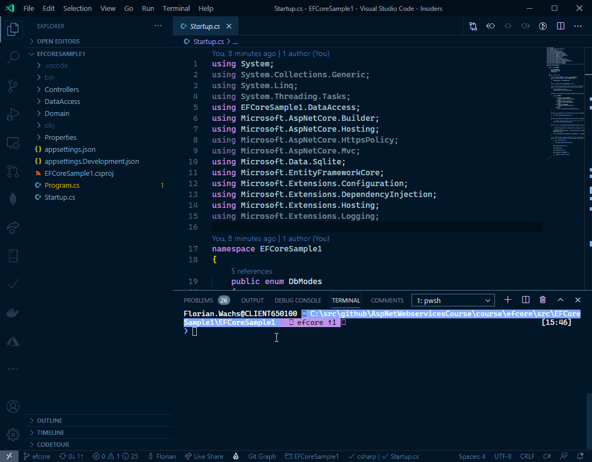

# Entity Framework Core

Im Folgenden wollen wir uns die Grundlagen des Entity Frameworks ansehen. EF ist ein komplexes Framework, daher können hier nicht alle Funktionen behandelt werden. Ich empfehle die großartige Dokumentation auf https://docs.microsoft.com.

## Überblick

- Interaktion mit relationalen Datenbanken über ein Objektmodell das direkt die Business-Objekte der Anwendung abbildet
- Object Relational Mapper
- Favorisierte API für Datenzugriff in .NET
- Kümmert sich um den Aufbau und die Ausführung von SQL-Statements
- Umwandlung von Abfrageergebnissen in Business-Objekte
- Änderungsverfolgung an Business-Objekten
- LINQ ist Grundbestandteil der Architektur, nicht nachträglich hinzugefügt
- Reduzierte Abhängigkeiten zum physikalischen Datenbankschema und zu relationalen Datenbanken selbst (nur EF Core)
- Hohe Testbarkeit: die Business-Objekte können POCOs sein und enthalten damit keine Datenbankzugriffslogik und auch keine harten Abhängigkeiten zum EF
- Es werden keine Collections aus Zeilen und Spalten bearbeitet, sondern Collections aus typisierten Objekten, sog. Entitäten
- Entity Framework kommt in 2 unterschiedlichen Ansätzen
  - model-first (nur Full-Framework, EF Core kann aber ein Modell aus der DB generieren)
  - code-first

## Vorteile von OR-Mappern

- Bekanntes Umfeld in der objektorientierten Entwicklung
  - Kenntnisse von SQL, Datenbankschemas nicht zwingend notwendig
  - Höhere Entwicklungsgeschwindigkeit da die SQL-Tabellen zu einem späteren Zeitpunkt generiert werden können (In-Memory-Database)
- Automatische Änderungserkennung an Objekten und Generierung von SQL für das Update
- Abstraktion von der zugrundeliegenden Datenbank-Technologie
  - MS SQL
  - Postgres
  - SQLite
  - MySQL

## Nachteile von OR-Mappern

- Queries können inperformant werden (n+1 Problem)
- Insgesamt ist die Performance relativ gesehen zur direkten Implementierung langsamer (high-traffic)

## EF Core im Projekt verwenden

Auch EF Core besteht aus einer Reihe von `Nuget`-Paketen welche im Projekt eingebunden werden müssen. Dabei trennen sich die Pakete in die abstrakte Hauptimplementierung von EF Core `Microsoft.EntityFrameworkCore` und sog. Provider.
Pro Datenbank benötigt EF Core einen Provider, welche die Kommunikation mit der Datenbank zur Ausführung der Befehle steuert. Es gibt eine Vielzahl von offiziellen und 3rd Party Providern für EF Core.

- `Microsoft.EntityFrameworkCore.InMemory`
- `Microsoft.EntityFrameworkCore.SqlLite`
- `Microsoft.EntityFrameworkCore.SqlServer`
- `Npgsql.EntityFrameworkCore.PostgreSQL`

Mindestens ein Provider muss installiert werden.

Möchte man Migrationen anlegen können, dass sind Klassen welche Code zum Erstellen / Änderung von Tabellen enthalten, muss noch das Design Paket `Microsoft.EntityFrameworkCore.Design` hinzugefügt werden.

## EF Core Building Blocks

Der Einsatz von EF Core im Projekt kann in folgende Bereiche aufgeteilt werden:

- DbContext und Entitäten modellieren
- DbContext im Dependency Injection System konfigurieren und registrieren
  - Datenprovider auswählen => MS SQLServer, PostgresSQL, Sqlite…
- Migrationen für das Datenmodell generieren
- Migrationen auf die Datenbank anwenden

### DbContext und Entitäten modellieren

Entitäten mit ihren Eigenschaften und Relationen werden bei EF Core als POCOs (Plain Old C# Objects) modelliert, d.h. sie müssen nicht von einer Basisklasse abgeleitet worden sein oder ein spezielles Interface implementieren. Über Attribute kann zusätzliche Funktionalität wie Validierung oder datenbankspezifische Einstellungen wie Spaltenname konfiguriert werden. Will man auch keine Attribute haben (häufig bei Domain Driven Design), so kann diese Konfiguration über spezielle Klassen gelöst werden.

Hier die `Author`-Entität als Beispiel.

```csharp
public class Author
{
    // 👇 Sollen Ids nicht automatisch erzeugt werden, kann dieses Attribute dies verhindern.
    // Standardmäßig wird eine Identity-Spalte mit Autoincrement in der DB angelegt.
    [DatabaseGenerated(DatabaseGeneratedOption.None)]
    public int Id { get; set; }

    // 👇 Validierungsattribute können verwendet werden, um die Konsistenz der Daten sicherzustellen.
    [Required]
    [MaxLength(255)]
    public string FirstName { get; set; }

    [Required]
    [MaxLength(255)]
    public string LastName { get; set; }

    [Range(0, 150)]
    public int Age { get; set; }

    // 👇 Relationen werden unterstützt, komplizierte Fälle wie many-to-many (Books) müssen aber noch im DbContext nachkonfiguriert werden
    public ICollection<ContactInfo> ContactInfos { get; set; }
    public ICollection<BookAuthorRel> Books { get; set; }
}
```

Der `DbContext` ist die zentrale Stelle welche die Entitäten zusammenfasst und als Einstiegspunkt in die Verwendung der EF Core API bietet.

- Einstiegspunkt für das EF um das Objektmodell verwalten zu können und damit zu arbeiten
- Entitäten die direkt abgefragt und verarbeitet werden sollten in DbSet<TEntity>-Properties veröffentlicht werden
- Über den Context kann das Modell vor der ersten Verwendung konfiguriert werden
- Der Context bietet Lifecycle-Hooks wie SaveChanges() und ShouldValidateEntity() die überschrieben werden können
- Über den Context wird auch der zu verwendende Data Provider konfiguriert (meist in .config, .json)
- Über den Context kann auf den Change Tracker zugegriffen werden, welcher Änderungen an den Entitäten aufzeichnet
- Über SaveChanges() werden die Änderungen in der DB persistiert
- Enthält einen Cache für bereits geladene Entitäten
  - Daher sollten Entitäten nicht am EF vorbei modifiziert werden

Hier ein Beispiel für den `DbContext`:

```csharp
public class BookDbContext : DbContext
{
    // Die Options enthalten Informationen für die DB-Connection mit der das EF-Framework
    // auf die DB zugreifen soll
    public BookDbContext(DbContextOptions<BookDbContext> options)
        : base(options)
    {
    }

    // Die Entitäten die direkt abgefragt werden können sollen,
    // werden über DbSets angegeben. Es müssen nicht alle Entitäten
    // angegeben werden
    public DbSet<Book> Books { get; set; }
    public DbSet<Author> Authors { get; set; }

    // Hier können noch Konfigurationen an Entitäten
    // und Conventions durchgeführt werden, bevor
    // das Modell benutzbar ist
    protected override void OnModelCreating(ModelBuilder modelBuilder)
    {
        base.OnModelCreating(modelBuilder);
        //                                                        👇 EF versucht automatisch den passenden Datentypen für die Tabellenspalte zu erkennen, dies kann hier festgelegt werden.
        modelBuilder.Entity<Book>().Property(b => b.ReleaseDate).HasColumnType("datetime2");

        // m:n Relationen können aktuell von EF nicht automatisch erkannt werden
        // Daher muss die Beziehung manuell definiert werden und eine Zwischentabelle für das Mapping
        // angelegt werden
        modelBuilder.Entity<BookAuthorRel>()
            .HasKey(t => new { t.BookId, t.AuthorId }); // 👈 Definition eines zusammengesetzten Schlüssels (Composite-Key)

        modelBuilder.Entity<BookAuthorRel>()
            .HasOne(pt => pt.Book)
            .WithMany(p => p.Authors)
            .HasForeignKey(pt => pt.BookId);

        modelBuilder.Entity<BookAuthorRel>()
            .HasOne(pt => pt.Author)
            .WithMany(t => t.Books)
            .HasForeignKey(pt => pt.AuthorId);

    }
}
```

EF Core hat eine vielzahl von Konventionen die automatisch angewendet werden um möglichst wenig zusätzliche Konfiguration erstellen zu müssen.
Über Attribute in den Entitäten und / oder in `OnModelCreating()` kann das Modell und die angewendeten Konventionen nach Bedarf geändert werden.

Über `EntityConfiguration` kann verhindert werden, dass `OnModelCreating()` zu unübersichtlich wird.

```csharp
public class Book
{
    public int Id { get; set; }
    public string Title { get; set; }
    public string Isbn { get; set; }
    public DateTime ReleaseDate { get; set; }
    public ICollection<BookAuthorRel> Authors { get; set; }
}
```

```csharp
public class BookConfiguration : IEntityTypeConfiguration<Book>
{
    public void Configure(EntityTypeBuilder<Book> builder)
    {
        builder.Property(b => b.Isbn).IsRequired();
        builder.Property(b => b.Title).IsRequired().HasMaxLength(500);
    }
}
```

```csharp
protected override void OnModelCreating(ModelBuilder modelBuilder)
{
    // ...

    //👇 die Konfiguration kann auch in eigene Klassen ausgelagert werden
    modelBuilder.ApplyConfiguration(new BookConfiguration());
}
```

## Datenprovider konfigurieren

// TODO:

## Migrationen für das Datenmodell generieren

Um das Datenmodell auf Tabellen in einer Datenbank abzubilden sind in der Regel SQL-Skripte notwendig. Dadurch entstehen jedoch eine
Vielzahl von Herausforderungen was Versions-Upgrades oder -Downgrades angeht.
**Migrationen** versuchen diese Probleme zu Lösen, indem sie die Logik für Up- und Downgrades in C# formulieren. Soll manuell oder automatisch
die DB aktualisiert werden, wird es vom EF Core Provider in SQL-Anweisungen übersetzt und ausgeführt.

https://docs.microsoft.com/de-de/ef/core/managing-schemas/migrations/?tabs=dotnet-core-cli

Mit Hilfe des Tools `dotnet ef` können neue Migrationen angelegt werden. Wichtig ist, dass der Befehl in dem Projekt ausgeführt wird, in dem der DbContext vorhanden ist.
Eine neue Migration lässt sich mit folgendem Befehl anlegen.

```powershell
dotnet ef migrations add [Name der Migration]
```



## Migrationen auf die Datenbank anwenden

Man kann Migrationen manuell in die Datenbank übertragen.
Hierzu dient der Befehl `dotnet ef database update`.

Zusätzlich besteht die Möglichkeit, die Migration auch beim Starten der Applikation durchzuführen.
Der Vorteil ist, dass man dies nicht manuell machen muss. Der größte Nachteil ist, dass die Gefahr besteht
das mehrere Instanzen gleichzeitig versuchen eine Migration auszuführen. In der Praxis wird meinst der manuelle Ansatz gewählt.

Will man es doch automatisch durchführen, so ist die empfohlene Stelle direkt nach dem Erzeugen des WebHosts aber noch vor dem Starten.
Man findet noch häufig Beispiele welche die Migration in `Startup.Configure()` durchführen, davon wird jedoch abgeraten.

```csharp
public static async Task Main(string[] args)
{
    var host = CreateHostBuilder(args).Build();
    await MigrateAndSeedDb(host);
    await host.RunAsync();
}

private static async Task MigrateAndSeedDb(IHost host)
{
    // Um auf das DI-System zuzugreifen muss ein neuer Scope erstellt werden,
    // in dem die erzeugten Objekte "leben"
    using var scope = host.Services.CreateScope();
    var dbContext = scope.ServiceProvider.GetRequiredService<BookDbContext>();
    
    // Mittels Migrate werden alle ausstehenden Db-Migrationen angewendet.
    // Vorsicht wenn mehrere Instanzen versuchen das Upgrade der DB auszuführen.
    // In Produktivsystemen führt man das DB-Upgrade meist getrennt vom Applikationsstart aus.
    await dbContext.Database.MigrateAsync();

    // Häufig werden beim initialen Anlegen der DB einige Stammdaten benötigt.
    // Der Prozess des Befüllens wird oft als Seeding bezeichnet.
    // ...   
}
```

## Grundbefüllung der Datenbank (Seeding)

Häufig werden in einer neuen Datenbank einige Stammdaten benötigt. Diese wird häufig als **Seeding** bezeichnet.
Eine gute Stelle ist, wie bei den Migrationen, kurz vor dem Starten des Hosts.

```csharp
public static async Task Main(string[] args)
{
    var host = CreateHostBuilder(args).Build();
    await MigrateAndSeedDb(host);
    await host.RunAsync();
}

private static async Task MigrateAndSeedDb(IHost host)
{
    // ...

    // Häufig werden beim initialen Anlegen der DB einige Stammdaten benötigt.
    // Der Prozess des Befüllens wird oft als Seeding bezeichnet.
    await SeedDb(dbContext);
}

private static async Task SeedDb(BookDbContext dbContext)
{
    // Zuerst prüfen wir ob schon etwas in der DB liegt
    if (dbContext.Books.Any() || dbContext.Authors.Any())
    {
        return;
    }
    
    // Falls nicht, legen wir ein paar Daten an
    var authors = new List<Author>()
    {
        new Author(){ Id = 1, Age = 40, FirstName = "Alice", LastName = "Walker"}, // The Color Purple, Possessing the Secret of Joy, The Temple of My Familiar
        new Author(){ Id = 2, Age = 30, FirstName = "Barbara", LastName = "Oakley"}, // A Mind for Numbers: How to Excel at Math and Science (Even If You Flunked Algebra)
        new Author(){ Id = 3, Age = 20, FirstName = "Chuck", LastName = "Norris"} // The Perfect Roundhouse Kick
    };

    await dbContext.Authors.AddRangeAsync(authors);
    await dbContext.SaveChangesAsync();

}

```

## Beispiel

Ein Beispiel für SqlLite, LocalDb (Nur Windows mit Visual Studio) und Postgres (mit Docker) findet Ihr [hier](src/EFCoreSample1)


## Alternativen

EF Core ist nicht der einzige OR-Mapper für .Net Core. Bekannte Alternativen sind `NHibernate` und `Dapper`.
`Dapper`ist dabei besonders schlank designt und hat deutlich weniger OR-Mapper Features, im Gegenzug ist es in einigen Fällen erheblich performanter.

### Dapper

- Erfunden und gepflegt von den StackOverflow-Betreibern
- Dünner Layer über ADO.NET (SQL-Connections)
- Weniger Abstraktion als EF Core, dafür aber deutlich höhere Performance
- Trotzdem den Vorteil des Objekt-Mappings
- https://github.com/StackExchange/Dapper
- Kein Konzept von „Migrationen“ wie bei EF Core
