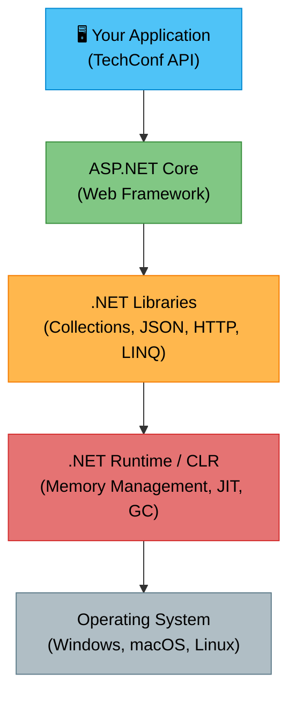
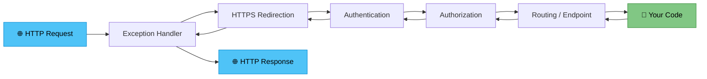

# .NET 10 Platform Overview

## Introduction

Before we start building web APIs, we need to understand the platform we're building on: **.NET 10**.

.NET 10 is the latest **Long-Term Support (LTS)** release from Microsoft, meaning it will receive security patches and bug fixes for **three years**. This makes it the ideal choice for production applications and for learning — the concepts you learn today won't become outdated anytime soon.

You can of course also use the current Preview of .NET 11 (Preview 2) but expect rough edges. For this course you should stick to .NET 10.

Throughout this course, we'll build a **TechConf Event Management** system — a platform for managing tech conferences, their sessions, speakers, and attendees. Think of it as the backend powering a conference app like those used at NDC, Build, or your university's own tech events.

> **Why this matters:** Modern web services power everything from mobile apps to IoT devices. Understanding .NET gives you access to one of the most performant, mature, and widely-adopted platforms in enterprise software development. Companies like Stack Overflow, Microsoft, Samsung, and UBS rely on .NET for their critical infrastructure.

---

## The .NET Ecosystem

### Runtime vs SDK vs ASP.NET Core

One of the first things that confuses newcomers is the terminology. Let's clarify:

| Component        | What It Is                                                                                                | Who Needs It                |
| ---------------- | --------------------------------------------------------------------------------------------------------- | --------------------------- |
| **.NET Runtime** | Executes compiled .NET applications. Includes the CLR (Common Language Runtime) and base class libraries. | Everyone running a .NET app |
| **.NET SDK**     | Everything needed to _build_ .NET apps: compilers, CLI tools, templates, and the runtime itself.          | Developers                  |
| **ASP.NET Core** | A framework _on top of_ .NET for building web applications, APIs, and real-time services.                 | Web developers              |

💡 **Think of it this way:** The SDK is your toolbox, the Runtime is the engine, and ASP.NET Core is a specialized vehicle built on that engine.

### The .NET Stack



### Cross-Platform Support

.NET 10 runs everywhere. This is a massive shift from the old .NET Framework, which was Windows-only.

| Platform          | Supported Architectures    | Notes                                |
| ----------------- | -------------------------- | ------------------------------------ |
| Windows 10/11+    | x64, x86, ARM64            | Full IDE support (Visual Studio)     |
| macOS 26+         | x64, ARM64 (Apple Silicon) | VS Code + C# Dev Kit or Rider        |
| Linux             | x64, ARM64, ARM32          | Ubuntu, Debian, Fedora, Alpine, RHEL |
| Containers        | x64, ARM64                 | Official Docker images available     |
| Mobile (via MAUI) | iOS, Android               | Not covered in this course           |

Besides .NET MAUI there a great OSS alternatives to cross-platform UI development like Avalonia or Uno.

### Release Cadence

Microsoft releases a new .NET version every November. Odd-numbered releases are **STS (Standard Term Support)** with 18 months of support; even-numbered releases are **LTS** with 36 months.

| Version     | Release Date | Support Type | End of Support |
| ----------- | ------------ | ------------ | -------------- |
| .NET 6      | Nov 2021     | LTS          | Nov 2024       |
| .NET 7      | Nov 2022     | STS          | May 2024       |
| .NET 8      | Nov 2023     | LTS          | Nov 2026       |
| .NET 9      | Nov 2024     | STS          | May 2026       |
| **.NET 10** | **Nov 2025** | **LTS**      | **Nov 2028**   |

> 📝 **Always choose LTS releases for production systems and for learning.** STS releases are great for exploring cutting-edge features but carry the risk of shorter support windows.

---

## SDK & CLI Essentials

The `dotnet` CLI (Command-Line Interface) is your primary tool for creating, building, running, and publishing .NET applications. Even if you use an IDE, understanding the CLI is essential.

### Checking Your Installation

```bash
# Check the installed SDK version
dotnet --version

# List all installed SDKs (you might have multiple)
dotnet --list-sdks

# List all installed runtimes
dotnet --list-runtimes
```

### Creating Projects with `dotnet new`

The `dotnet new` command creates new projects from templates. Here are the ones we'll use most:

| Template             | Short Name       | Description                               |
| -------------------- | ---------------- | ----------------------------------------- |
| ASP.NET Core Web API | `webapi`         | REST API with controllers or minimal APIs |
| ASP.NET Core Empty   | `web`            | Bare-bones web app — a blank canvas       |
| Console Application  | `console`        | Simple command-line app                   |
| Class Library        | `classlib`       | Reusable library (no executable)          |
| .NET Aspire Starter  | `aspire-starter` | Cloud-ready app with service defaults     |
| Solution File        | `sln`            | A solution to group multiple projects     |

To discover all available templates:

```bash
# List all installed templates
dotnet new list

# Search for templates by keyword
dotnet new search api
```

### Building, Running & Publishing

```bash
# Restore NuGet packages (dependencies)
dotnet restore

# Build the project (compile)
dotnet build

# Run the project (build + execute)
dotnet run

# Run in watch mode (auto-restart on file changes)
dotnet watch run

# Publish a self-contained release build
dotnet publish -c Release --self-contained
```

### Managing Dependencies

```bash
# Add a NuGet package
dotnet add package Microsoft.EntityFrameworkCore --version 10.0.0

# Remove a NuGet package
dotnet remove package Microsoft.EntityFrameworkCore

# List installed packages
dotnet list package
```

### 🎯 Hands-On: Creating Your First Web API

Let's create the TechConf API project from scratch:

```bash
# Create a new directory and navigate into it
mkdir TechConf && cd TechConf

# Create a solution file
dotnet new sln -n TechConf

# Create the Web API project
dotnet new webapi -n TechConf.Api -o src/TechConf.Api

# Add the project to the solution
dotnet sln add src/TechConf.Api/TechConf.Api.csproj

# Run it!
dotnet run --project src/TechConf.Api
```

After running, open `http://localhost:5000` (or the URL shown in the terminal) in your browser.

### CLI Command Reference

| Command                       | Description                                       |
| ----------------------------- | ------------------------------------------------- |
| `dotnet new <template>`       | Create a new project from a template              |
| `dotnet restore`              | Restore NuGet packages                            |
| `dotnet build`                | Compile the project                               |
| `dotnet run`                  | Build and run the project                         |
| `dotnet watch`                | Run with file-watching and Hot Reload             |
| `dotnet test`                 | Run unit tests                                    |
| `dotnet publish`              | Package for deployment                            |
| `dotnet add package <name>`   | Add a NuGet dependency                            |
| `dotnet add reference <path>` | Add a project-to-project reference                |
| `dotnet ef`                   | Entity Framework Core CLI (requires tool install) |
| `dotnet user-secrets`         | Manage development secrets                        |
| `dotnet tool install`         | Install a .NET CLI tool                           |

---

## Project Anatomy

Understanding what each file does in a .NET project is crucial. Let's dissect a newly created ASP.NET Core Web API project.

### The `.csproj` File — Your Project Definition

The `.csproj` file is an XML-based project file that defines everything about your project. Here's a typical one, annotated line by line:

```xml
<Project Sdk="Microsoft.NET.Sdk.Web">
  <!-- Sdk="Microsoft.NET.Sdk.Web" tells MSBuild this is a web project.
       It automatically includes ASP.NET Core references. -->

  <PropertyGroup>
    <!-- Target framework: .NET 10 -->
    <TargetFramework>net10.0</TargetFramework>

    <!-- Enable nullable reference types (compiler warnings for null safety) -->
    <Nullable>enable</Nullable>

    <!-- Automatically import common namespaces so you don't need 'using' statements -->
    <ImplicitUsings>enable</ImplicitUsings>

    <!-- Emit documentation warnings for public APIs (optional) -->
    <GenerateDocumentationFile>false</GenerateDocumentationFile>
  </PropertyGroup>

  <ItemGroup>
    <!-- NuGet package references with version pinning -->
    <PackageReference Include="Microsoft.AspNetCore.OpenApi" Version="10.0.0" />
  </ItemGroup>

</Project>
```

💡 **The SDK attribute is critical.** `Microsoft.NET.Sdk.Web` vs `Microsoft.NET.Sdk` determines what gets auto-imported. Use `.Web` for ASP.NET Core apps, plain `.Sdk` for libraries and console apps.

### What Implicit Usings Actually Import

When `<ImplicitUsings>enable</ImplicitUsings>` is set, the compiler auto-imports these namespaces for a web project:

```csharp
// From Microsoft.NET.Sdk
global using global::System;
global using global::System.Collections.Generic;
global using global::System.IO;
global using global::System.Linq;
global using global::System.Net.Http;
global using global::System.Threading;
global using global::System.Threading.Tasks;

// From Microsoft.NET.Sdk.Web (additional)
global using global::System.Net.Http.Json;
global using global::Microsoft.AspNetCore.Builder;
global using global::Microsoft.AspNetCore.Hosting;
global using global::Microsoft.AspNetCore.Http;
global using global::Microsoft.AspNetCore.Routing;
global using global::Microsoft.Extensions.Configuration;
global using global::Microsoft.Extensions.DependencyInjection;
global using global::Microsoft.Extensions.Hosting;
global using global::Microsoft.Extensions.Logging;
```

### Custom Global Usings

For domain-specific namespaces you use everywhere, create a `GlobalUsings.cs` file in your project root:

```csharp
// GlobalUsings.cs
global using TechConf.Api.Models;
global using TechConf.Api.Services;
global using TechConf.Api.Extensions;
```

> 📝 **Tip:** Only add namespaces here that are truly used across many files. Overusing global usings hides dependencies and makes code harder to read.

### The `launchSettings.json` File

Located at `Properties/launchSettings.json`, this file configures how the app starts during development:

```json
{
  "$schema": "https://json.schemastore.org/launchsettings.json",
  "profiles": {
    "http": {
      "commandName": "Project",
      "dotnetRunMessages": true,
      "launchBrowser": true,
      "launchUrl": "openapi/v1.json",
      "applicationUrl": "http://localhost:5100",
      "environmentVariables": {
        "ASPNETCORE_ENVIRONMENT": "Development"
      }
    },
    "https": {
      "commandName": "Project",
      "dotnetRunMessages": true,
      "launchBrowser": true,
      "launchUrl": "openapi/v1.json",
      "applicationUrl": "https://localhost:7100;http://localhost:5100",
      "environmentVariables": {
        "ASPNETCORE_ENVIRONMENT": "Development"
      }
    }
  }
}
```

Key points:

- **Profiles** define different launch configurations (HTTP, HTTPS, Docker, etc.)
- **`applicationUrl`** sets the ports your app listens on
- **`ASPNETCORE_ENVIRONMENT`** determines which config files are loaded and enables developer-friendly features like detailed error pages
- This file is **not deployed** — it only affects local development

### Typical Project Directory Structure

```
TechConf.Api/
├── Properties/
│   └── launchSettings.json          # Dev launch configuration
├── Controllers/                      # API controllers (if using controller pattern)
│   └── EventsController.cs
├── Models/                           # Domain models / DTOs
│   ├── Event.cs
│   ├── Session.cs
│   └── Speaker.cs
├── Services/                         # Business logic
│   └── EventService.cs
├── appsettings.json                  # Base configuration
├── appsettings.Development.json      # Dev-specific config overrides
├── GlobalUsings.cs                   # Custom global using statements
├── Program.cs                        # Application entry point
└── TechConf.Api.csproj               # Project file
```

---

## Program.cs — The Modern Entry Point

### Evolution of the Entry Point

The way .NET web apps are bootstrapped has evolved significantly:

| Era                    | Pattern                                                              | Files Needed |
| ---------------------- | -------------------------------------------------------------------- | ------------ |
| ASP.NET Core 1.x–2.x   | `Program.cs` + `Startup.cs` (with `ConfigureServices` + `Configure`) | 2 files      |
| ASP.NET Core 3.x–5.0   | `Program.cs` + `Startup.cs` (Host builder pattern)                   | 2 files      |
| .NET 6+ (Minimal APIs) | Single `Program.cs` with top-level statements                        | 1 file       |
| **.NET 10**            | Single `Program.cs`, even more streamlined                           | 1 file       |

The old `Startup.cs` class with its `ConfigureServices()` and `Configure()` methods is gone. Everything lives in `Program.cs` now.

### Top-Level Statements

C# 9+ allows you to write code at the top level of a file without wrapping it in a class and `Main` method. The compiler generates the boilerplate for you:

```csharp
// What you write:
Console.WriteLine("Hello, TechConf!");

// What the compiler generates behind the scenes:
internal class Program
{
    private static void Main(string[] args)
    {
        Console.WriteLine("Hello, TechConf!");
    }
}
```

### The Builder Pattern

`Program.cs` in an ASP.NET Core app follows a two-phase pattern:

1. **Build phase** — configure services (dependency injection) and settings
2. **Run phase** — configure the HTTP request pipeline (middleware) and start listening

### Complete Annotated Program.cs

```csharp
// ===== PHASE 1: BUILD =====
var builder = WebApplication.CreateBuilder(args);

// --- Register services with the DI container ---
// Add API controller support
builder.Services.AddControllers();

// Add OpenAPI/Swagger document generation
builder.Services.AddOpenApi();

// Register our own application services (we'll build these later)
// builder.Services.AddScoped<IEventService, EventService>();

var app = builder.Build();

// ===== PHASE 2: RUN (Configure Middleware Pipeline) =====

// In development, serve the OpenAPI document
if (app.Environment.IsDevelopment())
{
    app.MapOpenApi();
}

// Redirect HTTP to HTTPS
app.UseHttpsRedirection();

// Enable authorization middleware
app.UseAuthorization();

// Map controller routes
app.MapControllers();

// Start the application
app.Run();
```

> 💡 **Key insight:** The order of middleware registration matters! Each middleware component processes the request in the order it's added, and the response in reverse order.

### Minimal API Endpoints

.NET 6+ introduced minimal APIs — a way to define endpoints directly in `Program.cs` without controllers:

```csharp
var builder = WebApplication.CreateBuilder(args);
var app = builder.Build();

// Minimal API endpoint — concise and expressive
app.MapGet("/api/events", () =>
{
    return new[]
    {
        new { Id = 1, Name = "TechConf 2026", Location = "Munich" },
        new { Id = 2, Name = "DevDays", Location = "Vienna" }
    };
});

app.MapGet("/api/events/{id:int}", (int id) =>
    Results.Ok(new { Id = id, Name = "TechConf 2026" }));

app.MapPost("/api/events", (Event newEvent) =>
    Results.Created($"/api/events/{newEvent.Id}", newEvent));

app.Run();
```

### Request Pipeline Flow



> 📝 **Note:** Each middleware component can short-circuit the pipeline. For example, the Authorization middleware can return a `401 Unauthorized` without ever reaching your endpoint code.

---

## Configuration System

ASP.NET Core has a layered configuration system. Values are loaded from multiple sources and later sources override earlier ones.

### Configuration Loading Order (Last Wins)

1. `appsettings.json`
2. `appsettings.{Environment}.json`
3. User Secrets (Development only)
4. Environment variables
5. Command-line arguments

### appsettings.json

This is your base configuration file. It uses JSON and supports nested sections:

```json
{
  "Logging": {
    "LogLevel": {
      "Default": "Information",
      "Microsoft.AspNetCore": "Warning"
    }
  },
  "AllowedHosts": "*",
  "TechConf": {
    "MaxAttendeesPerEvent": 500,
    "DefaultEventDurationHours": 8,
    "ApiTitle": "TechConf Event Management API"
  },
  "ConnectionStrings": {
    "TechConfDb": "Server=localhost;Database=TechConf;Trusted_Connection=true;"
  }
}
```

### Environment-Specific Overrides

`appsettings.Development.json` overrides values when running in Development mode:

```json
{
  "Logging": {
    "LogLevel": {
      "Default": "Debug"
    }
  },
  "TechConf": {
    "MaxAttendeesPerEvent": 50
  }
}
```

The `ASPNETCORE_ENVIRONMENT` variable (set in `launchSettings.json`) determines which override file is loaded. Common values: `Development`, `Staging`, `Production`.

### User Secrets (Development Only)

Never store passwords, API keys, or connection strings in `appsettings.json` — those get committed to source control! Use User Secrets instead:

```bash
# Initialize user secrets for your project
dotnet user-secrets init

# Set a secret
dotnet user-secrets set "ConnectionStrings:TechConfDb" "Server=myserver;Password=s3cret!"

# List all secrets
dotnet user-secrets list
```

Secrets are stored outside your project directory in your OS user profile and are automatically loaded in Development mode.

### Reading Configuration in Code

```csharp
var builder = WebApplication.CreateBuilder(args);

// Direct access via IConfiguration
var maxAttendees = builder.Configuration.GetValue<int>("TechConf:MaxAttendeesPerEvent");

// Using the Options pattern (covered more in Day 2)
builder.Services.Configure<TechConfOptions>(
    builder.Configuration.GetSection("TechConf"));

var app = builder.Build();

app.MapGet("/api/config", (IConfiguration config) =>
{
    var title = config["TechConf:ApiTitle"];
    return Results.Ok(new { Title = title });
});

app.Run();
```

```csharp
// The strongly-typed options class
public class TechConfOptions
{
    public int MaxAttendeesPerEvent { get; set; }
    public int DefaultEventDurationHours { get; set; }
    public string ApiTitle { get; set; } = string.Empty;
}
```

> [!IMPORTANT]
> ⚠️ **Never hard-code configuration values.** Always use the configuration system — it makes your app flexible across environments. And never ever add secrets to a config file.

---

## What's New in .NET 10

.NET 10 brings meaningful improvements for web API development. Here are the highlights most relevant to our course:

### OpenAPI 3.1 with YAML Output

.NET 10 upgrades from OpenAPI 3.0 to **3.1**, aligning with the latest JSON Schema draft. You can now serve the document as YAML:

```csharp
builder.Services.AddOpenApi();

// ...

app.MapOpenApi("/openapi/{documentName}.yaml", "yaml");
```

### Built-in Validation with `AddValidation()`

No more wiring up FluentValidation or manual checks — .NET 10 includes validation as a first-class feature:

```csharp
builder.Services.AddValidation();

app.MapPost("/api/events", (Event newEvent) =>
{
    // Validation happens automatically based on data annotations
    return Results.Created($"/api/events/{newEvent.Id}", newEvent);
});

public class Event
{
    public int Id { get; set; }

    [Required, MaxLength(200)]
    public string Name { get; set; } = string.Empty;

    [Required]
    public DateTime StartDate { get; set; }
}
```

### Server-Sent Events (SSE)

Push real-time updates from server to client over HTTP — perfect for live conference dashboards:

```csharp
app.MapGet("/api/events/live", async (CancellationToken ct) =>
{
    return TypedResults.ServerSentEvents(GetLiveUpdates(ct));
});

async IAsyncEnumerable<SseItem<string>> GetLiveUpdates(
    [EnumeratorCancellation] CancellationToken ct)
{
    while (!ct.IsCancellationRequested)
    {
        yield return SseItem.Create($"Attendee count: {Random.Shared.Next(100, 500)}");
        await Task.Delay(2000, ct);
    }
}
```

### HybridCache (Stable)

A unified caching API that combines in-memory and distributed caching, now stable in .NET 10:

```csharp
builder.Services.AddHybridCache();

app.MapGet("/api/events/{id}", async (int id, HybridCache cache) =>
{
    var cacheKey = $"event-{id}";
    var ev = await cache.GetOrCreateAsync(cacheKey, async ct =>
    {
        // Fetch from database only if not cached
        return await GetEventFromDb(id, ct);
    });
    return Results.Ok(ev);
});
```

### Feature Comparison: .NET 9 vs .NET 10

| Feature             | .NET 9                   | .NET 10                              |
| ------------------- | ------------------------ | ------------------------------------ |
| OpenAPI Version     | 3.0 (JSON only)          | 3.1 (JSON + YAML)                    |
| Built-in Validation | ❌ Manual only           | ✅ `AddValidation()`                 |
| Server-Sent Events  | ❌ Manual implementation | ✅ `TypedResults.ServerSentEvents()` |
| HybridCache         | ⚠️ Preview               | ✅ Stable                            |
| Blazor static SSR   | ✅ Yes                   | ✅ Improved                          |
| MAUI                | ✅ Yes                   | ✅ Improved                          |
| AOT for Web APIs    | ⚠️ Limited               | ✅ Broader support                   |

---

### Collection Expressions

Introduced in C# 12 and continually improved — a unified syntax for creating collections:

```csharp
// Arrays, lists, spans — one syntax to rule them all
int[] ids = [1, 2, 3];
List<string> tags = ["dotnet", "aspnetcore", "webapi"];
Span<int> ratings = [5, 4, 3, 5, 4];

// Spread operator to combine collections
int[] moreIds = [0, ..ids, 4, 5];
```

---

## Common Pitfalls

> ⚠️ **Watch out for these — they trip up almost every beginner.**

### 1. Using .NET Framework Docs Instead of .NET 10

When searching for solutions, make sure the documentation says **".NET"** (or ".NET 10", ".NET 8", etc.) — not ".NET Framework 4.x". They are different platforms. URLs containing `docs.microsoft.com/en-us/dotnet/` are correct; pages referencing `System.Web` or `Web.config` are the old Framework.

### 2. Forgetting `await` on Async Calls

```csharp
// ❌ WRONG — the task is not awaited, results may be lost
app.MapGet("/api/events", (IEventService service) =>
{
    service.GetAllEventsAsync(); // Fire and forget!
    return Results.Ok();
});

// ✅ CORRECT
app.MapGet("/api/events", async (IEventService service) =>
{
    var events = await service.GetAllEventsAsync();
    return Results.Ok(events);
});
```

### 3. Wrong Target Framework in `.csproj`

If you see errors about missing APIs, check your `<TargetFramework>`. It should be `net10.0`, not `net48`, `netcoreapp3.1`, or `net6.0` (unless intentional).

### 4. Not Running `dotnet restore`

After adding a package reference or cloning a project, always restore dependencies:

```bash
# Run restore explicitly (also happens automatically on build)
dotnet restore
```

If your IDE shows red squiggles after cloning a repo, `dotnet restore` is usually the fix.

### 5. Port Conflicts

If `dotnet run` fails with "address already in use", another process is using the same port. Change the port in `launchSettings.json` or stop the conflicting process.

### 6. Committing Secrets

Never commit `appsettings.Development.json` with real credentials. Use User Secrets or environment variables instead. Add sensitive files to `.gitignore`.

---

## Mini-Exercise: Try It Yourself

Test your understanding by completing these steps:

### Step 1: Create a New Project

```bash
mkdir MyTechConf && cd MyTechConf
dotnet new webapi -n MyTechConf.Api --use-controllers false
cd MyTechConf.Api
```

### Step 2: Add a Custom Endpoint

Open `Program.cs` and add the following endpoint before `app.Run()`:

```csharp
app.MapGet("/hello", () => "Welcome to TechConf 2026! 🎉");
```

### Step 3: Run and Test

```bash
dotnet run
```

Open the URL shown in the terminal (e.g., `http://localhost:5000/hello`) in your browser.

### Step 4: Explore the Files

Take a few minutes to open and read through:

- `Program.cs` — the entry point
- `MyTechConf.Api.csproj` — the project definition
- `Properties/launchSettings.json` — launch profiles
- `appsettings.json` — configuration

> 💡 **Bonus Challenge:** Add another endpoint `GET /api/events` that returns a hardcoded list of conference events as JSON.

---

## Further Reading

- 📖 [What's New in .NET 10](https://learn.microsoft.com/en-us/dotnet/core/whats-new/dotnet-10/overview) — Official Microsoft overview
- 📖 [What's New in ASP.NET Core 10.0](https://learn.microsoft.com/en-us/aspnet/core/release-notes/aspnetcore-10.0) — Web-specific features
- 📖 [.NET 10 Release Blog Post](https://devblogs.microsoft.com/dotnet/) — Announcements and deep dives
- 📖 [C# 13 Language Features](https://learn.microsoft.com/en-us/dotnet/csharp/whats-new/csharp-13) — Language improvements
- 📖 [ASP.NET Core Fundamentals](https://learn.microsoft.com/en-us/aspnet/core/fundamentals/) — Deep dive into the framework
- 📖 [.NET CLI Overview](https://learn.microsoft.com/en-us/dotnet/core/tools/) — Complete CLI reference
- 📖 [Tutorial: Create a Minimal API](https://learn.microsoft.com/en-us/aspnet/core/tutorials/min-web-api) — Step-by-step guide

## Great Youtubers

- [Nick](https://www.youtube.com/@nickchapsas)
- [Milan](https://www.youtube.com/@MilanJovanovicTech)
- [Zoran](https://www.youtube.com/@zoran-horvat)

---
