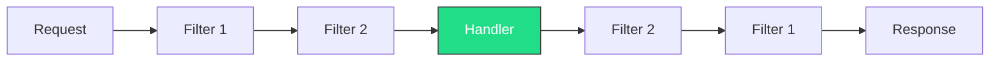

# Minimal APIs Deep-Dive

## Introduction

Minimal APIs were introduced in **.NET 6** as a new way to build HTTP APIs with minimal ceremony. Instead of creating controller classes with attributes and convention-based routing, you wire endpoints **explicitly** in `Program.cs` using lambdas or method references.

**Why were they introduced?**

- Reduce boilerplate for simple APIs (no controllers, no attributes, no startup class)
- Align with modern frameworks like Express.js, FastAPI, and Sinatra
- Improve startup performance by reducing reflection-based discovery

**Convention vs explicit wiring**: Controllers use _conventions_ — naming a method `GetById` with `[HttpGet]` in an `[ApiController]` class. Minimal APIs use _explicit wiring_ — `app.MapGet("/events/{id}", handler)` makes intent immediately visible.

💡 **Why this matters**: Most new .NET API development uses the Minimal API model. Greenfield microservices, serverless endpoints, and even larger projects are adopting this pattern. Understanding Minimal APIs is essential for modern .NET development.

In this chapter, we build a complete **TechConf Event Management** API using Minimal APIs.

---

## Your First Endpoint

Create and run the simplest possible API:

```bash
dotnet new web -n TechConf.Api
cd TechConf.Api
```

```csharp
// Program.cs
var builder = WebApplication.CreateBuilder(args);  // 1. Configure DI, config, logging
var app = builder.Build();                          // 2. Build the application

app.MapGet("/", () => "Welcome to TechConf!");      // 3. Map GET / to a lambda handler

app.Run();                                          // 4. Start Kestrel web server
```

**What each line does:**

1. Creates a builder with dependency injection, configuration, and logging pre-configured
2. Builds the `WebApplication` from the configured builder
3. Maps HTTP GET on `/` to a handler that returns a string
4. Starts listening (default: `http://localhost:5000`)

```bash
dotnet run
# In another terminal:
curl http://localhost:5000
# Output: Welcome to TechConf!
```

📝 **Note**: You can also open `http://localhost:5000` in your browser to see the result.

---

## HTTP Method Mapping

| HTTP Method | Map Method  | CRUD Operation | Example Route             |
| ----------- | ----------- | -------------- | ------------------------- |
| GET         | `MapGet`    | **R**ead       | `GET /api/events`         |
| POST        | `MapPost`   | **C**reate     | `POST /api/events`        |
| PUT         | `MapPut`    | **U**pdate     | `PUT /api/events/{id}`    |
| PATCH       | `MapPatch`  | Partial Update | `PATCH /api/events/{id}`  |
| DELETE      | `MapDelete` | **D**elete     | `DELETE /api/events/{id}` |

### Complete CRUD Example — TechConf Events

```csharp
var builder = WebApplication.CreateBuilder(args);
var app = builder.Build();

var events = new List<Event>
{
    new(Guid.NewGuid(), "dotnet conf 2026", DateTime.Parse("2026-11-10"), "Virtual", "Annual .NET conference"),
    new(Guid.NewGuid(), "TechConf Munich", DateTime.Parse("2026-06-15"), "Munich", null)
};

// READ all
app.MapGet("/api/events", () => events);

// READ one by ID
app.MapGet("/api/events/{id:guid}", (Guid id) =>
{
    var evt = events.FirstOrDefault(e => e.Id == id);
    return evt is not null ? Results.Ok(evt) : Results.NotFound();
});

// CREATE
app.MapPost("/api/events", (CreateEventRequest request) =>
{
    var evt = new Event(Guid.NewGuid(), request.Name, request.Date, request.City, request.Description);
    events.Add(evt);
    return Results.Created($"/api/events/{evt.Id}", evt);
});

// UPDATE (full replace)
app.MapPut("/api/events/{id:guid}", (Guid id, UpdateEventRequest request) =>
{
    var index = events.FindIndex(e => e.Id == id);
    if (index == -1) return Results.NotFound();
    events[index] = new Event(id, request.Name, request.Date, request.City, request.Description);
    return Results.Ok(events[index]);
});

// DELETE
app.MapDelete("/api/events/{id:guid}", (Guid id) =>
{
    var removed = events.RemoveAll(e => e.Id == id);
    return removed > 0 ? Results.NoContent() : Results.NotFound();
});

app.Run();

record Event(Guid Id, string Name, DateTime Date, string City, string? Description = null);
record CreateEventRequest(string Name, DateTime Date, string City, string? Description = null);
record UpdateEventRequest(string Name, DateTime Date, string City, string? Description = null);
```

---

## Parameter Binding — All Sources

The framework inspects your handler's parameters and automatically resolves them from the correct source.

### Route Parameters

```csharp
app.MapGet("/api/events/{id:guid}", (Guid id) => ...);

// Multiple route parameters
app.MapGet("/api/events/{eventId:guid}/sessions/{sessionId:int}",
    (Guid eventId, int sessionId) => Results.Ok(new { eventId, sessionId }));
```

⚠️ The route parameter name `{id}` must match the method parameter name `id`.

### Query String Parameters

```csharp
// GET /api/events?search=dotnet&page=2&pageSize=10
app.MapGet("/api/events", (string? search, int page = 1, int pageSize = 10) =>
{
    var query = events.AsEnumerable();
    if (!string.IsNullOrWhiteSpace(search))
        query = query.Where(e => e.Name.Contains(search, StringComparison.OrdinalIgnoreCase));
    return Results.Ok(query.Skip((page - 1) * pageSize).Take(pageSize).ToList());
});
```

💡 Nullable types (`string?`) and default values (`int page = 1`) make parameters optional.

### Request Body (JSON)

Complex types are automatically deserialized from the JSON body for POST/PUT/PATCH:

```csharp
app.MapPost("/api/events", (CreateEventRequest request) =>
{
    var evt = new Event(Guid.NewGuid(), request.Name, request.Date, request.City, request.Description);
    events.Add(evt);
    return Results.Created($"/api/events/{evt.Id}", evt);
});
```

📝 Only **one** parameter can be bound from the body per endpoint.

### Header Binding

```csharp
app.MapGet("/api/events",
    ([FromHeader(Name = "X-Correlation-Id")] string correlationId) =>
        Results.Ok(new { correlationId, message = "Headers received" }));
```

### Service Injection (DI)

Registered services are automatically injected — no attribute needed:

```csharp
builder.Services.AddSingleton<IEventService, InMemoryEventService>();

app.MapGet("/api/events", (IEventService service) => service.GetAllEvents());

app.MapGet("/api/events/{id:guid}", (Guid id, IEventService service) =>
{
    var evt = service.GetById(id);
    return evt is not null ? Results.Ok(evt) : Results.NotFound();
});
```

### Special Types

These types are recognized and resolved automatically:

```csharp
app.MapGet("/api/debug", (HttpContext context) =>
    Results.Ok(new { path = context.Request.Path }));

app.MapGet("/api/events", async (IEventService service, CancellationToken ct) =>
    await service.GetAllEventsAsync(ct));

app.MapGet("/api/me", (ClaimsPrincipal user) =>
    Results.Ok(new { name = user.Identity?.Name }));
```

### `[AsParameters]` — Grouping Parameters

```csharp
app.MapGet("/api/events", ([AsParameters] EventSearchParams p) =>
    p.Service.Search(p.Search, p.Page, p.PageSize));

record EventSearchParams(string? Search, int Page = 1, int PageSize = 10, IEventService Service);
```

### Binding Source Reference

| Source       | Attribute        | Auto-detected? | Example                               |
| ------------ | ---------------- | -------------- | ------------------------------------- |
| Route        | `[FromRoute]`    | ✅ Yes         | `(Guid id)` with `{id}` in route      |
| Query String | `[FromQuery]`    | ✅ Yes         | `(string? search)`                    |
| Body (JSON)  | `[FromBody]`     | ✅ Yes         | `(CreateEventRequest request)`        |
| Header       | `[FromHeader]`   | ❌ Required    | `([FromHeader] string correlationId)` |
| DI Services  | `[FromServices]` | ✅ Yes         | `(IEventService service)`             |
| Form         | `[FromForm]`     | ❌ Required    | `([FromForm] string name)`            |

**Binding precedence** (how the framework decides):

1. Explicit `[From*]` attribute (always wins)
2. Special types (`HttpContext`, `CancellationToken`, `ClaimsPrincipal`)
3. Registered DI service
4. Route parameter (if name matches a route segment)
5. Query string (simple/value types)
6. Body (complex types, POST/PUT/PATCH only)

---

## Records for DTOs

C# **records** are ideal for API data transfer objects — immutability, value equality, and concise syntax.

```csharp
// One line gives you: constructor, read-only props, equality, ToString(), `with` expressions
record CreateEventRequest(string Name, DateTime Date, string City, string? Description = null);

var original = new EventResponse(Guid.NewGuid(), "dotnet conf", DateTime.Now, "Virtual", null);
var updated = original with { City = "Munich" };  // New instance with City changed
```

### Comparison: record vs record struct vs class

| Feature              | `record`         | `record struct`   | `class`            |
| -------------------- | ---------------- | ----------------- | ------------------ |
| Reference type       | ✅               | ❌ (value type)   | ✅                 |
| Immutable by default | ✅               | ❌ (mutable)      | ❌                 |
| Value equality       | ✅               | ✅                | ❌ (ref equality)  |
| `with` expression    | ✅               | ✅                | ❌                 |
| Best for             | DTOs, API models | Small value types | Entities, services |

### TechConf DTO Examples

```csharp
// Request DTOs
record CreateEventRequest(string Name, DateTime Date, string City, string? Description = null);
record UpdateEventRequest(string Name, DateTime Date, string City, string? Description = null);

// Response DTO
record EventResponse(Guid Id, string Name, DateTime Date, string City, string? Description);

// Property-style with required members (for larger DTOs)
record CreateSessionRequest
{
    public required string Title { get; init; }
    public required TimeSpan Duration { get; init; }
    public string? Abstract { get; init; }
    public required Guid EventId { get; init; }
}
```

💡 Use positional records for simple DTOs (≤5 properties). For larger DTOs, use property syntax with `init` and `required`.

---

## TypedResults vs Results

### The Problem

```csharp
// Loosely typed — returns IResult, OpenAPI can't infer response types
app.MapGet("/api/events/{id:guid}", (Guid id) =>
{
    var evt = events.FirstOrDefault(e => e.Id == id);
    return evt is not null ? Results.Ok(evt) : Results.NotFound();
});
```

### The Solution: TypedResults

```csharp
// Strongly typed — compiler and OpenAPI know exact return types
app.MapGet("/api/events/{id:guid}", Results<Ok<Event>, NotFound> (Guid id) =>
{
    var evt = events.FirstOrDefault(e => e.Id == id);
    return evt is not null ? TypedResults.Ok(evt) : TypedResults.NotFound();
});
```

**Benefits**: compile-time safety, automatic OpenAPI documentation, self-documenting return types, refactoring safety.

### Common TypedResults Methods

| Method                              | Status | Description                        |
| ----------------------------------- | ------ | ---------------------------------- |
| `TypedResults.Ok(value)`            | 200    | Success with body                  |
| `TypedResults.Created(uri, value)`  | 201    | Resource created                   |
| `TypedResults.NoContent()`          | 204    | Success without body               |
| `TypedResults.BadRequest(value)`    | 400    | Client error                       |
| `TypedResults.NotFound()`           | 404    | Resource not found                 |
| `TypedResults.Conflict(value)`      | 409    | Resource conflict                  |
| `TypedResults.ValidationProblem(e)` | 400    | Validation errors (ProblemDetails) |

### Union Return Types

Use `Results<T1, T2, ...>` (up to 6 type parameters) to declare all possible responses:

```csharp
app.MapPost("/api/events",
    Results<Created<Event>, ValidationProblem, Conflict> (CreateEventRequest request) =>
{
    if (string.IsNullOrWhiteSpace(request.Name))
        return TypedResults.ValidationProblem(
            new Dictionary<string, string[]> { ["Name"] = ["Event name is required"] });

    if (events.Any(e => e.Name == request.Name))
        return TypedResults.Conflict(new { message = $"Event '{request.Name}' already exists" });

    var evt = new Event(Guid.NewGuid(), request.Name, request.Date, request.City, request.Description);
    events.Add(evt);
    return TypedResults.Created($"/api/events/{evt.Id}", evt);
});
```

⚠️ Don't mix `Results.*` and `TypedResults.*` in the same endpoint — they return different types and won't compile with union return types.

---

## Route Groups — Organizing Endpoints

### The Problem

```csharp
// Every endpoint repeats "/api/events"
app.MapGet("/api/events", GetAllEvents);
app.MapGet("/api/events/{id:guid}", GetEventById);
app.MapPost("/api/events", CreateEvent);
```

### The Solution: MapGroup

```csharp
var group = app.MapGroup("/api/events").WithTags("Events");
group.MapGet("/", GetAllEvents);
group.MapGet("/{id:guid}", GetEventById);
group.MapPost("/", CreateEvent);
group.MapPut("/{id:guid}", UpdateEvent);
group.MapDelete("/{id:guid}", DeleteEvent);
```

### Nested Groups

```csharp
var api = app.MapGroup("/api");
var eventGroup = api.MapGroup("/events").WithTags("Events");
var sessionGroup = api.MapGroup("/sessions").WithTags("Sessions");
```

### Recommended Pattern: Extension Methods

```csharp
// Endpoints/EventEndpoints.cs
public static class EventEndpoints
{
    public static RouteGroupBuilder MapEventEndpoints(this IEndpointRouteBuilder app)
    {
        var group = app.MapGroup("/api/events").WithTags("Events").WithOpenApi();

        group.MapGet("/", GetAll);
        group.MapGet("/{id:guid}", GetById);
        group.MapPost("/", Create);
        group.MapPut("/{id:guid}", Update);
        group.MapDelete("/{id:guid}", Delete);

        return group;
    }

    private static Ok<List<Event>> GetAll(IEventService service)
        => TypedResults.Ok(service.GetAll());

    private static Results<Ok<Event>, NotFound> GetById(Guid id, IEventService service)
    {
        var evt = service.GetById(id);
        return evt is not null ? TypedResults.Ok(evt) : TypedResults.NotFound();
    }

    private static Created<Event> Create(CreateEventRequest request, IEventService service)
    {
        var evt = service.Create(request);
        return TypedResults.Created($"/api/events/{evt.Id}", evt);
    }

    private static Results<Ok<Event>, NotFound> Update(
        Guid id, UpdateEventRequest request, IEventService service)
    {
        var evt = service.Update(id, request);
        return evt is not null ? TypedResults.Ok(evt) : TypedResults.NotFound();
    }

    private static Results<NoContent, NotFound> Delete(Guid id, IEventService service)
        => service.Delete(id) ? TypedResults.NoContent() : TypedResults.NotFound();
}

// Program.cs — clean one-line registration
app.MapEventEndpoints();
```

---

## Route Constraints

Route constraints restrict what values a route parameter will match. If the constraint fails, the route returns `404`.

| Constraint     | Example                      | Matches                  |
| -------------- | ---------------------------- | ------------------------ |
| `int`          | `{id:int}`                   | `123`, `-1`              |
| `guid`         | `{id:guid}`                  | `CD2C1638-1638-72D5-...` |
| `bool`         | `{active:bool}`              | `true`, `false`          |
| `datetime`     | `{date:datetime}`            | `2026-06-15`             |
| `alpha`        | `{name:alpha}`               | Letters only             |
| `minlength(n)` | `{name:minlength(3)}`        | 3+ characters            |
| `maxlength(n)` | `{name:maxlength(50)}`       | Up to 50 characters      |
| `length(n,m)`  | `{code:length(3,6)}`         | 3 to 6 characters        |
| `min(n)`       | `{age:min(18)}`              | ≥ 18                     |
| `max(n)`       | `{qty:max(100)}`             | ≤ 100                    |
| `range(n,m)`   | `{page:range(1,100)}`        | 1 through 100            |
| `regex(expr)`  | `{code:regex(^[A-Z]{{3}}$)}` | `ABC`, `XYZ`             |
| `required`     | `{name:required}`            | Non-empty values         |

```csharp
// Single constraint
app.MapGet("/api/events/{id:guid}", (Guid id) => ...);

// Multiple constraints chained with colons
app.MapGet("/api/events/{slug:alpha:minlength(3):maxlength(100)}", (string slug) => ...);
```

💡 Always use `{id:guid}` instead of plain `{id}` for GUID parameters to prevent route conflicts with named routes like `/api/events/search`.

---

## Endpoint Filters

Endpoint filters run code before and after a handler — the Minimal API equivalent of MVC action filters.



### Inline Filter

```csharp
app.MapGet("/api/events", (IEventService service) => service.GetAll())
    .AddEndpointFilter(async (context, next) =>
    {
        var sw = Stopwatch.StartNew();
        var result = await next(context);
        Console.WriteLine($"Executed in {sw.ElapsedMilliseconds}ms");
        return result;
    });
```

### Typed Reusable Filter

```csharp
public class ValidationFilter<T> : IEndpointFilter where T : class
{
    public async ValueTask<object?> InvokeAsync(
        EndpointFilterInvocationContext context,
        EndpointFilterDelegate next)
    {
        var argument = context.Arguments.OfType<T>().FirstOrDefault();
        if (argument is null)
            return TypedResults.BadRequest(new { error = $"{typeof(T).Name} is required" });

        var problems = new Dictionary<string, string[]>();
        foreach (var prop in typeof(T).GetProperties())
        {
            if (prop.PropertyType == typeof(string)
                && prop.GetValue(argument) is string val
                && string.IsNullOrWhiteSpace(val))
                problems[prop.Name] = [$"{prop.Name} must not be empty"];
        }

        return problems.Count > 0
            ? TypedResults.ValidationProblem(problems)
            : await next(context);
    }
}

// Apply to an endpoint
app.MapPost("/api/events", (CreateEventRequest req, IEventService svc) => ...)
    .AddEndpointFilter<ValidationFilter<CreateEventRequest>>();
```

### Apply Filters to Route Groups

```csharp
var group = app.MapGroup("/api/events")
    .AddEndpointFilter(async (ctx, next) =>
    {
        Console.WriteLine($"[{DateTime.UtcNow}] {ctx.HttpContext.Request.Method} {ctx.HttpContext.Request.Path}");
        return await next(ctx);
    });
```

### Filters vs Middleware

| Aspect          | Endpoint Filters               | Middleware                     |
| --------------- | ------------------------------ | ------------------------------ |
| Scope           | Single endpoint or group       | All requests (global pipeline) |
| Endpoint access | ✅ Can read handler parameters | ❌ No parameter access         |
| Best for        | Validation, per-endpoint auth  | CORS, logging, compression     |
| Registration    | `.AddEndpointFilter()`         | `app.Use()`                    |

---

## Organizing a Large API

### Recommended File Structure

```
TechConf.Api/
├── Program.cs
├── Endpoints/
│   ├── EventEndpoints.cs
│   ├── SessionEndpoints.cs
│   ├── SpeakerEndpoints.cs
│   └── AttendeeEndpoints.cs
├── Models/
│   ├── Event.cs
│   ├── Session.cs
│   └── Speaker.cs
├── Services/
│   ├── IEventService.cs
│   └── InMemoryEventService.cs
└── Filters/
    └── ValidationFilter.cs
```

```csharp
// Program.cs — clean and minimal
var builder = WebApplication.CreateBuilder(args);
builder.Services.AddSingleton<IEventService, InMemoryEventService>();
builder.Services.AddSingleton<ISessionService, InMemorySessionService>();
builder.Services.AddOpenApi();

var app = builder.Build();
app.MapOpenApi();
app.MapEventEndpoints();       // One line per entity
app.MapSessionEndpoints();
app.MapSpeakerEndpoints();
app.MapAttendeeEndpoints();
app.Run();
```

### Alternative: Interface-based Auto-Discovery

```csharp
public interface IEndpointMapper
{
    static abstract void MapEndpoints(IEndpointRouteBuilder app);
}
```

### Carter Library

[Carter](https://github.com/CarterCommunity/Carter) is a community library adding module-based structure. Worth knowing about, but this course uses the built-in patterns.

### Naming Conventions

| Element          | Convention                | Example                       |
| ---------------- | ------------------------- | ----------------------------- |
| Endpoint class   | `{Entity}Endpoints`       | `EventEndpoints`              |
| Extension method | `Map{Entity}Endpoints`    | `MapEventEndpoints()`         |
| Handler methods  | CRUD verb names           | `GetAll`, `GetById`, `Create` |
| Request DTOs     | `{Action}{Entity}Request` | `CreateEventRequest`          |
| Response DTOs    | `{Entity}Response`        | `EventResponse`               |

---

## Minimal APIs vs Controllers

| Feature             | Minimal APIs                 | Controllers                       |
| ------------------- | ---------------------------- | --------------------------------- |
| Setup ceremony      | None (lambdas/methods)       | Class + attributes + conventions  |
| Route definition    | Explicit (`MapGet(...)`)     | Convention + attributes           |
| Parameter binding   | Automatic + `[From*]`        | Automatic + `[From*]`             |
| Model validation    | Manual / filters             | `[ApiController]` auto-validation |
| Filters             | Endpoint filters             | Action filters, result filters    |
| OpenAPI support     | ✅ Built-in                  | ✅ Built-in                       |
| TypedResults        | ✅ Native                    | ✅ Supported                      |
| Route groups        | ✅ `MapGroup()`              | ❌ Area/attribute routing         |
| Content negotiation | Manual                       | Built-in (XML, JSON, etc.)        |
| Output caching      | ✅ `.CacheOutput()`          | ✅ `[OutputCache]`                |
| Rate limiting       | ✅ `.RequireRateLimiting()`  | ✅ `[EnableRateLimiting]`         |
| Authorization       | ✅ `.RequireAuthorization()` | ✅ `[Authorize]`                  |
| API versioning      | ✅ Via groups                | ✅ Via attributes                 |
| Performance         | Slightly faster              | Slightly more overhead            |
| Testability         | Direct method calls          | `WebApplicationFactory`           |
| File uploads        | `IFormFile`                  | `IFormFile`                       |

**Choose Minimal APIs** for greenfield projects, microservices, and teams preferring explicit wiring.
**Choose Controllers** for large teams familiar with MVC, complex model binding, or migrating existing apps.

You can **mix both** in the same project:

```csharp
builder.Services.AddControllers();
var app = builder.Build();
app.MapControllers();       // Controller routes
app.MapEventEndpoints();    // Minimal API routes
```

📝 This course focuses on Minimal APIs, but controllers remain production-valid.

---

## Common Pitfalls

⚠️ **Forgetting proper status codes** — Don't just return the object:

```csharp
// ❌ Always returns 200, even when not found
app.MapGet("/api/events/{id:guid}", (Guid id) => events.FirstOrDefault(e => e.Id == id));
// ✅ Returns 404 when not found
app.MapGet("/api/events/{id:guid}", Results<Ok<Event>, NotFound> (Guid id) =>
    events.FirstOrDefault(e => e.Id == id) is { } evt
        ? TypedResults.Ok(evt) : TypedResults.NotFound());
```

⚠️ **Not using `CancellationToken`** for async operations:

```csharp
// ❌ Can't be cancelled when client disconnects
app.MapGet("/api/events", async (IEventService s) => await s.GetAllAsync());
// ✅ Cancellable
app.MapGet("/api/events", async (IEventService s, CancellationToken ct) => await s.GetAllAsync(ct));
```

⚠️ **Route parameter name mismatch** — `{eventId}` in route but `id` in method signature silently fails.

⚠️ **Circular dependency injection** — Service A → Service B → Service A throws at runtime. Design clear dependency hierarchies.

⚠️ **Mixing `Results` and `TypedResults`** — They return different types. Pick one and stay consistent within each endpoint.

---

## Mini-Exercise: "Try It Yourself"

Start from the CRUD example earlier in this document and extend it:

**Exercise 1 — Search Endpoint**: Add `MapGet("/api/events/search")` accepting `query` (string), `city` (string?), and `fromDate` (DateTime?) as query parameters. Return matching events with `TypedResults.Ok()`.

**Exercise 2 — Validated POST**: Add a `MapPost` that validates `Name` is not empty, `Date` is in the future, and `City` is not empty. Return `TypedResults.ValidationProblem()` on failure, `TypedResults.Created()` on success.

**Exercise 3 — Route Groups**: Refactor all event endpoints into an `EventEndpoints` static class using `MapGroup("/api/events")`. Register with `app.MapEventEndpoints()`.

**Exercise 4 — Execution Timer Filter**: Create an `IEndpointFilter` that logs execution time and sets an `X-Elapsed-Ms` response header:

```csharp
public class TimingFilter : IEndpointFilter
{
    public async ValueTask<object?> InvokeAsync(
        EndpointFilterInvocationContext context, EndpointFilterDelegate next)
    {
        var sw = Stopwatch.StartNew();
        var result = await next(context);
        sw.Stop();
        context.HttpContext.Response.Headers["X-Elapsed-Ms"] = sw.ElapsedMilliseconds.ToString();
        return result;
    }
}
```

---

## Further Reading

- 📖 [Minimal APIs overview](https://learn.microsoft.com/en-us/aspnet/core/fundamentals/minimal-apis/overview)
- 📖 [Parameter binding](https://learn.microsoft.com/en-us/aspnet/core/fundamentals/minimal-apis/parameter-binding)
- 📖 [Filters in Minimal APIs](https://learn.microsoft.com/en-us/aspnet/core/fundamentals/minimal-apis/min-api-filters)
- 📖 [Route constraints](https://learn.microsoft.com/en-us/aspnet/core/fundamentals/routing#route-constraints)
- 📖 [What's new in ASP.NET Core 10](https://learn.microsoft.com/en-us/aspnet/core/release-notes/aspnetcore-10.0)
- 📖 [Carter library](https://github.com/CarterCommunity/Carter)

---

_Next up: [Dependency Injection for Minimal APIs](02a-dependency-injection.md) — Understand how Minimal APIs resolve services, lifetimes, and scopes._
