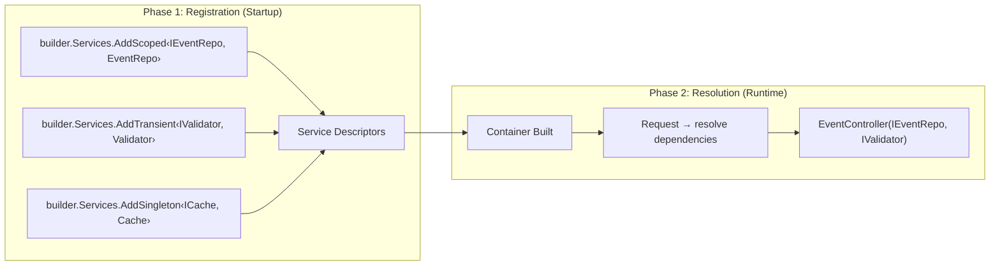
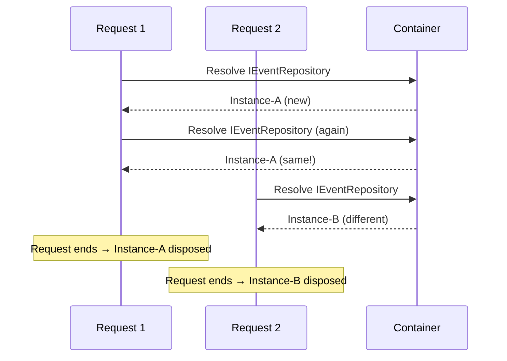
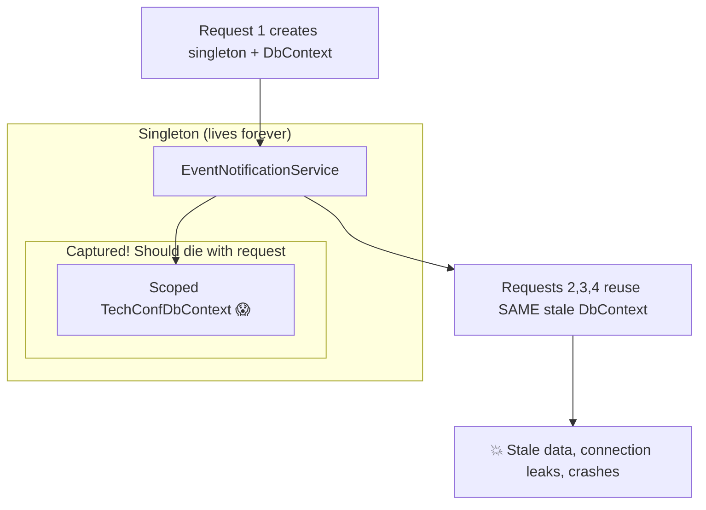

# Dependency Injection for Minimal APIs

## Introduction

Dependency Injection (DI) is the backbone of ASP.NET Core, and it shows up immediately when you start writing Minimal APIs.
If you want to understand why a handler can accept `IEventService` or `ILogger<Program>` as parameters, you need to understand DI first.

**The Problem: Tight Coupling**

```csharp
// ❌ Tightly coupled — hard to test, hard to change
public class EventManager
{
    private readonly EventRepository _repo = new EventRepository(new TechConfDbContext());
    public Event GetEvent(int id) => _repo.GetById(id);
}

// ✅ Loosely coupled — testable, flexible
public class EventManager
{
    private readonly IEventRepository _repo;
    public EventController(IEventRepository repo) => _repo = repo;
    public Event GetEvent(int id) => _repo.GetById(id);
}
```

The class no longer knows _which_ implementation it gets. That decision is made by the **DI container**.

---

## The DI Container Concept

An **Inversion of Control (IoC) container** knows how to create objects, manages their lifetime,
and resolves entire dependency graphs automatically. ASP.NET Core ships with a built-in container.



**Phase 1 — Registration:** Tell the container _what_ to create and _how long_ it lives (`builder.Services`).
**Phase 2 — Resolution:** At runtime, the container walks the dependency graph and injects via constructors.

> [!TIP]
> 💡 Think of the container as a **"factory of factories"** — it creates the objects that those objects need, recursively down the graph.

---

## Service Lifetimes — The Critical Decision

Every registration specifies a **lifetime**. Getting this wrong causes subtle, hard-to-debug issues.

### Transient — New Instance Every Time

```csharp
builder.Services.AddTransient<IEventValidator, EventValidator>();
```

Created fresh every time it is requested. Three classes in the same request each get their **own** instance.

**When to use:** Lightweight, stateless services — validators, formatters, builders.

```csharp
public class EventValidator : IEventValidator
{
    public ValidationResult Validate(Event evt)
    {
        var errors = new List<string>();
        if (string.IsNullOrWhiteSpace(evt.Title))
            errors.Add("Event title is required.");
        if (evt.StartDate >= evt.EndDate)
            errors.Add("Start date must be before end date.");
        return new ValidationResult(errors);
    }
}
```

### Scoped — One Instance per HTTP Request

```csharp
builder.Services.AddScoped<IEventRepository, EventRepository>();
```

Created **once per request**. Every class within the same request gets the **same** instance.
When the request ends, the scope and all scoped services are disposed.

**When to use:** DbContext, repositories, unit-of-work, per-request state.



### Singleton — One Instance for the App Lifetime

```csharp
builder.Services.AddSingleton<ICacheService, CacheService>();
```

Created **once**, shared across every request and thread for the entire application lifetime.

**When to use:** Thread-safe shared state, caches, configuration services.

> [!IMPORTANT]
> ⚠️ **Singletons MUST be thread-safe.** Multiple requests access them concurrently.

```csharp
public class CacheService : ICacheService
{
    private readonly ConcurrentDictionary<string, CachedEvent> _cache = new();
    public CachedEvent? GetEvent(string key) =>
        _cache.TryGetValue(key, out var evt) ? evt : null;
    public void SetEvent(string key, CachedEvent evt) => _cache[key] = evt;
}
```

### Comparison Table

| Lifetime  | Created       | Disposed        | Thread-Safe? | Typical Use             |
| --------- | ------------- | --------------- | ------------ | ----------------------- |
| Transient | Every resolve | When scope ends | No           | Validators, formatters  |
| Scoped    | Per request   | End of request  | No           | DbContext, repositories |
| Singleton | Once          | App shutdown    | **Yes!**     | Cache, configuration    |

**Quick decision:** DB connection? → **Scoped**. Stateless? → **Transient**. Shared state? → **Singleton**.

---

## The Captive Dependency Problem

> ⚠️ **The #1 most common DI mistake.**

A **captive dependency** occurs when a longer-lived service captures a shorter-lived service — typically a Singleton holding a Scoped service.



The DbContext was designed to live for one request, but is kept alive forever — causing stale data, connection leaks, and thread-safety crashes.

### Detection: ValidateScopes

```csharp
builder.Host.UseDefaultServiceProvider(options =>
{
    options.ValidateScopes = true;   // Catch captive dependencies at resolve time
    options.ValidateOnBuild = true;  // Catch ALL issues at startup (recommended!)
});
```

### What Can Inject What?

| Consumer ↓ / Dependency → | Transient | Scoped          | Singleton |
| ------------------------- | --------- | --------------- | --------- |
| **Transient**             | ✅        | ✅              | ✅        |
| **Scoped**                | ✅        | ✅              | ✅        |
| **Singleton**             | ✅        | ❌ **Captive!** | ✅        |

> A service may only depend on services with an **equal or longer** lifetime.

---

## Registration Patterns

**Interface → Implementation:**

```csharp
builder.Services.AddScoped<IEventRepository, EventRepository>();
```

**Multiple implementations** — last registration wins for single-service resolution:

```csharp
builder.Services.AddScoped<IEventRepository, SqlEventRepository>();
builder.Services.AddScoped<IEventRepository, CosmosEventRepository>(); // ← wins
```

**Conditional registration** — only if not already registered:

```csharp
builder.Services.TryAddScoped<IEventRepository, EventRepository>();
```

**Factory registration:**

```csharp
builder.Services.AddScoped<IEventService>(sp =>
{
    var dbContext = sp.GetRequiredService<TechConfDbContext>();
    var logger = sp.GetRequiredService<ILogger<EventService>>();
    return new EventService(dbContext, logger);
});
```

**Extension method pattern for clean registration:**

```csharp
public static class ServiceCollectionExtensions
{
    public static IServiceCollection AddTechConfServices(this IServiceCollection services)
    {
        services.AddScoped<IEventRepository, EventRepository>();
        services.AddScoped<ISessionRepository, SessionRepository>();
        services.AddScoped<IEventService, EventService>();
        services.AddTransient<IEventValidator, EventValidator>();
        services.AddSingleton<ICacheService, CacheService>();
        return services;
    }
}

// In Program.cs — one clean line
builder.Services.AddTechConfServices();
```

---

## Keyed Services (.NET 8+)

When you have **multiple implementations** of the same interface and need to choose between them:

```csharp
builder.Services.AddKeyedScoped<INotificationService, EmailNotificationService>("email");
builder.Services.AddKeyedScoped<INotificationService, SmsNotificationService>("sms");
builder.Services.AddKeyedScoped<INotificationService, PushNotificationService>("push");
```

**Resolution in Minimal APIs:**

```csharp
app.MapPost("/events/{id}/notify", (
    int id,
    [FromKeyedServices("email")] INotificationService notifier) =>
{
    return notifier.NotifyAsync($"event-{id}@techconf.com", "Event approved!");
});
```

**Resolution in controllers:**

```csharp
public class NotificationController(
    [FromKeyedServices("sms")] INotificationService smsNotifier) : ControllerBase
{ }
```

| Approach         | Best When                                                    |
| ---------------- | ------------------------------------------------------------ |
| Keyed Services   | Fixed set of named implementations, chosen at injection time |
| Factory Pattern  | Runtime decision logic, complex creation rules               |
| `IEnumerable<T>` | You need **all** implementations (pipeline, chain)           |

---

## Injecting into Minimal APIs

Services are resolved **automatically** as endpoint handler parameters:

```csharp
app.MapGet("/events/{id}", async (int id, IEventService service) =>
{
    var evt = await service.GetByIdAsync(id);
    return evt is not null ? Results.Ok(evt) : Results.NotFound();
});
```

Use `[FromServices]` when the framework can't disambiguate:

```csharp
app.MapPost("/events", ([FromServices] IEventService service, [FromBody] CreateEventDto dto) =>
    service.CreateAsync(dto));
```

**Multiple services in one handler:**

```csharp
app.MapPost("/events/{id}/publish", async (
    int id, IEventService eventService, IEventValidator validator,
    [FromKeyedServices("email")] INotificationService notifier) =>
{
    var evt = await eventService.GetByIdAsync(id);
    if (evt is null) return Results.NotFound();
    var validation = validator.Validate(evt);
    if (!validation.IsValid) return Results.BadRequest(validation.Errors);
    await eventService.PublishAsync(id);
    await notifier.NotifyAsync(evt.OrganizerEmail, $"'{evt.Title}' published!");
    return Results.Ok();
});
```

**Anti-patterns to avoid:**

```csharp
// ❌ Service Locator — hidden dependencies, untestable
app.MapGet("/events", (IServiceProvider sp) =>
    sp.GetRequiredService<IEventRepository>().GetAllAsync());

// ❌ Manual resolution from HttpContext
app.MapGet("/events", (HttpContext ctx) =>
    ctx.RequestServices.GetRequiredService<IEventRepository>().GetAllAsync());

// ✅ Direct injection
app.MapGet("/events", (IEventRepository repo) => repo.GetAllAsync());
```

---

## IServiceScopeFactory — Creating Scopes Manually

Background services are **singletons** and cannot inject scoped services directly. Use `IServiceScopeFactory` to create manual scopes:

```csharp
public class EventCleanupService : BackgroundService
{
    private readonly IServiceScopeFactory _scopeFactory;
    private readonly ILogger<EventCleanupService> _logger;

    public EventCleanupService(IServiceScopeFactory scopeFactory, ILogger<EventCleanupService> logger)
    {
        _scopeFactory = scopeFactory;
        _logger = logger;
    }

    protected override async Task ExecuteAsync(CancellationToken ct)
    {
        while (!ct.IsCancellationRequested)
        {
            using var scope = _scopeFactory.CreateScope();
            var repo = scope.ServiceProvider.GetRequiredService<IEventRepository>();
            var expired = await repo.GetExpiredEventsAsync();
            _logger.LogInformation("Archived {Count} expired events", expired.Count);
            await Task.Delay(TimeSpan.FromHours(1), ct);
        }
    }
}
```

> [!TIP]
> 💡 `IServiceScopeFactory` is a singleton — safe to inject anywhere. Each `CreateScope()` produces an independent scope.

---

## Testing with DI

Replace services in integration tests using `WebApplicationFactory`:

```csharp
public class EventApiTests : IClassFixture<WebApplicationFactory<Program>>
{
    private readonly WebApplicationFactory<Program> _factory;
    public EventApiTests(WebApplicationFactory<Program> factory) => _factory = factory;

    [Fact]
    public async Task GetEvents_ReturnsExpectedEvents()
    {
        var client = _factory.WithWebHostBuilder(builder =>
        {
            builder.ConfigureServices(services =>
            {
                services.RemoveAll<IEventRepository>();
                services.AddScoped<IEventRepository, FakeEventRepository>();
            });
        }).CreateClient();

        var response = await client.GetAsync("/events");
        response.EnsureSuccessStatusCode();
    }
}
```

| Approach | When to Use                            |
| -------- | -------------------------------------- |
| **Fake** | Simple in-memory replacement           |
| **Mock** | Verify interactions (Moq, NSubstitute) |
| **Stub** | Return fixed data, no verification     |

---

## DI Outside Web Apps

The same container and registration model also works in a plain console application:

```csharp
using Microsoft.Extensions.Hosting;

var builder = Host.CreateApplicationBuilder(args);

builder.Services.AddSingleton<TimeProvider>(TimeProvider.System);
builder.Services.AddTransient<AgendaPrinter>();

using var app = builder.Build();
var printer = app.Services.GetRequiredService<AgendaPrinter>();
printer.Print("Dependency Injection in a Console App");
```

In a console app there is no automatic HTTP request scope, so you create scopes manually when you want scoped services:

```csharp
using var scope = app.Services.CreateScope();
var scopedPrinter = scope.ServiceProvider.GetRequiredService<AgendaPrinter>();
```

> 💡 Try the optional lab **[Dependency Injection with Application Builder](../../labs/lab-di-console/)** to see this pattern in a small self-contained example.

---

## Common Pitfalls

⚠️ **Captive dependency** — A singleton capturing a scoped service. Use `IServiceScopeFactory`.

⚠️ **Service Locator anti-pattern** — Injecting `IServiceProvider` hides dependencies. Prefer constructor injection.

⚠️ **Circular dependencies** — A depends on B, B depends on A → exception. Introduce an intermediary.

⚠️ **Disposable services not disposed** — The container only disposes instances _it_ creates:

```csharp
// ⚠️ Container will NOT dispose this — you created it
builder.Services.AddSingleton<ICacheService>(new CacheService());
// ✅ Container WILL dispose this
builder.Services.AddSingleton<ICacheService, CacheService>();
```

⚠️ **Concrete types instead of interfaces** — Always depend on abstractions for testability.

💡 **Enable build-time validation** in development:

```csharp
builder.Host.UseDefaultServiceProvider(o => { o.ValidateScopes = true; o.ValidateOnBuild = true; });
```

---

## Mini-Exercise

**Task 1:** Define `IEventService` with `GetAllAsync()`, `GetByIdAsync(int id)`, and `CreateAsync(CreateEventDto dto)`. Implement it as `EventService` depending on `IEventRepository` and `IEventValidator`. What lifetime should it have? Justify.

**Task 2:** Create a `ServiceCollectionExtensions.AddTechConfServices()` method registering all domain services.

**Task 3: Spot the Bug 🐛**

```csharp
builder.Services.AddSingleton<IEventReportService, EventReportService>();
public class EventReportService(TechConfDbContext dbContext) : IEventReportService { }
// TechConfDbContext is registered as Scoped — what's wrong?
```

<details>
<summary>Answer</summary>

**Captive dependency!** The singleton captures a scoped DbContext. Fix: make `EventReportService` scoped, or inject `IServiceScopeFactory`.

</details>

---

## Further Reading

- 📖 [Dependency injection in ASP.NET Core](https://learn.microsoft.com/en-us/aspnet/core/fundamentals/dependency-injection)
- 📖 [Keyed Services in .NET 8](https://learn.microsoft.com/en-us/dotnet/core/extensions/dependency-injection#keyed-services)
- 📖 [Service lifetimes](https://learn.microsoft.com/en-us/dotnet/core/extensions/dependency-injection#service-lifetimes)
- 📖 [Background tasks with hosted services](https://learn.microsoft.com/en-us/aspnet/core/fundamentals/host/hosted-services)
- 📖 Mark Seemann — _Dependency Injection: Principles, Practices, and Patterns_ (Manning, 2nd ed.)

---

_Next up: [OpenAPI & Scalar](03-openapi-scalar.md) — Generate interactive API documentation automatically from your Minimal API endpoints._
