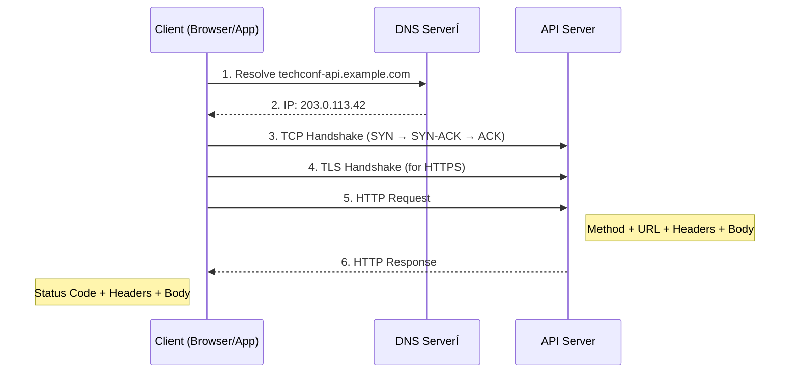

# HTTP Fundamentals for REST APIs

## Why This Matters

Every REST API you build sits on top of HTTP. It's not just a transport layer — **the protocol IS the API**. The HTTP methods you choose, the status codes you return, and the headers you set are the public contract your clients depend on.

A developer who doesn't understand HTTP will build APIs that are confusing, hard to debug, and fragile. A developer who masters HTTP will build APIs that are intuitive, self-documenting, and robust.

In this module, we'll cover everything you need to know about HTTP to build professional-grade REST APIs with ASP.NET Core.

💡 **Think of it this way**: HTTP is to REST APIs what grammar is to language. You can't write well if you don't understand grammar — and you can't build good APIs without understanding HTTP.

---

## The HTTP Request/Response Cycle

Every API call follows this lifecycle:



### Request Structure

Every HTTP request has up to four parts:

```http
POST /api/events HTTP/1.1              ← Method + Path + Protocol
Host: techconf-api.example.com         ← Headers start here
Content-Type: application/json
Authorization: Bearer eyJhbGciOi...
                                       ← Empty line separates headers from body
{                                      ← Request body (optional)
  "title": "Intro to .NET 10",
  "startDate": "2026-03-15T09:00:00Z",
  "city": "Munich"
}
```

### Response Structure

Every HTTP response has up to three parts:

```http
HTTP/1.1 201 Created                   ← Protocol + Status Code + Reason
Content-Type: application/json         ← Headers
Location: /api/events/42               ← URI of the created resource
                                       ← Empty line
{                                      ← Response body
  "id": 42,
  "title": "Intro to .NET 10",
  "startDate": "2026-03-15T09:00:00Z",
  "city": "Munich"
}
```

💡 **Key insight**: The request and response are plain text. There's no magic — you can read and write raw HTTP by hand. Tools like `.http` files in your IDE let you do exactly that.

---

## HTTP Methods in Detail

### Overview Table

| Method    | CRUD Operation | Idempotent | Safe | Request Body | Response Body |
| --------- | -------------- | ---------- | ---- | ------------ | ------------- |
| `GET`     | Read           | ✅         | ✅   | ❌           | ✅            |
| `POST`    | Create         | ❌         | ❌   | ✅           | ✅            |
| `PUT`     | Full Update    | ✅         | ❌   | ✅           | Optional      |
| `PATCH`   | Partial Update | ❌\*       | ❌   | ✅           | ✅            |
| `DELETE`  | Delete         | ✅         | ❌   | Optional     | Optional      |
| `HEAD`    | Metadata       | ✅         | ✅   | ❌           | ❌            |
| `OPTIONS` | CORS/Caps      | ✅         | ✅   | ❌           | ✅            |

### Idempotency Explained

**Idempotent** means: calling the operation multiple times produces the same result as calling it once.

```
PUT /api/events/42  { "title": "New Title", "city": "Munich" }
→ First call:  updates the event → 200 OK
→ Second call: same data, same result → 200 OK    ← Idempotent!

POST /api/events    { "title": "New Event" }
→ First call:  creates event #42 → 201 Created
→ Second call: creates event #43 → 201 Created    ← NOT idempotent!
```

⚠️ **Why it matters**: If a network error occurs and the client retries, idempotent operations are safe to repeat. Non-idempotent operations (like POST) may create duplicates.

### Safety Explained

**Safe** methods don't modify server state. `GET` and `HEAD` are safe — they only read data. Clients, caches, and crawlers can call safe methods freely without side effects.

### POST vs PUT for Creation

| Scenario                | Use POST              | Use PUT                            |
| ----------------------- | --------------------- | ---------------------------------- |
| Server generates the ID | ✅ `POST /api/events` | —                                  |
| Client provides the ID  | —                     | ✅ `PUT /api/events/my-event-slug` |
| Creates or replaces     | —                     | ✅ (upsert semantics)              |
| Always creates new      | ✅                    | —                                  |

In most APIs (including TechConf), the server generates IDs — so **POST is the standard for creation**.

### PATCH Approaches

Two common formats for partial updates:

**JSON Merge Patch** (`application/merge-patch+json`) — simpler, most common:

```json
{ "city": "Berlin" }
```

Only the fields present are updated; others remain unchanged.

**JSON Patch** (`application/json-patch+json`) — more powerful, more complex:

```json
[
  { "op": "replace", "path": "/city", "value": "Berlin" },
  { "op": "add", "path": "/tags/-", "value": "updated" }
]
```

💡 _PATCH is idempotent if you use JSON Merge Patch with the same values. Marked ❌_ in the table because the spec doesn't guarantee it.

---

## Status Codes — The Complete Guide

Status codes tell the client **what happened**. Choose them carefully — they are a core part of your API contract.

### 1xx — Informational

Rarely used in REST APIs. `100 Continue` may appear in large file uploads. You typically don't set these yourself.

### 2xx — Success

| Code  | Name       | When to Use                                | TechConf Example                        |
| ----- | ---------- | ------------------------------------------ | --------------------------------------- |
| `200` | OK         | Successful GET, PUT, PATCH                 | `GET /api/events/42` returns the event  |
| `201` | Created    | Successful POST that creates a resource    | `POST /api/events` → new event created  |
| `202` | Accepted   | Async operation started (not yet complete) | Registration confirmation email queued  |
| `204` | No Content | Successful DELETE (nothing to return)      | `DELETE /api/events/42` → event removed |

```csharp
// ASP.NET Core examples
app.MapGet("/api/events/{id}", (int id) => TypedResults.Ok(eventStore.Get(id)));
app.MapPost("/api/events", (Event e) => TypedResults.Created($"/api/events/{e.Id}", e));
app.MapDelete("/api/events/{id}", (int id) => { eventStore.Remove(id); return TypedResults.NoContent(); });
```

💡 **Always return `201 Created` with a `Location` header for POST** — it tells the client where to find the new resource.

### 3xx — Redirection

| Code  | Name              | When to Use                              | TechConf Example                                 |
| ----- | ----------------- | ---------------------------------------- | ------------------------------------------------ |
| `301` | Moved Permanently | Resource has a new permanent URL         | API version retired: `/v1/events` → `/v2/events` |
| `304` | Not Modified      | Conditional GET — content hasn't changed | Client sends `If-None-Match` with ETag           |

Most API developers rarely set 3xx codes manually. They're more common in web applications.

### 4xx — Client Errors

These mean **the client did something wrong**. The client can fix the problem and retry.

| Code  | Name                 | When to Use                                 | TechConf Example                                       |
| ----- | -------------------- | ------------------------------------------- | ------------------------------------------------------ |
| `400` | Bad Request          | Malformed request / invalid input           | Missing required `title` field                         |
| `401` | Unauthorized         | Not authenticated (no/invalid credentials)  | Missing or expired JWT token                           |
| `403` | Forbidden            | Authenticated but not authorized            | Speaker trying to delete an admin-only event           |
| `404` | Not Found            | Resource doesn't exist                      | `GET /api/events/99999`                                |
| `405` | Method Not Allowed   | HTTP method not supported for this URL      | `DELETE /api/events` (collection, not item)            |
| `409` | Conflict             | Business rule violation / state conflict    | Registering for an event you're already registered for |
| `422` | Unprocessable Entity | Validation failed (well-formed but invalid) | Event `endDate` is before `startDate`                  |
| `429` | Too Many Requests    | Rate limit exceeded                         | More than 100 requests per minute                      |

⚠️ **401 vs 403 — Know the Difference!**

|                 | 401 Unauthorized             | 403 Forbidden                 |
| --------------- | ---------------------------- | ----------------------------- |
| **Meaning**     | "Who are you?"               | "I know who you are, but no." |
| **Credentials** | Missing or invalid           | Valid but insufficient        |
| **Fix**         | Log in / provide valid token | Request elevated permissions  |

### 5xx — Server Errors

These mean **the server did something wrong**. The client can't fix these — the server team must investigate.

| Code  | Name                  | When to Use                                | TechConf Example                        |
| ----- | --------------------- | ------------------------------------------ | --------------------------------------- |
| `500` | Internal Server Error | Unhandled exception                        | NullReferenceException in event handler |
| `502` | Bad Gateway           | Upstream service returned invalid response | Payment gateway returned garbage        |
| `503` | Service Unavailable   | Server overloaded or in maintenance        | During deployment or database migration |
| `504` | Gateway Timeout       | Upstream service didn't respond in time    | External speaker-profile API timed out  |

⚠️ **Never return `200 OK` with an error message in the body.** This is one of the most common API anti-patterns. Use proper status codes so clients can handle errors programmatically.

### Quick Reference: Decision Tree

```
Request processed successfully?
├── YES → Did it create a resource?
│   ├── YES → 201 Created + Location header
│   ├── NO  → Is there a response body?
│   │   ├── YES → 200 OK
│   │   └── NO  → 204 No Content
│   └── Is it async? → 202 Accepted
└── NO → Whose fault is it?
    ├── CLIENT → 4xx
    │   ├── Bad input?        → 400 / 422
    │   ├── Not logged in?    → 401
    │   ├── No permission?    → 403
    │   └── Doesn't exist?    → 404
    └── SERVER → 5xx → 500 (catch-all)
```

---

## REST Principles

**REST** stands for **Representational State Transfer**. It's an architectural style defined by Roy Fielding in his 2000 dissertation. REST is not a standard — it's a set of constraints.

### The 6 Constraints

1. **Client-Server** — Client and server are separated. They evolve independently.
2. **Stateless** — Each request contains all information needed. No server-side session state.
3. **Cacheable** — Responses must declare whether they're cacheable. Improves scalability.
4. **Uniform Interface** — The most important constraint. See below.
5. **Layered System** — Client can't tell if it's talking to the server directly or through a proxy/load balancer.
6. **Code on Demand** _(optional)_ — Server can send executable code (e.g., JavaScript). Rarely used in APIs.

### Uniform Interface — The Core of REST

The uniform interface has four sub-constraints:

- **Resource identification**: Resources are identified by URIs (`/api/events/42`)
- **Resource manipulation through representations**: Clients send/receive JSON representations of resources
- **Self-descriptive messages**: Each message contains enough info to process it (Content-Type, status codes)
- **HATEOAS**: Hypermedia as the Engine of Application State — responses include links to related actions

💡 **HATEOAS in practice**: Most real-world APIs don't fully implement HATEOAS. It's good to know the concept, but don't stress about it for this course.

### Resource Naming Conventions

| ✅ Do                            | ❌ Don't                         | Why                                                |
| -------------------------------- | -------------------------------- | -------------------------------------------------- |
| `/api/events`                    | `/api/getEvents`                 | Use nouns, not verbs — the HTTP method is the verb |
| `/api/events/42`                 | `/api/event/42`                  | Use plural for collections                         |
| `/api/events/42/sessions`        | `/api/getSessionsForEvent?id=42` | Nest related resources naturally                   |
| `/api/events?status=active`      | `/api/activeEvents`              | Use query params for filtering                     |
| `/api/events?city=Munich&page=2` | `/api/events/munich/page/2`      | Use query params for optional filters              |

**Nesting vs Flat URLs** — use nesting when there's a clear parent-child relationship:

```
/api/events/42/sessions          ← Sessions belong to an event
/api/events/42/sessions/7        ← Specific session in an event
/api/sessions/7                  ← Also valid — flat access to any session
```

---

## Content Negotiation

Content negotiation lets clients and servers agree on the data format.

### Key Headers

| Header         | Direction         | Purpose                     | Example            |
| -------------- | ----------------- | --------------------------- | ------------------ |
| `Content-Type` | Request → Server  | Format of the request body  | `application/json` |
| `Accept`       | Request → Server  | Desired response format     | `application/json` |
| `Content-Type` | Response → Client | Format of the response body | `application/json` |

### Common Media Types

| Media Type                     | Usage                                                   |
| ------------------------------ | ------------------------------------------------------- |
| `application/json`             | Standard for REST APIs (request & response)             |
| `application/problem+json`     | Standardized error responses (RFC 9457 — covered Day 2) |
| `application/merge-patch+json` | JSON Merge Patch for PATCH requests                     |
| `multipart/form-data`          | File uploads                                            |
| `text/plain`                   | Simple text responses (health checks)                   |

### ASP.NET Core Content Negotiation

ASP.NET Core handles content negotiation automatically:

- JSON is the default format (via `System.Text.Json`)
- The framework reads `Accept` headers and responds accordingly
- You can add XML support with `builder.Services.AddControllers().AddXmlSerializerFormatters()`
- `TypedResults.Ok(event)` automatically serializes to the negotiated format

💡 **For this course**, we'll use JSON exclusively. It's the universal standard for modern APIs.

---

## Important Headers

### Reference Table

| Header             | Direction | Purpose                         | Example Value                          |
| ------------------ | --------- | ------------------------------- | -------------------------------------- |
| `Authorization`    | Request   | Authentication credentials      | `Bearer eyJhbGciOi...`                 |
| `Content-Type`     | Both      | Body format                     | `application/json`                     |
| `Accept`           | Request   | Desired response format         | `application/json`                     |
| `Location`         | Response  | URI of created resource         | `/api/events/42`                       |
| `Cache-Control`    | Response  | Caching directives              | `no-cache`, `max-age=3600`             |
| `ETag`             | Response  | Resource version identifier     | `"v1-abc123"`                          |
| `If-None-Match`    | Request   | Conditional GET (cache check)   | `"v1-abc123"`                          |
| `X-Correlation-Id` | Both      | Request tracing across services | `f47ac10b-58cc-4372-a567-0e02b2c3d479` |
| `Retry-After`      | Response  | When to retry (with 429/503)    | `60` (seconds)                         |

### Conditional Requests with ETags

```
Client: GET /api/events/42
Server: 200 OK, ETag: "v3"

Client: GET /api/events/42, If-None-Match: "v3"
Server: 304 Not Modified (no body — saves bandwidth!)

Client: GET /api/events/42, If-None-Match: "v3"
Server: 200 OK, ETag: "v4" (event was updated — here's the new version)
```

---

## CORS Basics

### What is CORS?

**Cross-Origin Resource Sharing (CORS)** is a browser security mechanism. Browsers enforce the **Same-Origin Policy** — JavaScript on `https://techconf-frontend.example.com` cannot call `https://techconf-api.example.com` unless the API explicitly allows it.

⚠️ **CORS is a browser-only concern.** Tools like `curl`, Postman, and server-to-server calls are not affected.

### How It Works

1. Browser sends a **preflight request** (`OPTIONS`) to check if the cross-origin call is allowed
2. Server responds with CORS headers (`Access-Control-Allow-Origin`, etc.)
3. If allowed, browser sends the actual request

### ASP.NET Core Configuration

```csharp
// In Program.cs — configure CORS policy
builder.Services.AddCors(options =>
{
    options.AddPolicy("AllowFrontend", policy =>
        policy.WithOrigins("https://techconf-frontend.example.com")
              .AllowAnyMethod()
              .AllowAnyHeader());
});

// In the middleware pipeline — apply CORS policy
app.UseCors("AllowFrontend");
```

### Common CORS Mistakes

- ⚠️ Using `AllowAnyOrigin()` in production — opens your API to any website
- ⚠️ Forgetting to add `UseCors()` to the middleware pipeline
- ⚠️ Placing `UseCors()` after `UseAuthorization()` — order matters!
- ⚠️ Not understanding that CORS errors come from the **browser**, not the server

---

## Common Pitfalls

| Pitfall                              | Why It's Wrong                                                | Do This Instead                                    |
| ------------------------------------ | ------------------------------------------------------------- | -------------------------------------------------- |
| ⚠️ Using GET for state changes       | GET is safe — caches/crawlers may call it unexpectedly        | Use POST/PUT/DELETE for mutations                  |
| ⚠️ Returning 200 for errors          | Clients can't distinguish success from failure by status code | Use proper 4xx/5xx codes                           |
| ⚠️ Not using 201 + Location for POST | Clients don't know where the new resource lives               | `TypedResults.Created($"/api/events/{id}", event)` |
| ⚠️ Confusing 401 and 403             | 401 = "not logged in", 403 = "logged in but not allowed"      | Check the table above                              |
| ⚠️ Forgetting CORS headers           | Frontend JavaScript calls will fail silently                  | Configure CORS in Program.cs                       |
| ⚠️ Using verbs in URLs               | `/api/getEvents` is not RESTful                               | Use `/api/events` — the method is the verb         |
| ⚠️ Inconsistent resource naming      | Mixing `/event`, `/Events`, `/api/v1/EVENT`                   | Stick to lowercase plural: `/api/events`           |

---

## Mini-Exercise

### What Method and Status Code?

For each scenario, identify the correct HTTP method and expected success status code:

| #   | Scenario                                                | Method | Status Code |
| --- | ------------------------------------------------------- | ------ | ----------- |
| 1   | List all events                                         | `???`  | `???`       |
| 2   | Create a new speaker profile                            | `???`  | `???`       |
| 3   | Update an event's title only                            | `???`  | `???`       |
| 4   | Remove a session from an event                          | `???`  | `???`       |
| 5   | Check if an event exists (without downloading the body) | `???`  | `???`       |

### Review Your Lab 1 Endpoints

Open your Lab 1 solution and verify:

- [ ] GET endpoints return `200 OK`
- [ ] POST endpoints return `201 Created` with a `Location` header
- [ ] DELETE endpoints return `204 No Content`
- [ ] Non-existent resources return `404 Not Found`
- [ ] Invalid input returns `400 Bad Request` or `422 Unprocessable Entity`

---

## Further Reading

- 📖 [MDN HTTP Reference](https://developer.mozilla.org/en-US/docs/Web/HTTP) — Comprehensive HTTP documentation
- 📖 [RFC 9110 — HTTP Semantics](https://www.rfc-editor.org/rfc/rfc9110) — The official HTTP specification
- 📖 [RFC 9457 — Problem Details for HTTP APIs](https://www.rfc-editor.org/rfc/rfc9457) — Standardized error responses (Day 2 topic)
- 📖 [REST API Tutorial](https://restfulapi.net/) — Practical REST API design guide
- 📖 [Microsoft: Minimal API Responses](https://learn.microsoft.com/en-us/aspnet/core/fundamentals/minimal-apis/responses) — TypedResults and status codes in ASP.NET Core
- 📖 [Fielding's Dissertation, Chapter 5](https://www.ics.uci.edu/~fielding/pubs/dissertation/rest_arch_style.htm) — The original REST definition

---
