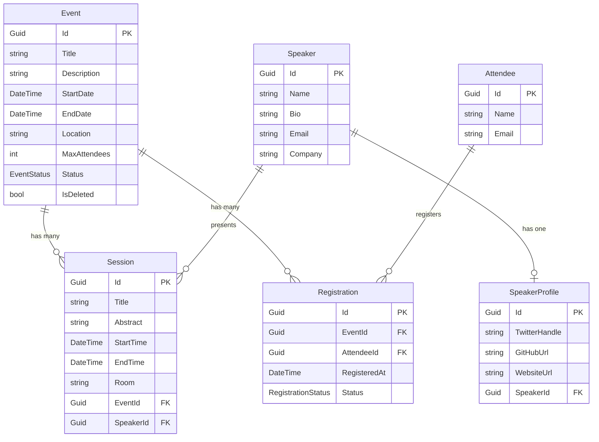

# Entity Framework Core 10 Deep-Dive

## Introduction — Why ORM?

An **Object-Relational Mapper (ORM)** bridges the gap between your C# object model and a relational database. Instead of writing raw SQL strings, you work with strongly-typed LINQ queries that the ORM translates into efficient SQL at runtime. This gives you compile-time safety, IntelliSense, and a unified programming model across different database providers.

**Entity Framework Core (EF Core)** is the official ORM for .NET. It is lightweight, extensible, and supports a wide range of databases — PostgreSQL, SQL Server, SQLite, MySQL, and more.

### EF Core vs Dapper vs Raw SQL

| Criteria              | EF Core                              | Dapper                           | Raw SQL (ADO.NET)            |
| --------------------- | ------------------------------------ | -------------------------------- | ---------------------------- |
| **Abstraction Level** | High — full ORM with change tracking | Low — micro-ORM, you write SQL   | None — manual everything     |
| **Productivity**      | Fastest for CRUD-heavy apps          | Fast once SQL is written         | Lots of boilerplate          |
| **Performance**       | Good (excellent with tuning)         | Excellent (minimal overhead)     | Best possible (full control) |
| **Migrations**        | Built-in schema management           | None                             | Manual scripts               |
| **Learning Curve**    | Moderate                             | Low                              | Low (but error-prone)        |
| **Best For**          | Domain-rich apps, rapid development  | Read-heavy reporting, legacy DBs | Ultra-low-latency hot paths  |

💡 **Rule of thumb:** Start with EF Core. Introduce Dapper or raw SQL only for proven performance bottlenecks.

### Why This Matters for API Development

In a Web API, almost every endpoint reads from or writes to a database. EF Core gives you:

- **Type-safe queries** — catch errors at compile time, not at 2 AM in production
- **Change tracking** — modify objects and call `SaveChangesAsync()`; EF generates the SQL
- **Migrations** — evolve your schema alongside your code, version-controlled
- **Testability** — swap out providers for in-memory or SQLite in tests

Throughout this module we build the data layer for **TechConf** — an event management platform with Events, Sessions, Speakers, Attendees, and Registrations.

---

## Setting Up DbContext

### What Is DbContext?

`DbContext` is the central class in EF Core. It represents a **session with the database** and implements two key patterns:

- **Unit of Work** — tracks all changes made during a business transaction and persists them in a single `SaveChangesAsync()` call
- **Repository** — each `DbSet<T>` property acts as a collection you can query and modify

Think of `DbContext` as a shopping cart: you add, remove, and modify items, then "check out" with `SaveChangesAsync()`.

### Creating TechConfDbContext

```csharp
using Microsoft.EntityFrameworkCore;

public class TechConfDbContext : DbContext
{
    public TechConfDbContext(DbContextOptions<TechConfDbContext> options) : base(options) { }

    public DbSet<Event> Events => Set<Event>();
    public DbSet<Session> Sessions => Set<Session>();
    public DbSet<Speaker> Speakers => Set<Speaker>();
    public DbSet<Attendee> Attendees => Set<Attendee>();
    public DbSet<Registration> Registrations => Set<Registration>();

    protected override void OnModelCreating(ModelBuilder modelBuilder)
    {
        modelBuilder.ApplyConfigurationsFromAssembly(typeof(TechConfDbContext).Assembly);
    }
}
```

📝 **Note:** The `=> Set<Event>()` syntax avoids nullable warnings. The older `{ get; set; } = null!;` style works too, but the expression-bodied form is idiomatic in modern EF Core.

### DbContext Lifecycle and Scoping

EF Core registers `DbContext` as **Scoped** by default in DI. This means:

| Lifetime      | Behavior                      | Correct for DbContext?       |
| ------------- | ----------------------------- | ---------------------------- |
| **Transient** | New instance every injection  | ❌ Breaks unit of work       |
| **Scoped**    | One instance per HTTP request | ✅ Default and recommended   |
| **Singleton** | One instance for app lifetime | ❌ Thread-unsafe, stale data |

A scoped `DbContext` ensures that all repositories and services within a single HTTP request share the same change tracker. When `SaveChangesAsync()` is called, all modifications are committed as one database transaction.

⚠️ **Warning:** Never inject a `DbContext` into a singleton service. This causes concurrency bugs and memory leaks.

### DbContext Pooling

For high-throughput APIs, creating a new `DbContext` per request adds overhead. **DbContext pooling** reuses instances:

```csharp
builder.Services.AddDbContextPool<TechConfDbContext>(options =>
    options.UseNpgsql(builder.Configuration.GetConnectionString("TechConf")));
```

Pooling resets the `DbContext` state between uses instead of allocating a new one. This reduces GC pressure and improves throughput by ~20% in benchmarks. The pool size defaults to 1024.

💡 **Tip:** Use pooling in production. Use `AddDbContext` during development if you need to override `OnConfiguring` for debugging.

---

## Entity Models

### The TechConf Domain

```csharp
public class Event
{
    public Guid Id { get; set; }
    public required string Title { get; set; }
    public string? Description { get; set; }
    public DateTime StartDate { get; set; }
    public DateTime EndDate { get; set; }
    public required string Location { get; set; }
    public int MaxAttendees { get; set; }
    public EventStatus Status { get; set; }
    public bool IsDeleted { get; set; }

    public ICollection<Session> Sessions { get; set; } = [];
    public ICollection<Registration> Registrations { get; set; } = [];
}

public class Session
{
    public Guid Id { get; set; }
    public required string Title { get; set; }
    public string? Abstract { get; set; }
    public DateTime StartTime { get; set; }
    public DateTime EndTime { get; set; }
    public string? Room { get; set; }

    public Guid EventId { get; set; }
    public Event Event { get; set; } = null!;
    public Guid SpeakerId { get; set; }
    public Speaker Speaker { get; set; } = null!;
}

public class Speaker
{
    public Guid Id { get; set; }
    public required string Name { get; set; }
    public string? Bio { get; set; }
    public required string Email { get; set; }
    public string? Company { get; set; }

    public ICollection<Session> Sessions { get; set; } = [];
    public SpeakerProfile? Profile { get; set; }
}

public class Attendee
{
    public Guid Id { get; set; }
    public required string Name { get; set; }
    public required string Email { get; set; }

    public ICollection<Registration> Registrations { get; set; } = [];
}

public class Registration
{
    public Guid Id { get; set; }
    public Guid EventId { get; set; }
    public Event Event { get; set; } = null!;
    public Guid AttendeeId { get; set; }
    public Attendee Attendee { get; set; } = null!;
    public DateTime RegisteredAt { get; set; }
    public RegistrationStatus Status { get; set; }
}

public enum EventStatus { Draft, Active, Cancelled, Completed }
public enum RegistrationStatus { Pending, Confirmed, Cancelled, WaitListed }
```

### Choosing a Primary Key Type

| Type           | Pros                                | Cons                                    | Best For                  |
| -------------- | ----------------------------------- | --------------------------------------- | ------------------------- |
| `int` / `long` | Small, fast, human-readable         | Sequential → guessable, merge conflicts | Internal/simple apps      |
| `Guid`         | Globally unique, client-generated   | 16 bytes, random → index fragmentation  | Distributed systems, APIs |
| `Ulid`         | Sortable, 26 chars, globally unique | Requires library or .NET 9+             | Best of both worlds       |

💡 **Tip:** We use `Guid` in TechConf. For new projects on .NET 9+, consider `Ulid` — it gives you sortability (like `int`) with global uniqueness (like `Guid`).

### Nullable Reference Types

EF Core respects C# nullable annotations. A `string?` property becomes a nullable column; a `required string` becomes `NOT NULL`. Enable `<Nullable>enable</Nullable>` in your `.csproj` to get this behavior automatically.

---

## Fluent API Configuration

### Why Fluent API over Data Annotations?

| Aspect                 | Data Annotations                | Fluent API                        |
| ---------------------- | ------------------------------- | --------------------------------- |
| Location               | On the entity class             | In separate configuration classes |
| Capabilities           | Basic constraints               | Full EF Core feature set          |
| Separation of concerns | ❌ Mixes domain and persistence | ✅ Clean separation               |
| Relationships          | Limited                         | Full control                      |

📝 **Note:** Data Annotations (`[Required]`, `[MaxLength]`) are fine for simple cases, but Fluent API gives you access to everything — composite keys, value conversions, query filters, and more.

### The IEntityTypeConfiguration Pattern

Each entity gets its own configuration class. This keeps things organized and testable:

```csharp
using Microsoft.EntityFrameworkCore;
using Microsoft.EntityFrameworkCore.Metadata.Builders;

public class EventConfiguration : IEntityTypeConfiguration<Event>
{
    public void Configure(EntityTypeBuilder<Event> builder)
    {
        builder.HasKey(e => e.Id);

        builder.Property(e => e.Title)
            .HasMaxLength(200)
            .IsRequired();

        builder.Property(e => e.Description)
            .HasMaxLength(2000);

        builder.Property(e => e.Location)
            .HasMaxLength(300)
            .IsRequired();

        builder.Property(e => e.Status)
            .HasConversion<string>()
            .HasMaxLength(50);

        builder.HasIndex(e => e.StartDate);
        builder.HasIndex(e => e.Status);

        builder.HasMany(e => e.Sessions)
            .WithOne(s => s.Event)
            .HasForeignKey(s => s.EventId)
            .OnDelete(DeleteBehavior.Cascade);

        builder.HasMany(e => e.Registrations)
            .WithOne(r => r.Event)
            .HasForeignKey(r => r.EventId)
            .OnDelete(DeleteBehavior.Cascade);
    }
}
```

### Applying Configurations

In your `DbContext.OnModelCreating`, scan the assembly for all `IEntityTypeConfiguration<T>` implementations:

```csharp
protected override void OnModelCreating(ModelBuilder modelBuilder)
{
    modelBuilder.ApplyConfigurationsFromAssembly(typeof(TechConfDbContext).Assembly);
}
```

This automatically discovers and applies `EventConfiguration`, `SessionConfiguration`, etc. No manual registration needed.

### Value Conversions

Value conversions let you store .NET types as different database types:

```csharp
// Enum → string (already shown above)
builder.Property(e => e.Status)
    .HasConversion<string>()
    .HasMaxLength(50);

// DateOnly → DateTime (for databases without native DateOnly support)
builder.Property(e => e.StartDate)
    .HasConversion(
        v => v.ToDateTime(TimeOnly.MinValue),
        v => DateOnly.FromDateTime(v));

// Custom value object
builder.Property(e => e.Email)
    .HasConversion(
        v => v.Value,
        v => new EmailAddress(v))
    .HasMaxLength(320);
```

💡 **Tip:** Always store enums as strings (`.HasConversion<string>()`) in APIs. It makes the database human-readable and avoids breaking changes when you reorder enum values.

---

## Relationships

### ER Diagram — TechConf Domain



### One-to-Many: Event → Sessions

The most common relationship. One event has many sessions; each session belongs to exactly one event.

```csharp
// In EventConfiguration
builder.HasMany(e => e.Sessions)
    .WithOne(s => s.Event)
    .HasForeignKey(s => s.EventId)
    .OnDelete(DeleteBehavior.Cascade);
```

When you delete an `Event`, all its `Session` entities are automatically deleted (`Cascade`). Choose your delete behavior carefully:

| DeleteBehavior | Effect on Dependents   | Use When                                    |
| -------------- | ---------------------- | ------------------------------------------- |
| `Cascade`      | Deleted with principal | Child cannot exist without parent           |
| `Restrict`     | Throws exception       | Prevent accidental data loss                |
| `SetNull`      | FK set to `null`       | Child can be orphaned (FK must be nullable) |
| `NoAction`     | Database decides       | Database has its own FK rules               |

### Many-to-Many: Event ↔ Attendees (through Registration)

The `Registration` entity is an **explicit join entity** — it carries its own data (`RegisteredAt`, `Status`).

```csharp
// In RegistrationConfiguration
public class RegistrationConfiguration : IEntityTypeConfiguration<Registration>
{
    public void Configure(EntityTypeBuilder<Registration> builder)
    {
        builder.HasKey(r => r.Id);

        builder.Property(r => r.Status)
            .HasConversion<string>()
            .HasMaxLength(50);

        builder.HasIndex(r => new { r.EventId, r.AttendeeId })
            .IsUnique();

        builder.HasOne(r => r.Event)
            .WithMany(e => e.Registrations)
            .HasForeignKey(r => r.EventId);

        builder.HasOne(r => r.Attendee)
            .WithMany(a => a.Registrations)
            .HasForeignKey(r => r.AttendeeId);
    }
}
```

**Explicit vs Implicit Join Entities:**

| Approach                                  | When to Use                                             |
| ----------------------------------------- | ------------------------------------------------------- |
| **Implicit** (EF creates join table)      | Pure many-to-many, no extra data on the relationship    |
| **Explicit** (you create the join entity) | Relationship carries payload data (dates, status, etc.) |

📝 **Note:** In TechConf, `Registration` is explicit because it holds `RegisteredAt` and `Status`. If you only needed to know _which_ attendees are at _which_ events — with no extra data — you could use an implicit join.

### One-to-One: Speaker → SpeakerProfile

```csharp
public class SpeakerProfile
{
    public Guid Id { get; set; }
    public string? TwitterHandle { get; set; }
    public string? GitHubUrl { get; set; }
    public string? WebsiteUrl { get; set; }

    public Guid SpeakerId { get; set; }
    public Speaker Speaker { get; set; } = null!;
}
```

```csharp
// In SpeakerConfiguration
builder.HasOne(s => s.Profile)
    .WithOne(p => p.Speaker)
    .HasForeignKey<SpeakerProfile>(p => p.SpeakerId);
```

### Navigation Property Patterns

| Property Type                              | Relationship Side                       | Example           |
| ------------------------------------------ | --------------------------------------- | ----------------- |
| **Reference** (`Event Event`)              | The "one" side (child points to parent) | `Session.Event`   |
| **Collection** (`ICollection<Session>`)    | The "many" side (parent holds children) | `Event.Sessions`  |
| **Optional Reference** (`SpeakerProfile?`) | Optional one-to-one                     | `Speaker.Profile` |

💡 **Tip:** Always initialize collection navigation properties with `= [];` (collection expression) to avoid null reference exceptions when adding items before loading from the database.

---

## Registering DbContext with Dependency Injection

### Basic Registration

```csharp
var builder = WebApplication.CreateBuilder(args);

builder.Services.AddDbContext<TechConfDbContext>(options =>
    options.UseNpgsql(builder.Configuration.GetConnectionString("TechConf")));
```

### AddDbContext vs AddDbContextPool

| Method             | Lifetime        | Pooling | Use When                            |
| ------------------ | --------------- | ------- | ----------------------------------- |
| `AddDbContext`     | Scoped          | No      | Development, custom `OnConfiguring` |
| `AddDbContextPool` | Pooled (reused) | Yes     | Production, high-throughput APIs    |

### Connection String Configuration

In `appsettings.json`:

```json
{
  "ConnectionStrings": {
    "TechConf": "Host=localhost;Database=techconf;Username=app;Password=secret"
  }
}
```

⚠️ **Warning:** Never commit real credentials. Use User Secrets in development, environment variables or Azure Key Vault in production.

### With .NET Aspire (Preview for Day 3)

```csharp
// In AppHost
var postgres = builder.AddPostgres("pg").AddDatabase("techconf");

// In API project
builder.AddNpgsqlDbContext<TechConfDbContext>("techconf");
```

Aspire handles connection strings, health checks, and retry policies automatically. We cover this in depth on Day 3.

---

## Migrations Workflow

### What Are Migrations?

Migrations are **version-controlled schema changes**. Each migration is a C# class that describes how to transform the database from one state to the next. They are the equivalent of `git` for your database schema.

### Step-by-Step Workflow

**Step 0: Install the dotnet ef tool**

https://learn.microsoft.com/en-us/ef/core/cli/dotnet

```bash
dotnet tool install --global dotnet-ef
```

**Step 1: Create the initial migration**

```bash
dotnet ef migrations add InitialCreate --project src/TechConf.Api
```

This generates a file like `20250115_InitialCreate.cs` with `Up()` and `Down()` methods:

```csharp
public partial class InitialCreate : Migration
{
    protected override void Up(MigrationBuilder migrationBuilder)
    {
        migrationBuilder.CreateTable(
            name: "Events",
            columns: table => new
            {
                Id = table.Column<Guid>(nullable: false),
                Title = table.Column<string>(maxLength: 200, nullable: false),
                // ... other columns
            },
            constraints: table => table.PrimaryKey("PK_Events", x => x.Id));
    }

    protected override void Down(MigrationBuilder migrationBuilder)
    {
        migrationBuilder.DropTable(name: "Events");
    }
}
```

**Step 2: Review the migration**

Always inspect what EF Core generated before applying.

**Step 3: Apply to database**

```bash
dotnet ef database update --project src/TechConf.Api
```

**Step 4: Iterate — add more migrations as your model evolves**

```bash
dotnet ef migrations add AddSessionRoom --project src/TechConf.Api
```

### Migration Best Practices

**Review generated SQL before applying to production:**

```bash
dotnet ef migrations script --idempotent --project src/TechConf.Api -o migrate.sql
```

The `--idempotent` flag wraps each migration in an `IF NOT EXISTS` check, making it safe to run multiple times.

**Data migrations** — sometimes you need to transform existing data:

```csharp
protected override void Up(MigrationBuilder migrationBuilder)
{
    migrationBuilder.AddColumn<string>("Status", "Events", defaultValue: "Draft");
    migrationBuilder.Sql("UPDATE \"Events\" SET \"Status\" = 'Active' WHERE \"EndDate\" > NOW()");
}
```

**Rolling back:**

```bash
dotnet ef database update InitialCreate --project src/TechConf.Api
```

This reverts all migrations applied after `InitialCreate` by running their `Down()` methods.

### Essential Commands

| Command                                    | Description                                     |
| ------------------------------------------ | ----------------------------------------------- |
| `dotnet ef migrations add <Name>`          | Create a new migration                          |
| `dotnet ef database update`                | Apply all pending migrations                    |
| `dotnet ef database update <Name>`         | Migrate to a specific migration (up or down)    |
| `dotnet ef migrations remove`              | Remove the last unapplied migration             |
| `dotnet ef migrations list`                | List all migrations and their status            |
| `dotnet ef migrations script`              | Generate SQL script for all migrations          |
| `dotnet ef migrations script --idempotent` | Generate idempotent SQL script (safe to re-run) |
| `dotnet ef dbcontext info`                 | Show DbContext configuration info               |

⚠️ **Warning:** Never use `EnsureCreated()` alongside migrations. It creates the schema without migration history, and subsequent migrations will fail.

---

## LINQ Queries with EF Core

EF Core translates LINQ expressions into SQL. All queries should use the `async` variants (`ToListAsync`, `FirstOrDefaultAsync`, etc.) in web applications.

### Simple Filtering and Ordering

```csharp
var activeEvents = await dbContext.Events
    .Where(e => e.Status == EventStatus.Active)
    .OrderBy(e => e.StartDate)
    .ToListAsync();
```

Generated SQL:

```sql
SELECT * FROM "Events" WHERE "Status" = 'Active' ORDER BY "StartDate";
```

### Projection with Select

📝 **Note:** Projection is the most efficient query pattern — it only fetches the columns you need.

```csharp
public record EventSummaryDto(Guid Id, string Title, DateTime StartDate, int SessionCount);

var eventSummaries = await dbContext.Events
    .Where(e => e.Status == EventStatus.Active)
    .Select(e => new EventSummaryDto(
        e.Id,
        e.Title,
        e.StartDate,
        e.Sessions.Count))
    .ToListAsync();
```

Generated SQL:

```sql
SELECT "e"."Id", "e"."Title", "e"."StartDate",
       (SELECT COUNT(*) FROM "Sessions" AS "s" WHERE "e"."Id" = "s"."EventId")
FROM "Events" AS "e"
WHERE "e"."Status" = 'Active';
```

### Eager Loading with Include

```csharp
var eventWithDetails = await dbContext.Events
    .Include(e => e.Sessions)
        .ThenInclude(s => s.Speaker)
    .Include(e => e.Registrations)
        .ThenInclude(r => r.Attendee)
    .FirstOrDefaultAsync(e => e.Id == eventId);
```

### Pagination

```csharp
var pagedEvents = await dbContext.Events
    .Where(e => e.Status == EventStatus.Active)
    .OrderBy(e => e.StartDate)
    .Skip((page - 1) * pageSize)
    .Take(pageSize)
    .ToListAsync();
```

⚠️ **Warning:** Always use `OrderBy` before `Skip`/`Take`. Without a deterministic order, the database may return different results each time.

### Aggregation

```csharp
var statusCounts = await dbContext.Events
    .GroupBy(e => e.Status)
    .Select(g => new { Status = g.Key, Count = g.Count() })
    .ToListAsync();
```

### Checking Existence

```csharp
// More efficient than Count() > 0
var hasRegistrations = await dbContext.Registrations
    .AnyAsync(r => r.EventId == eventId && r.Status == RegistrationStatus.Confirmed);
```

### Finding a Single Entity

```csharp
// Find by primary key (checks cache first)
var eventById = await dbContext.Events.FindAsync(eventId);

// FirstOrDefault (always hits the database)
var eventByTitle = await dbContext.Events
    .FirstOrDefaultAsync(e => e.Title == "TechConf 2026");
```

💡 **Tip:** Use `FindAsync` when you have the primary key — it checks the change tracker first and avoids a database round-trip if the entity is already loaded.

---

## Avoiding N+1 Queries

### What Is the N+1 Problem?

The N+1 problem occurs when your code executes **1 query** to load a list of parents, then **N additional queries** to load each parent's children:

```
Query 1: SELECT * FROM Events                          -- 1 query
Query 2: SELECT * FROM Sessions WHERE EventId = 'aaa'  -- +1
Query 3: SELECT * FROM Sessions WHERE EventId = 'bbb'  -- +1
Query 4: SELECT * FROM Sessions WHERE EventId = 'ccc'  -- +1
...                                                     -- = N+1 total
```

With 100 events, that's **101 database round-trips** instead of 1 or 2.

### Detecting N+1: Logging SQL

Enable EF Core query logging to see every SQL statement:

```csharp
builder.Services.AddDbContext<TechConfDbContext>(options =>
    options
        .UseNpgsql(connectionString)
        .LogTo(Console.WriteLine, LogLevel.Information)
        .EnableSensitiveDataLogging()); // shows parameter values (dev only!)
```

If you see the same `SELECT` repeated with different parameter values, you have an N+1 problem.

### Solution 1: Eager Loading with Include

```csharp
// ❌ N+1 — accessing Sessions triggers lazy loading per event
var events = await dbContext.Events.ToListAsync();
foreach (var e in events)
    Console.WriteLine(e.Sessions.Count); // N extra queries!

// ✅ Eager loading — one JOIN query
var events = await dbContext.Events
    .Include(e => e.Sessions)
    .ToListAsync();
```

### Solution 2: Split Queries

When you have multiple `Include` calls, EF Core generates a massive JOIN that can produce a **Cartesian explosion**. Split queries run separate SQL statements instead:

```csharp
var events = await dbContext.Events
    .Include(e => e.Sessions)
    .Include(e => e.Registrations)
    .AsSplitQuery()
    .ToListAsync();
```

This generates 3 queries instead of one huge JOIN:

```sql
SELECT * FROM "Events";
SELECT * FROM "Sessions" WHERE "EventId" IN (...);
SELECT * FROM "Registrations" WHERE "EventId" IN (...);
```

### Solution 3: Projection (Most Efficient)

```csharp
// ✅ Best — only loads exactly what you need
var results = await dbContext.Events
    .Select(e => new
    {
        e.Id,
        e.Title,
        SessionCount = e.Sessions.Count,
        Speakers = e.Sessions.Select(s => s.Speaker.Name).Distinct()
    })
    .ToListAsync();
```

### Loading Strategies Comparison

| Strategy                                          | How                  | SQL Queries         | Use When                                          |
| ------------------------------------------------- | -------------------- | ------------------- | ------------------------------------------------- |
| **Eager** (`Include`)                             | JOIN in single query | 1 (can be large)    | Need full related entities                        |
| **Split** (`AsSplitQuery`)                        | Multiple queries     | N (one per include) | Multiple collections to avoid Cartesian explosion |
| **Explicit** (`Entry().Collection().LoadAsync()`) | On-demand            | 1 per load call     | Conditional loading                               |
| **Projection** (`Select`)                         | Custom SELECT        | 1 (optimized)       | API responses, DTOs — **preferred**               |

💡 **Tip:** For API endpoints, projection is almost always the right choice. You rarely need to return full entity graphs to the client.

---

## Performance Patterns

### AsNoTracking

By default, EF Core tracks every entity it loads — watching for changes to persist later. For **read-only** queries, this tracking is wasted overhead:

```csharp
// ✅ 30-50% faster for read-only queries
var events = await dbContext.Events
    .AsNoTracking()
    .Where(e => e.Status == EventStatus.Active)
    .ToListAsync();
```

For read-heavy endpoints (GET requests), always use `AsNoTracking()`.

### AsNoTrackingWithIdentityResolution

When loading related entities without tracking, duplicates can appear (the same `Speaker` object duplicated across sessions). `AsNoTrackingWithIdentityResolution` deduplicates:

```csharp
var sessions = await dbContext.Sessions
    .AsNoTrackingWithIdentityResolution()
    .Include(s => s.Speaker)
    .ToListAsync();
// Two sessions with the same speaker → same Speaker instance
```

### Compiled Queries

For hot-path queries executed thousands of times, eliminate the LINQ translation overhead:

```csharp
public static class TechConfQueries
{
    public static readonly Func<TechConfDbContext, Guid, Task<Event?>> GetEventById =
        EF.CompileAsyncQuery((TechConfDbContext db, Guid id) =>
            db.Events.FirstOrDefault(e => e.Id == id));

    public static readonly Func<TechConfDbContext, EventStatus, IAsyncEnumerable<Event>> GetEventsByStatus =
        EF.CompileAsyncQuery((TechConfDbContext db, EventStatus status) =>
            db.Events.Where(e => e.Status == status));
}

// Usage
var ev = await TechConfQueries.GetEventById(dbContext, eventId);
```

### Global Query Filters

Apply automatic filtering to every query — perfect for **soft delete** and **multi-tenancy**:

```csharp
// In EventConfiguration
builder.HasQueryFilter(e => !e.IsDeleted);
```

Now every query on `Events` automatically adds `WHERE "IsDeleted" = false`. To bypass the filter when needed:

```csharp
// Admin endpoint: show all events including deleted
var allEvents = await dbContext.Events
    .IgnoreQueryFilters()
    .ToListAsync();
```

### Raw SQL When Needed

For complex queries that LINQ cannot express efficiently:

```csharp
var events = await dbContext.Events
    .FromSqlInterpolated($"""
        SELECT * FROM "Events"
        WHERE "StartDate" > {startDate}
        AND "Location" ILIKE {$"%{searchTerm}%"}
    """)
    .ToListAsync();
```

⚠️ **Warning:** Always use `FromSqlInterpolated` (not `FromSqlRaw` with string concatenation) to prevent SQL injection. The interpolated values become parameterized queries.

### Bulk Operations (EF Core 7+)

Update or delete many rows without loading entities into memory:

```csharp
// Cancel all registrations for a cancelled event
await dbContext.Registrations
    .Where(r => r.EventId == eventId)
    .ExecuteUpdateAsync(s => s
        .SetProperty(r => r.Status, RegistrationStatus.Cancelled));

// Hard-delete old draft events
await dbContext.Events
    .Where(e => e.Status == EventStatus.Draft && e.StartDate < cutoffDate)
    .ExecuteDeleteAsync();
```

These generate direct `UPDATE` / `DELETE` SQL — no entity loading, no change tracking. Orders of magnitude faster for bulk operations.

---

## New in EF Core 10

### LeftJoin LINQ Operator

Before EF Core 10, left joins required an awkward `GroupJoin` + `SelectMany` + `DefaultIfEmpty` pattern. Now there is a first-class `LeftJoin` operator:

```csharp
// EF Core 10: Clean left join
var results = await dbContext.Events
    .LeftJoin(
        dbContext.Registrations,
        e => e.Id,
        r => r.EventId,
        (e, r) => new { Event = e, Registration = r })
    .ToListAsync();
```

Compare with the old approach:

```csharp
// EF Core 9: Verbose workaround
var results = await dbContext.Events
    .GroupJoin(dbContext.Registrations, e => e.Id, r => r.EventId, (e, regs) => new { e, regs })
    .SelectMany(x => x.regs.DefaultIfEmpty(), (x, r) => new { Event = x.e, Registration = r })
    .ToListAsync();
```

### JSON Column Improvements

Store and query complex objects as JSON columns with improved support:

```csharp
// Map a complex property to a JSON column
builder.OwnsOne(e => e.Venue, v =>
{
    v.ToJson();
    v.Property(x => x.Address).HasMaxLength(500);
    v.Property(x => x.Capacity);
});

// Query into JSON
var largeVenues = await dbContext.Events
    .Where(e => e.Venue.Capacity > 500)
    .ToListAsync();
```

### ExecuteUpdateAsync with Complex Expressions

More expressive bulk updates:

```csharp
await dbContext.Events
    .Where(e => e.Status == EventStatus.Active && e.EndDate < DateTime.UtcNow)
    .ExecuteUpdateAsync(s => s
        .SetProperty(e => e.Status, EventStatus.Completed)
        .SetProperty(e => e.Description, e => e.Description + " [Archived]"));
```

### Improved Contains Translation

EF Core 10 generates more efficient SQL for `Contains` with large collections, using `VALUES` instead of individual `OR` clauses or parameters.

### EF Core 9 vs 10 — Feature Comparison

| Feature              | EF Core 9             | EF Core 10                      |
| -------------------- | --------------------- | ------------------------------- |
| Left Join            | GroupJoin workaround  | First-class `LeftJoin` operator |
| JSON columns         | Basic support         | Enhanced querying and indexing  |
| Contains translation | Parameter per value   | Optimized `VALUES` clause       |
| Bulk updates         | Basic `ExecuteUpdate` | Complex expression support      |
| LINQ translation     | Good                  | Expanded operator coverage      |
| AOT compatibility    | Limited               | Improved trimming support       |

---

## Data Seeding

### HasData in Fluent API

Seed initial data as part of your migrations:

```csharp
// In EventConfiguration
builder.HasData(
    new Event
    {
        Id = Guid.Parse("a1b2c3d4-e5f6-7890-abcd-ef1234567890"),
        Title = "TechConf 2026",
        Location = "Munich",
        StartDate = new DateTime(2026, 6, 15),
        EndDate = new DateTime(2026, 6, 17),
        MaxAttendees = 500,
        Status = EventStatus.Draft,
        IsDeleted = false
    });
```

⚠️ **Warning:** `HasData` requires fixed primary keys (no `Guid.NewGuid()`). Values are embedded in the migration file.

### Custom Seeding in Migrations

For more complex seeding logic, use raw SQL in the migration's `Up()` method:

```csharp
protected override void Up(MigrationBuilder migrationBuilder)
{
    migrationBuilder.Sql("""
        INSERT INTO "Speakers" ("Id", "Name", "Email", "Company")
        VALUES ('...', 'Jane Doe', 'jane@example.com', 'Contoso')
        ON CONFLICT DO NOTHING;
    """);
}
```

### Development-Only Seeding

```csharp
if (app.Environment.IsDevelopment())
{
    using var scope = app.Services.CreateScope();
    var db = scope.ServiceProvider.GetRequiredService<TechConfDbContext>();
    // ⚠️ EnsureCreated bypasses migrations — NEVER use in production
    // Use only for quick prototyping or integration tests
    db.Database.EnsureCreated();
}
```

---

## Common Pitfalls

### ⚠️ Forgetting `await` on Async Queries

```csharp
// ❌ Bug: returns Task<List<Event>>, not List<Event>
var events = dbContext.Events.ToListAsync();

// ✅ Correct
var events = await dbContext.Events.ToListAsync();
```

The compiler may not warn you if you assign a `Task` to `var` — always double-check.

### ⚠️ Using Find() Without Understanding Caching

`FindAsync` checks the change tracker first. If the entity was previously loaded and modified (but not saved), `Find` returns the **modified in-memory version**, not the database version.

### ⚠️ Tracking Entities Across DbContext Instances

```csharp
// ❌ Loaded from one DbContext, attached to another → exception
var ev = await dbContext1.Events.FindAsync(id);
dbContext2.Events.Update(ev!); // InvalidOperationException!
```

### ⚠️ Not Disposing DbContext

DI handles disposal automatically for scoped `DbContext`. But if you create one manually (`new TechConfDbContext(...)`), you must dispose it yourself with `using`.

### ⚠️ String Concatenation in Raw SQL

```csharp
// ❌ SQL injection vulnerability!
var events = dbContext.Events.FromSqlRaw($"SELECT * FROM Events WHERE Title = '{title}'");

// ✅ Safe — parameterized
var events = dbContext.Events.FromSqlInterpolated($"SELECT * FROM \"Events\" WHERE \"Title\" = {title}");
```

### ⚠️ Missing Indexes

If you frequently query by a column, add an index in your configuration:

```csharp
builder.HasIndex(e => e.Status);
builder.HasIndex(e => new { e.StartDate, e.Status }); // composite index
```

Check `EXPLAIN ANALYZE` output to verify your queries use indexes.

### 💡 Always Check Generated SQL in Development

Enable logging and review the SQL EF Core generates. Surprising query plans are the #1 source of performance problems in EF Core applications.

---

## Mini-Exercise

### Tasks

1. **Entity Configurations** — Create `IEntityTypeConfiguration<T>` classes for `Session`, `Speaker`, `Attendee`, and `Registration` with appropriate constraints, indexes, and relationships.

2. **Write 5 LINQ Queries:**
   - Get all active events in a specific location
   - Get an event with all sessions and their speakers (eager loading)
   - Get the top 5 most-registered events (aggregation + ordering)
   - Get a paginated list of speakers with their session count (projection)
   - Check if an attendee is already registered for a specific event (existence check)

3. **Global Query Filter** — Add a soft-delete filter to the `Event` entity so that deleted events are automatically excluded from all queries.

4. **Migration** — Run `dotnet ef migrations add InitialCreate` and inspect the generated `.cs` file. Then run `dotnet ef migrations script` and review the SQL output.

💡 **Tip:** Try writing each query first, then enable SQL logging to see what EF Core generates. Compare `Include` vs `Select` approaches for query #2 — which generates better SQL?

---

## Further Reading

- 📖 [EF Core Official Documentation](https://learn.microsoft.com/en-us/ef/core/)
- 📖 [EF Core — What's New in EF Core 10](https://learn.microsoft.com/en-us/ef/core/what-is-new/ef-core-10.0/whatsnew)
- 📖 [EF Core Performance Tips](https://learn.microsoft.com/en-us/ef/core/performance/)
- 📖 [Npgsql EF Core Provider](https://www.npgsql.org/efcore/)
- 📖 [EF Core Power Tools](https://github.com/ErikEJ/EFCorePowerTools) — Visual Studio extension for reverse engineering and visualization
- 🎥 [.NET Data Community Standup](https://www.youtube.com/playlist?list=PLdo4fOcmZ0oX0e4kXCD_9U_log0iVk28s) — weekly EF Core deep-dives from the team
- 📖 [Julie Lerman's EF Core Courses](https://www.pluralsight.com/authors/julie-lerman) — Pluralsight (excellent for deep understanding)

---

📝 **Next up:** On Day 3 we integrate EF Core with .NET Aspire and add PostgreSQL as a managed resource with automatic connection management, health checks, and observability.
