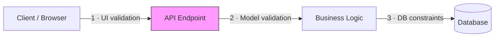
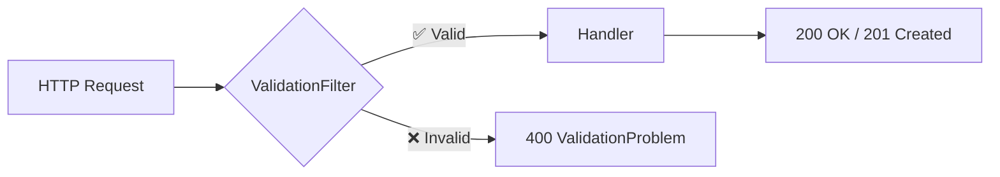

# Validation — Keeping Your Data Clean

## 🎯 Learning Objectives

- Explain **why server-side validation is non-negotiable**
- Use **.NET 10 built-in validation** with `AddValidation()`
- Build **FluentValidation** validators for complex business rules
- Wire up an **endpoint filter** so validation runs automatically
- **Test** your validators in isolation

---

## Why Validation Matters

> _"Garbage in, garbage out."_

Every HTTP request is untrusted input. Without validation your database fills up with nonsense.

**Defense in depth** — validate at every layer:



Client-side validation improves UX. Database constraints are the last safety net. **API-level validation** is where you enforce your business rules.

| Approach                  | Since     | Best For                              |
| ------------------------- | --------- | ------------------------------------- |
| Data Annotations          | .NET 1.0  | Simple property rules                 |
| `.NET 10 AddValidation()` | .NET 10   | Automatic annotation-based validation |
| FluentValidation          | 3rd-party | Complex, testable business rules      |
| Manual checks             | Always    | One-off edge cases                    |

---

## .NET 10 Built-in Validation

.NET 10 introduces a first-class validation system that automatically validates **Data Annotation** attributes — no extra packages needed.

```csharp
var builder = WebApplication.CreateBuilder(args);

// NEW in .NET 10 — registers the built-in validation system
builder.Services.AddValidation();

var app = builder.Build();
```

The framework validates annotated properties **before** your handler executes.

### Supported Attributes

| Attribute             | Purpose                       | TechConf Example        |
| --------------------- | ----------------------------- | ----------------------- |
| `[Required]`          | Must be present and non-null  | Event `Title`           |
| `[StringLength(max)]` | Max (and optional min) length | `Title` ≤ 200 chars     |
| `[Range(min, max)]`   | Numeric range                 | `MaxAttendees` 1–50 000 |
| `[EmailAddress]`      | Valid email format            | Speaker contact         |
| `[Url]`               | Valid URL                     | Event website           |
| `[RegularExpression]` | Pattern match                 | Phone number            |
| `[Compare]`           | Must equal another property   | Password confirmation   |

### TechConf Example — `CreateEventRequest`

```csharp
using System.ComponentModel.DataAnnotations;

public record CreateEventRequest(
    [Required, StringLength(200, MinimumLength = 3)]
    string Title,
    [StringLength(2000)]
    string? Description,
    [Required] DateTime StartDate,
    [Required] DateTime EndDate,
    [Required, StringLength(100)] string Location,
    [Range(1, 50_000)] int MaxAttendees);
```

### How Results Are Returned

When validation fails the framework returns **HTTP 400** with a `ValidationProblemDetails` body ([RFC 9457](https://www.rfc-editor.org/rfc/rfc9457)):

```json
{
  "type": "https://tools.ietf.org/html/rfc9110#section-15.5.1",
  "title": "One or more validation errors occurred.",
  "status": 400,
  "errors": {
    "Title": ["The Title field is required."],
    "MaxAttendees": ["The field MaxAttendees must be between 1 and 50000."]
  }
}
```

### Limitations

- ❌ No **async** validation (e.g. database uniqueness)
- ❌ No **cross-property** rules beyond `[Compare]`
- ❌ Annotations live **on the model** — violates separation of concerns

💡 For anything beyond simple property-level checks, reach for **FluentValidation**.

---

## FluentValidation — For Complex Rules

- **Readable** — rules read like English
- **Testable** — plain classes, no HTTP server needed
- **Powerful** — async rules, conditional logic, cross-property checks
- **Separated** — validation lives outside your model

### Installation

```bash
dotnet add package FluentValidation.DependencyInjectionExtensions
```

### Basic Validator

```csharp
using FluentValidation;

public class CreateEventRequestValidator : AbstractValidator<CreateEventRequest>
{
    public CreateEventRequestValidator()
    {
        RuleFor(x => x.Title)
            .NotEmpty().WithMessage("Event title is required")
            .MaximumLength(200).WithMessage("Title must be 200 characters or less");

        RuleFor(x => x.StartDate)
            .GreaterThan(DateTime.UtcNow).WithMessage("Event must be in the future");

        RuleFor(x => x.EndDate)
            .GreaterThan(x => x.StartDate).WithMessage("End date must be after start date");

        RuleFor(x => x.MaxAttendees)
            .InclusiveBetween(1, 50_000);

        RuleFor(x => x.Location)
            .NotEmpty()
            .MaximumLength(100);
    }
}
```

### Built-in Validators Reference

| Validator                                                    | What It Checks            | Example                      |
| ------------------------------------------------------------ | ------------------------- | ---------------------------- |
| `NotNull()`                                                  | Not null                  | Required refs                |
| `NotEmpty()`                                                 | Not null/empty/whitespace | `Title`                      |
| `Equal()` / `NotEqual()`                                     | Equality check            | Confirmation fields          |
| `Length(min, max)` / `MaximumLength(n)` / `MinimumLength(n)` | String length             | `Title` 3–200                |
| `LessThan(n)` / `GreaterThan(n)`                             | Comparison                | `StartDate` > now            |
| `InclusiveBetween(a, b)`                                     | a ≤ value ≤ b             | Attendees 1–50 000           |
| `Matches(regex)`                                             | Regex match               | Phone number                 |
| `EmailAddress()`                                             | Valid email               | Speaker email                |
| `Must()` / `MustAsync()`                                     | Custom predicate          | Business rules, DB checks    |
| `IsInEnum()` / `PrecisionScale()`                            | Enum / decimal            | `SessionLevel`, ticket price |

### Custom Validators with `Must`

```csharp
RuleFor(x => x.Title)
    .Must(title => !title.Contains("test", StringComparison.OrdinalIgnoreCase))
    .WithMessage("Title cannot contain 'test'");
```

### Async Validation — Database Checks

Inject `DbContext` via the constructor and use `MustAsync`:

```csharp
public class CreateEventRequestValidator : AbstractValidator<CreateEventRequest>
{
    public CreateEventRequestValidator(AppDbContext dbContext)
    {
        RuleFor(x => x.Title)
            .NotEmpty()
            .MaximumLength(200)
            .MustAsync(async (title, ct) =>
            {
                return !await dbContext.Events.AnyAsync(e => e.Title == title, ct);
            })
            .WithMessage("An event with this title already exists");
    }
}
```

⚠️ Because this validator depends on `DbContext`, register it as **Scoped** (see [Registering Validators](#registering-validators)).

### Conditional Validation — `When` / `Unless`

```csharp
RuleFor(x => x.SpeakerBio)
    .NotEmpty().MinimumLength(50)
    .When(x => x.SessionType == SessionType.Keynote)
    .WithMessage("Keynote speakers must provide a bio (≥ 50 chars)");

RuleFor(x => x.VirtualLink)
    .NotEmpty()
    .Unless(x => x.Format == EventFormat.InPerson);
```

### Collection Validation — `RuleForEach`

```csharp
RuleForEach(x => x.Tags).NotEmpty().MaximumLength(30);
```

### Including Other Validators

Reuse validators for nested objects with `SetValidator`:

```csharp
RuleFor(x => x.Address).SetValidator(new AddressValidator());
```

### Severity Levels

`Severity.Info`, `Severity.Warning`, or `Severity.Error` (default). Only `Error` makes `IsValid` return `false`.

---

## Validation Endpoint Filter

Without a filter you must manually call `ValidateAsync` in **every** handler — repetitive. An endpoint filter extracts this into a reusable component.

### Implementation

```csharp
using FluentValidation;

public class ValidationFilter<T> : IEndpointFilter where T : class
{
    public async ValueTask<object?> InvokeAsync(
        EndpointFilterInvocationContext context,
        EndpointFilterDelegate next)
    {
        var validator = context.HttpContext
            .RequestServices.GetService<IValidator<T>>();
        if (validator is null) return await next(context);

        var argument = context.Arguments.OfType<T>().FirstOrDefault();
        if (argument is null) return await next(context);

        var result = await validator.ValidateAsync(argument);
        if (!result.IsValid)
        {
            return TypedResults.ValidationProblem(result.ToDictionary());
        }

        return await next(context);
    }
}
```

### Applying the Filter

```csharp
var group = app.MapGroup("/api/events").WithTags("Events");

group.MapPost("/", CreateEvent)
     .AddEndpointFilter<ValidationFilter<CreateEventRequest>>();

group.MapPut("/{id:guid}", UpdateEvent)
     .AddEndpointFilter<ValidationFilter<UpdateEventRequest>>();
```

### Request Flow



💡 The handler **never executes** if validation fails — keeping your business logic clean.

---

## Registering Validators

```csharp
// Manual
builder.Services.AddScoped<IValidator<CreateEventRequest>, CreateEventRequestValidator>();

// Assembly scanning (recommended) — finds all AbstractValidator<T> implementations
builder.Services.AddValidatorsFromAssemblyContaining<Program>();
```

### Lifetime Considerations

| Lifetime                | Use When                               | Notes                        |
| ----------------------- | -------------------------------------- | ---------------------------- |
| **Transient** (default) | No injected dependencies               | Cheapest option              |
| **Scoped**              | Injects `DbContext` or scoped services | Required for async DB checks |

```csharp
builder.Services.AddValidatorsFromAssemblyContaining<Program>(
    lifetime: ServiceLifetime.Scoped);
```

⚠️ A **Scoped** dependency (like `DbContext`) inside a **Transient** validator causes a captive dependency error.

---

## Comparing Validation Approaches

| Feature                | Data Annotations | .NET 10 `AddValidation()` | FluentValidation  |
| ---------------------- | :--------------: | :-----------------------: | :---------------: |
| Setup complexity       |      🟢 Low      |          🟢 Low           |     🟡 Medium     |
| No extra packages      |        ✅        |            ✅             |        ❌         |
| Async validation       |        ❌        |            ❌             |        ✅         |
| Cross-property rules   |        ❌        |            ❌             |        ✅         |
| Testability            |     ❌ Hard      |          ❌ Hard          |      ✅ Easy      |
| DB-dependent rules     |        ❌        |            ❌             |        ✅         |
| Conditional logic      |    ❌ Limited    |        ❌ Limited         |        ✅         |
| Error messages         |     🟡 Basic     |         🟡 Basic          |  ✅ Customisable  |
| Separation of concerns |   ❌ On model    |        ❌ On model        | ✅ Separate class |

### 💡 Recommendation

| Scenario                            | Use                                                              |
| ----------------------------------- | ---------------------------------------------------------------- |
| Quick prototypes, simple CRUD       | Data Annotations + `AddValidation()`                             |
| Production APIs with business rules | **FluentValidation**                                             |
| Mix of both                         | Annotations for simple props, FluentValidation for complex rules |

For TechConf we use **FluentValidation** — cross-property checks, async uniqueness, and conditional rules.

---

## Testing Validators

Validators are plain C# classes — no HTTP server required. Use `FluentAssertions` and `FluentValidation.TestHelper`.

```csharp
public class CreateEventRequestValidatorTests
{
    private readonly CreateEventRequestValidator _sut = new();

    [Fact]
    public async Task Should_Fail_When_StartDate_Is_In_The_Past()
    {
        var request = new CreateEventRequest("DotNet Conf", null,
            DateTime.UtcNow.AddDays(-1), DateTime.UtcNow.AddDays(1), "Vienna", 200);

        var result = await _sut.ValidateAsync(request);
        result.IsValid.Should().BeFalse();
        result.Errors.Should().Contain(e => e.PropertyName == "StartDate");
    }

    [Fact]
    public async Task Should_Fail_When_EndDate_Before_StartDate()
    {
        var request = new CreateEventRequest("DotNet Conf", null,
            DateTime.UtcNow.AddDays(10), DateTime.UtcNow.AddDays(5), "Vienna", 200);

        var result = await _sut.ValidateAsync(request);
        result.ShouldHaveValidationErrorFor(x => x.EndDate);
    }

    [Fact]
    public async Task Should_Pass_For_Valid_Request()
    {
        var request = new CreateEventRequest("DotNet Conf", "The best conference",
            DateTime.UtcNow.AddDays(30), DateTime.UtcNow.AddDays(32), "Vienna", 500);

        var result = await _sut.ValidateAsync(request);
        result.IsValid.Should().BeTrue();
    }
}
```

💡 Use `ShouldHaveValidationErrorFor` from the `TestHelper` namespace for concise assertions.

---

## Common Pitfalls

|     | Pitfall                                                     | Fix                                                  |
| --- | ----------------------------------------------------------- | ---------------------------------------------------- |
| ⚠️  | Forgetting to register validators with DI                   | Use `AddValidatorsFromAssemblyContaining<Program>()` |
| ⚠️  | Async validator + Transient lifetime                        | Register as **Scoped** when injecting `DbContext`    |
| ⚠️  | Validating only on **create**, not **update**               | Create separate validators for each DTO              |
| ⚠️  | Returning plain `400` instead of `ValidationProblemDetails` | Use `TypedResults.ValidationProblem(...)`            |
| ⚠️  | Trusting client-side validation alone                       | **Always validate on the server**                    |

💡 **Golden rule**: Never trust the client. The API is your contract — enforce it.

---

## 🧪 Mini-Exercise

### Task 1 — Create Validators

Build FluentValidation validators for these TechConf DTOs:

```csharp
public record CreateSessionRequest(
    string Title,
    string? Abstract,
    SessionType Type,      // Regular, Workshop, Keynote
    int DurationMinutes,
    string SpeakerName,
    string? SpeakerBio);

public record UpdateEventRequest(
    string Title, string? Description,
    DateTime StartDate, DateTime EndDate,
    string Location, int MaxAttendees);
```

### Task 2 — Conditional Validation

- `SpeakerBio` is **required** (≥ 50 characters) only when `Type == SessionType.Keynote`
- `DurationMinutes` must be 45–60 for regular talks, 90–240 for workshops

### Task 3 — Unit Tests

Write at least **3 unit tests** per validator covering a valid request ✅, a missing field ❌, and a violated business rule ❌.

### Task 4 — Wire It Up

Register validators via assembly scanning, apply `ValidationFilter<T>` to all `POST`/`PUT` endpoints, and verify `ValidationProblemDetails` on invalid input.

---

## 📖 Further Reading

- [FluentValidation Docs](https://docs.fluentvalidation.net/) · [Testing Extensions](https://docs.fluentvalidation.net/en/latest/testing.html)
- [.NET 10 Built-in Validation](https://learn.microsoft.com/en-us/aspnet/core/release-notes/aspnetcore-10.0)
- [ASP.NET Core Model Validation](https://learn.microsoft.com/en-us/aspnet/core/mvc/models/validation)
- [RFC 9457 — Problem Details](https://www.rfc-editor.org/rfc/rfc9457)

---

_Next up → [04 Problem Details & Error Handling](04-problem-details.md)_
