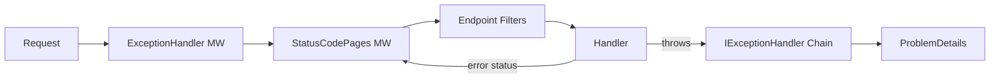

# Problem Details & Error Handling

## The Problem: Inconsistent Error Responses

Without a standard, every API invents its own error format — `{ "error": "..." }`, `{ "code": 404, "msg": "..." }`, `{ "success": false }`. API consumers must write **custom parsing logic for each API**, which is fragile and error-prone.

**RFC 9457** (formerly RFC 7807) solves this by defining a **machine-readable, standardized format** for HTTP API error responses. ASP.NET Core has first-class support for this standard, making it the default choice for all modern .NET APIs.

> 💡 Standardized errors enable generic error-handling middleware, shared client libraries, and consistent user-facing messages across your entire platform.

---

## RFC 9457 — Problem Details Format

RFC 9457 defines a JSON (or XML) format for describing errors in HTTP APIs. The media type is `application/problem+json`.

### Standard Structure

```json
{
    "type": "https://tools.ietf.org/html/rfc9110#section-15.5.5",
    "title": "Not Found",
    "status": 404,
    "detail": "Event with ID '550e8400-e29b-41d4-a716-446655440000' was not found.",
    "instance": "/api/events/550e8400-e29b-41d4-a716-446655440000",
    "traceId": "00-abc123-def456-01"
}
```

### Field-by-Field Explanation

| Field      | Purpose                                                                 |
|------------|-------------------------------------------------------------------------|
| `type`     | URI reference identifying the **problem type**. Defaults to `about:blank`. |
| `title`    | **Short, human-readable summary**. Same for every occurrence of this type. |
| `status`   | HTTP **status code**. Duplicated for convenience outside the HTTP layer. |
| `detail`   | **Human-readable explanation** specific to this occurrence. |
| `instance` | URI reference identifying the **specific occurrence** (typically the request path). |

> All fields are optional per the RFC, but `type` and `status` are strongly recommended.

### Content-Type Header

Responses **must** use `Content-Type: application/problem+json` — this allows clients to detect Problem Details responses regardless of the HTTP status code.

### Extension Members

RFC 9457 allows **custom properties** beyond the five standard fields:

```json
{
    "type": "https://techconf.example.com/problems/capacity-exceeded",
    "title": "Event Capacity Exceeded",
    "status": 409,
    "eventId": "550e8400-e29b-41d4-a716-446655440000",
    "currentCapacity": 500
}
```

### ValidationProblemDetails

ASP.NET Core extends `ProblemDetails` with `ValidationProblemDetails`, adding an `errors` dictionary:

```json
{
    "type": "https://tools.ietf.org/html/rfc9110#section-15.5.1",
    "title": "One or more validation errors occurred.",
    "status": 400,
    "errors": {
        "Title": ["Event title is required"],
        "EndDate": ["End date must be after start date"]
    }
}
```

This is returned automatically when model validation fails.

---

## Built-in Support in ASP.NET Core

ASP.NET Core 7+ includes built-in middleware that converts errors into RFC 9457-compliant responses.

### Enabling Problem Details

```csharp
builder.Services.AddProblemDetails();
```

This single line enables automatic conversion:

| Scenario                  | Without `AddProblemDetails`     | With `AddProblemDetails`              |
|---------------------------|----------------------------------|---------------------------------------|
| Unhandled exception       | Generic 500 HTML               | 500 `ProblemDetails` JSON             |
| 404 (no matching route)   | Empty response body            | 404 `ProblemDetails` JSON             |
| Model validation failure  | `ValidationProblemDetails`     | `ValidationProblemDetails` JSON       |

### Status Code Pages Middleware

To ensure **all non-success status codes** produce Problem Details (even those set manually):

```csharp
app.UseStatusCodePages();
```

### Combine with Exception Handler

```csharp
app.UseExceptionHandler();
app.UseStatusCodePages();
```

> 💡 When `AddProblemDetails()` is registered, `UseExceptionHandler()` formats exceptions as Problem Details JSON automatically.

---

## Custom Exception Handler (IExceptionHandler)

### The IExceptionHandler Interface (.NET 8+)

.NET 8 introduced `IExceptionHandler`, a structured way to handle exceptions globally. Implementations are **registered in DI** and form a **chain of responsibility** — multiple handlers are tried in order until one handles the exception.

```csharp
public interface IExceptionHandler
{
    ValueTask<bool> TryHandleAsync(HttpContext httpContext, Exception exception, CancellationToken ct);
}
```

- Return `true` → the exception is handled, pipeline stops.
- Return `false` → the next `IExceptionHandler` in the chain is tried.

### Complete Implementation

```csharp
public class GlobalExceptionHandler : IExceptionHandler
{
    private readonly ILogger<GlobalExceptionHandler> _logger;

    public GlobalExceptionHandler(ILogger<GlobalExceptionHandler> logger)
    {
        _logger = logger;
    }

    public async ValueTask<bool> TryHandleAsync(
        HttpContext httpContext,
        Exception exception,
        CancellationToken cancellationToken)
    {
        _logger.LogError(exception, "Unhandled exception: {Message}", exception.Message);

        var (statusCode, title) = exception switch
        {
            NotFoundException => (StatusCodes.Status404NotFound, "Not Found"),
            ConflictException => (StatusCodes.Status409Conflict, "Conflict"),
            ValidationException => (StatusCodes.Status400BadRequest, "Validation Error"),
            UnauthorizedAccessException => (StatusCodes.Status403Forbidden, "Forbidden"),
            _ => (StatusCodes.Status500InternalServerError, "Internal Server Error")
        };

        httpContext.Response.StatusCode = statusCode;
        await httpContext.Response.WriteAsJsonAsync(new ProblemDetails
        {
            Status = statusCode,
            Title = title,
            Detail = exception.Message,
            Instance = httpContext.Request.Path,
            Type = $"https://httpstatuses.com/{statusCode}"
        }, cancellationToken);

        return true;
    }
}
```

### Registration

```csharp
builder.Services.AddProblemDetails();
builder.Services.AddExceptionHandler<GlobalExceptionHandler>();
app.UseExceptionHandler();
app.UseStatusCodePages();
```

> ⚠️ `AddExceptionHandler<T>()` alone does nothing — you **must** also call `app.UseExceptionHandler()` to wire it into the middleware pipeline.

Define domain-specific exceptions that map to HTTP status codes:

```csharp
public class NotFoundException : Exception
{
    public NotFoundException(string entityName, object key)
        : base($"{entityName} with key '{key}' was not found.") { }
}

public class ConflictException : Exception
{
    public ConflictException(string message) : base(message) { }
}
```

Usage in a service — the `GlobalExceptionHandler` catches and returns a proper ProblemDetails response:

```csharp
public async Task<Event> GetEventAsync(Guid id)
{
    return await _dbContext.Events.FindAsync(id)
        ?? throw new NotFoundException("Event", id);
}
```

---

## Custom ProblemDetails Extensions

The `ProblemDetails.Extensions` dictionary lets you attach domain-specific data:

```csharp
var problem = new ProblemDetails
{
    Status = 409,
    Title = "Registration Conflict",
    Detail = "Attendee is already registered for this event."
};
problem.Extensions["eventId"] = eventId;
problem.Extensions["attendeeId"] = attendeeId;
problem.Extensions["existingRegistrationId"] = existingId;
```

### Global Customization with ProblemDetailsOptions

Use `CustomizeProblemDetails` to enrich **every** Problem Details response with common metadata:

```csharp
builder.Services.AddProblemDetails(options =>
{
    options.CustomizeProblemDetails = context =>
    {
        context.ProblemDetails.Extensions["traceId"] =
            context.HttpContext.TraceIdentifier;
        context.ProblemDetails.Extensions["timestamp"] =
            DateTime.UtcNow;
    };
});
```

> 💡 `TraceIdentifier` correlates with distributed tracing systems like OpenTelemetry. Including it lets consumers reference errors in support tickets.

---

## Error Handling Strategies Comparison

### The Error Handling Pipeline



### Approaches Compared

| Approach               | Scope         | Best For                      | Returns ProblemDetails? |
|------------------------|---------------|-------------------------------|------------------------|
| **Endpoint Filters**   | Per-endpoint  | Input validation      | Yes, manually          |
| **IExceptionHandler**  | Global        | Domain exceptions     | Yes, automatically     |
| **Custom Middleware**   | Global        | Cross-cutting concerns | Possible              |
| **Result\<T\> pattern**| Per-endpoint  | Expected failures     | Yes, via mapping       |

### Result Pattern vs Exceptions

Not every failure is "exceptional":

- **Exception:** Database connection dropped → truly unexpected, throw.
- **Result:** Event not found by ID → expected outcome, return a result.

💡 `OneOf` is a popular third-party package (`dotnet add package OneOf`) that provides discriminated union types in C#.

```csharp
// Result pattern: expected failures are return values, not exceptions
public async Task<OneOf<Event, NotFoundResult>> GetEventAsync(Guid id)
{
    var evt = await _dbContext.Events.FindAsync(id);
    return evt is null ? new NotFoundResult($"Event '{id}' not found.") : evt;
}

// In the endpoint
app.MapGet("/api/events/{id}", async (Guid id, EventService service) =>
{
    return (await service.GetEventAsync(id)).Match<IResult>(
        evt => Results.Ok(evt),
        notFound => Results.Problem(detail: notFound.Message, statusCode: 404, title: "Not Found"));
});
```

> 💡 Use exceptions for truly exceptional situations (infrastructure failures, programming errors). Use result types for expected business-rule failures.

---

## Development vs Production

During development, you want **maximum detail** — stack traces, inner exceptions. In production, exposing these is a **security risk**.

### Environment-Aware Configuration

```csharp
if (!app.Environment.IsDevelopment())
{
    // Production: safe ProblemDetails without internal details
    app.UseExceptionHandler();
    app.UseStatusCodePages();
}
```

### What Changes Between Environments

| Aspect               | Development                          | Production                         |
|----------------------|--------------------------------------|------------------------------------|
| Exception details    | Full stack trace in response         | Generic message only               |
| `detail` field       | `exception.Message` + inner          | Omitted or sanitized               |
| Logging              | Console + Debug output               | Structured logging (Seq, App Insights) |

> ⚠️ **Always log the full exception server-side**, even when hiding details from the response.

---

## Common Pitfalls

⚠️ **Exposing stack traces in production**
Never return `exception.StackTrace` in production. Attackers use this to find vulnerabilities.

⚠️ **Swallowing exceptions without logging**
A `catch` block with no logging is a debugging nightmare.

⚠️ **Returning different error formats from different endpoints**
Use `AddProblemDetails()` to ensure consistency — clients should write one error handler.

⚠️ **Not using the correct content type**
Use `application/problem+json`, not `application/json`. The ProblemDetails middleware handles this automatically.

⚠️ **Catching `Exception` too broadly**
Catch specific types; let unexpected errors bubble up to `IExceptionHandler`.

```csharp
// ❌ Bad: hides all errors
try { ... } catch (Exception) { return Results.Problem(); }

// ✅ Good: handle specific cases
try { ... } catch (ConflictException ex) { return Results.Conflict(ex.Message); }
```

💡 **Use structured logging** — it enables searching by exception type, request path, and other dimensions in production.

---

## Mini-Exercise

Build error handling for the TechConf API:

**Step 1:** Create custom domain exceptions: `EventNotFoundException`, `EventCapacityExceededException`, `DuplicateRegistrationException`.

**Step 2:** Implement `GlobalExceptionHandler : IExceptionHandler` that maps each exception to the correct HTTP status code and returns a ProblemDetails response.

**Step 3:** Register the handler and add global extensions (traceId, timestamp) via `ProblemDetailsOptions`.

**Step 4:** Test your error responses with an `.http` file:

```http
### Try to get a non-existent event
GET {{host}}/api/events/00000000-0000-0000-0000-000000000000

### Try to register for a full event
POST {{host}}/api/events/{{eventId}}/registrations
Content-Type: application/json

{ "attendeeEmail": "student@techconf.example.com" }

### Submit invalid event data
POST {{host}}/api/events
Content-Type: application/json

{ "title": "", "endDate": "2025-01-01" }
```

---

## Further Reading

- 📄 [RFC 9457 — Problem Details for HTTP APIs](https://www.rfc-editor.org/rfc/rfc9457)
- 📖 [ASP.NET Core — Handle Errors & ProblemDetails](https://learn.microsoft.com/aspnet/core/fundamentals/error-handling)
- 📖 [IExceptionHandler in .NET 8](https://learn.microsoft.com/aspnet/core/fundamentals/error-handling#iexceptionhandler)
- 🎥 [Nick Chapsas — Global Error Handling in ASP.NET Core](https://www.youtube.com/results?search_query=nick+chapsas+global+error+handling+aspnet+core)

---

> **Next:** [Dependency Injection & Service Lifetimes →](./05-dependency-injection.md)
