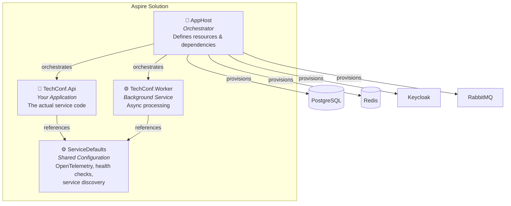
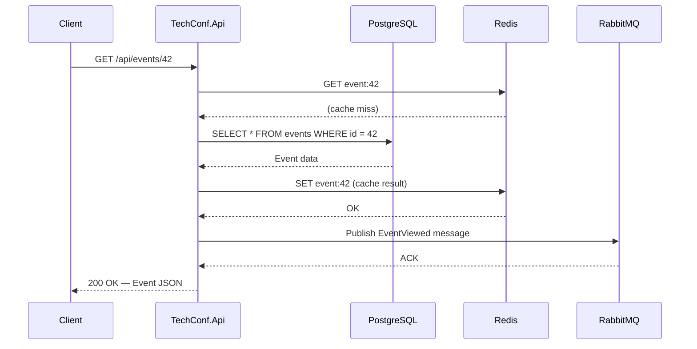
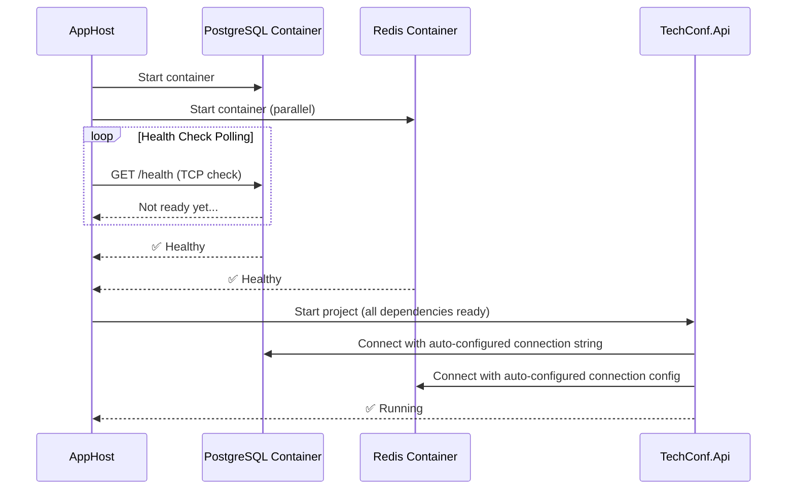

# .NET Aspire — Cloud-Ready Development

## Introduction

Building modern applications means juggling multiple services: databases, caches, message brokers,
identity providers — each with their own connection strings, ports, and startup order. During local
development, getting all of these running together is a significant source of friction.

**.NET Aspire** is an opinionated, cloud-ready stack for building observable, production-quality
distributed applications. Think of it as `docker-compose` deeply integrated into the .NET ecosystem,
but with added superpowers: automatic service discovery, built-in OpenTelemetry, health checks,
and a real-time dashboard — all configured in C# rather than YAML.

### Why This Matters

In our **TechConf Event Management** platform, the API needs PostgreSQL for persistence, Redis for
caching, Keycloak for authentication, and RabbitMQ for async messaging. Without Aspire, every
developer must manually install, configure, and start each service. With Aspire, a single
`dotnet run` brings up the entire stack and opens a dashboard for logs, traces, and metrics.

**Before Aspire:** "Works on my machine" — different Docker setups, manual connection strings, no observability.
**With Aspire:** One command, full stack, full observability, every developer gets the same environment.

> 💡 Aspire is not a deployment tool. It orchestrates your **development environment** and provides
> building blocks you carry into production.

---

## The Three Core Projects

Every Aspire solution is built from three project types that work together:



### AppHost — The Orchestrator

The AppHost project is the entry point. It does **not** contain business logic. Its purpose is to
define what resources exist, how they relate, and in what order they start.

- Uses `DistributedApplication.CreateBuilder()` to set up the orchestration
- Adds **infrastructure** (containers for databases, caches, brokers)
- Adds **projects** (your API, workers, front-ends)
- Wires them together with `WithReference()` and `WaitFor()`

### ServiceDefaults — Shared Configuration

A shared library referenced by every service. When you call `builder.AddServiceDefaults()`, it registers:

- **OpenTelemetry** — traces, metrics, and structured logging piped to the Aspire Dashboard
- **Health checks** — `/health` and `/alive` endpoints for readiness and liveness
- **Service discovery** — resolve service names like `http://api` instead of `http://localhost:5123`
- **Resilience** — default retry and timeout policies via `Microsoft.Extensions.Resilience`


### Your API Project — The Actual Service

Your API project references `ServiceDefaults` and uses it in `Program.cs`:

```csharp
var builder = WebApplication.CreateBuilder(args);
builder.AddServiceDefaults();  // Adds OpenTelemetry, health checks, service discovery
// ... your normal service configuration ...
var app = builder.Build();
app.MapDefaultEndpoints();     // Maps /health and /alive
// ... your normal middleware and endpoints ...
app.Run();
```

The API project does not need to know about Docker, ports, or connection strings — Aspire injects
all of this automatically through environment variables and configuration.

---

## OpenTelemetry Crash Course

**OpenTelemetry** is the standard way to collect telemetry from an application.
Telemetry is simply the information your app emits while it is running so you can understand:

- **What happened?** → logs
- **Where was time spent?** → traces / spans
- **Is the system healthy over time?** → metrics

Why this matters for students building APIs:

- Bugs rarely happen right in front of you during debugging
- Many problems only appear when several services talk to each other
- Good telemetry helps you answer _why_ something is slow or failing without guessing

In .NET, OpenTelemetry builds on APIs you already use:

| Signal                 | Main .NET API        | What it tells you                              |
| ---------------------- | -------------------- | ---------------------------------------------- |
| Structured logging     | `ILogger<T>`         | What happened for a specific operation         |
| Tracing / spans        | `ActivitySource`     | How a request moved through the system         |
| Metrics                | `Meter`              | Trends like request count, latency, error rate |

> 💡 Aspire already configures OpenTelemetry collection and export for you. Your job is to emit
> useful logs, spans, and metrics from your own code.

### Structured Logging — Describe What Happened

Use `ILogger<T>` with **named placeholders** instead of string interpolation. Those placeholders become
structured properties that tools like the Aspire Dashboard can filter and search.

```csharp
public sealed class RegistrationService(ILogger<RegistrationService> logger)
{
    public Task RegisterAsync(Guid eventId, string email)
    {
        logger.LogInformation(
            "Starting registration for {Email} in event {EventId}",
            email,
            eventId);

        // Imagine business logic here...

        logger.LogWarning(
            "Event {EventId} is almost full. Remaining seats: {RemainingSeats}",
            eventId,
            3);

        logger.LogInformation(
            "Registration completed for {Email} in event {EventId}",
            email,
            eventId);

        return Task.CompletedTask;
    }
}
```

This gives you readable messages **and** searchable fields like `Email`, `EventId`, and `RemainingSeats`.

### Spans — Measure One Unit of Work

A **span** represents one timed operation, such as calling a payment provider or saving data.
In .NET, spans are created with `ActivitySource`.

```csharp
using System.Diagnostics;

public sealed class PaymentService
{
    private static readonly ActivitySource ActivitySource = new("TechConf.Payments");

    public async Task ChargeAsync(Guid registrationId)
    {
        using var activity = ActivitySource.StartActivity("charge-registration");

        activity?.SetTag("registration.id", registrationId);
        activity?.SetTag("payment.provider", "Stripe");

        // Simulate an external call
        await Task.Delay(120);

        activity?.SetTag("payment.status", "approved");
    }
}
```

When this code runs inside an HTTP request, Aspire can show this span as part of the full trace,
so students can see where time was spent.

### Metrics — Track Trends Over Time

Metrics help you answer questions like: _How many registrations are happening?_ or _How long does registration take?_ 
In .NET, you create them with `Meter`.

```csharp
using System.Diagnostics;
using System.Diagnostics.Metrics;

public static class RegistrationTelemetry
{
    public static readonly Meter Meter = new("TechConf.Registrations");

    public static readonly Counter<int> RegistrationsCreated =
        Meter.CreateCounter<int>("techconf.registrations.created");

    public static readonly Histogram<double> RegistrationDuration =
        Meter.CreateHistogram<double>("techconf.registration.duration", unit: "ms");
}

public sealed class RegistrationService
{
    public async Task RegisterAsync(Guid eventId)
    {
        var startedAt = Stopwatch.GetTimestamp();

        // Imagine saving to the database here...
        await Task.Delay(80);

        RegistrationTelemetry.RegistrationsCreated.Add(
            1,
            new KeyValuePair<string, object?>("event.id", eventId));

        RegistrationTelemetry.RegistrationDuration.Record(
            Stopwatch.GetElapsedTime(startedAt).TotalMilliseconds,
            new KeyValuePair<string, object?>("event.id", eventId));
    }
}
```

Now Aspire can chart both the **count** of registrations and the **duration** of the operation.

### The Big Picture

If you remember only one thing, make it this:

- **Logs** explain the story
- **Spans** show the journey
- **Metrics** show the trend

That combination is what makes modern distributed systems understandable instead of mysterious.

---

## AppHost Deep-Dive

Complete, annotated AppHost for the TechConf platform:

```csharp
// File: TechConf.AppHost/Program.cs

var builder = DistributedApplication.CreateBuilder(args);

// ──────────────────────────────────────────────────────
// INFRASTRUCTURE — Containers managed by Aspire
// ──────────────────────────────────────────────────────

// PostgreSQL: main relational database
// WithDataVolume() persists data between container restarts
// WithPgAdmin() adds a pgAdmin container for database management UI
var postgres = builder.AddPostgres("postgres")
    .WithDataVolume("techconf-pgdata")
    .WithPgAdmin();

// Create a logical database within the PostgreSQL server
// This name ("techconfdb") is the key your API uses to resolve the connection string
var techconfDb = postgres.AddDatabase("techconfdb");

// Redis: distributed cache and session store
// WithRedisCommander() adds a web UI for inspecting cache contents
var redis = builder.AddRedis("cache")
    .WithRedisCommander();

// Keycloak: OpenID Connect identity provider
// WithDataVolume() persists realm configuration between restarts
// WithRealmImport() pre-loads a realm configuration (users, clients, roles)
var keycloak = builder.AddKeycloak("keycloak")
    .WithDataVolume("techconf-keycloak")
    .WithRealmImport("./keycloak-realm.json");

// RabbitMQ: message broker for async communication
// WithManagementPlugin() enables the RabbitMQ management UI
var rabbitmq = builder.AddRabbitMQ("messaging")
    .WithManagementPlugin();

// ──────────────────────────────────────────────────────
// APPLICATION — Your .NET projects
// ──────────────────────────────────────────────────────

// API: the main web API
// WithReference() injects the connection string / service URL into the project
// WaitFor() delays startup until the dependency's health check passes
var api = builder.AddProject<Projects.TechConf_Api>("api")
    .WithReference(techconfDb)      // Injects PostgreSQL connection string
    .WithReference(redis)           // Injects Redis connection configuration
    .WithReference(keycloak)        // Injects Keycloak URL and settings
    .WithReference(rabbitmq)        // Injects RabbitMQ connection string
    .WaitFor(postgres)              // Don't start until Postgres is healthy
    .WaitFor(keycloak);             // Don't start until Keycloak is healthy

// Worker: background service for async event processing
var worker = builder.AddProject<Projects.TechConf_Worker>("worker")
    .WithReference(techconfDb)      // Needs database access for persistence
    .WithReference(rabbitmq)        // Consumes messages from RabbitMQ
    .WaitFor(postgres)              // Wait for database to be ready
    .WaitFor(rabbitmq);             // Wait for message broker to be ready

// Build and run the distributed application
builder.Build().Run();
```

### What Happens When You Run This

1. Aspire pulls and starts Docker containers for PostgreSQL, Redis, Keycloak, and RabbitMQ
2. It waits for health checks to pass on each container
3. It starts your .NET projects with auto-configured environment variables
4. It opens the **Aspire Dashboard** in your browser

> ⚠️ `Projects.TechConf_Api` is auto-generated. It requires a `<ProjectReference>` from the
> AppHost `.csproj` with `IsAspireProjectResource="true"`.

In `TechConf.AppHost.csproj`:

```xml
<ItemGroup>
    <ProjectReference Include="..\TechConf.Api\TechConf.Api.csproj"
                      IsAspireProjectResource="true" />
    <ProjectReference Include="..\TechConf.Worker\TechConf.Worker.csproj"
                      IsAspireProjectResource="true" />
</ItemGroup>
```

---

## ServiceDefaults Walkthrough

Two key extension methods power ServiceDefaults.

### `AddServiceDefaults()` — What It Registers

```csharp
// File: TechConf.ServiceDefaults/Extensions.cs

public static IHostApplicationBuilder AddServiceDefaults(
    this IHostApplicationBuilder builder)
{
    // ── Service Discovery ──
    // Enables resolving service names (e.g., "http://api") to actual URLs
    builder.ConfigureOpenTelemetry();
    builder.AddDefaultHealthChecks();
    builder.Services.AddServiceDiscovery();

    // ── Resilience ──
    // Adds default retry, circuit breaker, and timeout policies
    // to all HttpClient instances created via IHttpClientFactory
    builder.Services.ConfigureHttpClientDefaults(http =>
    {
        http.AddStandardResilienceHandler();
        http.AddServiceDiscovery();
    });

    return builder;
}
```

### OpenTelemetry Configuration

```csharp
private static IHostApplicationBuilder ConfigureOpenTelemetry(
    this IHostApplicationBuilder builder)
{
    builder.Logging.AddOpenTelemetry(logging =>
    {
        logging.IncludeFormattedMessage = true;
        logging.IncludeScopes = true;
    });

    builder.Services.AddOpenTelemetry()
        .WithMetrics(metrics =>
        {
            // Runtime and HTTP metrics out of the box
            metrics.AddAspNetCoreInstrumentation()
                   .AddHttpClientInstrumentation()
                   .AddRuntimeInstrumentation();
        })
        .WithTracing(tracing =>
        {
            // Distributed tracing across HTTP calls, EF Core, and more
            tracing.AddAspNetCoreInstrumentation()
                   .AddHttpClientInstrumentation()
                   .AddEntityFrameworkCoreInstrumentation();
        });

    // Export to the Aspire Dashboard via OTLP
    builder.AddOpenTelemetryExporters();

    return builder;
}
```

### `MapDefaultEndpoints()` — Health Check Endpoints

```csharp
public static WebApplication MapDefaultEndpoints(this WebApplication app)
{
    // /health — full readiness check (includes database, cache, etc.)
    app.MapHealthChecks("/health");

    // /alive — simple liveness probe (is the process running?)
    app.MapHealthChecks("/alive", new HealthCheckOptions
    {
        Predicate = _ => false  // No dependency checks — just "am I alive?"
    });

    return app;
}
```

### Service Discovery

With Aspire, you never hardcode URLs. Use the **resource name** instead:

```csharp
builder.Services.AddHttpClient("api-client", client =>
{
    client.BaseAddress = new Uri("http://api");  // Resolved by Aspire service discovery
});
```

Aspire resolves `"http://api"` to the actual host and port at runtime — both locally and in production.

---

## The Aspire Dashboard

A real-time observability UI that launches automatically when you run the AppHost.

```bash
cd TechConf.AppHost
dotnet run
# Dashboard URL printed to console: https://localhost:17225/login?t=<token>
```

The dashboard has four main tabs:

### Resources Tab

Shows every resource in your distributed application:

| Column        | Description                                      |
| ------------- | ------------------------------------------------ |
| **Name**      | Resource name (e.g., `api`, `postgres`, `cache`) |
| **State**     | Running, Starting, Waiting, Failed               |
| **Type**      | Project, Container, Executable                   |
| **Endpoints** | Clickable URLs to access each service            |
| **Health**    | Healthy, Degraded, Unhealthy                     |

### Console Tab — Structured Logs

Real-time, structured log output from all services:

- Filter by **resource** or **log level**
- **Full-text search** across all services
- **Structured** — expand entries to see properties (`EventId`, `RequestPath`)
- Color-coded: gray (debug), white (info), yellow (warning), red (error)

### Traces Tab — Distributed Tracing

Every HTTP request is captured as a **distributed trace** — a tree of spans showing the full journey:



This entire flow appears as a single trace with nested spans showing **total duration**, **time per dependency**, **errors** in red, and **span attributes** (SQL queries, HTTP status codes, cache keys).

### Metrics Tab

Runtime and application metrics visualized as charts: HTTP request rate, response times (P50/P95/P99),
error rate, runtime metrics (GC, thread pool, memory), and custom counters you define.

> 💡 The dashboard uses OpenTelemetry under the hood. The same telemetry data flows to production
> monitoring tools (Prometheus, Grafana, Azure Monitor) without code changes.

---

## Aspire Integrations Catalog

Aspire provides NuGet packages for common infrastructure in two flavors:

### Hosting Integrations (used in AppHost)

| Integration   | NuGet Package                  | What It Provides                   |
| ------------- | ------------------------------ | ---------------------------------- |
| PostgreSQL    | `Aspire.Hosting.PostgreSQL`    | PostgreSQL container + pgAdmin     |
| Redis         | `Aspire.Hosting.Redis`         | Redis container + Redis Commander  |
| Keycloak      | `Aspire.Hosting.Keycloak`      | Keycloak container + realm import  |
| RabbitMQ      | `Aspire.Hosting.RabbitMQ`      | RabbitMQ container + management UI |
| SQL Server    | `Aspire.Hosting.SqlServer`     | SQL Server container               |
| MongoDB       | `Aspire.Hosting.MongoDB`       | MongoDB container + Mongo Express  |
| Seq           | `Aspire.Hosting.Seq`           | Seq log aggregation server         |
| Kafka         | `Aspire.Hosting.Kafka`         | Kafka + KafkaUI                    |
| Elasticsearch | `Aspire.Hosting.Elasticsearch` | Elasticsearch + Kibana             |
| Azure Storage | `Aspire.Hosting.Azure.Storage` | Azurite emulator                   |

### Client Integrations (used in your API/Worker projects)

| Package                                          | What It Does                                      |
| ------------------------------------------------ | ------------------------------------------------- |
| `Aspire.Npgsql.EntityFrameworkCore.PostgreSQL`   | EF Core + Npgsql with health checks/tracing       |
| `Aspire.Npgsql`                                  | Raw Npgsql data source with health checks         |
| `Aspire.StackExchange.Redis`                     | Redis `IConnectionMultiplexer` with health checks |
| `Aspire.StackExchange.Redis.OutputCaching`       | Redis-backed output caching                       |
| `Aspire.RabbitMQ.Client`                         | RabbitMQ `IConnection` with health checks         |
| `Aspire.Microsoft.EntityFrameworkCore.SqlServer` | EF Core + SQL Server with health checks           |
| `Aspire.Seq`                                     | Seq logging sink                                  |

> 💡 Hosting packages go in the **AppHost**. Client packages go in **your service project**.

---

## Resource Lifecycle & WaitFor

By default, Aspire starts all resources **in parallel** for maximum speed. This means your API
might try to connect to PostgreSQL before the database container is ready.

### `WaitFor()` — Dependency Ordering

`WaitFor()` tells Aspire: "Do not start this resource until the dependency's health check passes."

```csharp
var api = builder.AddProject<Projects.TechConf_Api>("api")
    .WithReference(techconfDb)
    .WaitFor(postgres);   // API won't start until PostgreSQL is healthy
```

### Startup Sequence



### Important Nuances

> ⚠️ `WaitFor()` means "container is healthy" — not "database is migrated" or "seed data loaded."

> ⚠️ `WithReference()` and `WaitFor()` are independent. `WithReference()` injects connection strings;
> `WaitFor()` controls startup order. You usually want both.
> Without `WaitFor()`, your app should handle transient connection failures gracefully.

---

## Environment & Configuration

When the AppHost starts your API project, it sets environment variables that the .NET configuration
system reads automatically. No manual connection strings needed.

```csharp
// In AppHost — sets environment variable automatically:
var techconfDb = postgres.AddDatabase("techconfdb");
var api = builder.AddProject<Projects.TechConf_Api>("api")
    .WithReference(techconfDb);
// Result: ConnectionStrings__techconfdb=Host=localhost;Port=54321;...
```

### Using the Connection String

```csharp
// In TechConf.Api/Program.cs — Aspire auto-configures this:
builder.AddNpgsqlDbContext<TechConfDbContext>("techconfdb");
// No manual connection string! The name matches the database name in AppHost.
```

### Service Discovery — Names Instead of URLs

```csharp
// Instead of hardcoded URLs:
client.BaseAddress = new Uri("http://localhost:5234");
// Use service names (Aspire resolves to actual host:port):
client.BaseAddress = new Uri("http://api");
```

### Custom Environment Variables

```csharp
var api = builder.AddProject<Projects.TechConf_Api>("api")
    .WithReference(techconfDb)
    .WithEnvironment("TechConf__MaxEventsPerPage", "50")
    .WithEnvironment("TechConf__EnableRegistration", "true");
```

These are accessible via `builder.Configuration["TechConf:MaxEventsPerPage"]` or the options pattern.

---

## Testing with Aspire

Aspire includes a testing package for spinning up the entire distributed application in integration
tests — with real containers and real infrastructure.

### Setup

```xml
<PackageReference Include="Aspire.Hosting.Testing" Version="9.*" />
```

### Writing an Integration Test

```csharp
using Aspire.Hosting.Testing;

public class TechConfIntegrationTests
{
    [Fact]
    public async Task AppHost_StartsSuccessfully()
    {
        // Arrange — build the entire distributed application
        var appHost = await DistributedApplicationTestingBuilder
            .CreateAsync<Projects.TechConf_AppHost>();
        await using var app = await appHost.BuildAsync();

        // Act — start all resources (containers + projects)
        await app.StartAsync();

        // Assert — verify the API is healthy
        var httpClient = app.CreateHttpClient("api");
        var response = await httpClient.GetAsync("/health");
        response.StatusCode.Should().Be(HttpStatusCode.OK);
    }

    [Fact]
    public async Task Api_CanCreateEvent()
    {
        var appHost = await DistributedApplicationTestingBuilder
            .CreateAsync<Projects.TechConf_AppHost>();
        await using var app = await appHost.BuildAsync();
        await app.StartAsync();

        var client = app.CreateHttpClient("api");
        var newEvent = new { Title = "ASP.NET Workshop", MaxAttendees = 100 };
        var response = await client.PostAsJsonAsync("/api/events", newEvent);
        response.StatusCode.Should().Be(HttpStatusCode.Created);
    }
}
```

### What This Gives You

- **Real infrastructure** — tests run against actual PostgreSQL, Redis, and RabbitMQ containers
- **No mocking** — no need to mock database contexts or cache providers
- **CI/CD ready** — runs in any CI environment with Docker support

> ⚠️ These tests are slower than unit tests (containers need to start). Use them for critical paths.

---

## Common Pitfalls

### ⚠️ Docker Desktop Must Be Running

Aspire uses Docker for containers. If Docker is not running, you'll see `"Docker is not available"`.

### ⚠️ Port Conflicts

Aspire auto-assigns random ports. If you use `.WithHostPort(5432)` and PostgreSQL is already on
that port, you'll get a conflict. Let Aspire auto-assign unless you have a specific reason.

### ⚠️ Data Volumes Persist Between Runs

`WithDataVolume()` persists data. For a clean state:

```bash
docker volume rm techconf-pgdata
```

### ⚠️ WaitFor ≠ Data Is Ready

`WaitFor(postgres)` means "accepting connections", not "migrations have run." Handle this yourself:

```csharp
// In Program.cs — run migrations on startup
using var scope = app.Services.CreateScope();
var db = scope.ServiceProvider.GetRequiredService<TechConfDbContext>();
await db.Database.MigrateAsync();
```

### ⚠️ Connection String Format Differences

Aspire generates connection strings in its own format. Always use Aspire's client integrations
(e.g., `AddNpgsqlDbContext`) instead of parsing connection strings manually.

### 💡 Use `WithDataVolume()` for Development Comfort

Named volumes preserve test data, Keycloak config, and database state across restarts:

```csharp
.WithDataVolume("techconf-pgdata")    // ✅ Descriptive
.WithDataVolume()                      // ⚠️ Auto-generated name, harder to manage
```

### 💡 Use `WithLifetime(ContainerLifetime.Persistent)` for Heavy Containers

Containers like Keycloak that take long to start can survive AppHost restarts:

```csharp
var keycloak = builder.AddKeycloak("keycloak")
    .WithLifetime(ContainerLifetime.Persistent);
```

---

## Mini-Exercise

Set up a minimal Aspire solution for TechConf with PostgreSQL, Redis, and your API.

Please make sure to install the aspire cli: https://aspire.dev/get-started/install-cli/

1. **Create the Aspire solution**

```bash
aspire new
# Select the AspNet Core / React option
# Confirm the rest of the options with yes
```

2. **Configure the project**
   Add the NuGet-Package

3. **Edit the AppHost** (`TechConf.AppHost/Program.cs`):

```csharp
var builder = DistributedApplication.CreateBuilder(args);

var cache = builder.AddRedis("cache");

var postgres = builder.AddPostgres("postgres")
    .WithDataVolume("techconf-pgdata")
    .WithPgAdmin();

var techconfDb = postgres.AddDatabase("techconfdb");

var server = builder.AddProject<Projects.fwa2_Server>("server")
    .WithReference(cache)
    .WithReference(techconfDb)
    .WaitFor(postgres)
    .WaitFor(cache)
    .WithHttpHealthCheck("/health")
    .WithExternalHttpEndpoints();

var webfrontend = builder.AddViteApp("webfrontend", "../frontend")
    .WithReference(server)
    .WaitFor(server);

server.PublishWithContainerFiles(webfrontend, "wwwroot");

builder.Build().Run();
```

4. **Run the AppHost:**
   ```bash
   cd TechConf.AppHost && dotnet run
   ```
5. **Explore the Dashboard:**
   - Check **Resources** — are all services healthy?
   - Check **Console** — can you see structured logs?
   - Make an HTTP request and find the trace in **Traces**
6. **Experiment:**
   - Restart the AppHost — is your data still there? (yes, thanks to `WithDataVolume`)
   - Remove `WaitFor(postgres)` and restart — what happens?

---

## Further Reading

| Resource                    | Link                                                                                                                                                 |
| --------------------------- | ---------------------------------------------------------------------------------------------------------------------------------------------------- |
| Official Documentation      | [learn.microsoft.com/dotnet/aspire](https://learn.microsoft.com/dotnet/aspire)                                                                       |
| GitHub Repository           | [github.com/dotnet/aspire](https://github.com/dotnet/aspire)                                                                                         |
| Integration Catalog         | [learn.microsoft.com/dotnet/aspire/fundamentals/integrations-overview](https://learn.microsoft.com/dotnet/aspire/fundamentals/integrations-overview) |
| Aspire Dashboard Standalone | [learn.microsoft.com/dotnet/aspire/fundamentals/dashboard/standalone](https://learn.microsoft.com/dotnet/aspire/fundamentals/dashboard/standalone)   |
| Samples                     | [github.com/dotnet/aspire-samples](https://github.com/dotnet/aspire-samples)                                                                         |

> 💡 Aspire is evolving rapidly. Always check the official docs for the latest API changes.

---

**Next:** [02 — Building the TechConf API with Aspire](./02-techconf-api.md)
