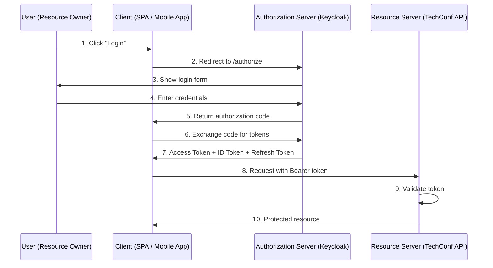
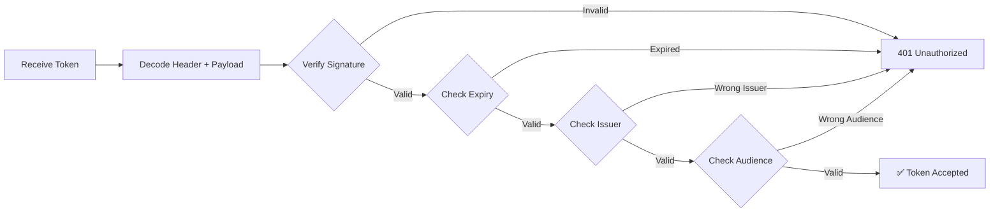
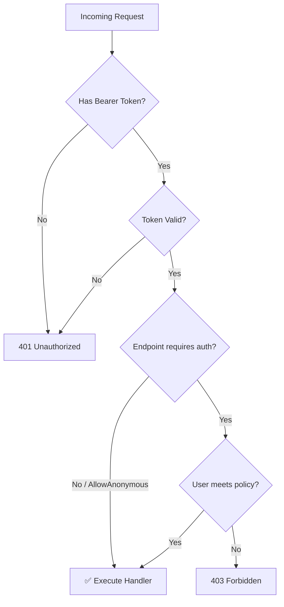
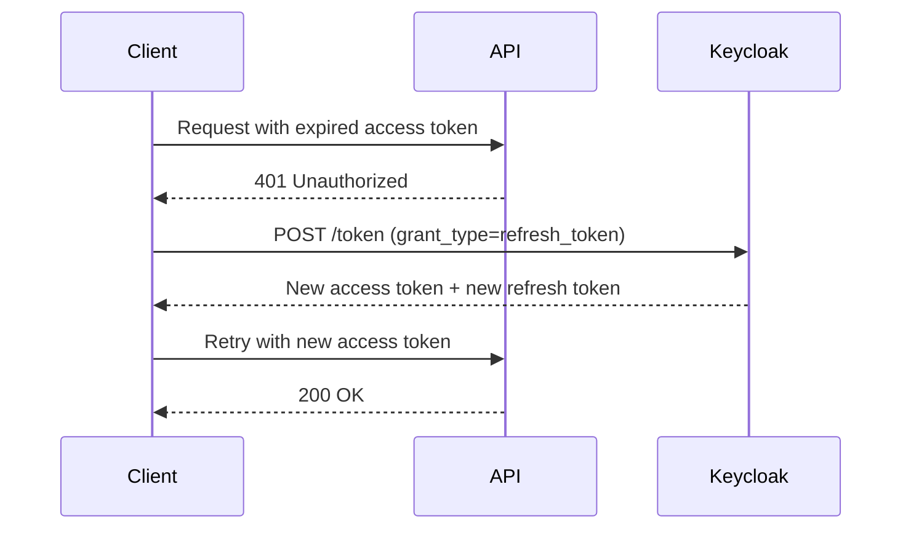

# Authentication & Authorization

## Disclaimer
>[!INFO]
>Dear students, beside naming variables and cache invocation getting Authentication and Authorization right is a big challenge.
>I can only recommend you to stick to proven solutions and "never" roll / build your own authentication system.
>Just like AI is Security a moving target that evolves fast.

## Introduction

Every API that serves real users must answer two fundamental questions:

1. **Authentication** — _Who are you?_ Verifying the identity of the caller.
2. **Authorization** — _What can you do?_ Determining which resources and operations the caller may access.

Without authentication, anyone can call your API. Without authorization, every authenticated user can do everything — including deleting the entire database.

### Common Approaches

| Approach | How it works | Best for |
|---|---|---|
| **API Keys** | Static secret sent in a header | Simple service-to-service, rate limiting |
| **Session-based** | Server stores session state, client holds a cookie | Traditional server-rendered web apps |
| **JWT (JSON Web Tokens)** | Signed, self-contained tokens sent per request | Modern APIs, microservices |
| **OAuth2 / OpenID Connect** | Delegated authorization framework with token issuance | Apps that need third-party or centralized login |

### Choosing an Identity Strategy

For **small or self-contained projects**, **ASP.NET Identity** is often the simplest choice. It is built into ASP.NET Core, stores users and roles in your app's database, and works well when one solution owns the full login flow.

When you need **multiple clients**, **single sign-on**, **external login providers**, or centralized authentication across services, you typically move to **OAuth2 + OpenID Connect + JWT** with an external identity provider such as **Keycloak**. We will compare both options, then use Keycloak for the more advanced walkthrough in the rest of this chapter.

---

## OAuth2 & OpenID Connect Concepts

Once you choose the **external identity provider** route, OAuth2 and OpenID Connect are the core protocols to understand. OAuth2 is an **authorization framework** that allows a client application to access resources on behalf of a user without knowing the user's password. OpenID Connect (OIDC) adds an **authentication layer** on top of OAuth2.

### The OAuth2 Flow



### Grant Types

**Authorization Code + PKCE** (Proof Key for Code Exchange)
- Used by **SPAs, mobile apps, and server-side web apps**
- The client redirects to the auth server, receives a code, exchanges it for tokens
- PKCE adds a code verifier/challenge to prevent interception attacks
- 💡 Recommended grant type for any user-facing application

**Client Credentials**
- Used for **service-to-service** communication (no user involved)
- The client authenticates directly with its own credentials
- Example: a background worker calling the TechConf API to sync schedules

### Tokens

| Token | Purpose | Lifetime | Sent to API? |
|---|---|---|---|
| **Access Token** | Grants access to protected resources | Short (5–15 min) | ✅ Yes |
| **Refresh Token** | Obtains new access tokens without re-login | Long (hours/days) | ❌ No — sent to auth server only |
| **ID Token** | Contains user identity claims (OIDC) | Short | ❌ No — consumed by client only |

### When to Use Each Grant Type

| Scenario | Grant Type | Example |
|---|---|---|
| User logs in via browser SPA | Authorization Code + PKCE | React frontend for TechConf |
| User logs in via mobile app | Authorization Code + PKCE | TechConf mobile app |
| Backend service calls API | Client Credentials | Session import worker |
| Server-rendered web app | Authorization Code | ASP.NET MVC admin panel |

### OpenID Connect

OpenID Connect (OIDC) extends OAuth2 with:
- A standardized **ID Token** (JWT) containing user identity
- A **UserInfo endpoint** to fetch additional profile data
- A **Discovery document** at `/.well-known/openid-configuration` describing all endpoints
- Standard **scopes**: `openid`, `profile`, `email`, `roles`

---

## JWT Token Anatomy

A JSON Web Token consists of three Base64Url-encoded parts separated by dots:

```
xxxxx.yyyyy.zzzzz
  │       │      │
Header  Payload  Signature
```

### Decoded Example (TechConf)

**Header** — Algorithm and token type:
```json
{
  "alg": "RS256",
  "typ": "JWT",
  "kid": "abc123"
}
```

**Payload** — Claims about the user:
```json
{
  "sub": "user-123",
  "name": "Jane Speaker",
  "email": "jane@techconf.example",
  "roles": ["speaker", "attendee"],
  "iss": "https://keycloak.techconf.example/realms/techconf",
  "aud": "techconf-api",
  "exp": 1735689600,
  "iat": 1735686000,
  "scope": "openid profile email"
}
```

**Signature** — Ensures the token has not been tampered with:
```
RS256(
  base64UrlEncode(header) + "." + base64UrlEncode(payload),
  privateKey
)
```

### Standard Claims

| Claim | Name | Description |
|---|---|---|
| `sub` | Subject | Unique identifier for the user |
| `iss` | Issuer | URL of the authorization server that issued the token |
| `aud` | Audience | Intended recipient (your API) |
| `exp` | Expiration | Unix timestamp when the token expires |
| `iat` | Issued At | Unix timestamp when the token was issued |
| `nbf` | Not Before | Token is not valid before this time |
| `jti` | JWT ID | Unique identifier for this specific token |

### Custom Claims

External identity providers like Keycloak can include custom claims like `roles`, `groups`, `realm_access`, and any custom user attribute.

### RS256 vs HS256

| | HS256 (Symmetric) | RS256 (Asymmetric) |
|---|---|---|
| **Algorithm** | HMAC + SHA-256 | RSA + SHA-256 |
| **Key** | Single shared secret | Private key (sign) + Public key (verify) |
| **Who can verify?** | Anyone with the secret | Anyone with the public key |
| **Who can create tokens?** | Anyone with the secret | Only the holder of the private key |
| **Use case** | Internal, single-service | APIs, microservices, distributed systems |

⚠️ **Always use RS256 (asymmetric) for APIs.** With HS256, any service that can verify tokens can also forge them. RS256 ensures only the authorization server can issue tokens while any service can verify them using the public key.

### Token Validation Flow



---

## ASP.NET Identity — Simpler Option for Small Projects

[ASP.NET Core Identity](https://learn.microsoft.com/aspnet/core/security/authentication/identity) is the built-in membership system in ASP.NET Core. It stores users, passwords, roles, and claims in your application's database via Entity Framework Core, so you do not need a separate identity server.

### When ASP.NET Identity is a good fit

- Small to medium applications owned by one team
- Internal tools or line-of-business apps with a single frontend/backend pair
- Projects where **cookie authentication** or app-issued tokens are enough
- Teams that want fewer moving parts and simpler local development

### Typical setup

```csharp
builder.Services.AddIdentity<IdentityUser, IdentityRole>(options =>
    {
        options.Password.RequireDigit = true;
        options.Password.RequiredLength = 6;
        options.Password.RequireNonAlphanumeric = true;
        options.Password.RequireUppercase = true;
        options.Password.RequireLowercase = true;
    })
    .AddEntityFrameworkStores<AppDbContext>()
    .AddDefaultTokenProviders();

builder.Services.AddAuthorization();
```

For browser-first applications, ASP.NET Identity usually pairs with **cookie authentication**. That is often the right default when your UI and API are part of the same solution and you do not need a dedicated OAuth2/OIDC server yet.

Want a hands-on version of this simpler path? See [Alternative Lab: ASP.NET Identity with Aspire and React](../../labs/lab-identity-react/).

## ASP.NET Identity vs Keycloak

| Aspect | ASP.NET Identity | Keycloak |
|---|---|---|
| Identity Provider | Built into your ASP.NET Core app | Separate identity server |
| User Storage | Your app database via EF Core | Dedicated Keycloak store |
| Default Auth Style | Cookies or app-issued tokens | OAuth2/OIDC with JWT bearer tokens |
| Infrastructure | Fewer moving parts | More infrastructure and operational overhead |
| Frontend Complexity | Simple first-party login flows | Better fit for multiple clients and standards-based login |
| Advanced Features | Basic membership, roles, claims | SSO, federation, social login, client/realm management |
| Best Fit | Small or self-contained projects | Advanced setups, multiple clients, centralized auth |

For the rest of this chapter, we continue with **Keycloak** because it demonstrates the standards-based OAuth2/OIDC + JWT flow you will use in larger or more distributed systems.

## Keycloak — Advanced Identity Provider

When your application grows beyond built-in membership, [Keycloak](https://www.keycloak.org/) provides an **open-source identity and access management** server with SSO, user management, social login, OAuth2/OIDC support, and role-based access control.

### Key Concepts

| Concept | Description | TechConf Example |
|---|---|---|
| **Realm** | A tenant — an isolated namespace for users, roles, and clients | `techconf` |
| **Client** | An application that requests authentication | `techconf-api`, `techconf-spa` |
| **User** | A person who authenticates | `jane@techconf.example` |
| **Role** | A permission label assigned to users | `admin`, `organizer`, `speaker`, `attendee` |
| **Group** | A collection of users that share roles | `Speakers 2026`, `Organizers` |

### Setting Up Keycloak with Aspire

Add Keycloak to your Aspire AppHost:

```csharp
// In AppHost/Program.cs
var keycloak = builder.AddKeycloak("keycloak")
    .WithDataVolume("techconf-keycloak");

var api = builder.AddProject<Projects.TechConf_Api>("techconf-api")
    .WithReference(keycloak);
```

### Step-by-Step Realm Configuration

Once Keycloak is running (`http://localhost:8080`), configure via the admin console:

**Step 1 — Create the `techconf` realm:**
- Open the admin console → "Create Realm" → Name: `techconf`

**Step 2 — Create the `techconf-api` client** (confidential, Standard flow + Service accounts)

**Step 3 — Create roles** (`admin`, `organizer`, `speaker`, `attendee`)

**Step 4 — Create test users** and assign roles under "Role mapping"

**Step 5 — Configure token mapper for roles:**
- Client scopes → `roles` → Mappers → Mapper type: "User Realm Role"
- Token claim name: `roles`, add to ID token and access token

### Reproducible Setup with Realm Import

Export your realm config and import it automatically for consistent dev environments:

```csharp
var keycloak = builder.AddKeycloak("keycloak")
    .WithDataVolume("techconf-keycloak")
    .WithRealmImport("./keycloak-realm.json");
```

💡 This ensures every developer gets the same users, roles, and client configuration out of the box.

### Getting Tokens for Testing

Use `curl` to obtain an access token (dev/testing only):

```bash
curl -X POST "http://localhost:8080/realms/techconf/protocol/openid-connect/token" \
  -H "Content-Type: application/x-www-form-urlencoded" \
  -d "grant_type=password" \
  -d "client_id=techconf-api" \
  -d "client_secret=your-secret" \
  -d "username=admin@techconf.example" \
  -d "password=admin"
```

Response (use `access_token` in subsequent requests):
```json
{
  "access_token": "eyJhbGciOiJSUzI1NiIs...",
  "expires_in": 300,
  "refresh_token": "eyJhbGciOiJIUzI1NiIs...",
  "token_type": "Bearer"
}
```

---

## JWT Bearer Authentication in ASP.NET Core

This section assumes you chose the **external identity provider** route and want your API to trust JWTs issued by Keycloak.

### Manual Configuration

Register the JWT Bearer authentication handler in `Program.cs`:

```csharp
using Microsoft.AspNetCore.Authentication.JwtBearer;
using Microsoft.IdentityModel.Tokens;

builder.Services.AddAuthentication(JwtBearerDefaults.AuthenticationScheme)
    .AddJwtBearer(options =>
    {
        options.Authority = "http://keycloak:8080/realms/techconf";
        options.Audience = "techconf-api";
        options.RequireHttpsMetadata = false; // Dev only!

        options.TokenValidationParameters = new TokenValidationParameters
        {
            ValidateIssuer = true,
            ValidateAudience = true,
            ValidateLifetime = true,
            ValidateIssuerSigningKey = true,
            RoleClaimType = "realm_access.roles"
        };
    });

builder.Services.AddAuthorization();
```

### Middleware Order Matters

⚠️ Authentication and authorization middleware **must** be in the correct order:

```csharp
app.UseAuthentication();  // 1st: Who are you?
app.UseAuthorization();   // 2nd: What can you do?
```

### Simplified Setup with Aspire + Keycloak

With .NET Aspire, Keycloak configuration is simpler:

```csharp
builder.Services.AddAuthentication()
    .AddKeycloakJwtBearer("keycloak", realm: "techconf");

builder.Services.AddAuthorization();
```

Aspire automatically resolves the Keycloak URL via service discovery.

---

## Applying Authorization

### Requiring Authentication

The simplest form — require that the caller is authenticated:

```csharp
group.MapGet("/profile", GetProfile).RequireAuthorization();
```

### Role-Based Authorization

```csharp
group.MapPost("/", CreateEvent)
    .RequireAuthorization(policy => policy.RequireRole("admin", "organizer"));
```

### Policy-Based Authorization

Define reusable policies for centralized authorization rules:

```csharp
builder.Services.AddAuthorizationBuilder()
    .AddPolicy("AdminOnly", policy =>
        policy.RequireRole("admin"))
    .AddPolicy("CanManageEvents", policy =>
        policy.RequireRole("admin", "organizer"))
    .AddPolicy("CanSubmitSessions", policy =>
        policy.RequireRole("speaker", "admin"));
```

💡 Policies are better than inline role checks because they give each rule a meaningful name, are defined in one place, and can be changed without modifying endpoint code.

### Applying Policies to Route Groups

```csharp
var eventsGroup = app.MapGroup("/api/events")
    .RequireAuthorization("CanManageEvents");

// Public read endpoints — override the group policy
eventsGroup.MapGet("/", GetAll).AllowAnonymous();
eventsGroup.MapGet("/{id:guid}", GetById).AllowAnonymous();

// Protected write endpoints — inherit group policy
eventsGroup.MapPost("/", CreateEvent);
eventsGroup.MapPut("/{id:guid}", UpdateEvent);
eventsGroup.MapDelete("/{id:guid}", DeleteEvent)
    .RequireAuthorization("AdminOnly"); // Stricter than group default
```

### Resource-Based Authorization

Sometimes authorization depends on **who owns the resource**. A speaker should only edit their own sessions:

```csharp
app.MapPut("/api/sessions/{id:guid}", async (
    Guid id, UpdateSessionRequest request,
    ClaimsPrincipal user, TechConfDbContext db) =>
{
    var session = await db.Sessions.FindAsync(id);
    if (session is null) return TypedResults.NotFound();

    var userId = user.FindFirstValue(ClaimTypes.NameIdentifier);
    var isAdmin = user.IsInRole("admin");

    if (session.SpeakerId.ToString() != userId && !isAdmin)
        return TypedResults.Forbid();

    session.Title = request.Title;
    session.Description = request.Description;
    await db.SaveChangesAsync();
    return TypedResults.Ok(session.ToResponse());
}).RequireAuthorization();
```

### Authorization Decision Flow



---

## Accessing User Claims

### ClaimsPrincipal Injection

Declare a `ClaimsPrincipal` parameter to access user claims in minimal API handlers:

```csharp
app.MapGet("/api/me", (ClaimsPrincipal user) =>
{
    var userId = user.FindFirstValue(ClaimTypes.NameIdentifier);
    var email = user.FindFirstValue(ClaimTypes.Email);
    var name = user.FindFirstValue("name");
    var roles = user.FindAll(ClaimTypes.Role).Select(c => c.Value).ToList();
    var isAdmin = user.IsInRole("admin");

    return TypedResults.Ok(new
    {
        UserId = userId,
        Email = email,
        Name = name,
        Roles = roles,
        IsAdmin = isAdmin
    });
}).RequireAuthorization();
```

### Extension Methods for Cleaner Access

```csharp
public static class ClaimsPrincipalExtensions
{
    public static string GetUserId(this ClaimsPrincipal user)
        => user.FindFirstValue(ClaimTypes.NameIdentifier)
           ?? throw new InvalidOperationException("User ID claim missing");

    public static string? GetEmail(this ClaimsPrincipal user)
        => user.FindFirstValue(ClaimTypes.Email);

    public static bool IsAdmin(this ClaimsPrincipal user)
        => user.IsInRole("admin");

    public static bool IsResourceOwner(this ClaimsPrincipal user, Guid resourceOwnerId)
        => user.GetUserId() == resourceOwnerId.ToString();
}
```

Usage:

```csharp
app.MapDelete("/api/sessions/{id:guid}", async (
    Guid id, ClaimsPrincipal user, TechConfDbContext db) =>
{
    var session = await db.Sessions.FindAsync(id);
    if (session is null) return TypedResults.NotFound();

    if (!user.IsResourceOwner(session.SpeakerId) && !user.IsAdmin())
        return TypedResults.Forbid();

    db.Sessions.Remove(session);
    await db.SaveChangesAsync();
    return TypedResults.NoContent();
}).RequireAuthorization();
```

---

## Testing Authenticated Endpoints

### The Challenge

Integration tests need valid JWTs, but you don't want to spin up Keycloak in every test run.

### Test Auth Handler

```csharp
public class TestAuthHandler : AuthenticationHandler<AuthenticationSchemeOptions>
{
    public TestAuthHandler(
        IOptionsMonitor<AuthenticationSchemeOptions> options,
        ILoggerFactory logger,
        UrlEncoder encoder)
        : base(options, logger, encoder) { }

    protected override Task<AuthenticateResult> HandleAuthenticateAsync()
    {
        var claims = new[]
        {
            new Claim(ClaimTypes.NameIdentifier, "test-user-id"),
            new Claim(ClaimTypes.Email, "test@techconf.example"),
            new Claim(ClaimTypes.Role, "admin"),
        };
        var identity = new ClaimsIdentity(claims, "Test");
        var principal = new ClaimsPrincipal(identity);
        var ticket = new AuthenticationTicket(principal, "Test");

        return Task.FromResult(AuthenticateResult.Success(ticket));
    }
}
```

### Using the Test Handler in WebApplicationFactory

```csharp
public class TechConfApiFactory : WebApplicationFactory<Program>
{
    protected override void ConfigureWebHost(IWebHostBuilder builder)
    {
        builder.ConfigureTestServices(services =>
        {
            // Replace real JWT auth with the test handler
            services.AddAuthentication("Test")
                .AddScheme<AuthenticationSchemeOptions, TestAuthHandler>(
                    "Test", null);
        });
    }
}
```

Now your integration tests can call protected endpoints without a real token. We will cover integration testing in detail on **Day 5**.

---

## Token Refresh & Revocation

Access tokens are short-lived by design (typically 5-15 minutes). When they expire, the client needs a new one without re-authenticating the user.

**The Refresh Flow:**



**Refresh Token Request:**
```bash
curl -X POST "http://localhost:8080/realms/techconf/protocol/openid-connect/token" \
  -d "grant_type=refresh_token" \
  -d "client_id=techconf-api" \
  -d "refresh_token=eyJhbGciOi..."
```

**Token Revocation** (logout):
```bash
curl -X POST "http://localhost:8080/realms/techconf/protocol/openid-connect/revoke" \
  -d "client_id=techconf-api" \
  -d "token=eyJhbGciOi..." \
  -d "token_type_hint=refresh_token"
```

**Best Practices:**
- Keep access tokens short-lived (5-15 minutes)
- Refresh tokens should have longer expiry (hours to days)
- Rotate refresh tokens on each use (Keycloak does this by default)
- Revoke refresh tokens on logout
- Store refresh tokens securely (never in localStorage for browser apps)

---

## Common Pitfalls

### Security

⚠️ **HTTPS in production** — JWTs are Base64-encoded, **not encrypted**. Anyone intercepting the token over HTTP can read and reuse it.

⚠️ **Token storage in browsers** — Never store tokens in `localStorage` (XSS-vulnerable). Use `httpOnly` cookies or keep tokens in memory.

⚠️ **Audience validation** — Without `aud` validation, tokens from other apps on the same realm are accepted.

### Configuration

⚠️ **Middleware order** — `UseAuthentication()` must come **before** `UseAuthorization()`.

⚠️ **Role claim mapping** — Keycloak uses `realm_access.roles`, but ASP.NET Core expects `http://schemas.microsoft.com/ws/2008/06/identity/claims/role`. Configure `RoleClaimType` or add a mapper in Keycloak.

⚠️ **Token expiry** — Use short-lived access tokens (5–15 min) with refresh tokens.

### Best Practices

💡 **Always use HTTPS in production** — set `RequireHttpsMetadata = true` and enforce HSTS.

💡 **Prefer policy-based authorization** over inline role checks. Policies are named, centralized, and testable.

💡 **Log authentication failures** — configure `JwtBearerEvents` to log rejection reasons.

💡 **Use `.http` files** to test authenticated endpoints quickly:

```http
### Get Token
POST http://localhost:8080/realms/techconf/protocol/openid-connect/token
Content-Type: application/x-www-form-urlencoded

grant_type=password&client_id=techconf-api&client_secret=your-secret&username=admin@techconf.example&password=admin

### Use Token
GET http://localhost:5000/api/events
Authorization: Bearer {{access_token}}
```

---

## 🏋️ Mini-Exercise

Build authentication and authorization for the TechConf API using the **Keycloak + JWT** path:

1. **Add Keycloak** to your Aspire AppHost with a realm import
2. **Configure JWT Bearer auth** in the TechConf API project
3. **Define three authorization policies:**
   - `AdminOnly` — requires the `admin` role
   - `CanManageEvents` — requires `admin` or `organizer`
   - `CanSubmitSessions` — requires `speaker` or `admin`
4. **Protect your event endpoints:**
   - `GET /api/events` and `GET /api/events/{id}` — allow anonymous
   - `POST`, `PUT`, `DELETE` — require `CanManageEvents`
5. **Get a token** from Keycloak using `curl` or a `.http` file
6. **Test** that unauthenticated requests to `POST /api/events` return `401`
7. **Test** that a `speaker` token on `DELETE /api/events/{id}` returns `403`

Looking for the simpler Day 3 alternative? See [Alternative Lab: ASP.NET Identity with Aspire and React](../../labs/lab-identity-react/).

⏱️ **Time estimate:** 30–45 minutes

---

## Further Reading

- 📖 [ASP.NET Core Authentication & Authorization](https://learn.microsoft.com/aspnet/core/security/)
- 📖 [ASP.NET Core Identity](https://learn.microsoft.com/aspnet/core/security/authentication/identity)
- 📖 [JWT.io](https://jwt.io/) — decode, verify, and generate JWTs interactively
- 📖 [OAuth 2.0 Simplified](https://www.oauth.com/)
- 📖 [Keycloak Documentation](https://www.keycloak.org/documentation)
- 📖 [RFC 7519 — JSON Web Token](https://datatracker.ietf.org/doc/html/rfc7519)
- 📖 [Aspire + Keycloak Integration](https://learn.microsoft.com/dotnet/aspire/authentication/keycloak-integration)
- 📖 [Alternative Lab: ASP.NET Identity with Aspire and React](../../labs/lab-identity-react/)
- 📖 [OWASP Authentication Cheat Sheet](https://cheatsheetseries.owasp.org/cheatsheets/Authentication_Cheat_Sheet.html)

---

**Next up:** [Middleware & Error Handling](./03-middleware.md) — building robust request pipelines with global error handling, logging, and custom middleware.
