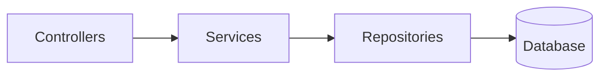
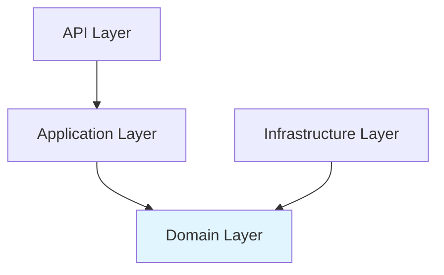
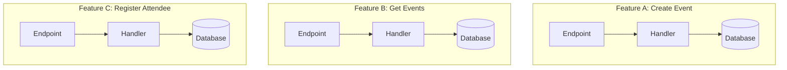
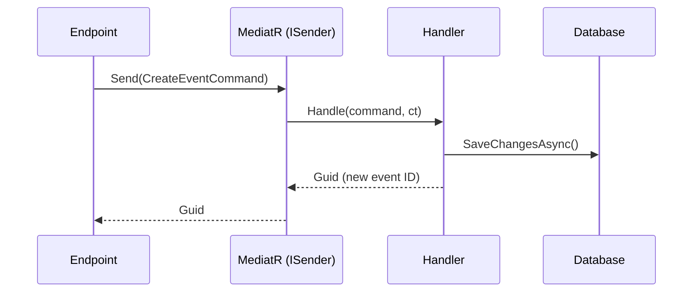
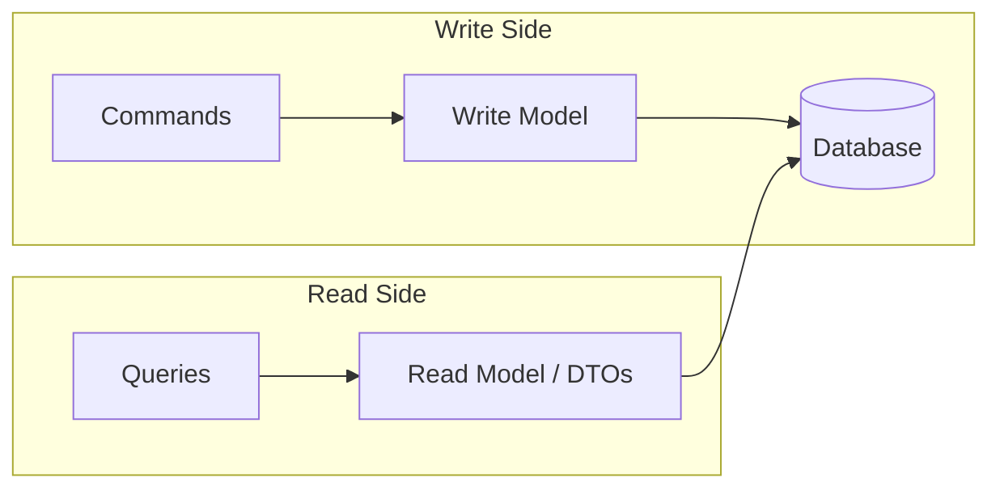

# Architecture Patterns — VSA, MediatR & CQRS

> **Day 3** — Moving beyond "everything in the controller" toward maintainable, testable, team-friendly API design.

## Why Architecture Matters

When an API has three endpoints and one developer, architecture is irrelevant. But APIs grow:
- **5 → 50 endpoints**: where does the business logic live?
- **1 → 5 developers**: who owns which code? Merge conflicts?
- **Simple CRUD → complex workflows**: registrations, capacity checks, notifications…

The right architecture gives you:

| Goal | What it means in practice |
|------|--------------------------|
| **Maintainability** | Change one feature without breaking others |
| **Testability** | Unit-test business logic without a running database |
| **Team scalability** | Developers work on features independently |
| **Onboarding** | New team members find code quickly |

This chapter explores three architecture styles, then focuses on **Vertical Slice Architecture (VSA)** powered by **MediatR** and **CQRS**.

---

## Architecture Evolution

### 1. Traditional Layered Architecture



✅ **Pros:** Familiar, simple mental model, works well for small CRUD APIs
❌ **Cons:** Adding a feature touches **every layer**, services grow to 500+ lines, merge conflicts

### 2. Clean Architecture (Onion / Hexagonal)



✅ **Pros:** Domain logic isolated and testable, infrastructure is pluggable
❌ **Cons:** Significant overhead for CRUD apps, many abstractions, high learning curve

### 3. Vertical Slice Architecture (VSA)

Instead of slicing **horizontally** by layer, VSA slices **vertically** by feature:



✅ **Pros:** Self-contained features, minimal merge conflicts, easy to understand and delete
❌ **Cons:** Some duplication across features, needs discipline to avoid hidden service layers

### Comparison Table

| Aspect | Layered | Clean / Onion | VSA |
|--------|---------|---------------|-----|
| Code organization | By technical layer | By layer + domain | By feature |
| Change scope | Touch many layers | Touch many layers | Touch one folder/file |
| Learning curve | Low | High | Medium |
| Team scaling | Merge conflicts likely | Some conflicts | Independent work |
| CRUD-heavy APIs | Good fit | Overkill | Good fit |
| Complex domains | Struggles | Best fit | Good fit |
| Testability | Medium | High | High |
| Onboarding speed | Fast | Slow | Fast |
| Abstraction count | Low | Very High | Low |
| File count per feature | 3–5 files | 5–8 files | 1–2 files |
| Refactoring cost | High (ripple effects) | Medium | Low (isolated) |

💡 **Our choice for TechConf:** VSA with MediatR — the right balance of structure and simplicity.

---

## Vertical Slice Architecture in Detail

### Folder Structure for TechConf

```
Features/
├── Events/
│   ├── GetEvents.cs          // query + handler + response DTO
│   ├── GetEventById.cs       // query + handler
│   ├── CreateEvent.cs        // command + handler + request DTO + validator
│   ├── UpdateEvent.cs        // command + handler
│   └── DeleteEvent.cs        // command + handler
├── Sessions/
│   ├── GetSessionsByEvent.cs
│   ├── CreateSession.cs
│   └── ...
└── Registrations/
    ├── RegisterAttendee.cs
    └── ...
```

Each file contains **everything** for one operation: request, handler, response, validator.

### Key Principles

1. **No shared "Services" layer** — handlers call infrastructure directly
2. **Each feature is independent** — `GetEvents` knows nothing about `CreateEvent`
3. **When features share logic** — extract to a small `Shared/` module, not a catch-all service
4. **Deleting a feature is trivial** — remove the file, remove the endpoint mapping

```
Features/
├── Shared/
│   ├── CapacityChecker.cs    // reusable logic, used by multiple features
│   └── SlugGenerator.cs
├── Events/ ...
```

⚠️ If the `Shared/` folder grows large, a service layer is creeping back in. Keep it small.

---

## MediatR — The Mediator Pattern

### What MediatR Does

MediatR sends a message through a mediator that finds and invokes the right handler:



### Setup

```bash
dotnet add package MediatR
```

```csharp
builder.Services.AddMediatR(cfg =>
    cfg.RegisterServicesFromAssemblyContaining<Program>());
```

### Query — Returns Data

```csharp
// ---------- Features/Events/GetEvents.cs ----------
public record GetEventsQuery(string? Search, int Page = 1, int PageSize = 20)
    : IRequest<PagedResult<EventResponse>>;

public record EventResponse(Guid Id, string Title, DateTime StartDate, EventStatus Status);

public class GetEventsHandler : IRequestHandler<GetEventsQuery, PagedResult<EventResponse>>
{
    private readonly TechConfDbContext _db;
    public GetEventsHandler(TechConfDbContext db) => _db = db;

    public async Task<PagedResult<EventResponse>> Handle(
        GetEventsQuery request, CancellationToken ct)
    {
        var query = _db.Events.AsNoTracking();

        if (!string.IsNullOrEmpty(request.Search))
            query = query.Where(e => e.Title.Contains(request.Search));

        var total = await query.CountAsync(ct);
        var items = await query
            .OrderBy(e => e.StartDate)
            .Skip((request.Page - 1) * request.PageSize)
            .Take(request.PageSize)
            .Select(e => new EventResponse(e.Id, e.Title, e.StartDate, e.Status))
            .ToListAsync(ct);

        return new PagedResult<EventResponse>(items, total, request.Page, request.PageSize);
    }
}
```

### Command — Modifies State

```csharp
// ---------- Features/Events/CreateEvent.cs ----------
public record CreateEventCommand(
    string Title, string? Description, DateTime StartDate,
    DateTime EndDate, string Location, int MaxAttendees)
    : IRequest<Guid>;

public class CreateEventHandler : IRequestHandler<CreateEventCommand, Guid>
{
    private readonly TechConfDbContext _db;
    public CreateEventHandler(TechConfDbContext db) => _db = db;

    public async Task<Guid> Handle(CreateEventCommand request, CancellationToken ct)
    {
        var ev = new Event
        {
            Id = Guid.NewGuid(),
            Title = request.Title,
            Description = request.Description,
            StartDate = request.StartDate,
            EndDate = request.EndDate,
            Location = request.Location,
            MaxAttendees = request.MaxAttendees,
            Status = EventStatus.Draft
        };

        _db.Events.Add(ev);
        await _db.SaveChangesAsync(ct);
        return ev.Id;
    }
}
```

### Wiring to Minimal API Endpoints

```csharp
var events = app.MapGroup("/api/events").WithTags("Events");

events.MapGet("/", async (
    [AsParameters] GetEventsQuery query,
    ISender sender) => TypedResults.Ok(await sender.Send(query)));

events.MapPost("/", async (
    CreateEventCommand command,
    ISender sender) =>
{
    var id = await sender.Send(command);
    return TypedResults.Created($"/api/events/{id}", new { id });
});
```

💡 Inject `ISender` (not `IMediator`) — it's the minimal interface for sending requests.

---

## CQRS — Command Query Responsibility Segregation

CQRS separates your application into two distinct paths:



**Commands** change state, **Queries** read state — using **different models** even against the same database.

### When CQRS Adds Value

| Scenario | Why CQRS helps |
|----------|----------------|
| Different read/write shapes | Read DTOs skip navigation properties |
| Read optimization | Cache read models, denormalized views |
| Complex business rules on writes | Write handlers enforce invariants |
| Audit / event sourcing | Commands produce events (advanced) |

### When CQRS is Overkill

- Simple CRUD where read and write shapes are identical
- Very small APIs with fewer than 10 endpoints
- Prototypes where speed-to-market matters more

### Practical CQRS in This Course

**Lightweight CQRS**: same database, different DTOs, naming conventions.

```
*Query     → reads data, returns DTOs          → GET endpoints
*Command   → modifies state, returns ID/void   → POST/PUT/DELETE endpoints
```

No separate databases. No event sourcing. Just clean separation of intent.

---

## Pipeline Behaviors — Cross-Cutting Concerns

Pipeline behaviors are **middleware for MediatR** — every request passes through before reaching its handler:


### Logging Behavior

```csharp
public class LoggingBehavior<TRequest, TResponse>
    : IPipelineBehavior<TRequest, TResponse>
    where TRequest : IRequest<TResponse>
{
    private readonly ILogger<LoggingBehavior<TRequest, TResponse>> _logger;

    public LoggingBehavior(ILogger<LoggingBehavior<TRequest, TResponse>> logger)
        => _logger = logger;

    public async Task<TResponse> Handle(
        TRequest request,
        RequestHandlerDelegate<TResponse> next,
        CancellationToken ct)
    {
        var requestName = typeof(TRequest).Name;
        _logger.LogInformation("Handling {RequestName}: {@Request}", requestName, request);

        var sw = Stopwatch.StartNew();
        var response = await next();
        sw.Stop();

        _logger.LogInformation("Handled {RequestName} in {ElapsedMs}ms",
            requestName, sw.ElapsedMilliseconds);

        return response;
    }
}
```

### Validation Behavior

```bash
dotnet add package FluentValidation.DependencyInjectionExtensions
```

```csharp
public class ValidationBehavior<TRequest, TResponse>
    : IPipelineBehavior<TRequest, TResponse>
    where TRequest : IRequest<TResponse>
{
    private readonly IEnumerable<IValidator<TRequest>> _validators;

    public ValidationBehavior(IEnumerable<IValidator<TRequest>> validators)
        => _validators = validators;

    public async Task<TResponse> Handle(
        TRequest request,
        RequestHandlerDelegate<TResponse> next,
        CancellationToken ct)
    {
        if (!_validators.Any()) return await next();

        var context = new ValidationContext<TRequest>(request);
        var failures = (await Task.WhenAll(
                _validators.Select(v => v.ValidateAsync(context, ct))))
            .SelectMany(r => r.Errors)
            .Where(f => f is not null)
            .ToList();

        if (failures.Count > 0)
            throw new ValidationException(failures);

        return await next();
    }
}
```

A validator for `CreateEventCommand`:

```csharp
public class CreateEventValidator : AbstractValidator<CreateEventCommand>
{
    public CreateEventValidator()
    {
        RuleFor(x => x.Title).NotEmpty().MaximumLength(200);
        RuleFor(x => x.StartDate).GreaterThan(DateTime.UtcNow);
        RuleFor(x => x.EndDate).GreaterThan(x => x.StartDate);
        RuleFor(x => x.MaxAttendees).InclusiveBetween(1, 10000);
    }
}
```

### Registration — Order Matters!

```csharp
builder.Services.AddMediatR(cfg =>
{
    cfg.RegisterServicesFromAssemblyContaining<Program>();
    cfg.AddBehavior(typeof(IPipelineBehavior<,>), typeof(LoggingBehavior<,>));
    cfg.AddBehavior(typeof(IPipelineBehavior<,>), typeof(ValidationBehavior<,>));
});

builder.Services.AddValidatorsFromAssemblyContaining<Program>();
```

💡 Logging wraps validation — so even failed validation gets logged.

---

## Refactoring Walkthrough

### Before — Fat Endpoint

```csharp
app.MapPost("/api/events", async (CreateEventRequest req, TechConfDbContext db) =>
{
    if (string.IsNullOrEmpty(req.Title))
        return Results.BadRequest("Title is required");
    if (req.EndDate <= req.StartDate)
        return Results.BadRequest("End date must be after start date");

    var ev = new Event
    {
        Id = Guid.NewGuid(), Title = req.Title,
        StartDate = req.StartDate, EndDate = req.EndDate,
        Location = req.Location, Status = EventStatus.Draft
    };
    db.Events.Add(ev);
    await db.SaveChangesAsync();
    return Results.Created($"/api/events/{ev.Id}", new { ev.Id });
});
```

⚠️ Validation mixed with business logic, no testability, no pipeline.

### Step 1 — Extract Request Record

```csharp
public record CreateEventCommand(
    string Title, string? Description, DateTime StartDate,
    DateTime EndDate, string Location, int MaxAttendees) : IRequest<Guid>;
```

### Step 2 — Create Handler

```csharp
public class CreateEventHandler : IRequestHandler<CreateEventCommand, Guid>
{
    private readonly TechConfDbContext _db;
    public CreateEventHandler(TechConfDbContext db) => _db = db;

    public async Task<Guid> Handle(CreateEventCommand request, CancellationToken ct)
    {
        var ev = new Event { /* map from request */ };
        _db.Events.Add(ev);
        await _db.SaveChangesAsync(ct);
        return ev.Id;
    }
}
```

### Step 3 — Wire Endpoint to ISender

```csharp
events.MapPost("/", async (CreateEventCommand command, ISender sender) =>
{
    var id = await sender.Send(command);
    return TypedResults.Created($"/api/events/{id}", new { id });
});
```

### Step 4 — Add Validation via Pipeline

The `CreateEventValidator` from section 6 handles validation automatically.

💡 The endpoint went from 20+ lines of mixed concerns to 3 lines.

---

## Common Pitfalls

### ⚠️ Over-Engineering
Don't use MediatR for a 3-endpoint API. Start simple, refactor **when complexity grows**.

### ⚠️ Anemic Handlers
```csharp
// BAD — just a pass-through, skip MediatR for this feature
public async Task<Guid> Handle(CreateEventCommand request, CancellationToken ct)
    => await _eventService.CreateEvent(request);
```

### ⚠️ Too Many Pipeline Behaviors
Every behavior adds overhead to **every** request. Consider marker interfaces for selective application.

### ⚠️ Forgetting CancellationToken
```csharp
await _db.SaveChangesAsync();    // BAD — ignores client disconnect
await _db.SaveChangesAsync(ct);  // GOOD — respects cancellation
```

### ⚠️ Circular Handler Dependencies
Handlers should **never** call other handlers via MediatR. Extract shared logic into a service instead.

### 💡 Start Simple, Refactor Later
Begin with inline endpoints. Extract to VSA slices when a feature gets complex.

### 💡 One File Per Feature
Keep request, handler, response, and validator in a single file. Cohesion beats convention.

---

## Mini-Exercise

### Task 1: Create Your First MediatR Handler
1. Create the folder `Features/Events/`
2. Add `GetEvents.cs` with `GetEventsQuery : IRequest<List<EventResponse>>`
3. Add `GetEventsHandler` that reads from the database
4. Update the endpoint to inject `ISender` and call `sender.Send(...)`

### Task 2: Add a Command
Create `CreateEvent.cs` with `CreateEventCommand`, `CreateEventHandler`, and `CreateEventValidator`.

### Task 3: Add the Logging Pipeline
Create `Behaviors/LoggingBehavior.cs`, register it, and observe log output.

### Task 4: VSA Folder Structure
Reorganize your project into the feature folder structure shown above.

---

## Further Reading

| Resource | Link |
|----------|------|
| MediatR GitHub | https://github.com/jbogard/MediatR |
| Jimmy Bogard — Vertical Slice Architecture | https://www.jimmybogard.com/vertical-slice-architecture/ |
| FluentValidation Docs | https://docs.fluentvalidation.net/ |
| CQRS — Martin Fowler | https://martinfowler.com/bliki/CQRS.html |
| Derek Comartin — CodeOpinion (YouTube) | https://www.youtube.com/c/CodeOpinion |
| Milan Jovanović — .NET Architecture (YouTube) | https://www.youtube.com/c/MilanJovanovic |

### NuGet Packages Used

```xml
<PackageReference Include="MediatR" Version="12.*" />
<PackageReference Include="FluentValidation.DependencyInjectionExtensions" Version="11.*" />
```
