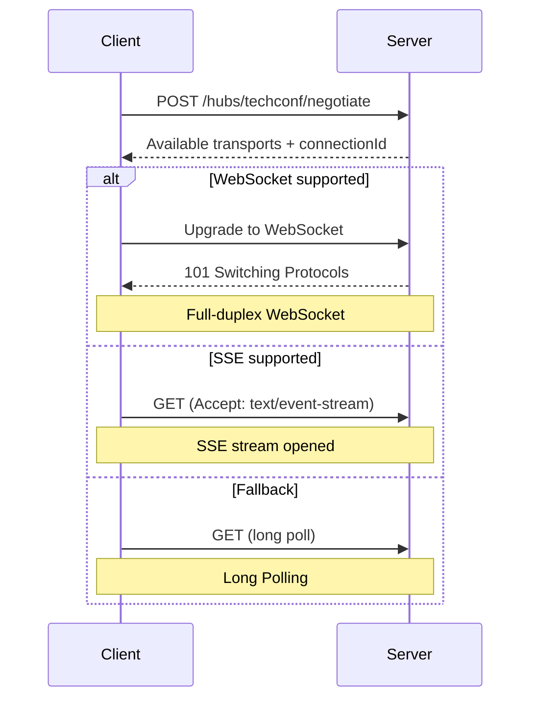
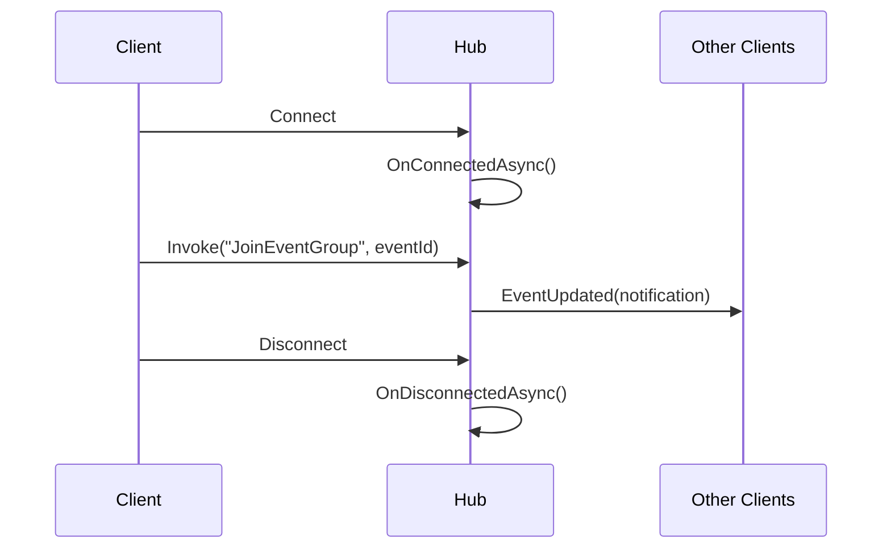
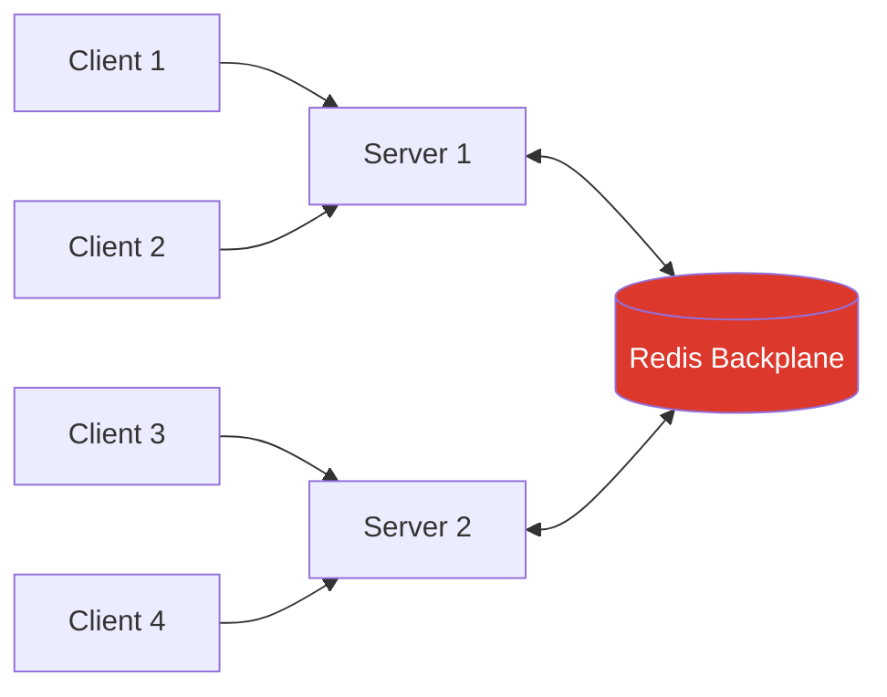

# SignalR — Real-time Communication

## Introduction

Traditional web communication follows a **request-response** pattern: the client asks, the server answers. But what happens when the server has new information and the client doesn't know to ask? In TechConf, attendees need **live session updates**, **real-time attendee counts**, and **instant notifications** — without refreshing.

**Real-time** means the server can **push** data to clients the moment something changes, rather than clients **polling** repeatedly.

| Approach | How it works | Drawback |
|---|---|---|
| Polling | Client requests every N seconds | Wasteful, delayed |
| Long Polling | Client holds request open until data arrives | Complex, resource-heavy |
| Server-Sent Events | Server pushes over HTTP (one-way) | No client→server messages |
| Raw WebSocket | Full-duplex TCP connection | Manual protocol, no fallback |
| **SignalR** | **Abstraction over all of the above** | **Picks the best transport** |

**SignalR** is an ASP.NET Core library that abstracts real-time communication. You write code **once**, and SignalR selects the best available transport, handling connection management, reconnection, and serialization.

---

## Transport Negotiation

SignalR supports three transports and automatically negotiates the best one.

1. **WebSocket** — Full-duplex, persistent TCP. Best performance. Preferred when available.
2. **Server-Sent Events (SSE)** — Server→client over HTTP. Fallback when WebSocket is unavailable.
3. **Long Polling** — Client opens request, server holds until data ready. Universal compatibility.



| Feature | WebSocket | SSE | Long Polling |
|---|---|---|---|
| **Direction** | Bidirectional | Server→Client | Bidirectional (simulated) |
| **Performance** | ⭐ Excellent | ⭐ Good | ⚠️ Higher overhead |
| **Browser Support** | All modern | All modern | Universal |
| **Binary data** | Yes | No | Yes |

💡 You never choose a transport — SignalR negotiates automatically. Your code stays the same.

---

## Hub Concept

A **Hub** is the server-side endpoint for real-time communication — like a controller for persistent connections.



- `OnConnectedAsync()` — called when a client connects
- Hub methods — invoked by clients (e.g., `JoinEventGroup`)
- `OnDisconnectedAsync()` — called on disconnect (browser close, network loss)
- The hub can send messages to **any** connected client, not just the caller

---

## Strongly Typed Hub

A strongly typed hub uses an **interface** for client methods, giving you **compile-time safety**.

```csharp
// Contracts/ITechConfClient.cs
public interface ITechConfClient
{
    Task EventUpdated(EventNotification notification);
    Task SessionStarted(SessionNotification notification);
    Task AttendeeCountChanged(Guid eventId, int count);
    Task RegistrationConfirmed(RegistrationNotification notification);
}

public record EventNotification(Guid EventId, string Title, string ChangeDescription);
public record SessionNotification(Guid SessionId, string Title, string Speaker, DateTime StartTime);
public record RegistrationNotification(Guid RegistrationId, string AttendeeName, string EventTitle);
```

```csharp
// Hubs/TechConfHub.cs
public class TechConfHub : Hub<ITechConfClient>
{
    private readonly ILogger<TechConfHub> _logger;

    public TechConfHub(ILogger<TechConfHub> logger) => _logger = logger;

    public override async Task OnConnectedAsync()
    {
        _logger.LogInformation("Client connected: {ConnectionId}", Context.ConnectionId);
        await base.OnConnectedAsync();
    }

    public override async Task OnDisconnectedAsync(Exception? exception)
    {
        _logger.LogInformation("Client disconnected: {ConnectionId}", Context.ConnectionId);
        await base.OnDisconnectedAsync(exception);
    }

    // Client can call this to join an event's notification group
    public async Task JoinEventGroup(Guid eventId)
    {
        await Groups.AddToGroupAsync(Context.ConnectionId, $"event:{eventId}");
        _logger.LogInformation("Client {ConnectionId} joined event {EventId}",
            Context.ConnectionId, eventId);
    }

    public async Task LeaveEventGroup(Guid eventId)
    {
        await Groups.RemoveFromGroupAsync(Context.ConnectionId, $"event:{eventId}");
    }
}
```

💡 With `Hub<ITechConfClient>`, calling `Clients.All.EventUpdated(...)` is checked at compile time. With untyped `Hub`, you'd write `Clients.All.SendAsync("EventUpdated", ...)` — a magic string that can silently break.

---

## Registration & Mapping

```csharp
// Program.cs
builder.Services.AddSignalR();

app.MapHub<TechConfHub>("/hubs/techconf");
```

### CORS Configuration

```csharp
builder.Services.AddCors(options =>
{
    options.AddPolicy("SignalRPolicy", policy =>
    {
        policy.WithOrigins("https://techconf-frontend.example.com")
              .AllowAnyHeader()
              .AllowAnyMethod()
              .AllowCredentials(); // Required for SignalR
    });
});

app.UseCors("SignalRPolicy");
```

⚠️ You **cannot** use `.AllowAnyOrigin()` with `.AllowCredentials()`. Specify explicit origins.

### Authentication on the Hub Endpoint

```csharp
app.MapHub<TechConfHub>("/hubs/techconf")
    .RequireAuthorization();
```

---

## Groups — Scoping Messages

Groups are **logical channels** for sending messages to a subset of clients.

| Group Name | Purpose |
|---|---|
| `event:{eventId}` | Everyone watching a specific event |
| `session:{sessionId}` | Attendees in a session |
| `admin` | All administrators |

```csharp
// Send to everyone watching a specific event
await Clients.Group($"event:{eventId}").EventUpdated(notification);
```

💡 Groups are automatically cleaned up on disconnect — no manual removal needed.

### Sending Targets

| Target | Method | Sends To |
|---|---|---|
| All clients | `Clients.All` | Every connected client |
| Caller only | `Clients.Caller` | The invoking client |
| All except caller | `Clients.Others` | Everyone except caller |
| Specific group | `Clients.Group("name")` | All clients in the group |
| Specific user | `Clients.User(userId)` | All connections of a user |
| Specific client | `Clients.Client(connId)` | One specific connection |
| Group except caller | `Clients.OthersInGroup("name")` | Group members except caller |

---

## Sending from Outside the Hub — IHubContext

Hub methods are only called when a client invokes them. To push messages from **API endpoints** or **background services**, inject `IHubContext`.

### From a Minimal API Endpoint

```csharp
app.MapPost("/api/events/{id:guid}/sessions", async (
    Guid id,
    CreateSessionCommand command,
    ISender sender,
    IHubContext<TechConfHub, ITechConfClient> hubContext) =>
{
    var sessionId = await sender.Send(command);

    await hubContext.Clients.Group($"event:{id}")
        .SessionStarted(new SessionNotification(
            sessionId, command.Title, command.Speaker, command.StartTime));

    return TypedResults.Created($"/api/sessions/{sessionId}");
});
```

### From a Background Service

```csharp
public class RegistrationNotifier : BackgroundService
{
    private readonly IHubContext<TechConfHub, ITechConfClient> _hub;
    private readonly IServiceScopeFactory _scopeFactory;

    public RegistrationNotifier(
        IHubContext<TechConfHub, ITechConfClient> hub,
        IServiceScopeFactory scopeFactory)
    {
        _hub = hub;
        _scopeFactory = scopeFactory;
    }

    protected override async Task ExecuteAsync(CancellationToken ct)
    {
        while (!ct.IsCancellationRequested)
        {
            using var scope = _scopeFactory.CreateScope();
            var db = scope.ServiceProvider.GetRequiredService<TechConfDbContext>();

            var events = await db.Registrations
                .Where(r => r.CreatedAt > DateTime.UtcNow.AddSeconds(-10))
                .Select(r => r.EventId).Distinct().ToListAsync(ct);

            foreach (var eventId in events)
            {
                var count = await db.Registrations.CountAsync(r => r.EventId == eventId, ct);
                await _hub.Clients.Group($"event:{eventId}")
                    .AttendeeCountChanged(eventId, count);
            }

            await Task.Delay(TimeSpan.FromSeconds(10), ct);
        }
    }
}
```

---

## Connection Management

| Concept | Scope |
|---|---|
| **ConnectionId** | Unique per connection (2 tabs = 2 IDs) |
| **User ID** | Unique per authenticated user (from `NameIdentifier` claim) |

When a connection drops and reconnects, the client gets a **new ConnectionId** — group memberships are **lost** and must be re-joined.

⚠️ Hubs are **transient** — a new instance per invocation. Never store state in hub fields.

```csharp
builder.Services.AddSignalR(options =>
{
    options.MaximumReceiveMessageSize = 64 * 1024;  // 64 KB
    options.KeepAliveInterval = TimeSpan.FromSeconds(15);
    options.ClientTimeoutInterval = TimeSpan.FromSeconds(30);
});
```

---

## JavaScript / TypeScript Client

```bash
npm install @microsoft/signalr
```

```typescript
import * as signalR from "@microsoft/signalr";

const connection = new signalR.HubConnectionBuilder()
    .withUrl("https://localhost:5001/hubs/techconf", {
        accessTokenFactory: () => getAccessToken()
    })
    .withAutomaticReconnect([0, 2000, 5000, 10000, 30000])
    .configureLogging(signalR.LogLevel.Information)
    .build();

// Handle server-to-client messages
connection.on("EventUpdated", (notification) => {
    console.log("Event updated:", notification);
    updateEventUI(notification);
});

connection.on("AttendeeCountChanged", (eventId: string, count: number) => {
    const el = document.getElementById(`count-${eventId}`);
    if (el) el.textContent = count.toString();
});

// Connection lifecycle
connection.onreconnecting((error) => {
    showStatus("Reconnecting...", "warning");
});

connection.onreconnected((connectionId) => {
    showStatus("Connected", "success");
    connection.invoke("JoinEventGroup", currentEventId);
});

connection.onclose((error) => {
    showStatus("Disconnected", "error");
    setTimeout(start, 5000);
});

// Start connection
async function start(): Promise<void> {
    try {
        await connection.start();
        console.log("SignalR connected");
        await connection.invoke("JoinEventGroup", currentEventId);
    } catch (err) {
        console.error("SignalR connection error:", err);
        setTimeout(start, 5000);
    }
}

start();
```

⚠️ Always re-join groups in `onreconnected` — reconnection assigns a **new ConnectionId** and previous memberships are lost.

---

## Scaling with Redis Backplane

When running **multiple API instances**, clients on Server A won't receive messages sent from Server B. A **Redis backplane** brokers messages between servers.



```csharp
builder.Services.AddSignalR()
    .AddStackExchangeRedis(builder.Configuration.GetConnectionString("Redis")!);
```

With .NET Aspire:

```csharp
// AppHost
var redis = builder.AddRedis("signalr-backplane");
var api = builder.AddProject<Projects.TechConf_Api>("api").WithReference(redis);

// API Program.cs
builder.Services.AddSignalR()
    .AddStackExchangeRedis(builder.Configuration.GetConnectionString("signalr-backplane")!);
```

---

## Authentication on Hubs

```csharp
public override async Task OnConnectedAsync()
{
    var userId = Context.UserIdentifier;
    if (Context.User?.IsInRole("Admin") == true)
        await Groups.AddToGroupAsync(Context.ConnectionId, "admin");
    await base.OnConnectedAsync();
}
```

WebSocket connections cannot send custom headers after the handshake. Configure JWT to read from the query string:

```csharp
builder.Services.AddAuthentication().AddJwtBearer(options =>
{
    options.Events = new JwtBearerEvents
    {
        OnMessageReceived = context =>
        {
            var accessToken = context.Request.Query["access_token"];
            if (!string.IsNullOrEmpty(accessToken)
                && context.HttpContext.Request.Path.StartsWithSegments("/hubs"))
            {
                context.Token = accessToken;
            }
            return Task.CompletedTask;
        }
    };
});
```

---

## Common Pitfalls

### ⚠️ Blocking Hub Methods
```csharp
// ❌ Blocks the SignalR thread
public void Process(string data) { Thread.Sleep(5000); }

// ✅ Always use async
public async Task Process(string data) { await Task.Delay(5000); }
```

### ⚠️ Not Handling Reconnection
Clients **will** lose connections. Always use `withAutomaticReconnect()` and re-join groups in `onreconnected`.

### ⚠️ Sending Large Payloads
Keep messages small and focused. Send IDs, let the client fetch details if needed.

### ⚠️ Broadcasting to ALL Clients
```csharp
// ❌ Wasteful
await Clients.All.EventUpdated(notification);
// ✅ Targeted
await Clients.Group($"event:{eventId}").EventUpdated(notification);
```

### ⚠️ Stateful Hubs
Hubs are **transient** — new instance per invocation. Use injected services for state.

### ⚠️ CORS Not Configured
SignalR fails silently without CORS. Remember: `.AllowCredentials()` is required and incompatible with `.AllowAnyOrigin()`.

### 💡 Always Prefer Strongly Typed Hubs
Use `Hub<ITechConfClient>` — let the compiler catch method name typos before your users do.

---

## Mini-Exercise

Build a real-time notification system for TechConf:

1. **Hub** — Create `TechConfHub` with `ITechConfClient`, implement `JoinEventGroup`/`LeaveEventGroup`, register at `/hubs/techconf`
2. **API** — Add `POST /api/events/{id}/announce`, inject `IHubContext<TechConfHub, ITechConfClient>`, send `EventUpdated` to the event group
3. **Client** — Create an HTML page with the SignalR JS client, connect, join an event group, display `EventUpdated` notifications, handle reconnection
4. **Bonus** — Add a live attendee counter that updates on new registrations

---

## Further Reading

- 📖 [ASP.NET Core SignalR Overview](https://learn.microsoft.com/en-us/aspnet/core/signalr/introduction)
- 📖 [Hubs — Server-side API](https://learn.microsoft.com/en-us/aspnet/core/signalr/hubs)
- 📖 [SignalR JavaScript Client](https://learn.microsoft.com/en-us/aspnet/core/signalr/javascript-client)
- 📖 [Scale SignalR with Redis](https://learn.microsoft.com/en-us/aspnet/core/signalr/redis-backplane)
- 📖 [Authentication in SignalR](https://learn.microsoft.com/en-us/aspnet/core/signalr/authn-and-authz)
- 📖 [MessagePack Hub Protocol](https://learn.microsoft.com/en-us/aspnet/core/signalr/messagepackhubprotocol)
