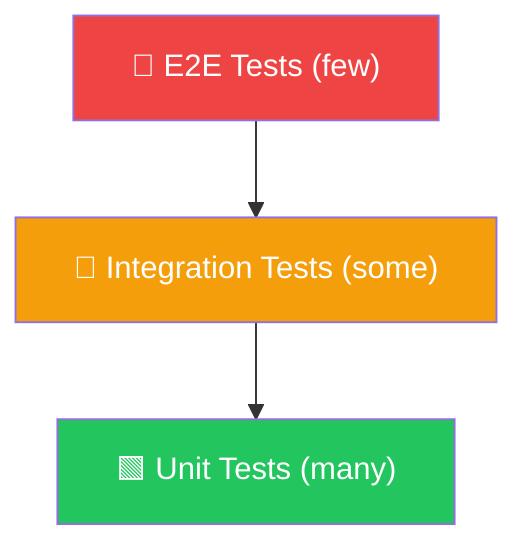
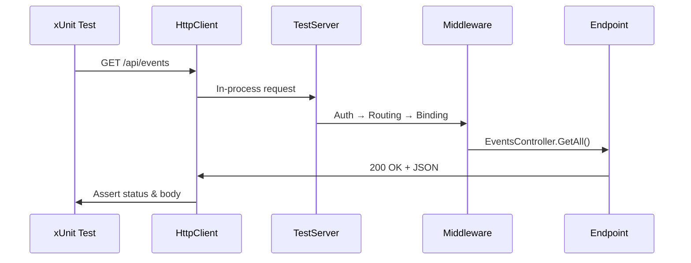
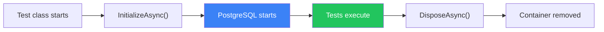

# Integration Testing — Confidence in Your API

## Testing Primer

Testing is about **feedback** and **confidence**.

When you change an ASP.NET Core application, you want fast evidence that:

- the small pieces still behave correctly,
- the application still works when those pieces are wired together,
- and the user can still complete the important flows.

In this course, that usually means three testing layers:

- **Unit tests** check one small piece in isolation.
- **Integration tests** check how the important backend pieces work together.
- **E2E tests** check the whole system from the outside, usually through the browser.



The layers are **complementary**, not competing:

- unit tests give the fastest feedback,
- integration tests give strong confidence in your API behavior,
- and E2E tests prove that the full user flow still works.

## Unit Testing Primer

Unit tests focus on **one method, class, or rule at a time**.

They are best when you want to check logic without bringing in the full web stack. For example:

- domain rules,
- validators,
- mapping logic,
- helper methods,
- and small services with clear dependencies.

That usually means replacing the outside world with fakes, mocks, or test data:

- no real HTTP server,
- no real middleware pipeline,
- no real database,
- and usually no real browser.

This makes unit tests:

- **fast**,
- **focused**,
- and cheap to write in larger numbers.

But the trade-off is important: unit tests do **not** prove that ASP.NET routing, model binding, middleware, serialization, authorization, and EF Core all work together correctly.

## Why Integration Tests?

Unit tests verify individual methods in isolation — but your API is more than isolated methods. In an Aspire solution, a real request may cross the frontend, API, service discovery, middleware, validation, EF Core, and one or more backing resources. A unit test for one class alone **cannot** catch failures in that pipeline.

Integration tests exercise the important seams where your application actually runs:

- API-only integration tests exercise the **HTTP pipeline** of one service.
- Aspire integration tests exercise the **distributed application** through the AppHost.

| Concern | Unit Test | Integration Test | E2E Test |
|---------|-----------|------------------|----------|
| Controller / handler logic | ✅ | ✅ | ✅ |
| Routing & model binding | ❌ | ✅ | ✅ |
| Middleware (auth, CORS) | ❌ | ✅ | ✅ |
| Database queries (EF Core) | ❌ | ✅ | ✅ |
| Serialization / API contract | ❌ | ✅ | ✅ |
| Frontend + browser behavior | ❌ | ❌ | ✅ |

> 💡 Integration tests sit in the middle of the pyramid — fewer than unit tests, broader than unit tests, and much cheaper than full E2E coverage for most API scenarios.

---

## Aspire Testing — Closed-box Integration for Distributed Apps

For Aspire-based solutions, the main integration-testing tool should be **`Aspire.Hosting.Testing`**.

It provides `DistributedApplicationTestingBuilder`, which starts your **AppHost** in the background and lets the AppHost orchestrate the rest of the system: database, API, frontend, cache, message broker, and other resources.

This is **closed-box integration testing**:

- your test does **not** manually rewire the application internals,
- your test starts the distributed app the same way the AppHost would,
- and your test interacts with named resources from the outside.

```xml
<PackageReference Include="Aspire.Hosting.Testing" Version="9.*" />
```

### Core Aspire Testing Flow

```csharp
var appHost = await DistributedApplicationTestingBuilder
    .CreateAsync<Projects.TechConf_AppHost>();

await using var app = await appHost.BuildAsync();
await app.StartAsync();

var apiClient = app.CreateHttpClient("api");
var response = await apiClient.GetAsync("/api/events");

response.StatusCode.Should().Be(HttpStatusCode.OK);
```

That one flow already proves a lot:

- the **test project** can start the AppHost,
- the **AppHost** can start the API and infrastructure resources,
- the API can boot with the right configuration,
- and the API is reachable through Aspire’s named-resource client.

By default, Aspire testing disables the dashboard and randomizes proxied ports so multiple test runs can coexist without colliding.

### Why this matters in an Aspire solution

If your real application is defined by the AppHost, then the most realistic integration test is usually:

1. start the **AppHost**,
2. let it orchestrate the real resources,
3. call the resource you care about,
4. and assert on real behavior.

This is the right default when you want confidence that:

- API ↔ database wiring works,
- frontend ↔ API wiring works,
- service references and environment wiring are correct,
- and the distributed app boots as expected.

### Choosing the right testing tool

| Tool | Style | Best fit |
|------|-------|----------|
| `WebApplicationFactory<T>` | Open-box, single-project | Testing one API/service in-process and overriding internals directly |
| `DistributedApplicationTestingBuilder` | Closed-box, distributed-app | Testing the AppHost, real resources, and service-to-service wiring |
| Playwright + Aspire testing | Closed-box + browser | Verifying full user flows on top of the same distributed-app harness |

For browser-driven tests, you usually build on the same Aspire harness:

```csharp
var resourceNotificationService = app.Services
    .GetRequiredService<ResourceNotificationService>();

await resourceNotificationService.WaitForResourceAsync(
    "web", KnownResourceStates.Running);

var webUrl = app.GetEndpoint("web", "http").ToString();
```

---

## WebApplicationFactory — Open-box Integration Tests for a Single Service

`Microsoft.AspNetCore.Mvc.Testing` still matters a lot.

`WebApplicationFactory<TEntryPoint>` is excellent when you want to test **one ASP.NET Core service in isolation**. It gives you an in-memory test server, no real ports, and the ability to override services directly.

This is an **open-box** style:

- you host one project in-process,
- you can replace internal registrations,
- and you control more of the app from the inside.

```xml
<PackageReference Include="Microsoft.AspNetCore.Mvc.Testing" Version="9.*" />
<PackageReference Include="FluentAssertions" Version="7.*" />
```

### Basic Setup

```csharp
public class TechConfApiTests : IClassFixture<WebApplicationFactory<Program>>
{
    private readonly HttpClient _client;
    public TechConfApiTests(WebApplicationFactory<Program> factory)
        => _client = factory.CreateClient();

    [Fact]
    public async Task GetEvents_ReturnsOk()
    {
        var response = await _client.GetAsync("/api/events");
        response.StatusCode.Should().Be(HttpStatusCode.OK);
    }
}
```

`IClassFixture<T>` ensures the factory is **created once** and shared across all tests in the class.

### Making `Program` Visible

**Option A — `InternalsVisibleTo` (recommended)** in the API `.csproj`:

```xml
<ItemGroup>
  <InternalsVisibleTo Include="TechConf.Api.IntegrationTests" />
</ItemGroup>
```

**Option B — Partial class** at the bottom of `Program.cs`:

```csharp
public partial class Program { }
```

### Customizing the Factory

```csharp
public class CustomFactory : WebApplicationFactory<Program>
{
    protected override void ConfigureWebHost(IWebHostBuilder builder)
    {
        builder.ConfigureServices(services =>
        {
            services.RemoveAll<TechConfDbContext>();
            services.AddDbContext<TechConfDbContext>(options =>
                options.UseNpgsql(TestConnectionString));
        });
        builder.UseEnvironment("Testing");
    }
}
```

> ⚠️ Use `ConfigureTestServices` instead of `ConfigureServices` if you want overrides to run **after** the app's own configuration.

### How It Works



No TCP sockets — everything stays in-process. Fast and deterministic.

---

## Testcontainers — Real Infrastructure for API-only Tests

EF Core's `UseInMemoryDatabase` **does not behave like a real database**:
| Feature | InMemory | Real PostgreSQL |
|---------|----------|-----------------|
| Foreign keys | ❌ | ✅ |
| Transactions | ❌ | ✅ |
| Raw SQL / JSON columns | ❌ | ✅ |
| Unique constraints | ❌ | ✅ |

> ⚠️ Tests passing with InMemory can **fail in production**. Always test against the real thing.

If you are staying in the **API-only / `WebApplicationFactory`** world, [Testcontainers](https://dotnet.testcontainers.org/) is the usual way to get real infrastructure into your tests.

In an **Aspire testing** scenario, the AppHost already orchestrates the real resources for you. That is why Aspire testing is the first choice for distributed-app integration tests, while direct Testcontainers usage remains valuable for single-service integration tests and lower-level control.

```xml
<PackageReference Include="Testcontainers.PostgreSql" Version="4.*" />
```

### Complete Factory

```csharp
public class TechConfApiFactory : WebApplicationFactory<Program>, IAsyncLifetime
{
    private readonly PostgreSqlContainer _postgres = new PostgreSqlBuilder()
        .WithImage("postgres:16-alpine")
        .WithDatabase("techconf_test")
        .WithUsername("test").WithPassword("test")
        .Build();

    protected override void ConfigureWebHost(IWebHostBuilder builder)
    {
        builder.ConfigureServices(services =>
        {
            services.RemoveAll<DbContextOptions<TechConfDbContext>>();
            services.AddDbContext<TechConfDbContext>(options =>
                options.UseNpgsql(_postgres.GetConnectionString()));
        });
        builder.UseEnvironment("Testing");
    }

    public async Task InitializeAsync() => await _postgres.StartAsync();
    public async Task DisposeAsync() => await _postgres.DisposeAsync();
}
```

### Container Lifecycle



The container starts **once per test class**, not per test.

### Multiple Containers (PostgreSQL + Redis)

```csharp
private readonly PostgreSqlContainer _postgres = new PostgreSqlBuilder()
    .WithImage("postgres:16-alpine")
    .WithDatabase("techconf_test")
    .WithUsername("test").WithPassword("test")
    .Build();
private readonly RedisContainer _redis = new RedisBuilder()
    .WithImage("redis:7-alpine")
    .Build();

public async Task InitializeAsync()
{
    await Task.WhenAll(_postgres.StartAsync(), _redis.StartAsync());
}
public async Task DisposeAsync()
{
    await Task.WhenAll(
        _postgres.DisposeAsync().AsTask(),
        _redis.DisposeAsync().AsTask());
}
```

> 💡 `Task.WhenAll` starts containers **in parallel** — saves seconds on every run.

> ⚠️ **Docker Desktop must be running.** GitHub Actions runners have Docker pre-installed.

---

## Database Cleanup with Respawn

Tests create data. If test A inserts "TechConf 2026" and test B expects an empty database, test B fails. This is **test pollution**.

| Approach | Speed | Reliability | Complexity |
|----------|-------|-------------|------------|
| `EnsureDeleted` + `EnsureCreated` | 🐢 Slow | ✅ High | Low |
| Transaction rollback | ⚡ Fast | ⚠️ Medium | Medium |
| **Respawn** | ⚡ Fast | ✅ High | Low |
| Manual `DELETE FROM` | ⚡ Fast | ⚠️ Fragile | High |

[Respawn](https://github.com/jbogard/Respawn) resets the database with targeted `DELETE` statements in FK-safe order, without dropping the schema.

```xml
<PackageReference Include="Respawn" Version="4.*" />
```

### Factory with Respawn

```csharp
public class TechConfApiFactory : WebApplicationFactory<Program>, IAsyncLifetime
{
    private readonly PostgreSqlContainer _postgres = new PostgreSqlBuilder()
        .WithImage("postgres:16-alpine")
        .WithDatabase("techconf_test")
        .WithUsername("test").WithPassword("test")
        .Build();

    protected override void ConfigureWebHost(IWebHostBuilder builder)
    {
        builder.ConfigureServices(services =>
        {
            services.RemoveAll<DbContextOptions<TechConfDbContext>>();
            services.AddDbContext<TechConfDbContext>(options =>
                options.UseNpgsql(_postgres.GetConnectionString()));
        });
        builder.UseEnvironment("Testing");
    }

    private Respawner _respawner = default!;
    private string _connectionString = default!;

    public async Task InitializeAsync()
    {
        await _postgres.StartAsync();
        _connectionString = _postgres.GetConnectionString();
        using var scope = Services.CreateScope();
        var db = scope.ServiceProvider.GetRequiredService<TechConfDbContext>();
        await db.Database.MigrateAsync();
        _respawner = await Respawner.CreateAsync(_connectionString, new RespawnerOptions
        {
            DbAdapter = DbAdapter.Postgres,
            SchemasToInclude = ["public"],
            TablesToIgnore = ["__EFMigrationsHistory"]
        });
    }

    public async Task ResetDatabaseAsync() => await _respawner.ResetAsync(_connectionString);
    public async Task DisposeAsync() => await _postgres.DisposeAsync();
}
```

### Using in Tests

```csharp
public class EventTests : IClassFixture<TechConfApiFactory>, IAsyncLifetime
{
    private readonly TechConfApiFactory _factory;
    private readonly HttpClient _client;
    public EventTests(TechConfApiFactory factory)
    {
        _factory = factory;
        _client = factory.CreateClient();
    }
    public async Task InitializeAsync() => await _factory.ResetDatabaseAsync();
    public Task DisposeAsync() => Task.CompletedTask;
}
```

> 💡 Every test now starts with a **clean database** — no pollution, no ordering issues.

---

## Writing API-level Integration Tests

The following examples assume the **API-only** integration-testing path with `WebApplicationFactory` (and optionally Testcontainers/Respawn).

For **Aspire closed-box** tests, the same assertions still apply, but your `HttpClient` typically comes from:

```csharp
var httpClient = app.CreateHttpClient("api");
```

### GET Tests

```csharp
[Fact]
public async Task GetEvents_WhenEmpty_ReturnsEmptyList()
{
    var response = await _client.GetAsync("/api/events");
    response.StatusCode.Should().Be(HttpStatusCode.OK);
    var events = await response.Content.ReadFromJsonAsync<List<EventResponse>>();
    events.Should().BeEmpty();
}

[Fact]
public async Task GetEventById_WhenNotFound_Returns404()
{
    var response = await _client.GetAsync($"/api/events/{Guid.NewGuid()}");
    response.StatusCode.Should().Be(HttpStatusCode.NotFound);
    var problem = await response.Content.ReadFromJsonAsync<ProblemDetails>();
    problem!.Status.Should().Be(404);
}

[Fact]
public async Task GetEventById_WhenExists_ReturnsEvent()
{
    var createResponse = await _client.PostAsJsonAsync(
        "/api/events", CreateValidRequest("TechConf 2026"));
    var created = await createResponse.Content.ReadFromJsonAsync<EventResponse>();

    var response = await _client.GetAsync($"/api/events/{created!.Id}");
    response.StatusCode.Should().Be(HttpStatusCode.OK);
    var fetched = await response.Content.ReadFromJsonAsync<EventResponse>();
    fetched!.Title.Should().Be("TechConf 2026");
}
```

### POST Tests

```csharp
[Fact]
public async Task CreateEvent_WithValidData_Returns201()
{
    var request = new CreateEventRequest(
        "TechConf 2026", "Annual tech conference",
        DateTime.UtcNow.AddMonths(3),
        DateTime.UtcNow.AddMonths(3).AddDays(2),
        "Munich", 1000);

    var response = await _client.PostAsJsonAsync("/api/events", request);
    response.StatusCode.Should().Be(HttpStatusCode.Created);
    response.Headers.Location.Should().NotBeNull();

    var created = await response.Content.ReadFromJsonAsync<EventResponse>();
    created!.Title.Should().Be("TechConf 2026");
}

[Fact]
public async Task CreateEvent_WithInvalidData_Returns400()
{
    var request = new CreateEventRequest("", null, default, default, "", -1);
    var response = await _client.PostAsJsonAsync("/api/events", request);
    response.StatusCode.Should().Be(HttpStatusCode.BadRequest);
}
```

### PUT & DELETE Tests

```csharp
[Fact]
public async Task UpdateEvent_WithValidData_Returns200()
{
    var createResponse = await _client.PostAsJsonAsync(
        "/api/events", CreateValidRequest("Old Title"));
    var created = await createResponse.Content.ReadFromJsonAsync<EventResponse>();
    var updateRequest = new UpdateEventRequest("New Title", "Updated description");

    var response = await _client.PutAsJsonAsync($"/api/events/{created!.Id}", updateRequest);
    response.StatusCode.Should().Be(HttpStatusCode.OK);
    var updated = await response.Content.ReadFromJsonAsync<EventResponse>();
    updated!.Title.Should().Be("New Title");
}

[Fact]
public async Task DeleteEvent_WhenExists_Returns204()
{
    var createResponse = await _client.PostAsJsonAsync(
        "/api/events", CreateValidRequest("To Delete"));
    var created = await createResponse.Content.ReadFromJsonAsync<EventResponse>();

    var response = await _client.DeleteAsync($"/api/events/{created!.Id}");
    response.StatusCode.Should().Be(HttpStatusCode.NoContent);

    var getResponse = await _client.GetAsync($"/api/events/{created.Id}");
    getResponse.StatusCode.Should().Be(HttpStatusCode.NotFound);
}
```

### Helper Method

```csharp
private static CreateEventRequest CreateValidRequest(string title = "Test Event") =>
    new(title, "A test event", DateTime.UtcNow.AddMonths(1),
        DateTime.UtcNow.AddMonths(1).AddDays(2), "Vienna", 500);
```

---

## Testing Authenticated Endpoints

Replace the real identity provider with a **fake authentication handler**.

### Test Authentication Handler

```csharp
public class TestAuthHandler : AuthenticationHandler<AuthenticationSchemeOptions>
{
    public TestAuthHandler(
        IOptionsMonitor<AuthenticationSchemeOptions> options,
        ILoggerFactory logger, UrlEncoder encoder)
        : base(options, logger, encoder) { }

    protected override Task<AuthenticateResult> HandleAuthenticateAsync()
    {
        if (!Request.Headers.ContainsKey("Authorization"))
            return Task.FromResult(AuthenticateResult.NoResult());

        var claims = new[]
        {
            new Claim(ClaimTypes.NameIdentifier, "test-user-id"),
            new Claim(ClaimTypes.Email, "admin@techconf.example"),
            new Claim(ClaimTypes.Role, "admin"),
            new Claim(ClaimTypes.Role, "organizer")
        };
        var identity = new ClaimsIdentity(claims, "Test");
        var principal = new ClaimsPrincipal(identity);
        var ticket = new AuthenticationTicket(principal, "Test");
        return Task.FromResult(AuthenticateResult.Success(ticket));
    }
}
```

### Factory Configuration

```csharp
builder.ConfigureTestServices(services =>
{
    services.AddAuthentication("Test")
        .AddScheme<AuthenticationSchemeOptions, TestAuthHandler>("Test", null);
});
```

### Creating Clients with Different Roles

```csharp
private HttpClient CreateAuthenticatedClient()
{
    var client = _factory.CreateClient();
    client.DefaultRequestHeaders.Authorization =
        new System.Net.Http.Headers.AuthenticationHeaderValue("Test");
    return client;
}
private HttpClient CreateAnonymousClient() => _factory.CreateClient();
```

### Testing Authorization

```csharp
[Fact]
public async Task CreateEvent_WithoutAuth_Returns401()
{
    var client = CreateAnonymousClient();
    var response = await client.PostAsJsonAsync("/api/events", CreateValidRequest());
    response.StatusCode.Should().Be(HttpStatusCode.Unauthorized);
}

[Fact]
public async Task CreateEvent_WithAuth_Returns201()
{
    var client = CreateAuthenticatedClient();
    var response = await client.PostAsJsonAsync("/api/events", CreateValidRequest());
    response.StatusCode.Should().Be(HttpStatusCode.Created);
}
```

> 💡 For granular role testing, extend `TestAuthHandler` to read the desired role from a custom header.

---

## Test Data Builders

Use the builder pattern to reduce duplication in test data construction.

```csharp
public class EventBuilder
{
    private string _title = "Test Event";
    private string _description = "A test event";
    private DateTime _startDate = DateTime.UtcNow.AddMonths(1);
    private DateTime _endDate = DateTime.UtcNow.AddMonths(1).AddDays(2);
    private string _location = "Vienna";
    private int _maxAttendees = 500;

    public EventBuilder WithTitle(string title) { _title = title; return this; }
    public EventBuilder WithStartDate(DateTime date) { _startDate = date; return this; }
    public EventBuilder WithLocation(string location) { _location = location; return this; }
    public EventBuilder WithMaxAttendees(int max) { _maxAttendees = max; return this; }

    public CreateEventRequest BuildRequest()
        => new(_title, _description, _startDate, _endDate, _location, _maxAttendees);
    public Event BuildEntity() => new()
    {
        Id = Guid.NewGuid(), Title = _title, Description = _description,
        StartDate = _startDate, EndDate = _endDate,
        Location = _location, MaxAttendees = _maxAttendees
    };
}
```

Usage:

```csharp
var request = new EventBuilder()
    .WithTitle("TechConf Munich")
    .WithLocation("Munich")
    .WithMaxAttendees(2000)
    .BuildRequest();
```

For randomized data, consider [Bogus](https://github.com/bchavez/Bogus):

```csharp
var faker = new Faker<CreateEventRequest>()
    .CustomInstantiator(f => new CreateEventRequest(
        f.Company.CatchPhrase(), f.Lorem.Paragraph(),
        f.Date.Future(1), f.Date.Future(2),
        f.Address.City(), f.Random.Int(100, 5000)));
```

---

## Testing SignalR

Test hub connections against the in-memory `TestServer`:

```csharp
[Fact]
public async Task TechConfHub_ReceivesEventUpdates()
{
    var hubConnection = new HubConnectionBuilder()
        .WithUrl($"{_client.BaseAddress}hubs/techconf",
            options => options.HttpMessageHandlerFactory =
                _ => _factory.Server.CreateHandler())
        .Build();

    string? receivedTitle = null;
    hubConnection.On<string>("EventCreated", title => receivedTitle = title);
    await hubConnection.StartAsync();

    await _client.PostAsJsonAsync("/api/events", CreateValidRequest("SignalR Event"));

    await Task.Delay(500);
    receivedTitle.Should().Be("SignalR Event");
    await hubConnection.DisposeAsync();
}
```

> 💡 `HttpMessageHandlerFactory` routes SignalR through the in-memory `TestServer` — no real network socket needed.

---

## Parallel Test Execution

xUnit runs test classes in **parallel** by default — dangerous when classes share a database.

### Option 1: `[Collection]` to Serialize DB Tests

```csharp
[Collection("Database")]
public class EventTests : IClassFixture<TechConfApiFactory>, IAsyncLifetime { ... }

[Collection("Database")]
public class SpeakerTests : IClassFixture<TechConfApiFactory>, IAsyncLifetime { ... }
```

### Option 2: Database-per-Test-Class (Recommended)

Each `IClassFixture<TechConfApiFactory>` creates a **separate factory** → separate container → full isolation. Tests run in parallel with zero shared state.

### `xunit.runner.json`

```json
{
  "$schema": "https://xunit.net/schema/current/xunit.runner.schema.json",
  "parallelizeAssembly": false,
  "parallelizeTestCollections": true,
  "maxParallelThreads": 4
}
```

---

## Common Pitfalls

- ⚠️ **Using InMemoryDatabase** — doesn't enforce FKs, constraints, or transactions. Tests pass, production breaks.
- ⚠️ **Not cleaning up test data** — results depend on execution order. Use Respawn + `IAsyncLifetime`.
- ⚠️ **Tests depending on order** — each test should set up its own data from scratch.
- ⚠️ **Container per test** — starts a new container for each test (2–5s each). Use `IClassFixture` to share per class.
- ⚠️ **Only testing happy paths** — test `404`, `400`, `401`, `409` too. Your frontend needs to handle them.
- 💡 **One factory per test class + Respawn** — dedicated container per class, Respawn resets between tests.
- 💡 **`IAsyncLifetime`** — prefer over constructors/`Dispose` for async setup/teardown.
- 💡 **Clear test names** — `MethodName_Scenario_ExpectedResult`:
  ```
  GetEvents_WhenEmpty_ReturnsEmptyList       ✅
  CreateEvent_WithInvalidData_Returns400     ✅
  TestGetEvents                              ❌
  ```

---

## Mini-Exercise

### 🎯 Build both API-level and distributed-app integration tests for TechConf

1. **API-only track** — use `WebApplicationFactory` to test the API in-process
2. **Distributed-app track** — use `Aspire.Hosting.Testing` to start the AppHost and call `app.CreateHttpClient("api")`
3. **Write CRUD tests** — `GET`, `POST`, `PUT`, `DELETE` against the API
4. **Add auth tests** — fake auth for API-only tests, or test the distributed setup where relevant
5. **Bonus** — add Playwright E2E on top of the same Aspire test harness

```
TechConf.Api.Tests/
TechConf.AppHost.Tests/
TechConf.E2E.Tests/
```

---

## Further Reading

| Resource | Link |
|----------|------|
| Aspire testing overview | [aspire.dev/testing/overview](https://aspire.dev/testing/overview/) |
| Microsoft — Integration Tests | [learn.microsoft.com/aspnet/core/test/integration-tests](https://learn.microsoft.com/en-us/aspnet/core/test/integration-tests) |
| Testcontainers for .NET | [dotnet.testcontainers.org](https://dotnet.testcontainers.org/) |
| Respawn | [github.com/jbogard/Respawn](https://github.com/jbogard/Respawn) |
| FluentAssertions | [fluentassertions.com](https://fluentassertions.com/) |
| Bogus | [github.com/bchavez/Bogus](https://github.com/bchavez/Bogus) |

---

> **Key takeaway:** For Aspire solutions, use **`Aspire.Hosting.Testing`** as the default way to integration-test the full distributed app, and keep **`WebApplicationFactory`** for focused single-service tests where open-box control is useful.
