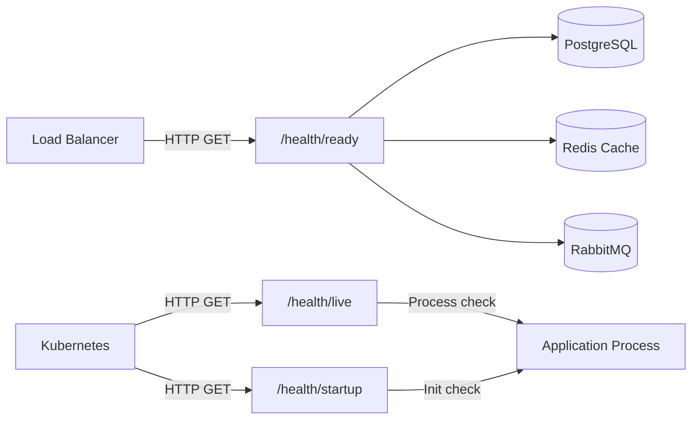

# Health Checks — Production Readiness

## Why Health Checks Matter

Health checks are **standardized HTTP endpoints** that report whether your application is functioning correctly. They answer one question: _"Can this service do its job right now?"_

Health checks are consumed by:
- **Load balancers** — route traffic only to healthy instances
- **Container orchestrators** (Kubernetes) — restart or replace failing containers
- **Monitoring systems** — trigger alerts before users notice problems
- **Deployment pipelines** — verify a new version works before cutting over traffic

> 💡 Health checks are **proactive** — they detect problems before users report them. Traditional monitoring is **reactive** — it tells you something went wrong after the fact.

---

## Liveness vs Readiness vs Startup Probes

Modern orchestration platforms distinguish between three probe types, each answering a different question.



| Probe | Question | Failure Action | Endpoint |
|-------|----------|---------------|----------|
| **Liveness** | Is the process alive? | Restart container | `/health/live` |
| **Readiness** | Can it serve traffic? | Remove from LB | `/health/ready` |
| **Startup** | Has it finished init? | Wait longer | `/health/startup` |

- **Liveness**: Detects stuck processes (deadlocks, infinite loops). Must be **minimal** — never test external dependencies. Failure → orchestrator restarts the container.
- **Readiness**: Checks all required dependencies (database, cache, broker). Failure → load balancer stops traffic but does **not** restart the container.
- **Startup**: Gives slow-starting apps extra time. Until it succeeds, liveness/readiness probes are paused.

### ASP.NET Core Probe Mapping

```csharp
app.MapHealthChecks("/health/live", new HealthCheckOptions
{
    Predicate = _ => false // No dependency checks
});

app.MapHealthChecks("/health/ready", new HealthCheckOptions
{
    Predicate = check => check.Tags.Contains("ready")
});
```

> ⚠️ Never test database connectivity in the liveness probe. If the database goes down, you do **not** want every container to restart — you want them to stop receiving traffic (readiness) and wait for recovery.

---

## Built-in Health Checks

The community-maintained [AspNetCore.Diagnostics.HealthChecks](https://github.com/Xabaril/AspNetCore.Diagnostics.HealthChecks) project offers pre-built checks for dozens of services.

```csharp
builder.Services.AddHealthChecks()
    .AddNpgSql(connectionString, name: "postgresql", tags: ["ready"])
    .AddRedis(redisConnectionString, name: "redis", tags: ["ready"])
    .AddRabbitMQ(rabbitConnectionString, name: "rabbitmq", tags: ["ready"]);
```

### Popular Health Check Packages

| Package | Checks |
|---------|--------|
| `AspNetCore.HealthChecks.NpgSql` | PostgreSQL connectivity |
| `AspNetCore.HealthChecks.Redis` | Redis connectivity |
| `AspNetCore.HealthChecks.RabbitMQ` | RabbitMQ broker |
| `AspNetCore.HealthChecks.UI` | Health check dashboard UI |

> 💡 Always set a **timeout** to prevent slow dependencies from blocking the health endpoint:
> ```csharp
> .AddNpgSql(connectionString, name: "postgresql",
>     tags: ["ready"], timeout: TimeSpan.FromSeconds(3))
> ```

---

## Custom Health Checks

Implement `IHealthCheck` for domain-specific checks. For TechConf, we verify database connectivity and data integrity.

```csharp
public class EventServiceHealthCheck : IHealthCheck
{
    private readonly TechConfDbContext _db;

    public EventServiceHealthCheck(TechConfDbContext db) => _db = db;

    public async Task<HealthCheckResult> CheckHealthAsync(
        HealthCheckContext context, CancellationToken ct)
    {
        try
        {
            var canConnect = await _db.Database.CanConnectAsync(ct);
            var eventCount = await _db.Events.CountAsync(ct);

            var data = new Dictionary<string, object>
            {
                ["eventCount"] = eventCount,
                ["databaseProvider"] = "PostgreSQL"
            };

            return canConnect
                ? HealthCheckResult.Healthy("Event service is operational", data)
                : HealthCheckResult.Unhealthy("Cannot connect to database");
        }
        catch (Exception ex)
        {
            return HealthCheckResult.Unhealthy("Event service check failed", ex);
        }
    }
}
```

### Registration

```csharp
builder.Services.AddHealthChecks()
    .AddCheck<EventServiceHealthCheck>("event-service", tags: ["ready"]);
```

### HealthCheckResult Options

| Result | HTTP Status | Meaning |
|--------|-------------|---------|
| `HealthCheckResult.Healthy(...)` | 200 OK | Everything is working |
| `HealthCheckResult.Degraded(...)` | 200 OK | Working with reduced capability |
| `HealthCheckResult.Unhealthy(...)` | 503 Service Unavailable | Cannot serve requests |

---

## Health Check Response Customization

By default, the health endpoint returns plain text (`Healthy`/`Unhealthy`). For production, use structured JSON:

```csharp
app.MapHealthChecks("/health", new HealthCheckOptions
{
    ResponseWriter = async (context, report) =>
    {
        context.Response.ContentType = "application/json";
        var result = new
        {
            status = report.Status.ToString(),
            duration = report.TotalDuration,
            checks = report.Entries.Select(e => new
            {
                name = e.Key,
                status = e.Value.Status.ToString(),
                duration = e.Value.Duration,
                description = e.Value.Description,
                data = e.Value.Data,
                exception = e.Value.Exception?.Message
            })
        };
        await context.Response.WriteAsJsonAsync(result);
    }
});
```

### Example JSON Response

```json
{
  "status": "Healthy",
  "duration": "00:00:00.1234567",
  "checks": [
    { "name": "postgresql", "status": "Healthy", "duration": "00:00:00.045", "data": {} },
    { "name": "event-service", "status": "Healthy", "description": "Event service is operational",
      "data": { "eventCount": 42, "databaseProvider": "PostgreSQL" } },
    { "name": "redis-cache", "status": "Degraded", "description": "Redis connection timed out" }
  ]
}
```

---

## Aspire Integration

.NET Aspire provides built-in health check support through `ServiceDefaults`. Health checks are wired up automatically.

```csharp
// ServiceDefaults/Extensions.cs — auto-generated by Aspire
public static IHostApplicationBuilder AddServiceDefaults(this IHostApplicationBuilder builder)
{
    builder.Services.AddHealthChecks()
        .AddCheck("self", () => HealthCheckResult.Healthy(), ["live"]);
    return builder;
}
```

### WaitFor and Health Checks

Aspire's `WaitFor` uses health checks to orchestrate startup order:

```csharp
var postgres = builder.AddPostgres("techconf-db");
var redis = builder.AddRedis("techconf-cache");

var api = builder.AddProject<Projects.TechConf_Api>("api")
    .WithReference(postgres)
    .WithReference(redis)
    .WaitFor(postgres)   // Waits for PostgreSQL health check
    .WaitFor(redis);     // Waits for Redis health check
```

The Aspire Dashboard displays real-time health status for all resources during development.

> 💡 Aspire gives you production-like health monitoring in development for free.

---

## Degraded State Handling

Not every dependency failure should make your service unhealthy. Some dependencies are **optional**.

```csharp
builder.Services.AddHealthChecks()
    // PostgreSQL is critical — without it, nothing works
    .AddNpgSql(connectionString,
        name: "postgresql",
        failureStatus: HealthStatus.Unhealthy,
        tags: ["ready"])
    // Redis is optional — service works without it, just slower
    .AddRedis(redisConnectionString,
        name: "redis-cache",
        failureStatus: HealthStatus.Degraded,  // Not Unhealthy!
        tags: ["ready"]);
```

| Dependency | Failure Status | Rationale |
|-----------|---------------|-----------|
| PostgreSQL | `Unhealthy` | Core data store — nothing works without it |
| Redis | `Degraded` | Cache only — API falls back to DB queries |
| Email Service | `Degraded` | Notifications queue up, core features work |
| RabbitMQ | `Unhealthy` | Event processing stops — registrations lost |

> ⚠️ Over-classifying dependencies as `Unhealthy` leads to unnecessary downtime.

---

## Health Check UI

The `AspNetCore.HealthChecks.UI` package provides a visual dashboard for monitoring health endpoints.

```csharp
builder.Services
    .AddHealthChecksUI(setup =>
    {
        setup.SetEvaluationTimeInSeconds(30);
        setup.AddHealthCheckEndpoint("TechConf API", "/health");
    })
    .AddInMemoryStorage();

app.MapHealthChecksUI(options => options.UIPath = "/health-ui");
```

Navigate to `/health-ui` for a color-coded dashboard (green/yellow/red) with history tracking, configurable polling intervals, and webhook notifications for status changes (Slack, Teams, email).

> 💡 In production, restrict access to the health UI with authentication or limit it to internal networks.

---

## Kubernetes Integration

Map ASP.NET Core health endpoints directly to Kubernetes probe configuration:

```yaml
containers:
  - name: techconf-api
    image: techconf/api:latest
    ports:
      - containerPort: 8080
    startupProbe:
      httpGet:
        path: /health/startup
        port: 8080
      failureThreshold: 30
      periodSeconds: 2
    livenessProbe:
      httpGet:
        path: /health/live
        port: 8080
      initialDelaySeconds: 5
      periodSeconds: 10
    readinessProbe:
      httpGet:
        path: /health/ready
        port: 8080
      initialDelaySeconds: 10
      periodSeconds: 5
```

> ⚠️ Set `failureThreshold` on the startup probe high enough for your slowest cold start.

---

## Common Pitfalls

⚠️ **Health checks that are too slow** — Always set timeouts. A check that takes 10 seconds blocks the response:
```csharp
.AddNpgSql(connectionString, name: "postgresql",
    tags: ["ready"], timeout: TimeSpan.FromSeconds(3))
```

⚠️ **Liveness checks testing dependencies** — If liveness checks the database and it goes down, Kubernetes restarts all containers — which won't fix the database. Liveness should **only** verify the process is responsive.

⚠️ **Not tagging checks** — Without tags, all checks run on every endpoint. A slow readiness check will also slow down your liveness probe.

⚠️ **Missing health checks for critical dependencies** — If your service depends on RabbitMQ but has no check for it, readiness reports `Healthy` even when message processing is broken.

> 💡 **Keep liveness simple, readiness thorough, and always set timeouts.**

---

## 🧪 Mini-Exercise

Build health checks for the TechConf API:

1. **Add NuGet packages**:
   ```bash
   dotnet add package AspNetCore.HealthChecks.NpgSql
   dotnet add package AspNetCore.HealthChecks.Redis
   ```

2. **Register built-in health checks** for PostgreSQL and Redis in `Program.cs`

3. **Create a custom `EventServiceHealthCheck`** that verifies database connectivity and returns the event count in the response data

4. **Map three endpoints**: `/health/live` (no checks), `/health/ready` (all tagged checks), and `/health` (JSON response with custom writer)

5. **Test your endpoints**:
   ```bash
   curl -s http://localhost:5000/health/live   # Should return 200
   curl -s http://localhost:5000/health/ready   # Should return 200 with dependency status
   curl -s http://localhost:5000/health | jq    # Should return detailed JSON
   ```

---

## 📚 Further Reading

- [Microsoft Docs — Health checks in ASP.NET Core](https://learn.microsoft.com/en-us/aspnet/core/host-and-deploy/health-checks)
- [AspNetCore.Diagnostics.HealthChecks (GitHub)](https://github.com/Xabaril/AspNetCore.Diagnostics.HealthChecks)
- [Kubernetes — Configure Probes](https://kubernetes.io/docs/tasks/configure-pod-container/configure-liveness-readiness-startup-probes/)
- [.NET Aspire Health Checks](https://learn.microsoft.com/en-us/dotnet/aspire/fundamentals/health-checks)
