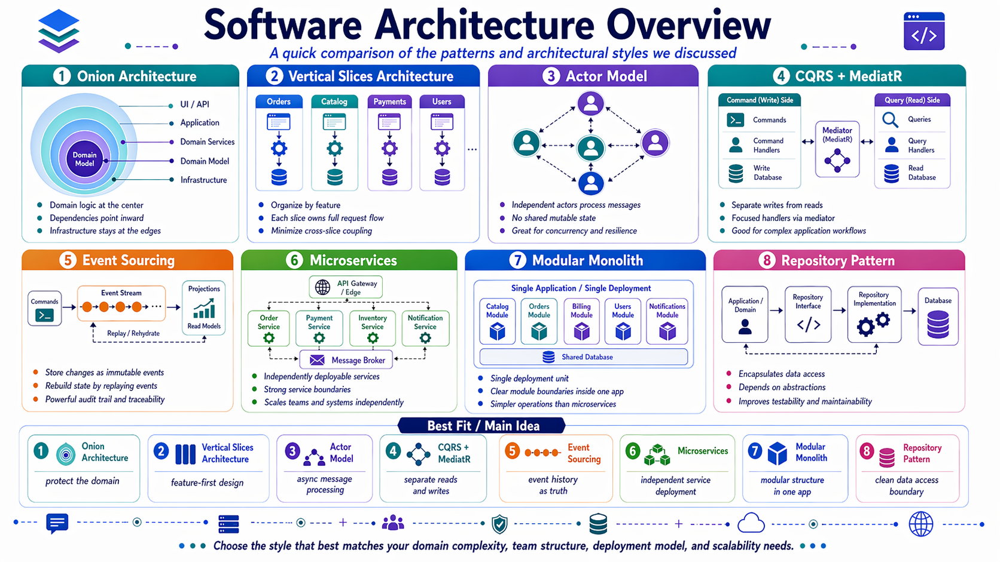
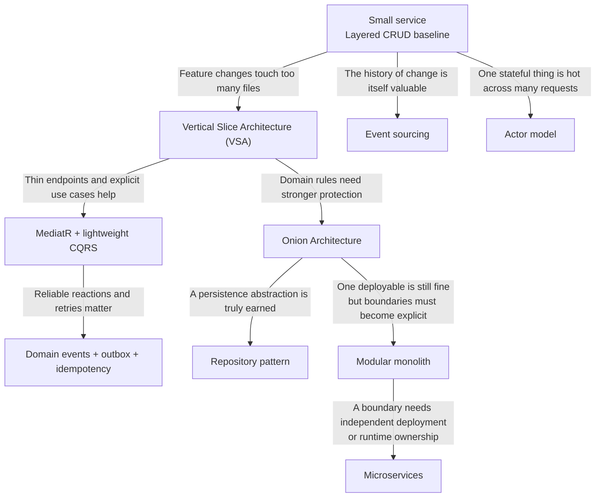

# Architecture Patterns in Web Services

This folder is the canonical home for the course's architecture material. Treat it as a decision guide, not a list of patterns you are supposed to apply all at once.

## Why you should care

When you build your first few endpoints, architecture barely matters. Once the API starts growing, it changes what feels hard:

- writing the first version is no longer the main problem,
- changing the second or third version becomes expensive,
- and understanding where a rule belongs becomes slower than writing the rule itself.

That is the moment when architecture starts paying rent.

For students, this matters because the course deliberately moves through that journey:

- Day 1 and Day 2 start from straightforward APIs.
- Day 3 introduces the point where "just add another endpoint" becomes messy.
- Later labs add authentication, caching, real-time features, messaging, and other forces that expose weak structure quickly.

The goal is **not** to make every project look "enterprise". The goal is to make the next change cheaper, safer, and easier to explain.

## How the topics fit together

Read this diagram from top to bottom. The normal course path starts simple, adds structure when change cost rises, and only reaches for the heavier patterns when the problem actually changes.

The important visual takeaway is that **event sourcing** and **actors** are side branches for special cases, while **VSA**, **MediatR/CQRS**, **Onion**, and often a **modular monolith** are the more typical path for a growing TechConf-style system. **Microservices** are a later move when the boundary itself needs operational independence, not just cleaner code.

## What pain architecture is trying to remove

| Symptom in the codebase | Pattern to consider | Why it might help |
| --- | --- | --- |
| One feature change touches controller, service, repository, mapper, and validator files | [Vertical Slice Architecture](01-architecture-styles.md) | Organizes code around one use case instead of technical layers |
| Business rules are mixed with HTTP details and EF Core concerns | [Onion Architecture](01-architecture-styles.md) | Protects the domain from infrastructure and transport details |
| One deployable is still desirable, but teams and features need stronger internal boundaries | [Modular monolith](07-modular-monolith.md) | Keeps one process and deployment while making modules explicit |
| A business boundary needs independent deployment, runtime ownership, or scaling | [Microservices](08-microservices.md) | Trades simplicity for autonomy at the service boundary |
| Reads and writes want different shapes or different rules | [MediatR + CQRS](02-mediatr-cqrs-and-pipeline-behaviors.md) | Makes commands and queries explicit |
| You are unsure whether to wrap `DbContext` | [Repository pattern](03-repository-pattern.md) | Helps decide when an abstraction is useful and when it is waste |
| The full history of changes is part of the business value | [Event sourcing](04-event-sourcing.md) | Stores the timeline of facts, not just the latest row state |
| A stateful thing is under heavy concurrency across many requests | [Actor model](05-actor-model.md) | Gives one owner to that state and processes messages sequentially |
| A database change and outgoing message must stay aligned | [Companion patterns](06-companion-patterns-and-anti-patterns.md) | Domain events, outbox, and idempotency handle production reliability |

If a pattern does not remove a real pain, it is overhead.

## Reading guide by question

If you are asking one of these questions, start here:

| If you are wondering... | Start with |
| --- | --- |
| "Do I really need more than a simple layered API?" | [Architecture styles](01-architecture-styles.md) |
| "Should this stay one deployment, but with real module boundaries?" | [Modular monolith](07-modular-monolith.md) |
| "When are microservices actually worth the cost?" | [Microservices](08-microservices.md) |
| "How do I keep endpoints thin without creating a giant service layer?" | [MediatR, CQRS, and pipeline behaviors](02-mediatr-cqrs-and-pipeline-behaviors.md) |
| "Should I create `IRepository<T>` for every entity?" | [Repository pattern](03-repository-pattern.md) |
| "When is event sourcing actually justified?" | [Event sourcing](04-event-sourcing.md) |
| "When do actors solve something that normal request/response code does not?" | [Actor model](05-actor-model.md) |
| "What smaller production patterns usually come with these bigger decisions?" | [Companion patterns and anti-patterns](06-companion-patterns-and-anti-patterns.md) |

## Recommended learning path

1. Start with **layered vs VSA vs Onion** so you know the main structural choices inside one service.
2. Move to **MediatR + CQRS** once you want request/handler boundaries and clearer use-case flow.
3. Consider a **modular monolith** when one application is growing, but split deployment would still be premature.
4. Add **repositories** only where the abstraction has clear domain meaning.
5. Treat **microservices**, **event sourcing**, and **actors** as advanced tools for specific problems, not as a maturity badge.
6. Use the **companion patterns** once the service has to behave reliably under retries, messaging, and background processing.

All lab links in this folder are relative to the current markdown file. The labs themselves live under `/labs/` at the repository root.

## Course-first guidance

For most TechConf-style services in this course, the practical default is:

1. start simple with a layered CRUD baseline,
2. refactor to **Vertical Slice Architecture** when feature change cost starts hurting,
3. use **MediatR** and **logical CQRS** to make commands and queries explicit,
4. add validators early and pipeline behaviors later when cross-cutting repetition becomes real,
5. introduce **Onion Architecture** when the domain is rich enough to deserve a protected core,
6. combine **VSA** and **Onion** when needed: VSA organizes feature code, Onion protects dependency boundaries,
7. move toward a **modular monolith** when you need stronger internal boundaries but still want one deployment and one operational surface,
8. split to **microservices** only when a boundary truly needs independent deployment, runtime ownership, or scaling,
9. add **repositories** only for earned abstractions,
10. keep **event sourcing** and **actors** rare and intentional,
11. and use **domain events + outbox + idempotency** when a state change must trigger reliable reactions.

## A short decision example

Imagine the TechConf API after a few iterations:

- `CreateEvent`, `CancelEvent`, `SubmitSession`, and `ApproveSession` all have different validation and rules,
- endpoint files are getting longer,
- and every new feature touches several folders.

That is usually a signal to move toward **Vertical Slice Architecture** with **MediatR**.

If, later, the session approval rules become rich enough that you want domain objects to guard invariants without knowing about HTTP or EF Core, that is a good signal to add **Onion** boundaries around the core.

If the application keeps growing and the codebase now has clear subdomains like catalog, submissions, registrations, and notifications, a **modular monolith** is often the next sensible step. You still keep one deployment, but the modules become explicit.

You still would **not** jump to microservices, event sourcing, or actors unless the actual problem changes.

## Hands-on follow-up

- [Refactor WorkshopPlanner to Vertical Slice Architecture](../../labs/lab-architecture-vertical-slices/)
- [Build WorkshopPlanner with MediatR, CQRS, and pipeline behaviors](../../labs/lab-mediatr-cqrs/)
- [Refactor WorkshopPlanner to Onion Architecture](../../labs/lab-architecture-onion/)
- [Build a seat-reservation API with Akka.NET and Akka.Hosting](../../labs/lab-akkanet/)

## What not to do

- Do not adopt every pattern because it sounds advanced.
- Do not create abstractions before you can name the pain they solve.
- Do not confuse "more layers" with "better architecture".
- Do not assume a small CRUD API is wrong just because it is simple.

Good architecture is not the most complex option. It is the **smallest structure that keeps change affordable**.
