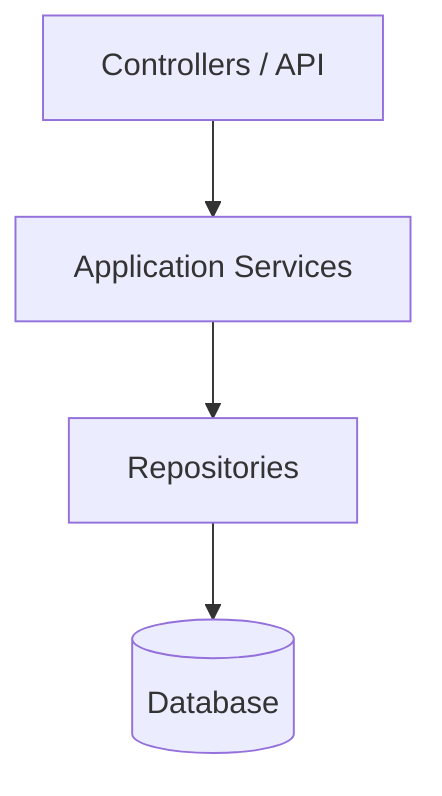
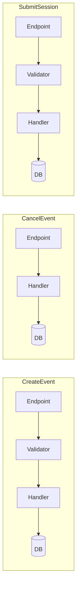
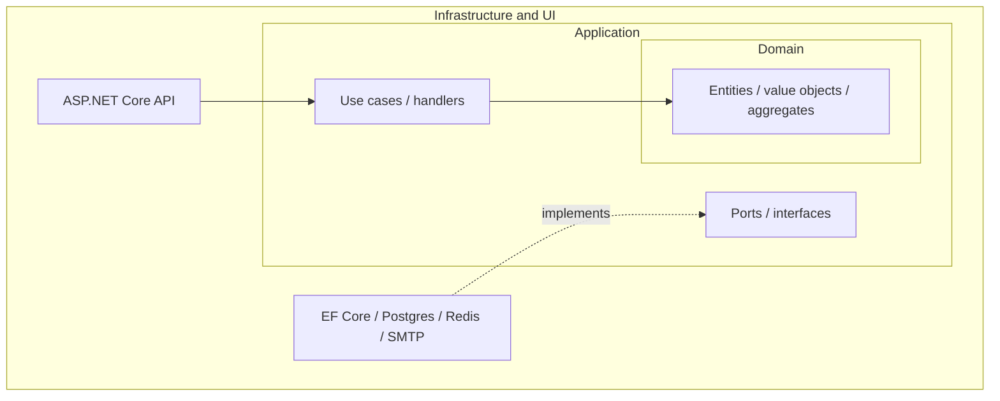

# Architecture Styles: Layered, Vertical Slice, and Onion

## Why architecture matters

Architecture matters when the main problem stops being "How do I make this endpoint work?" and becomes "Why does every small change feel bigger than it should?"

In practice, good structure helps with four things:

| Goal | What it means in practice |
| --- | --- |
| **Maintainability** | Change one feature without breaking or touching unrelated areas |
| **Testability** | Exercise important rules without booting the whole stack |
| **Team scalability** | Different developers can work without stepping on the same files constantly |
| **Onboarding** | A new team member can find the rule they need quickly |

In this course we use the **TechConf** and **WorkshopPlanner** domains. They are intentionally small enough to understand, but large enough to show when structure starts helping.

## A student-friendly rule of thumb

- If the API is small and mostly CRUD, simple structure is fine.
- If feature work keeps cutting across multiple folders, look at **Vertical Slice Architecture**.
- If the business rules themselves are becoming important and you want to protect them from infrastructure concerns, add **Onion** boundaries.

The biggest mistake is trying to skip straight to the most advanced-looking option.

## 1. The baseline: layered architecture



Layered architecture is familiar, easy to explain, and completely reasonable for small services.

### Why students usually start here

- The folders are easy to understand.
- ASP.NET examples often look like this.
- It is a fast way to build a working CRUD service.
- It gives a good baseline before you feel the pain of something more complex.

### What it feels like in a small project

If you are building a first version of TechConf with a few endpoints like:

- create event,
- list events,
- update event,
- delete event,

then layered architecture is often good enough. You can still ship quickly without inventing a more elaborate structure.

### Where it breaks down

- Adding a feature means editing several folders and several abstractions.
- Services tend to become noun-based god services such as `EventService`.
- Generic `IRepository<T>` and `IService<T>` abstractions hide intent and leak EF Core details anyway.
- Tests either mock too many layers or become integration tests by default.

### A short example of the pain

Suppose you add **PublishWorkshop** to the WorkshopPlanner starter:

1. the HTTP endpoint changes,
2. the service changes,
3. the repository might change,
4. validation is split across multiple places,
5. and the rule "published workshops cannot be changed" is not clearly owned anywhere.

The feature works, but the code no longer explains itself well.

### When layered architecture makes sense

- Small services, usually around CRUD-heavy workloads
- Prototypes and MVPs
- Teams that are still learning ASP.NET Core and EF Core
- Projects where speed of first delivery matters more than long-term feature isolation

### When it stops making sense

- Feature complexity diverges
- The team can no longer say where business logic lives in one sentence
- The same change repeatedly cuts across controller, service, repository, and entity layers
- One or two service classes are absorbing more and more unrelated behavior

## 2. Vertical Slice Architecture (VSA)

### The core idea

Organize code by **feature** or **use case**, not by technical layer.



Each slice owns one use case top-to-bottom. The main win is local reasoning: read one slice to understand one behavior.

### Why students should care

VSA is often the first architecture step that gives an immediate payoff in day-to-day work:

- one feature is easier to trace,
- endpoints become thinner,
- validation and handler logic stay close together,
- and adding a new use case does not require touching a general-purpose service class.

This is why the course uses VSA as the first major refactoring step on Day 3.

### Folder structure options

For small-to-medium features, a single file per use case is often enough:

```text
Features/
├── Events/
│   ├── GetEvents.cs
│   ├── GetEventById.cs
│   ├── CreateEvent.cs
│   ├── UpdateEvent.cs
│   └── DeleteEvent.cs
├── Sessions/
│   ├── GetSessionsByEvent.cs
│   └── CreateSession.cs
└── Registrations/
    └── RegisterAttendee.cs
```

For larger services, one folder per use case scales better:

```text
Features/
  Events/
    CreateEvent/
      CreateEventCommand.cs
      CreateEventValidator.cs
      CreateEventHandler.cs
      CreateEventEndpoint.cs
    CancelEvent/
      CancelEventCommand.cs
      CancelEventHandler.cs
      CancelEventEndpoint.cs
  Common/
    Behaviors/
    Middleware/
    Persistence/
```

Both layouts are valid. The important rule is that the slice stays cohesive.

### What changes in practice

In layered architecture, a "cancel event" change often feels like:

- find the endpoint,
- find the service method,
- find the repository call,
- find the validation rules,
- then reconstruct the feature in your head.

In VSA, "cancel event" is usually:

- open the `CancelEvent` slice,
- read the request,
- read the validator,
- read the handler,
- done.

That is why VSA often feels more understandable to students once a project grows past basic CRUD.

### Key principles

1. No shared catch-all service layer
2. Each feature owns its request, logic, validation, and response shape
3. Shared code should stay small and genuinely earned
4. Deleting a feature should be easy

### Example slice

```csharp
public record CancelEventCommand(Guid EventId, string Reason) : IRequest<Result>;

public class CancelEventValidator : AbstractValidator<CancelEventCommand>
{
    public CancelEventValidator()
    {
        RuleFor(x => x.EventId).NotEmpty();
        RuleFor(x => x.Reason).NotEmpty().MaximumLength(500);
    }
}

public class CancelEventHandler(TechConfDbContext db, IPublisher publisher)
    : IRequestHandler<CancelEventCommand, Result>
{
    public async Task<Result> Handle(CancelEventCommand cmd, CancellationToken ct)
    {
        var ev = await db.Events
            .Include(e => e.Registrations)
            .FirstOrDefaultAsync(e => e.Id == cmd.EventId, ct);

        if (ev is null) return Result.NotFound($"Event {cmd.EventId} not found");
        if (ev.Status == EventStatus.Cancelled) return Result.Conflict("Already cancelled");

        ev.Cancel(cmd.Reason);
        await db.SaveChangesAsync(ct);

        await publisher.Publish(
            new EventCancelled(ev.Id, ev.Registrations.Select(r => r.AttendeeId)),
            ct);

        return Result.Success();
    }
}
```

What is deliberately missing: no `IEventService`, no generic repository, no extra mapping layer.

### Common pitfalls

- A `Common/` folder that becomes the new service layer
- Recreating controller/service/repository layers inside every slice
- Reusing commands across slices instead of publishing events or extracting true shared logic
- Splitting code so aggressively that the slice becomes harder to read than the old version

### When VSA makes sense

- Medium-to-large services
- Teams that want stronger feature ownership
- Systems expected to live and change over time
- APIs where commands and queries already feel different in practice

### When VSA is overkill

- Tiny CRUD APIs
- Throwaway prototypes
- Very small projects where one simple file is still clearer than a request/handler setup

## 3. Onion Architecture

### The core idea

Onion Architecture organizes code in concentric rings where dependencies point inward. The domain sits in the center and does not know about HTTP, databases, or brokers.



This is the same family as Hexagonal and Clean Architecture. The picture changes; the dependency rule does not.

### Why students should care

VSA helps you find code faster. Onion helps you protect the code that matters most.

If your system has rules like:

- a workshop needs enough total session time before publishing,
- published workshops cannot change,
- a session can only move through valid status transitions,

then you may want those rules to live in a domain model that does not know anything about HTTP responses or EF Core configuration.

### The dependency rule

- UI and infrastructure depend on application
- Application depends on the domain
- Infrastructure implements interfaces declared inside the application ring
- The domain depends on nothing

### TechConf in onion layout

```text
src/
  TechConf.Domain/
    Events/
    Sessions/
    Speakers/
    Shared/

  TechConf.Application/
    Abstractions/
    Features/
      Events/
      Sessions/

  TechConf.Infrastructure/
    Persistence/
    Email/
    Messaging/

  TechConf.Api/
    Program.cs
    Endpoints/
```

### A short example of why this helps

Imagine the WorkshopPlanner rule:

> A workshop needs at least one hour of session time before it can be published.

If that rule only lives in an endpoint or handler, it is easy to bypass accidentally when another entry point is added later.

If it lives in a domain method such as `Workshop.Publish()`, the rule stays close to the concept it protects.

That is the real value of Onion: not "more projects", but a domain core with stronger boundaries.

### Onion vs VSA: complementary, not opposed

| Question | Answer |
| --- | --- |
| How do I organize files? | **VSA** by feature |
| How do dependencies flow? | **Onion** inward |
| Can I use both? | Yes - VSA inside the application ring is often the best larger-service combination |

For larger TechConf-style services, the most useful combination is:

- **Onion** for project boundaries
- **VSA** inside the application layer
- **MediatR + CQRS** for use-case flow

### When Onion makes sense

- Rich domains with real business rules
- Long-lived systems where infrastructure may change
- Services that must keep business logic isolated and testable
- Systems with multiple front ends or delivery mechanisms

### When Onion is overkill

- Simple CRUD services
- Prototypes
- Teams that are not ready to practice dependency inversion consistently
- Projects where "domain" would just be empty entities and pass-through abstractions

### Common pitfalls

- An anemic domain with all logic still in application services
- EF-specific concerns leaking into the domain ring
- Interfaces defined in infrastructure instead of inside the application ring
- Abstracting dependencies that are not worth abstracting
- Adding extra projects before the domain has enough rules to justify them

## Comparison table

| Aspect | Layered | Onion / Clean | VSA |
| --- | --- | --- | --- |
| Organization | By technical layer | By ring and dependency direction | By feature |
| Change scope | Usually many folders | Many folders, but better boundaries | Usually one feature folder |
| Learning curve | Low | High | Medium |
| CRUD-heavy APIs | Good fit | Often overkill | Good fit |
| Rich domain | Starts to struggle | Best fit | Good fit, especially with Onion |
| Testability | Medium | High | High |
| Team scaling | Merge conflicts more likely | Better boundaries, but more upfront design | Strong feature ownership |

## Three quick decision scenarios

| Scenario | Best starting point | Why |
| --- | --- | --- |
| "I have a small Events API with basic CRUD." | Layered | The simpler structure is cheaper and clearer |
| "Every new feature touches too many folders and services." | VSA | It reduces change scope and makes use cases easier to follow |
| "The business rules are getting rich and must stay protected from HTTP/EF details." | VSA + Onion | VSA helps organization; Onion protects the domain core |

> **Rule of thumb:** start simple, move to VSA when feature change cost hurts, and add Onion when the domain itself becomes the center of gravity.
