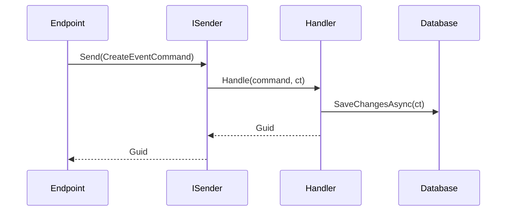
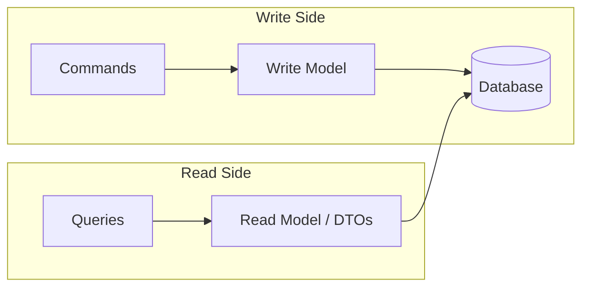

# MediatR, CQRS, and Pipeline Behaviors

This page is about the step after "my endpoints work" and before "I need a full-blown architecture astronaut project".

For most course projects, MediatR and lightweight CQRS are useful because they make one use case the center of the code instead of one generic service class.

## Why students should care

MediatR, CQRS, and pipeline behaviors help when these problems start showing up:

- endpoint files are mixing transport, validation, persistence, and business rules,
- service classes keep growing because every feature gets added to the same place,
- queries want read-shaped DTOs while commands care about invariants and side effects,
- and you want logging or validation to happen consistently for every request.

If none of that is happening yet, you probably do not need this machinery.

## A simple mental model

| Piece | Job |
| --- | --- |
| Endpoint | Accept HTTP input and return HTTP output |
| Request (`Command` / `Query`) | Represent one use case |
| Handler | Execute that use case |
| Pipeline behavior | Apply cross-cutting work around handlers |

That is the whole idea. MediatR is not magic; it is a disciplined request pipeline.

## MediatR: the mediator pattern in practice

MediatR routes a request to the matching handler. In a vertical-slice design, that makes the handler the center of a use case.



### Setup

```bash
dotnet add package MediatR
dotnet add package FluentValidation.DependencyInjectionExtensions
```

Start with the minimal registration used in the current course labs:

```csharp
builder.Services.AddMediatR(cfg => cfg.RegisterServicesFromAssemblyContaining<Program>());
builder.Services.AddValidatorsFromAssemblyContaining<Program>();
```

That is enough to get thin endpoints, explicit requests, handlers, and validators into the solution.

When the request/handler split is already paying off and you want cross-cutting logic once per request, add open generic behaviors:

```csharp
builder.Services.AddMediatR(cfg =>
{
    cfg.RegisterServicesFromAssemblyContaining<Program>();
    cfg.AddOpenBehavior(typeof(LoggingBehavior<,>));
    cfg.AddOpenBehavior(typeof(ValidationBehavior<,>));
});

builder.Services.AddValidatorsFromAssemblyContaining<Program>();
```

The Day 3 TechConf lab intentionally stops before this behavior-registration step so the first refactor stays focused on requests, handlers, and validators.

Inject `ISender` at endpoints when you only need to send requests.

## Before and after in plain language

The "before" version of a growing Minimal API often looks like this:

- endpoint parses input,
- endpoint performs validation,
- endpoint queries the database,
- endpoint applies business rules,
- endpoint saves changes,
- endpoint returns HTTP results.

That works at first, but the use case becomes harder to test, harder to reuse, and harder to read.

The "after" version with MediatR usually becomes:

- endpoint delegates,
- validator checks input,
- handler owns the use case,
- and optional behaviors can later apply logging, validation, transactions, or caching in one place.

That separation is the main benefit students usually feel first.

## Query example

```csharp
public record GetEventsQuery(string? Search, int Page = 1, int PageSize = 20)
    : IRequest<PagedResult<EventResponse>>;

public record EventResponse(Guid Id, string Title, DateTime StartDate, EventStatus Status);

public class GetEventsHandler(TechConfDbContext db)
    : IRequestHandler<GetEventsQuery, PagedResult<EventResponse>>
{
    public async Task<PagedResult<EventResponse>> Handle(GetEventsQuery request, CancellationToken ct)
    {
        var query = db.Events.AsNoTracking();

        if (!string.IsNullOrWhiteSpace(request.Search))
            query = query.Where(e => e.Title.Contains(request.Search));

        var total = await query.CountAsync(ct);
        var items = await query
            .OrderBy(e => e.StartDate)
            .Skip((request.Page - 1) * request.PageSize)
            .Take(request.PageSize)
            .Select(e => new EventResponse(e.Id, e.Title, e.StartDate, e.Status))
            .ToListAsync(ct);

        return new PagedResult<EventResponse>(items, total, request.Page, request.PageSize);
    }
}
```

Queries should favor projection, `AsNoTracking()`, and response-shaped DTOs because the read side cares about shape and speed, not aggregate mutation.

## Command example

```csharp
public record CreateEventCommand(
    string Title,
    string? Description,
    DateTime StartDate,
    DateTime EndDate,
    string Location,
    int MaxAttendees) : IRequest<Guid>;

public class CreateEventHandler(TechConfDbContext db)
    : IRequestHandler<CreateEventCommand, Guid>
{
    public async Task<Guid> Handle(CreateEventCommand request, CancellationToken ct)
    {
        var ev = new Event
        {
            Id = Guid.NewGuid(),
            Title = request.Title,
            Description = request.Description,
            StartDate = request.StartDate,
            EndDate = request.EndDate,
            Location = request.Location,
            MaxAttendees = request.MaxAttendees,
            Status = EventStatus.Draft
        };

        db.Events.Add(ev);
        await db.SaveChangesAsync(ct);
        return ev.Id;
    }
}
```

Commands mutate state and should be where invariants, persistence, and side effects are coordinated.

In TechConf terms:

- `GetEventsQuery` is about getting the best read shape,
- `CreateEventCommand` is about creating valid state,
- `CancelEventCommand` is about enforcing rules and triggering follow-up work.

## Wiring handlers to Minimal APIs

```csharp
var events = app.MapGroup("/api/events").WithTags("Events");

events.MapGet("/", async ([AsParameters] GetEventsQuery query, ISender sender) =>
    TypedResults.Ok(await sender.Send(query)));

events.MapPost("/", async (CreateEventCommand command, ISender sender) =>
{
    var id = await sender.Send(command);
    return TypedResults.Created($"/api/events/{id}", new { id });
});
```

This keeps endpoint code thin and moves real behavior into the request pipeline.

## CQRS: Command Query Responsibility Segregation

CQRS separates reads from writes because they optimize for different things.



| | Command | Query |
| --- | --- | --- |
| Purpose | Changes state | Reads state |
| Side effects | Yes | No |
| Returns | ID, `Result`, or nothing | DTOs or projections |
| Optimization target | Invariants and consistency | Shape and speed |

### What students often misunderstand

CQRS does **not** automatically mean:

- separate databases,
- microservices,
- event sourcing,
- or a complex distributed system.

In this course, CQRS usually means something much lighter:

- commands and queries are named differently,
- handlers are separated by intent,
- reads and writes can use different shapes,
- but both may still use the same `DbContext`.

### CQRS levels

```text
Baseline: Controller -> Service -> Repository
Level 1: Commands and queries -> handlers -> same DbContext
Level 2: Separate write model vs read DTOs
Level 3: Separate read store or materialized views
Level 4: Event sourcing with projections
```

Most course projects should stop at **Level 1 or 2**.

### Level 1 in TechConf

```csharp
public record SubmitSessionCommand(Guid EventId, string Title, string Abstract, Guid SpeakerId)
    : IRequest<Guid>;

public class SubmitSessionHandler(TechConfDbContext db)
    : IRequestHandler<SubmitSessionCommand, Guid>
{
    public async Task<Guid> Handle(SubmitSessionCommand cmd, CancellationToken ct)
    {
        var session = Session.Submit(cmd.EventId, cmd.Title, cmd.Abstract, cmd.SpeakerId);
        db.Sessions.Add(session);
        await db.SaveChangesAsync(ct);
        return session.Id;
    }
}

public record ListSessionsForEventQuery(Guid EventId, string? Track, int Page, int PageSize)
    : IRequest<PagedResult<SessionListItem>>;

public record SessionListItem(Guid Id, string Title, string SpeakerName, string Status, string? Track);
```

This is lightweight CQRS: same database, different intent, different model shape.

That is enough for many real projects. The value is clarity, not ceremony.

### When CQRS adds value

- Read and write shapes differ
- Cross-cutting behaviors should apply uniformly to every use case
- Business rules on writes are more complex than the read shape
- The system is moving toward domain events or event-driven integrations
- You want use cases named after intent instead of a generic service surface

### When CQRS is overkill

- Thin CRUD wrappers over one table
- Tiny APIs with almost no branching business logic
- Projects where the team would be slowed down more by ceremony than helped by structure
- Teams adding commands and queries but still keeping all real logic in one service anyway

## Pipeline behaviors

Pipeline behaviors are middleware for MediatR requests.


### Why students should care about behaviors

Behaviors are one of the biggest practical wins of the MediatR approach:

- validation can run the same way for every command,
- logging does not have to be copied into every handler,
- transactions can be applied consistently,
- and selected queries can add caching without changing endpoint code.

The point is not "more abstraction". The point is "write this concern once".

In this repository, treat behaviors as a **follow-up step**, not the starting point. The current labs first teach the request/handler split and validator registration, then leave behaviors as the natural next improvement once repeated cross-cutting code becomes visible.

### Logging behavior

```csharp
public class LoggingBehavior<TRequest, TResponse>(
    ILogger<LoggingBehavior<TRequest, TResponse>> logger)
    : IPipelineBehavior<TRequest, TResponse>
    where TRequest : IRequest<TResponse>
{
    public async Task<TResponse> Handle(
        TRequest request,
        RequestHandlerDelegate<TResponse> next,
        CancellationToken ct)
    {
        var requestName = typeof(TRequest).Name;
        logger.LogInformation("Handling {RequestName}: {@Request}", requestName, request);

        var sw = Stopwatch.StartNew();
        var response = await next();
        sw.Stop();

        logger.LogInformation(
            "Handled {RequestName} in {ElapsedMs}ms",
            requestName,
            sw.ElapsedMilliseconds);

        return response;
    }
}
```

### Validation behavior

```csharp
public class ValidationBehavior<TRequest, TResponse>(
    IEnumerable<IValidator<TRequest>> validators)
    : IPipelineBehavior<TRequest, TResponse>
    where TRequest : notnull
{
    public async Task<TResponse> Handle(
        TRequest request,
        RequestHandlerDelegate<TResponse> next,
        CancellationToken ct)
    {
        if (!validators.Any())
            return await next();

        var context = new ValidationContext<TRequest>(request);
        var failures = (await Task.WhenAll(validators.Select(v => v.ValidateAsync(context, ct))))
            .SelectMany(result => result.Errors)
            .Where(error => error is not null)
            .ToList();

        if (failures.Count > 0)
            throw new ValidationException(failures);

        return await next();
    }
}
```

```csharp
public class CreateEventValidator : AbstractValidator<CreateEventCommand>
{
    public CreateEventValidator()
    {
        RuleFor(x => x.Title).NotEmpty().MaximumLength(200);
        RuleFor(x => x.StartDate).GreaterThan(DateTime.UtcNow);
        RuleFor(x => x.EndDate).GreaterThan(x => x.StartDate);
        RuleFor(x => x.MaxAttendees).InclusiveBetween(1, 10000);
    }
}
```

Register behavior order intentionally. Logging outside validation is often useful because failed validation still appears in logs.

With the MediatR 12 packages used in this repo, open generic behaviors are typically registered with:

```csharp
cfg.AddOpenBehavior(typeof(LoggingBehavior<,>));
cfg.AddOpenBehavior(typeof(ValidationBehavior<,>));
```

The current course labs intentionally omit that step so the first MediatR refactor stays smaller and easier to follow.

Common additional behaviors:

- `AuthorizationBehavior`
- `TransactionBehavior` for commands
- `CachingBehavior` for selected queries

## Refactoring walkthrough

### Before: fat endpoint

```csharp
app.MapPost("/api/events", async (CreateEventRequest req, TechConfDbContext db) =>
{
    if (string.IsNullOrEmpty(req.Title))
        return Results.BadRequest("Title is required");
    if (req.EndDate <= req.StartDate)
        return Results.BadRequest("End date must be after start date");

    var ev = new Event
    {
        Id = Guid.NewGuid(),
        Title = req.Title,
        StartDate = req.StartDate,
        EndDate = req.EndDate,
        Location = req.Location,
        Status = EventStatus.Draft
    };

    db.Events.Add(ev);
    await db.SaveChangesAsync();
    return Results.Created($"/api/events/{ev.Id}", new { ev.Id });
});
```

### After: extracted request pipeline

1. Extract `CreateEventCommand`
2. Create `CreateEventHandler`
3. Wire the endpoint to `ISender`
4. Add `CreateEventValidator`
5. Optionally register the logging and validation behaviors once the request pipeline already feels useful

That turns a mixed-concern endpoint into a thin transport adapter.

This is a good mental checkpoint:

- the endpoint knows HTTP,
- the validator knows input rules,
- the handler knows the use case,
- the behavior knows cross-cutting concerns.

## When this approach makes sense

- Day 3 refactoring work where features already deserve their own use-case boundaries
- APIs where reads and writes clearly have different shapes
- Projects where you want logging and validation applied consistently
- Teams that want better feature-level traceability than a generic service layer provides

## When it does not

- A tiny API with three or four trivial CRUD endpoints
- A short-lived demo where the extra files would be noisier than the value they provide
- A codebase where handlers would only forward to one giant service

## Common pitfalls

- **Over-engineering**: do not use MediatR just because it exists
- **Anemic handlers**: a handler that only forwards to another service has not earned its existence
- **Too many behaviors**: every behavior runs for every matching request
- **Ignoring `CancellationToken`**: pass it through EF Core, HTTP clients, and async work
- **Handlers calling handlers**: prefer domain methods, domain events, or a genuinely shared helper instead of mediator chains
- **Confusing structure with complexity**: the point is simpler use cases, not more moving parts

## Mini-exercise

1. Create a `GetEventsQuery` and `GetEventsHandler`
2. Add `CreateEventCommand`, handler, and validator
3. Register a `LoggingBehavior`
4. Refactor one feature from inline endpoint logic into a complete vertical slice

## Short decision examples

| Situation | Good choice | Why |
| --- | --- | --- |
| `GetEvents` returns a list view and `CreateEvent` enforces rules | MediatR + CQRS Level 1 | Reads and writes already have different intent |
| One feature needs validation, logging, and transaction handling | Add pipeline behaviors | It centralizes repeated concerns |
| A tiny admin API only wraps one table | Stay simple | MediatR may add more ceremony than value |

## Further reading

| Resource | Link |
| --- | --- |
| MediatR GitHub | https://github.com/jbogard/MediatR |
| Jimmy Bogard - Vertical Slice Architecture | https://www.jimmybogard.com/vertical-slice-architecture/ |
| FluentValidation Docs | https://docs.fluentvalidation.net/ |
| Martin Fowler - CQRS | https://martinfowler.com/bliki/CQRS.html |
| Microsoft CQRS pattern | https://learn.microsoft.com/azure/architecture/patterns/cqrs |
