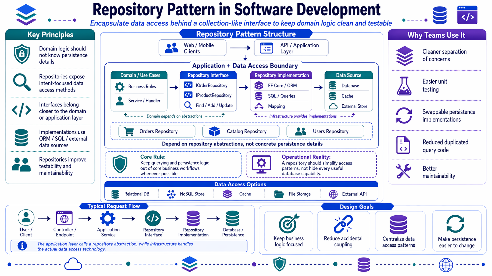
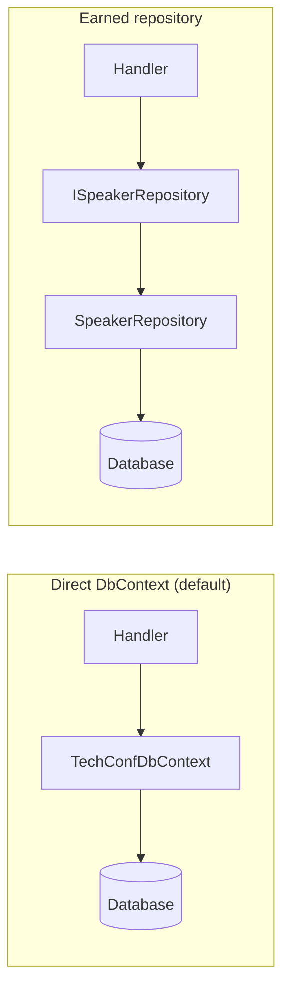
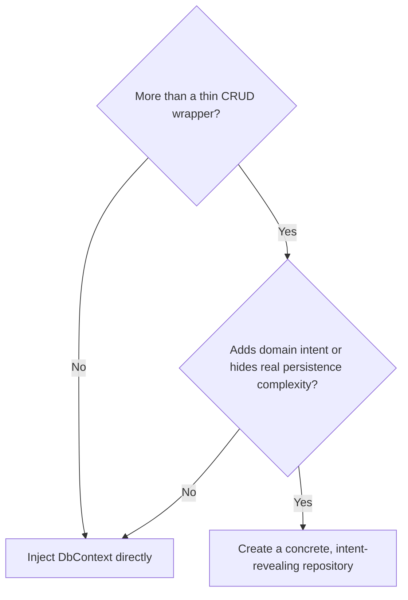

# The Repository Pattern

## Why students ask about this pattern so often

Once people learn Onion or Clean Architecture, they often assume they need a repository for every entity.

In .NET, that is usually the wrong default.

The important question is not:

> "Can I create a repository here?"

The important question is:

> "What value does this abstraction add beyond `DbContext`?"

## The classic idea

A repository is a collection-like abstraction over persistence. Client code asks for data by **domain intent** rather than by raw SQL or raw LINQ.

That fits naturally with Onion Architecture:

- the repository **interface** lives in the application ring,
- the repository **implementation** lives in infrastructure,
- and the domain does not know which storage technology is underneath.

## Visual comparison: direct `DbContext` vs earned repository

Read the left side as the default for straightforward handlers. Read the right side as the shape you introduce only when the abstraction adds real domain meaning or hides real persistence complexity.





## The .NET complication

In EF Core, `DbContext` and `DbSet<T>` already provide unit-of-work and repository-like behavior. Wrapping them in a generic `IRepository<T>` often adds cost without adding meaning.

Common problems with a generic repository over EF Core:

- `IQueryable` leaks through anyway, or useful querying features get blocked
- loading strategies such as `Include`, `AsNoTracking`, and split queries become harder to use
- tests end up mocking query providers instead of exercising real behavior
- multiple repositories in one request can blur the unit-of-work boundary

> If the repository is just `Add`, `Remove`, `GetById`, and `GetAll`, it usually has not earned its existence.

## When direct `DbContext` is the better choice

For many handlers, direct `DbContext` is the clearest and most honest option.

```csharp
public class GetEventDetailsHandler(TechConfDbContext db)
    : IRequestHandler<GetEventDetailsQuery, EventDetailsResponse?>
{
    public Task<EventDetailsResponse?> Handle(GetEventDetailsQuery request, CancellationToken ct) =>
        db.Events
            .AsNoTracking()
            .Where(e => e.Id == request.EventId)
            .Select(e => new EventDetailsResponse(
                e.Id,
                e.Title,
                e.Description,
                e.StartDate,
                e.EndDate,
                e.Location,
                e.Status))
            .FirstOrDefaultAsync(ct);
}
```

That handler is readable, explicit, and does not pretend there is a domain abstraction where none is needed.

## When repositories earn their keep

Use a **concrete, intent-revealing repository** when:

1. a complex query appears in multiple places,
2. Onion Architecture requires an application-facing port,
3. one aggregate pulls data from multiple sources,
4. EF Core is not the storage abstraction in play,
5. the aggregate is event sourced,
6. an aggregate has storage concerns worth hiding behind a domain-friendly contract.

## Decision flow

If you are unsure whether to create a repository, use this as a quick filter:



## What "earned abstraction" looks like

An earned repository usually has one or more of these qualities:

- its methods use domain language,
- it hides persistence complexity that callers should not care about,
- it supports a real aggregate boundary,
- or it makes application-layer contracts cleaner in an Onion design.

If the interface would look nearly identical for every entity, that is a warning sign.

## When repositories are an anti-pattern

- Generic `IRepository<T>` on top of EF Core
- Returning `IQueryable<T>` from the repository
- One giant repository interface for the entire application
- Repositories that duplicate `DbContext` without adding domain language
- Adding repositories only because a diagram or template said so

## TechConf example: an earned repository

Speaker scheduling is a good example because the query itself is meaningful to the domain.

```csharp
public interface ISpeakerRepository
{
    Task<Speaker?> GetAsync(Guid id, CancellationToken ct);
    Task<IReadOnlyList<Speaker>> FindAvailableAsync(
        Guid eventId,
        DateTime from,
        DateTime to,
        string? excludeTrack,
        CancellationToken ct);
    void Add(Speaker speaker);
}

public class SpeakerRepository(TechConfDbContext db) : ISpeakerRepository
{
    public Task<Speaker?> GetAsync(Guid id, CancellationToken ct) =>
        db.Speakers
            .Include(s => s.Engagements)
            .FirstOrDefaultAsync(s => s.Id == id, ct);

    public async Task<IReadOnlyList<Speaker>> FindAvailableAsync(
        Guid eventId,
        DateTime from,
        DateTime to,
        string? excludeTrack,
        CancellationToken ct)
    {
        return await db.Speakers
            .Where(s => s.Events.Any(e => e.Id == eventId))
            .Where(s => !s.Engagements.Any(en =>
                en.Starts < to &&
                en.Ends > from &&
                (excludeTrack == null || en.Track == excludeTrack)))
            .OrderBy(s => s.DisplayName)
            .ToListAsync(ct);
    }

    public void Add(Speaker speaker) => db.Speakers.Add(speaker);
}
```

Why this one is worth keeping:

- it is **not generic**,
- it exposes a meaningful query,
- it does not leak `IQueryable`,
- and it separates aggregate persistence from transaction commit.

## A quick contrast

| Version | Signal | Verdict |
| --- | --- | --- |
| `IRepository<Event>` with `GetAll`, `GetById`, `Add`, `Remove` | No domain meaning | Usually delete it |
| `ISpeakerRepository.FindAvailableAsync(...)` | Clear domain intent | Usually worth keeping |

## Rule of thumb

If the interface would look nearly identical for any aggregate, delete it and inject `DbContext`.

If the interface encodes domain meaning such as "find available speakers", keep it.

## A short decision example

Suppose you are implementing `ApproveSession`:

- If the handler just loads one session, updates it, and saves it, direct `DbContext` is probably fine.
- If the application needs a contract like "load session aggregate with approval history and related policy data", a repository may be justified.
- If the aggregate is event sourced, a repository is almost always the natural shape.

## Further reading

- See the [WorkshopPlanner Onion lab](../../labs/lab-architecture-onion/), where `IWorkshopRepository` is earned and exposes domain-meaningful members such as `ExistsByTitleAsync(...)` instead of only generic CRUD.
- Martin Fowler - https://martinfowler.com/eaaCatalog/repository.html
- Jimmy Bogard - https://www.jimmybogard.com/query-objects-with-the-repository-pattern/
