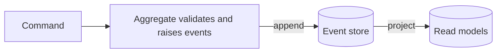
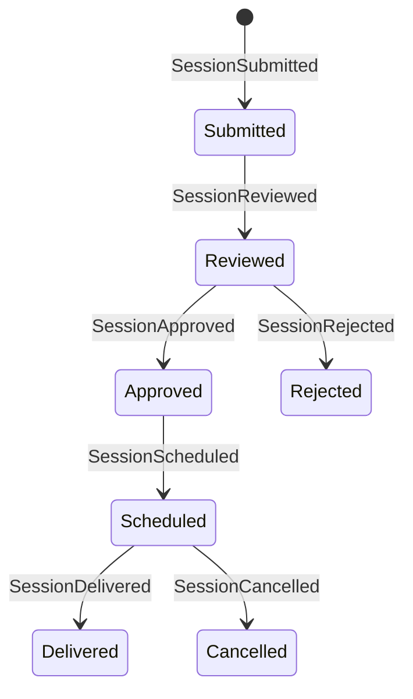

# Event Sourcing

## Why you should care

Event sourcing is one of the easiest patterns to romanticize and one of the easiest to misuse.

You should care about it for two reasons:

1. it solves a real class of problems extremely well,
2. and it introduces enough complexity that you should recognize when **not** to use it.

For most course projects, event sourcing is **not** the default. It is an advanced option for cases where the history of change is itself part of the business value.

## The core idea

Instead of storing current state, store the **sequence of events** that produced it.


```text
state = events.Aggregate(initialState, (current, @event) => current.Apply(@event))
```



Events are business facts in past tense: `SessionSubmitted`, `SessionApproved`, `SessionCancelled`.

That means the source of truth becomes:

- what happened,
- in what order it happened,
- and how the aggregate arrived at its current state.

## State-based vs event-sourced storage

| Property | State-based | Event-sourced |
| --- | --- | --- |
| What is stored | Current row | Append-only history |
| History | Usually partial unless added explicitly | Built in |
| Why the state changed | Often lost | Preserved in the event stream |
| Read model | Direct | Usually via projections |
| Operational complexity | Lower | Higher |

## What pain this pattern actually solves

Event sourcing becomes attractive when questions like these are business-important:

- "How did this session end up approved?"
- "What changed first, and who changed it?"
- "Can we rebuild multiple read models from the same stream of business facts?"
- "Do temporal queries matter?"

If the business only needs "What is the current session status?", event sourcing is usually too expensive.

## TechConf example

A session submission lifecycle maps naturally to events:



```csharp
public abstract record SessionEvent(Guid SessionId, DateTime At);

public record SessionSubmitted(Guid SessionId, string Title, string Abstract, Guid SpeakerId, DateTime At)
    : SessionEvent(SessionId, At);
public record SessionApproved(Guid SessionId, Guid ApprovedBy, DateTime At)
    : SessionEvent(SessionId, At);
public record SessionCancelled(Guid SessionId, string Reason, DateTime At)
    : SessionEvent(SessionId, At);

public class Session
{
    public Guid Id { get; private set; }
    public SessionStatus Status { get; private set; }
    public int Version { get; private set; }

    private readonly List<SessionEvent> _uncommitted = new();
    public IReadOnlyList<SessionEvent> Uncommitted => _uncommitted;

    public static Session FromHistory(IEnumerable<SessionEvent> events)
    {
        var session = new Session();
        foreach (var @event in events)
        {
            session.Apply(@event);
            session.Version++;
        }

        return session;
    }

    public void Approve(Guid approver)
    {
        if (Status != SessionStatus.Reviewed)
            throw new InvalidStateException("Only reviewed sessions can be approved");

        Raise(new SessionApproved(Id, approver, DateTime.UtcNow));
    }

    public void Cancel(string reason)
    {
        if (Status is SessionStatus.Cancelled or SessionStatus.Delivered)
            throw new InvalidStateException($"Cannot cancel a session in state {Status}");

        Raise(new SessionCancelled(Id, reason, DateTime.UtcNow));
    }

    private void Apply(SessionEvent @event)
    {
        switch (@event)
        {
            case SessionSubmitted submitted:
                Id = submitted.SessionId;
                Status = SessionStatus.Submitted;
                break;
            case SessionApproved:
                Status = SessionStatus.Approved;
                break;
            case SessionCancelled:
                Status = SessionStatus.Cancelled;
                break;
        }
    }

    private void Raise(SessionEvent @event)
    {
        Apply(@event);
        _uncommitted.Add(@event);
    }
}
```

The key discipline is the split between:

- **command methods** that enforce rules and raise events,
- and **`Apply` methods** that mutate state with no business decisions.

That separation is one of the main mental shifts in event-sourced modeling.

## Repository and event store

With event sourcing, the repository loads the stream and rebuilds the aggregate.

```csharp
public interface ISessionRepository
{
    Task<Session?> GetAsync(Guid id, CancellationToken ct);
    Task SaveAsync(Session session, CancellationToken ct);
}

public class SessionRepository(IEventStore store) : ISessionRepository
{
    public async Task<Session?> GetAsync(Guid id, CancellationToken ct)
    {
        var events = await store.ReadStreamAsync($"session-{id}", ct);
        return events.Count == 0 ? null : Session.FromHistory(events.Cast<SessionEvent>());
    }

    public Task SaveAsync(Session session, CancellationToken ct) =>
        store.AppendAsync(
            $"session-{session.Id}",
            session.Version,
            session.Uncommitted,
            ct);
}
```

Popular .NET options include **Marten** and **EventStoreDB**.

## Projections feed the read side

Reads usually come from projection tables or projection documents, not from replaying the event log on every request.

```csharp
public class SessionListProjection : IProjection
{
    public async Task HandleAsync(SessionEvent @event, TechConfReadDb read, CancellationToken ct)
    {
        switch (@event)
        {
            case SessionSubmitted submitted:
                read.SessionList.Add(new SessionListRow(
                    submitted.SessionId,
                    submitted.Title,
                    "Submitted",
                    submitted.SpeakerId));
                break;
            case SessionApproved approved:
                var row = await read.SessionList.FindAsync([approved.SessionId], ct);
                if (row is not null) row.Status = "Approved";
                break;
        }

        await read.SaveChangesAsync(ct);
    }
}
```

## When event sourcing makes sense

- audit history is a hard requirement,
- temporal queries matter,
- multiple read models must be derived from the same business truth,
- the domain is naturally event-driven,
- and the team is comfortable with projections and eventual consistency.

## When event sourcing is a trap

- plain CRUD workloads,
- small teams under short timelines,
- teams not ready for replay, versioning, and async consistency,
- or systems that only need domain events, not event-sourced truth.

## False positives: when it sounds attractive but probably is not worth it

- "We might want analytics later."
- "It feels more advanced."
- "We want to publish events to other services."
- "We need an audit log."

None of those automatically require event sourcing.

Often a simpler combination is enough:

- normal relational storage,
- domain events,
- audit tables,
- and an outbox for reliable integration messages.

## Short decision examples

| Situation | Better fit | Why |
| --- | --- | --- |
| A speaker updates their bio and profile photo | State-based storage | The current state matters far more than the change timeline |
| Session approval needs a full timeline, replay, and multiple derived views | Event sourcing | The sequence of changes is part of the business truth |
| You only need to notify another service after a write | Domain events + outbox | You need reliable messaging, not a new source of truth |

## Gotchas

- **Event versioning:** old events stay in the store, so schema changes must be planned instead of silently replacing the past.
- **GDPR and deletion requirements:** append-only history can clash with "right to be forgotten" expectations unless personal data is isolated or encrypted carefully.
- **Snapshotting for long streams:** rebuilding state from thousands of events on every load eventually becomes too slow without checkpoints.
- **Idempotent projections:** projection handlers must tolerate replays and duplicates without double-counting or corrupting the read model.
- **Projection coordination and replay safety:** replaying or rebuilding one projection should not accidentally break others or resend integration side effects.

> Event sourcing is powerful and rare. Use it when the history is itself part of the business value.

## Further reading

- Microsoft Event Sourcing pattern - https://learn.microsoft.com/azure/architecture/patterns/event-sourcing
- Marten - https://martendb.io/
- EventStoreDB - https://www.eventstore.com/
