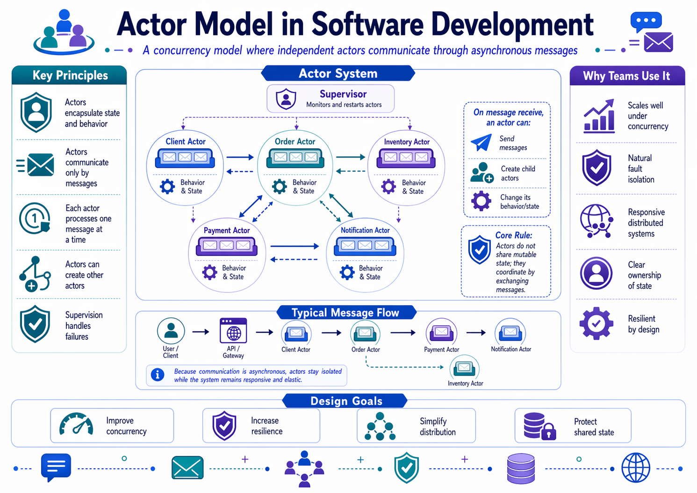
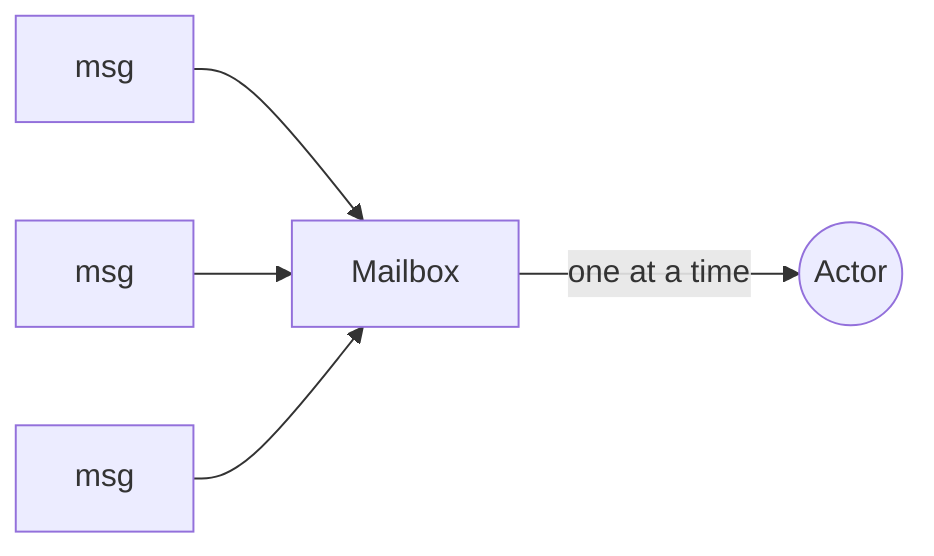

# The Actor Model

## Why actors enter the picture

Most architecture patterns in this folder organize code or persistence. Actors solve a different problem: **stateful concurrency in memory**.

Typical examples:

- seat reservations under heavy concurrent load,
- live event state shared across many clients,
- long-running workflows or sagas that must remember progress.

The actor model treats an actor as a unit of **state + behavior + mailbox** that processes one message at a time.





That means no shared mutable state and no explicit locking inside the actor itself.

## Why you should care

Actors are worth learning because they solve a problem that layered architecture, VSA, Onion, and CQRS do not solve directly:

> Who owns a piece of state that stays alive across many requests while many clients try to change it at once?

If your API is mostly stateless request/response work, you probably do not need actors.

If one thing stays alive in memory and many messages target it, actors become more interesting.

## TechConf example: seat reservation

```csharp
public record Reserve(Guid AttendeeId, IActorRef ReplyTo);
public record Release(Guid AttendeeId);
public record SeatReserved(Guid SessionId, Guid AttendeeId);
public record SessionFull(Guid SessionId);

public class SessionActor : ReceiveActor
{
    private readonly Guid _sessionId;
    private readonly int _capacity;
    private readonly HashSet<Guid> _attendees = new();

    public SessionActor(Guid sessionId, int capacity)
    {
        _sessionId = sessionId;
        _capacity = capacity;

        Receive<Reserve>(msg =>
        {
            if (_attendees.Count >= _capacity)
            {
                msg.ReplyTo.Tell(new SessionFull(_sessionId));
                return;
            }

            if (_attendees.Add(msg.AttendeeId))
                msg.ReplyTo.Tell(new SeatReserved(_sessionId, msg.AttendeeId));
        });

        Receive<Release>(msg => _attendees.Remove(msg.AttendeeId));
    }
}
```

The actor owns the capacity invariant. Because messages are processed one at a time, no lock is required to avoid overbooking.

That is the key value: the invariant lives with the state owner.

## Bridging actors with ASP.NET Core

Actors sit behind the HTTP layer rather than replacing it.

```csharp
app.MapPost("/api/sessions/{id:guid}/reserve",
    async (Guid id, ReserveRequest body, IActorRegistry registry, CancellationToken ct) =>
{
    var sessions = registry.Get<SessionManager>();
    var reply = await sessions.Ask<object>(
        new Envelope(id, new Reserve(body.AttendeeId, ActorRefs.NoSender)),
        timeout: TimeSpan.FromSeconds(3),
        cancellationToken: ct);

    return reply switch
    {
        SeatReserved reserved => Results.Ok(new { sessionId = reserved.SessionId }),
        SessionFull => Results.Conflict("Session is full"),
        _ => Results.Problem("Unexpected response")
    };
});
```

## What actors are not

Actors are **not**:

- a replacement for every service class,
- a better controller pattern,
- a synonym for background jobs,
- or a generic excuse to make everything asynchronous.

Actors help when the important thing is a **stateful entity with serialized message handling**.

## Supervision and failure

Actors are designed around explicit failure handling. A supervisor decides whether a failing child actor should restart, resume, stop, or escalate.

That is a major benefit: failure becomes structural instead of being scattered through ad-hoc retry logic.

## When actors make sense

Reach for actors when you have all three:

1. stateful entities,
2. high concurrency against that state,
3. and state that lives longer than one HTTP request.

Good fits include reservations, auctions, chat rooms, live lobbies, device twins, and saga coordinators.

## When actors are the wrong tool

- plain CRUD,
- stateless request/response logic,
- one-off background jobs,
- or teams without tooling and operational experience for async message flows.

## Short decision examples

| Situation | Better fit | Why |
| --- | --- | --- |
| A normal TechConf admin API for events and speakers | Regular request/response architecture | There is no long-lived hot state to coordinate |
| A session reservation hotspot with many simultaneous requests | Actor model | One state owner can serialize message handling |
| A live multiplayer lobby or scoreboard | Actor model can fit well | The state is shared, hot, and long-lived |
| A nightly import job | Background service, not actors | The job is asynchronous, but not actor-shaped |

## Options in .NET

| Framework | Strengths | Trade-offs |
| --- | --- | --- |
| Akka.NET | Mature actor toolkit with clustering and persistence | Steeper learning curve |
| Microsoft Orleans | Virtual actors and strong cloud story | Different mental model, less explicit control |
| Proto.Actor | Lightweight and gRPC-friendly | Smaller ecosystem |
| Dapr Actors | Sidecar-based and language-neutral | Extra infrastructure runtime |

For this course, **Akka.NET** is the clearest teaching fit because it exposes the classic actor model directly.

## Hands-on follow-up

- [Build a seat-reservation API with Akka.NET and Akka.Hosting](../../labs/lab-akkanet/)

## One practical warning

Actors are powerful, but they change how you think about debugging, observability, and failure handling. That means they are rarely the first thing to add to a student project.

Learn them as a targeted tool, not as a default architecture.

## Further reading

- Akka.NET - https://getakka.net/
- Microsoft Orleans - https://learn.microsoft.com/dotnet/orleans/
