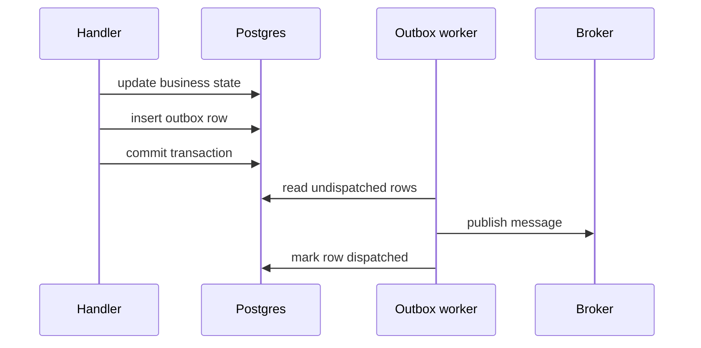
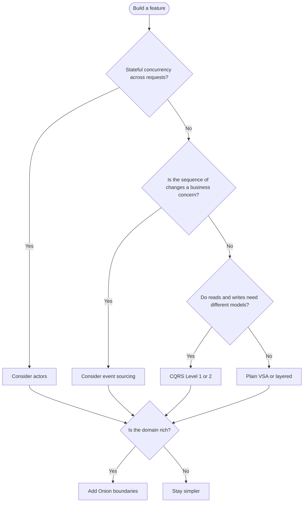

# Companion Patterns and Anti-Patterns

This page collects the smaller patterns that usually appear around VSA, Onion, CQRS, event sourcing, and actors once a service starts behaving like a real production system.

These are often the patterns students notice later:

- the main architecture is already in place,
- the feature works,
- but reliability, retries, messaging, and coupling now matter.

## Why this page exists

The larger patterns answer questions like:

- where code should live,
- how dependencies should flow,
- and how reads and writes should be separated.

The companion patterns answer different questions:

- How do other parts of the system react safely?
- How do I keep a database write and outgoing message aligned?
- How do I model expected business outcomes without throwing exceptions for everything?
- How do I survive retries without double-processing a real-world action?

## Domain events

A slice can publish a domain event after a successful state change so other parts of the system can react without direct coupling.

```csharp
public record EventCancelled(Guid EventId, IEnumerable<Guid> AffectedAttendees) : INotification;

public class NotifyAttendeesOnCancellation(IEmailSender mail)
    : INotificationHandler<EventCancelled>
{
    public Task Handle(EventCancelled evt, CancellationToken ct) =>
        mail.SendCancellationNoticeAsync(evt.AffectedAttendees, evt.EventId, ct);
}
```

Domain events are cheap, useful, and often the first decoupling step that a growing service needs.

### When you should care

Use domain events when:

- one action should trigger several reactions,
- you want to keep the main use case focused,
- and those reactions do not belong inside the same handler method.

## Transactional outbox

If a handler writes to the database and publishes to Kafka, RabbitMQ, or another broker, the state change and the outgoing message must be coordinated.

The outbox pattern writes an outgoing message row in the **same database transaction** as the state change. A background worker dispatches the outbox rows afterward.



Use this whenever a business transaction and a network message must stay aligned.

### Why students should care

Without an outbox, these failures become possible:

- database commit succeeds but broker publish fails,
- broker publish succeeds but the database transaction rolls back,
- retries create duplicate external messages.

The outbox exists to make those edge cases boring instead of surprising.

## Result types for expected outcomes

In command handlers, outcomes like not found or conflict are often expected business results, not exceptional failures.

```csharp
public abstract record Result
{
    public record Success<T>(T Value) : Result;
    public record NotFound(string Message) : Result;
    public record Conflict(string Message) : Result;
    public record Invalid(IEnumerable<string> Errors) : Result;
}
```

Endpoints can map these to HTTP results directly while true exceptions remain reserved for infrastructure failures and bugs.

You can implement this `Result` shape yourself, as shown here, or use a small helper library. For the course labs, a simple custom result type is usually the easiest option.

### Why this matters

If "session already approved" is a normal business outcome, throwing an exception for it usually adds noise. Result types keep expected outcomes explicit.

## Idempotency for write endpoints

Any write with real-world side effects should tolerate retries.

Typical approach:

1. accept an `Idempotency-Key` header,
2. store the key and response,
3. return the same result when the client retries the same request.

This matters most for payments, reservations, external calls, and emails.

### Short example

If a client submits `RegisterAttendee` and the network drops after the server succeeds, the client may retry. Idempotency is what stops the attendee from being charged, emailed, or registered twice.

## A common confusion: domain events vs event sourcing

| Concept | Meaning |
| --- | --- |
| Domain event | "Something important happened and other parts of the system may react." |
| Event sourcing | "The event stream itself is the source of truth for this aggregate." |

You can use domain events without event sourcing. In fact, most systems do.

## Choosing and combining patterns

The patterns in this folder answer different questions.

| Axis | Pattern | Question |
| --- | --- | --- |
| Code organization | Layered vs VSA | Where does feature code live? |
| Dependency direction | Onion | What depends on what? |
| Data access | Repository vs direct `DbContext` | Does this aggregate need its own persistence contract? |
| Read/write separation | CQRS | Should reads and writes share a model? |
| Historical truth | Event sourcing | Is the sequence of changes itself important? |
| Stateful concurrency | Actors | Who owns this state while it is alive? |
| Cross-service messaging | Domain events + outbox | How do reactions stay decoupled and reliable? |

### Decision flow



### Rule of adoption

Adopt a pattern **after** you feel the pain it solves, not before.

## Anti-patterns to watch for

- Architecture cargo-culting
- Onion projects with an anemic domain
- EF-specific concerns leaking into the domain ring
- Generic `IRepository<T>` over EF Core
- Repositories returning `IQueryable<T>`
- "CQRS" that still uses one generic repository and one entity shape for everything
- Confusing domain events with event sourcing
- Event-sourcing everything
- Actors that only forward to a service and own no state
- A `Common/` folder that becomes the new god service
- Handlers calling other handlers
- Sending broker messages without an outbox
- Write endpoints with no idempotency strategy

## Short decision examples

| Situation | Good pattern | Why |
| --- | --- | --- |
| `CancelEvent` should notify attendees and update analytics | Domain events | One action needs decoupled reactions |
| Save booking data and publish a broker message reliably | Transactional outbox | The write and message must stay aligned |
| Retry-prone payment or reservation endpoint | Idempotency | Replays must not duplicate side effects |
| Expected business outcome like "already cancelled" | Result type | It is not an exceptional failure |

## Suggested lab ideas

1. Refactor one feature to a full vertical slice.
2. Split a service into Domain, Application, Infrastructure, and Api projects.
3. Audit every repository and delete the generic ones.
4. Add MediatR with logging and validation behaviors.
5. Split read and write models for one TechConf feature.
6. Event-source one aggregate that truly benefits from history.
7. Add a `SessionActor` and verify capacity under parallel load.
8. Add an outbox and dispatch it with a background service.

## Further reading

### Code organization

- Jeffrey Palermo - https://jeffreypalermo.com/2008/07/the-onion-architecture-part-1/
- Robert C. Martin - https://blog.cleancoder.com/uncle-bob/2012/08/13/the-clean-architecture.html
- Alistair Cockburn - https://alistair.cockburn.us/hexagonal-architecture/

### Integration and consistency

- Microsoft Transactional Outbox - https://learn.microsoft.com/azure/architecture/patterns/outbox
- Vlad Khononov, *Learning Domain-Driven Design*

> Start with the smallest structure that keeps change affordable, then add complexity only when it starts paying rent.
