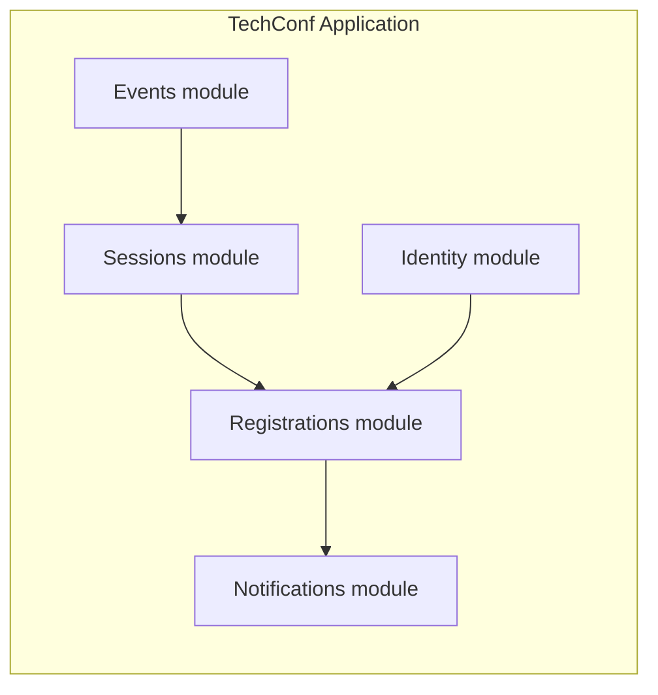

# Modular Monolith

This page is about a system-level decision that sits between "one small service" and "many distributed services".

For many growing products, the next good move is **not** microservices. It is often a **modular monolith**: one deployable application with explicit module boundaries inside it.

## Why this page exists

Students often reach this point after learning VSA, MediatR, and Onion:

- the codebase is growing,
- there are now several real business areas,
- and the team wants stronger boundaries,
- but splitting into separate deployed services would add a lot of operational cost.

That is the sweet spot for a modular monolith.

## What a modular monolith is

A modular monolith is:

- **one deployment**
- **one process** or one application runtime
- **one operational surface**
- but with **real internal module boundaries**

Those modules should feel closer to small systems than to folders.

The key idea is not "put code in separate folders". The key idea is:

- each module owns a clear responsibility,
- each module has a narrow public surface,
- and other modules are not allowed to reach into its internals whenever they want.

## What it is not

A modular monolith is **not**:

- a layered monolith with more folders,
- a `Modules/` directory where everything still references everything,
- or a fake boundary where all modules share the same application services and database access without rules.

If every feature can still touch every table, every entity, and every internal class, you do not have modules. You have a monolith with nicer packaging.

## Why students should care

For many course-sized and early production systems, a modular monolith gives most of the benefits people hope microservices will give them:

- clearer ownership,
- better separation of concerns,
- easier onboarding,
- safer change boundaries,
- and more room for the codebase to grow.

But it avoids a lot of distributed-system cost:

- no network calls between features by default,
- no per-service deployment pipeline explosion,
- no cross-service auth and tracing setup for every boundary,
- and no immediate consistency problems caused by splitting too early.

## When it is a good fit

A modular monolith is often a good fit when:

- the product is clearly growing beyond a small CRUD service,
- the domain has distinct areas such as events, submissions, registrations, and notifications,
- one deployment is still operationally fine,
- one transaction across modules is still useful,
- the team wants cleaner ownership before it wants separate runtime ownership,
- and local development should stay simple.

### Typical signals

You may be ready for a modular monolith when:

1. one application now contains several real subdomains,
2. feature teams keep stepping on each other in the same files,
3. "shared" services are absorbing unrelated rules,
4. you want to make dependencies explicit,
5. but you still do not have a strong reason to pay the microservice tax.

## Benefits and costs

| Benefit | What you gain |
| --- | --- |
| Simpler deployment | One app is still easier to build, run, debug, and observe |
| Stronger boundaries | Modules make ownership and change impact clearer |
| Easier refactoring | You can improve boundaries before committing to distributed services |
| Cheaper consistency | Many workflows can still stay transactional inside one app |
| Better local development | Fewer moving parts than a fleet of services |

| Cost | What you must do intentionally |
| --- | --- |
| Boundary discipline | The compiler will not save you unless you create real rules |
| Shared-process temptation | It is easy to bypass module APIs because everything is nearby |
| Runtime coupling | One bad deployment still affects the whole app |
| Scaling together | You scale the whole app, not one module at a time |
| Migration pressure later | If service boundaries eventually matter, extraction still takes work |

## Module boundary rules

Good module boundaries usually mean:

1. each module has a clear responsibility,
2. each module owns its own application logic,
3. each module exposes a small public surface,
4. and other modules depend on that surface, not on internal implementation details.

Practical rules:

- Do not let one module reach straight into another module's persistence internals.
- Keep shared code small and boring.
- Prefer explicit contracts, commands, or events over random cross-module method calls.
- If you share a database, still think in terms of **module ownership**, not "all tables are everyone's problem".
- If a module has no boundary rules, it is just a namespace.

### Communication patterns inside the monolith

Inside a modular monolith, modules often communicate through:

- direct calls to a public module API,
- in-process MediatR requests for clear use cases,
- or domain/application events when the reaction should stay decoupled.

You are still in one process, so you do **not** need network communication just to prove a point.

## A TechConf-style example

Imagine TechConf has grown beyond simple endpoints.

You might split one application into modules like:

| Module | Owns |
| --- | --- |
| Events | event lifecycle, venue, scheduling windows |
| Sessions | session proposals, review workflow, speaker decisions |
| Registrations | attendee sign-up, ticket state, check-in rules |
| Notifications | email templates, reminder workflows, delivery history |
| Identity | users, roles, permissions, auth integration |

That can still be one application.

The win is that "approve session" or "cancel event" is now easier to locate and reason about without turning TechConf into five separately deployed systems.

## When it starts to break down

A modular monolith stops being enough when the boundary needs more than clean code. For example:

- one area needs independent deployment cadence,
- one area has very different scaling needs,
- one area needs a different runtime or storage model,
- one team must release independently without coordinating every deployment,
- or the system must keep running even when another boundary is down.

That is when you should start reading about [microservices](08-microservices.md).

## Common mistakes and anti-patterns

- A `Modules/` folder with no real dependency rules
- One giant shared `Common/` project that becomes the real monolith core
- One shared `DbContext` where every module freely edits every aggregate
- Public types that expose internals instead of a narrow module API
- Splitting into modules by technical layer instead of business capability
- Calling the system "modular" when the only change was folder names

## Decision checklist

Ask these questions:

1. Do we still want one deployment and one operational surface?
2. Are the main problems about code boundaries more than deployment boundaries?
3. Would distributed communication add more cost than value right now?
4. Are the business areas clear enough to define modules with real ownership?
5. Can we enforce a narrow public surface for each module?

If the answers are mostly "yes", a modular monolith is probably the better next step than microservices.

## Rule of thumb

If the application is getting too big for "just one service" thinking, but not big enough to justify distributed-system pain, build a **modular monolith** first.

That move solves a surprising amount of growth pain more cheaply than splitting too early.
