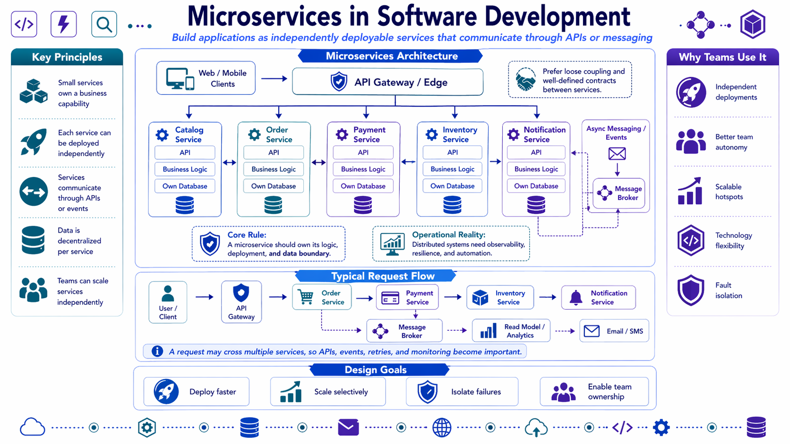
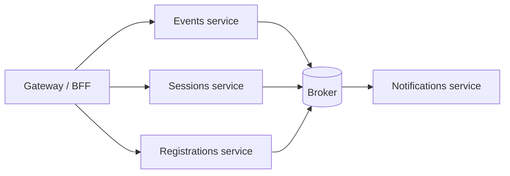

# Microservices

This page is about one of the most overused architecture words in modern software.

Microservices can be useful, but only when the boundary needs real **operational independence**, not just cleaner code.

Yet, just like Actor-Systems and Event Sourcing, you should know what it is, how it works and how to apply it to the correct problem. It should be a tool in your toolbelt but not applied in every situation.

## Why this page exists

You often hear that microservices are:

- more scalable,
- more modern,
- and a natural next step for any growing system.

That is incomplete at best.

Microservices (like most things) are a trade. You gain service autonomy, but you also accept distributed-system cost:

- network failure,
- distributed tracing,
- retries,
- auth between services,
- eventual consistency,
- more deployment pipelines,
- and more things to observe when something breaks.

For most course projects and many production systems, that cost is not worth paying. It is a powerful technique when applied to a situation that requires it.

## What microservices are

A microservice architecture means the system is split into **independently deployable services** that each own a clear business capability.

Typical characteristics:

- each service has its own deployable unit,
- each service owns its own runtime boundary,
- each service should own its own data,
- and communication happens across process boundaries.

The important word is not "micro". It is **independent**.

If two services still must always release together, scale together, and share the same data model, the split may be cosmetic.

## What microservices are good at

Microservices are useful when a boundary truly needs:

- independent deployment,
- independent scaling,
- independent runtime ownership,
- independent data ownership,
- or long-lived team autonomy.

### Good reasons to split

Examples of justified service boundaries:

- a video-processing capability that scales very differently from the main API,
- a payment or billing boundary with stronger security and audit requirements,
- a notifications system that can fail or retry independently,
- a search subsystem with a specialized storage model,
- or a product area owned by a separate team with its own release cadence.

## When they are justified

Microservices become more realistic when:

1. the domain boundaries are already well understood,
2. the team structure can support service ownership,
3. operational maturity is strong enough to handle many deployables,
4. observability and automation are not optional,
5. and a modular monolith is no longer enough.

This last point matters.

If you cannot explain why a **modular monolith** is no longer sufficient, you probably are not ready to justify microservices yet.

## Benefits and costs

| Benefit | What you gain |
| --- | --- |
| Independent deployment | One service can ship without redeploying the whole system |
| Independent scaling | Hot paths can scale differently from colder ones |
| Team autonomy | Ownership can align more closely with business capabilities |
| Fault isolation | Some failures can be contained instead of taking the whole app down |
| Technology choice | In some cases a service can choose different storage or runtime tools |

| Cost | What you must now handle |
| --- | --- |
| Network failure | Calls can timeout, retry, or partially fail |
| Data consistency | Cross-service workflows are harder than one transaction |
| Operational load | More CI/CD, more config, more infrastructure, more runbooks |
| Observability needs | Logs alone are not enough; tracing and correlation become essential |
| Local development complexity | Running the system and testing flows becomes harder |

## Communication and data ownership

Microservices work best when each service owns its own data and communicates through clear contracts.

Typical communication options:

- HTTP or gRPC for request/response collaboration
- messaging for decoupled reactions
- events for state change notifications

What to avoid:

- a shared database used by several services as if they were one app,
- direct table access into another service's data,
- or synchronous chatty traffic where one request fans out across many services by default.

If two services must coordinate a workflow, you will likely need patterns like:

- domain events,
- transactional outbox,
- idempotency,
- retries,
- and good observability.

Those companion patterns are explained in [Companion patterns and anti-patterns](06-companion-patterns-and-anti-patterns.md).

## Operational implications

Microservices are not only an application-structure decision. They are also an operations decision.

Once you split services, you usually need:

- service-to-service authentication and authorization,
- distributed tracing,
- better health checks and alerting,
- resilience policies such as timeouts and retries,
- versioned contracts,
- rollout and rollback discipline,
- and stronger testing across service boundaries.

This is where tools like Aspire help:

- local orchestration becomes easier,
- service discovery becomes easier,
- traces and logs become easier to inspect,
- and end-to-end integration testing becomes more realistic.

But Aspire does **not** remove the architectural cost of the split. It only helps you manage it.

## TechConf-style examples

### Splits that may make sense

| Situation | Better reasoning |
| --- | --- |
| Notifications can be retried and scaled independently | A notification service may be justified |
| Video transcoding or document processing needs special compute | A separate processing service may be justified |
| Billing has different compliance and release pressure | A billing service boundary may be justified |

### Splits that are usually weak

| Situation | Why it is probably weak |
| --- | --- |
| "Events controller" and "Sessions controller" become separate services immediately | Different controllers are not automatically different operational boundaries |
| The team wants microservices because they sound modern | That is fashion, not architecture |
| The domain is still unclear | Splitting early freezes bad boundaries |
| Every service still shares the same database | The operational cost rises, but the ownership clarity does not |

## Common anti-patterns

- Microservices as a resume-driven design choice
- Splitting before the domain boundaries are stable
- Shared database microservices
- Synchronous chains where one user request depends on many services in sequence
- Assuming one bug in a monolith is always worse than many partial failures in a distributed system
- Treating "more deployables" as proof of maturity

## Decision checklist

Ask these questions before splitting:

1. Does this boundary need independent deployment in practice?
2. Does it need different scaling, storage, or runtime behavior?
3. Can a specific team actually own it end to end?
4. Are we ready for tracing, retries, contract management, and operational overhead?
5. Have we already tried to clarify the boundary inside a modular monolith?

If the answer to the last question is "no", that is usually a warning sign.

## Rule of thumb

Use microservices when the boundary needs **operational independence**, not when the codebase merely needs better organization.

If the pain is mostly about code boundaries, start with [modular monolith](07-modular-monolith.md). If the pain is about deployment, autonomy, scaling, and runtime isolation, microservices may be earned.
