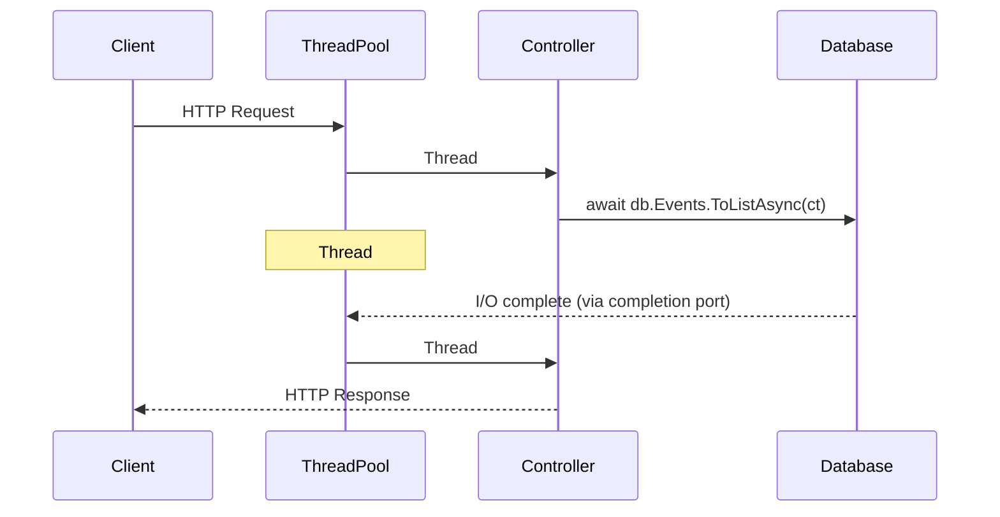

# Async/Await Patterns & Best Practices

> Reference for the ASP.NET Web Services course — Domain: **TechConf Event Management**

## Why Async Matters for Web APIs

Async/await in ASP.NET Core is about **scalability**, not speed.
A single async request doesn't complete faster — but your server can handle
**thousands more concurrent requests** because threads are not blocked waiting for I/O.

When an async controller calls `await db.Events.ToListAsync()`, the thread is
released back to the thread pool. The OS uses **I/O completion ports** to notify
.NET when the database response arrives, and a thread pool thread picks up where
it left off. No thread sits idle during the wait.

> 💡 A synchronous API with 100 threads can serve at most 100 concurrent requests.
> An async API with the same 100 threads can serve thousands.

---

## How Async Works in ASP.NET Core



### Key Insight: Concurrency, Not Speed

| Metric | Sync API | Async API |
|---|---|---|
| Single request latency | ~50 ms | ~50 ms (same!) |
| Max concurrent requests (100 threads) | 100 | 5,000+ |
| Thread pool exhaustion under load | Yes | No |

The latency of a single request is dominated by I/O (database, HTTP calls),
not by thread scheduling. Async doesn't reduce that I/O time — it frees threads
to serve **other** requests during the wait.

### No SynchronizationContext — And That's Great

Unlike WPF or WinForms, ASP.NET Core has **no `SynchronizationContext`**.
This means `await` does not try to resume on a specific thread.
Any thread pool thread can pick up the continuation, which:

- Eliminates the classic `.Result` / `.Wait()` deadlock from ASP.NET 4.x
- Removes overhead of posting back to a captured context
- Means you **never** need `ConfigureAwait(false)` in ASP.NET Core app code

> ⚠️ Library authors should still use `ConfigureAwait(false)` because their
> code may run in environments that do have a `SynchronizationContext`.

---

## The Golden Rules

### 1. Async All the Way

Every method in the call chain should be async — from controller to repository to database.

```csharp
// ❌ Bad: sync method calling async code
public List<Event> GetEvents()
{
    return _db.Events.ToListAsync().Result; // Blocks a thread!
}

// ✅ Good: async all the way
public async Task<List<Event>> GetEventsAsync(CancellationToken ct)
{
    return await _db.Events.ToListAsync(ct);
}
```

### 2. Never Use `.Result` or `.Wait()`

These block the calling thread, wasting thread pool resources and risking deadlocks.

```csharp
// ❌ Bad: blocks thread pool thread
var events = _httpClient.GetFromJsonAsync<List<Event>>(url).Result;

// ✅ Good: non-blocking
var events = await _httpClient.GetFromJsonAsync<List<Event>>(url, ct);
```

### 3. Always Pass `CancellationToken`

When a client disconnects, ASP.NET Core cancels the token. Respect it.

```csharp
// ❌ Bad: ignores client disconnect — wastes resources
app.MapGet("/api/events", async (TechConfDbContext db) =>
    await db.Events.ToListAsync());

// ✅ Good: stops work when client disconnects
app.MapGet("/api/events", async (TechConfDbContext db, CancellationToken ct) =>
    await db.Events.ToListAsync(ct));
```

### 4. Return `Task`, Not `void`

Async void methods swallow exceptions and cannot be awaited.

```csharp
// ❌ Bad: exception crashes the process
async void SendConfirmation(int eventId) { ... }

// ✅ Good: caller can await and catch exceptions
async Task SendConfirmationAsync(int eventId, CancellationToken ct) { ... }
```

---

## CancellationToken Patterns

### Basic Usage in Minimal APIs

```csharp
app.MapGet("/api/events", async (TechConfDbContext db, CancellationToken ct) =>
{
    return await db.Events.ToListAsync(ct); // Passes token to EF Core
});

app.MapGet("/api/events/{id:int}", async (int id, TechConfDbContext db, CancellationToken ct) =>
{
    return await db.Events.FindAsync([id], ct)
        is Event ev ? Results.Ok(ev) : Results.NotFound();
});
```

### Creating Linked Tokens

Combine the request cancellation with a custom timeout:

```csharp
app.MapGet("/api/events/external", async (
    IHttpClientFactory httpFactory, CancellationToken ct) =>
{
    using var timeoutCts = new CancellationTokenSource(TimeSpan.FromSeconds(5));
    using var linkedCts = CancellationTokenSource.CreateLinkedTokenSource(ct, timeoutCts.Token);

    var client = httpFactory.CreateClient();
    // Cancelled if client disconnects OR after 5 seconds
    return await client.GetFromJsonAsync<List<Event>>(
        "https://partner-api.example.com/events", linkedCts.Token);
});
```

### Checking Cancellation in Loops

```csharp
public async Task ImportEventsAsync(IEnumerable<EventDto> events, CancellationToken ct)
{
    foreach (var dto in events)
    {
        ct.ThrowIfCancellationRequested(); // Throws OperationCanceledException

        var ev = new Event { Title = dto.Title, Date = dto.Date };
        _db.Events.Add(ev);
        await _db.SaveChangesAsync(ct);
    }
}
```

| Method | Behavior |
|---|---|
| `ct.ThrowIfCancellationRequested()` | Throws `OperationCanceledException` — use in most cases |
| `if (ct.IsCancellationRequested)` | Lets you run cleanup logic before exiting |

---

## ValueTask vs Task

### When to Use `ValueTask<T>`

`ValueTask<T>` avoids a heap allocation when the result is **already available synchronously**.

```csharp
// ValueTask is beneficial here — cache hit returns synchronously
public ValueTask<Event?> GetEventAsync(int id, CancellationToken ct)
{
    if (_cache.TryGetValue(id, out Event? cached))
        return ValueTask.FromResult(cached); // No allocation

    return new ValueTask<Event?>(LoadFromDbAsync(id, ct)); // Wraps the Task
}
```

### Comparison Table

| | `Task<T>` | `ValueTask<T>` |
|---|---|---|
| Heap allocation | Always | Only if truly async |
| Await multiple times | ✅ Safe | ❌ Undefined behavior |
| Store and await later | ✅ Safe | ❌ Don't do this |
| Use `.Result` after completion | ✅ OK | ⚠️ Only once |
| EF Core return type | ✅ Used everywhere | ❌ Not used |
| HybridCache return type | — | ✅ Used here |

### ⚠️ ValueTask Rules

1. **Don't await a `ValueTask` more than once**
2. **Don't use `.Result` or `.GetAwaiter().GetResult()` before it completes**
3. **When in doubt, use `Task<T>`** — it's always safe

---

## Async Streams (`IAsyncEnumerable`)

### Streaming Responses from Minimal APIs

```csharp
app.MapGet("/api/events/stream", async IAsyncEnumerable<Event> (
    TechConfDbContext db,
    CancellationToken ct) =>
{
    await foreach (var ev in db.Events.AsAsyncEnumerable().WithCancellation(ct))
    {
        yield return ev;
    }
});
```

This streams events **one by one** to the client as chunked JSON, instead of
buffering the entire list in memory.

### When to Use Async Streams

| Use Case | Example |
|---|---|
| Large datasets | Exporting all sessions for a multi-day conference |
| Real-time feeds | Streaming live schedule updates |
| Expensive per-item processing | Enriching each event with external API data |

```csharp
// Producing an async stream with delay (e.g., polling for updates)
async IAsyncEnumerable<ScheduleUpdate> GetUpdatesAsync(
    [EnumeratorCancellation] CancellationToken ct)
{
    while (!ct.IsCancellationRequested)
    {
        var update = await _db.ScheduleUpdates.FirstOrDefaultAsync(ct);
        if (update is not null) yield return update;
        await Task.Delay(TimeSpan.FromSeconds(1), ct);
    }
}
```

---

## Parallel Async Operations

### Running Independent Queries Concurrently

```csharp
app.MapGet("/api/dashboard", async (TechConfDbContext db, CancellationToken ct) =>
{
    // ✅ Good: start all queries, then await together
    var eventsTask = db.Events.CountAsync(ct);
    var sessionsTask = db.Sessions.CountAsync(ct);
    var speakersTask = db.Speakers.CountAsync(ct);

    await Task.WhenAll(eventsTask, sessionsTask, speakersTask);

    return new DashboardStats(
        Events: await eventsTask,
        Sessions: await sessionsTask,
        Speakers: await speakersTask);
});
```

> ⚠️ With EF Core, each `DbContext` instance is **not thread-safe**.
> Use separate `DbContext` instances or `IDbContextFactory` for true parallel queries.

### `Task.WhenAll` vs `Task.WhenAny`

| Method | Use Case |
|---|---|
| `Task.WhenAll` | Wait for **all** tasks — dashboard aggregation |
| `Task.WhenAny` | React to the **first** completed task — racing redundant calls, timeouts |

### ⚠️ Don't Use `Parallel.ForEachAsync` for I/O

`Parallel.ForEachAsync` is designed for **CPU-bound** work. For I/O-bound work,
use `Task.WhenAll` or limit concurrency with `SemaphoreSlim`:

```csharp
// ✅ Limiting concurrent HTTP calls with SemaphoreSlim
public async Task EnrichEventsAsync(List<Event> events, CancellationToken ct)
{
    using var semaphore = new SemaphoreSlim(5); // Max 5 concurrent calls

    var tasks = events.Select(async ev =>
    {
        await semaphore.WaitAsync(ct);
        try
        {
            ev.ExternalData = await _httpClient.GetStringAsync(ev.DataUrl, ct);
        }
        finally
        {
            semaphore.Release();
        }
    });

    await Task.WhenAll(tasks);
}
```

---

## Common Async Anti-Patterns

### 1. Sync over Async

```csharp
// ❌ Blocks a thread pool thread — kills scalability
var events = _db.Events.ToListAsync().Result;
var events = _db.Events.ToListAsync().GetAwaiter().GetResult();
_db.SaveChangesAsync().Wait();

// ✅ Await properly
var events = await _db.Events.ToListAsync(ct);
await _db.SaveChangesAsync(ct);
```

### 2. Async Void

```csharp
// ❌ Exceptions here crash the process — no way to observe them
async void OnEventCreated(Event ev) => await _emailService.NotifyAsync(ev);

// ✅ Return Task so callers can await and handle errors
async Task OnEventCreatedAsync(Event ev, CancellationToken ct)
    => await _emailService.NotifyAsync(ev, ct);
```

### 3. Unnecessary `Task.Run` Wrapping

```csharp
// ❌ Pointless: you're already on a thread pool thread in ASP.NET Core
var events = await Task.Run(() => _db.Events.ToListAsync());

// ✅ Just await directly
var events = await _db.Events.ToListAsync(ct);
```

### 4. Not Using `await using` for Async Disposables

```csharp
// ❌ Calls synchronous Dispose — may block
using var connection = new SqlConnection(connString);

// ✅ Properly disposes asynchronously
await using var connection = new SqlConnection(connString);
```

### 5. Forgetting CancellationToken

```csharp
// ❌ Runs to completion even if client disconnects
var data = await _httpClient.GetStringAsync(url);
var events = await _db.Events.Where(e => e.IsActive).ToListAsync();

// ✅ Passes token — work stops on disconnect
var data = await _httpClient.GetStringAsync(url, ct);
var events = await _db.Events.Where(e => e.IsActive).ToListAsync(ct);
```

### 6. `Task.Run` in ASP.NET Core

```csharp
// ❌ Queues work to... the same thread pool you're already on
app.MapPost("/api/events", async (Event ev, TechConfDbContext db) =>
{
    await Task.Run(async () =>
    {
        db.Events.Add(ev);
        await db.SaveChangesAsync();
    });
});

// ✅ No need for Task.Run — just do the work directly
app.MapPost("/api/events", async (Event ev, TechConfDbContext db, CancellationToken ct) =>
{
    db.Events.Add(ev);
    await db.SaveChangesAsync(ct);
    return Results.Created($"/api/events/{ev.Id}", ev);
});
```

---

## Testing Async Code

### Basic Async Test

```csharp
[Fact]
public async Task GetEvents_ReturnsNonEmptyList()
{
    // Arrange
    var db = CreateTestDbContext();
    db.Events.Add(new Event { Title = "TechConf 2026" });
    await db.SaveChangesAsync();
    var service = new EventService(db);

    // Act
    var result = await service.GetEventsAsync(CancellationToken.None);

    // Assert
    result.Should().NotBeEmpty();
    result.First().Title.Should().Be("TechConf 2026");
}
```

### Testing Cancellation

```csharp
[Fact]
public async Task GetEvents_ThrowsOnCancellation()
{
    var cts = new CancellationTokenSource();
    cts.Cancel(); // Pre-cancel

    await Assert.ThrowsAsync<OperationCanceledException>(
        () => _service.GetEventsAsync(cts.Token));
}
```

### Testing Timeouts

```csharp
[Fact]
public async Task ExternalCall_RespectsTimeout()
{
    using var cts = new CancellationTokenSource(TimeSpan.FromMilliseconds(100));

    // Should throw because the fake handler delays 5 seconds
    await Assert.ThrowsAsync<TaskCanceledException>(
        () => _service.FetchExternalDataAsync(cts.Token));
}
```

---

## Further Reading

| Resource | Link |
|---|---|
| Async guidance (David Fowler) | [github.com/davidfowl/AspNetCoreDiagnosticScenarios](https://github.com/davidfowl/AspNetCoreDiagnosticScenarios) |
| Async best practices (Stephen Cleary) | [blog.stephencleary.com](https://blog.stephencleary.com/2012/02/async-and-await.html) |
| `ConfigureAwait` FAQ | [devblogs.microsoft.com](https://devblogs.microsoft.com/dotnet/configureawait-faq/) |
| Cancellation in .NET | [learn.microsoft.com](https://learn.microsoft.com/en-us/dotnet/standard/threading/cancellation-in-managed-threads) |
| `IAsyncEnumerable` in ASP.NET Core | [learn.microsoft.com](https://learn.microsoft.com/en-us/aspnet/core/fundamentals/middleware/) |

> 📌 When in doubt: **await it, pass the CancellationToken, return Task**.
