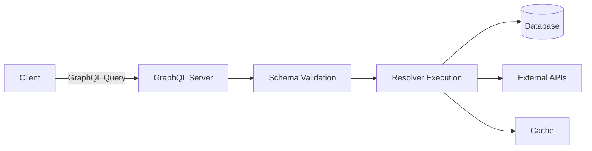
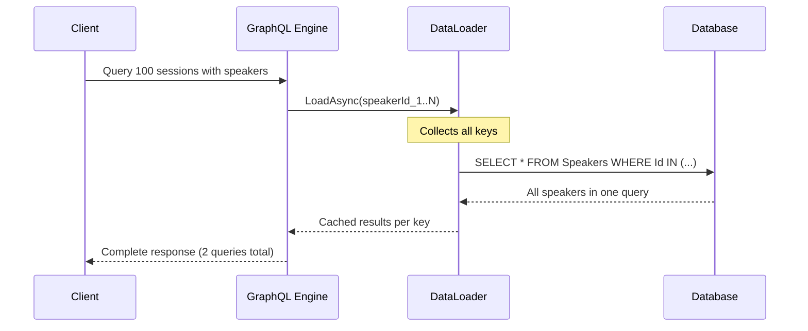

# GraphQL — Flexible API Queries with Hot Chocolate

- [Introduction](#introduction)
- [GraphQL Core Concepts](#graphql-core-concepts)
- [Setting Up Hot Chocolate](#setting-up-hot-chocolate)
- [Queries — Reading Data](#queries--reading-data)
- [Mutations — Writing Data](#mutations--writing-data)
- [Subscriptions — Real-time](#subscriptions--real-time)
- [DataLoader — Solving N+1](#dataloader--solving-n1)
- [Filtering, Sorting & Pagination](#filtering-sorting--pagination)
- [Authentication & Authorization](#authentication--authorization)
- [Banana Cake Pop — GraphQL IDE](#banana-cake-pop--graphql-ide)
- [Error Handling](#error-handling)
- [GraphQL vs REST Comparison](#graphql-vs-rest-comparison)
- [Common Pitfalls](#common-pitfalls)
- [Try It Yourself](#try-it-yourself)
- [Further Reading](#further-reading)

---

## Introduction

**GraphQL** is a query language for APIs developed by Facebook in 2012 and open-sourced in 2015. It was created to solve a mobile engineering problem: the News Feed needed deeply nested data, but REST endpoints either returned too much (**over-fetching**) or required many requests (**under-fetching**).

GraphQL lets the **client specify exactly which fields** it needs in a single request. The server exposes a strongly-typed **schema**, and clients query against it. Two approaches exist:

- **Schema-first**: Write GraphQL SDL by hand, then implement resolvers. Common in JavaScript.
- **Code-first**: Write C# classes and the framework generates the schema. Standard in .NET.

**Hot Chocolate** is the most mature GraphQL server library for .NET. It integrates with ASP.NET Core and EF Core, supporting queries, mutations, subscriptions, DataLoader, filtering, sorting, and pagination — all code-first.

> Throughout this document we use the **TechConf Event Management** domain: Events, Sessions, Speakers, Attendees, and Registrations.

---

## GraphQL Core Concepts

### Schema and Type System

The **schema** defines available data, mutations, and subscriptions. The type system includes:

- **Scalar types**: `Int`, `Float`, `String`, `Boolean`, `ID` — plus `DateTime`, `UUID`
- **Object types**: Complex types with fields (e.g., `Event`, `Speaker`)
- **Enum types**: Fixed value sets (e.g., `EventStatus { DRAFT, PUBLISHED, CANCELLED }`)
- **Input types**: Used exclusively for mutation arguments
- **Interfaces / Unions**: Abstract types for polymorphism
- **Non-null (`!`)** and **List (`[]`)**: Type modifiers

### Operations

| Operation        | Purpose                        | HTTP Analogy       |
|-----------------|--------------------------------|--------------------|
| **Query**       | Read data                      | GET                |
| **Mutation**    | Write / modify data            | POST, PUT, DELETE  |
| **Subscription**| Real-time via WebSockets       | WebSocket / SSE    |

### Query Language

- **Fields**: Select exactly which fields to return
- **Arguments**: Pass parameters (`event(id: "...")`)
- **Aliases**: Rename fields in the response
- **Fragments**: Reusable field sets to avoid duplication
- **Variables**: Parameterize queries (`$id: ID!`)

### Resolvers

A **resolver** is a function that produces the value for a single field. The engine walks the query tree and calls resolvers for each requested field.

### Architecture



The server validates every query against the schema **before** execution — invalid queries never reach a resolver.

---

## Setting Up Hot Chocolate

### NuGet Packages

```bash
dotnet add package HotChocolate.AspNetCore
dotnet add package HotChocolate.Data.EntityFramework
```

| Package | Purpose |
|---------|---------|
| `HotChocolate.AspNetCore` | Core server, middleware, Banana Cake Pop UI |
| `HotChocolate.Data.EntityFramework` | EF Core filtering, sorting, projections |

### Service Registration and Endpoint

```csharp
builder.Services
    .AddGraphQLServer()
    .AddQueryType<Query>()
    .AddMutationType<Mutation>()
    .AddSubscriptionType<Subscription>()
    .AddFiltering()
    .AddSorting()
    .AddProjections()
    .RegisterDbContext<TechConfDbContext>();

app.MapGraphQL(); // Serves at /graphql (includes Banana Cake Pop UI)
```

---

## Queries — Reading Data

### Basic Query Type

```csharp
public class Query
{
    [UseDbContext(typeof(TechConfDbContext))]
    [UseProjection]
    [UseFiltering]
    [UseSorting]
    public IQueryable<Event> GetEvents([Service] TechConfDbContext db)
        => db.Events;

    [UseDbContext(typeof(TechConfDbContext))]
    [UseFirstOrDefault]
    public IQueryable<Event> GetEventById(
        [Service] TechConfDbContext db, Guid id)
        => db.Events.Where(e => e.Id == id);
}
```

> **Attribute order matters.** Correct: `[UseDbContext]` → `[UsePaging]` → `[UseProjection]` → `[UseFiltering]` → `[UseSorting]`.

### Example GraphQL Queries

```graphql
# Get published events with nested data — no over-fetching
query {
  events(where: { status: { eq: PUBLISHED } }) {
    id
    title
    startDate
    sessions {
      title
      speaker { name, company }
    }
  }
}

# Get specific event
query {
  eventById(id: "550e8400-e29b-41d4-a716-446655440000") {
    title
    description
    location
    registrations { totalCount }
  }
}

# Aliases: multiple datasets in one request
query {
  upcoming: events(where: { startDate: { gte: "2026-01-01" } }, order: { startDate: ASC }) {
    title
    startDate
  }
  past: events(where: { endDate: { lt: "2026-01-01" } }) {
    title
  }
}
```

### Cursor-based Pagination

```csharp
[UsePaging(IncludeTotalCount = true)]
[UseProjection]
[UseFiltering]
[UseSorting]
public IQueryable<Session> GetSessions([Service] TechConfDbContext db)
    => db.Sessions;
```

```graphql
query {
  sessions(first: 10, after: "Y3Vyc29yMTA=") {
    totalCount
    pageInfo { hasNextPage, endCursor }
    edges { cursor, node { title, speaker { name } } }
  }
}
```

With `[UseProjection]`, Hot Chocolate translates the selection set into LINQ expressions, so EF Core generates SQL selecting only the requested columns and joins.

---

## Mutations — Writing Data

### Defining Mutations

```csharp
public class Mutation
{
    public async Task<Event> CreateEvent(
        CreateEventInput input,
        [Service] TechConfDbContext db,
        CancellationToken ct)
    {
        var ev = new Event
        {
            Id = Guid.NewGuid(),
            Title = input.Title,
            Description = input.Description,
            StartDate = input.StartDate,
            EndDate = input.EndDate,
            Location = input.Location,
            MaxAttendees = input.MaxAttendees,
            Status = EventStatus.Draft
        };
        db.Events.Add(ev);
        await db.SaveChangesAsync(ct);
        return ev;
    }
}

public record CreateEventInput(
    string Title, string? Description,
    DateTime StartDate, DateTime EndDate,
    string Location, int MaxAttendees);
```

### Calling a Mutation

```graphql
mutation {
  createEvent(input: {
    title: "TechConf 2026"
    description: "Annual developer conference"
    startDate: "2026-11-10T09:00:00Z"
    endDate: "2026-11-12T17:00:00Z"
    location: "Munich"
    maxAttendees: 1000
  }) {
    id
    title
    status
  }
}
```

### Conventions

- **Naming**: Verb-noun format (`createEvent`, `cancelRegistration`)
- **Input wrapping**: Always use a dedicated input type
- **Return type**: Return the modified entity so clients can update local state

---

## Subscriptions — Real-time

### Setup and Definition

```csharp
builder.Services
    .AddGraphQLServer()
    .AddSubscriptionType<Subscription>()
    .AddInMemorySubscriptions();

app.UseWebSockets();
app.MapGraphQL();
```

```csharp
public class Subscription
{
    [Subscribe]
    [Topic("EventUpdated_{eventId}")]
    public Event OnEventUpdated([EventMessage] Event @event, Guid eventId)
        => @event;
}
```

### Publishing from Mutations

```csharp
public async Task<Event> UpdateEvent(
    UpdateEventInput input, [Service] TechConfDbContext db,
    [Service] ITopicEventSender sender, CancellationToken ct)
{
    var ev = await db.Events.FindAsync(new object[] { input.Id }, ct);
    ev!.Title = input.Title;
    await db.SaveChangesAsync(ct);
    await sender.SendAsync($"EventUpdated_{ev.Id}", ev, ct);
    return ev;
}
```

```graphql
subscription {
  onEventUpdated(eventId: "550e8400-e29b-41d4-a716-446655440000") {
    title
    status
  }
}
```

| Aspect | GraphQL Subscriptions | SignalR |
|--------|-----------------------|---------|
| Protocol | WebSocket (graphql-ws) | WebSocket / SSE / Long Polling |
| Data shape | Client selects fields | Server defines payload |
| Best for | GraphQL-first APIs | General real-time .NET apps |

---

## DataLoader — Solving N+1

### The Problem

```graphql
query {
  sessions {           # 1 query: SELECT * FROM Sessions
    title
    speaker { name }   # N queries: one per session
  }
}
```

100 sessions → **101 SQL queries**. DataLoader batches and caches within a request.

### BatchDataLoader (Many-to-One)

```csharp
public class SpeakerByIdDataLoader : BatchDataLoader<Guid, Speaker>
{
    private readonly IDbContextFactory<TechConfDbContext> _dbFactory;

    public SpeakerByIdDataLoader(
        IDbContextFactory<TechConfDbContext> dbFactory,
        IBatchScheduler batchScheduler,
        DataLoaderOptions? options = null)
        : base(batchScheduler, options) => _dbFactory = dbFactory;

    protected override async Task<IReadOnlyDictionary<Guid, Speaker>> LoadBatchAsync(
        IReadOnlyList<Guid> keys, CancellationToken ct)
    {
        await using var db = await _dbFactory.CreateDbContextAsync(ct);
        return await db.Speakers
            .Where(s => keys.Contains(s.Id))
            .ToDictionaryAsync(s => s.Id, ct);
    }
}

// Usage in a type extension resolver
[ExtendObjectType(typeof(Session))]
public class SessionResolvers
{
    public async Task<Speaker> GetSpeaker(
        [Parent] Session session,
        SpeakerByIdDataLoader loader, CancellationToken ct)
        => await loader.LoadAsync(session.SpeakerId, ct);
}
```

### GroupedDataLoader (One-to-Many)

```csharp
public class SessionsByEventIdDataLoader : GroupedDataLoader<Guid, Session>
{
    private readonly IDbContextFactory<TechConfDbContext> _dbFactory;

    public SessionsByEventIdDataLoader(
        IDbContextFactory<TechConfDbContext> dbFactory,
        IBatchScheduler batchScheduler,
        DataLoaderOptions? options = null)
        : base(batchScheduler, options) => _dbFactory = dbFactory;

    protected override async Task<ILookup<Guid, Session>> LoadGroupedBatchAsync(
        IReadOnlyList<Guid> keys, CancellationToken ct)
    {
        await using var db = await _dbFactory.CreateDbContextAsync(ct);
        var sessions = await db.Sessions
            .Where(s => keys.Contains(s.EventId)).ToListAsync(ct);
        return sessions.ToLookup(s => s.EventId);
    }
}
```

### How Batching Works



---

## Filtering, Sorting & Pagination

### Filtering with `[UseFiltering]`

```graphql
query {
  events(where: {
    and: [
      { status: { eq: PUBLISHED } }
      { startDate: { gte: "2026-01-01" } }
      { location: { contains: "Munich" } }
    ]
  }) { title, startDate }
}
```

Operations by type: **String** — `eq`, `contains`, `startsWith`, `endsWith`, `in`; **Numeric/DateTime** — `eq`, `gt`, `gte`, `lt`, `lte`, `in`; **Logical** — `and`, `or`, `not`.

### Sorting with `[UseSorting]`

```graphql
query {
  speakers(order: [{ company: ASC }, { name: ASC }]) { name, company }
}
```

### Offset Pagination with `[UseOffsetPaging]`

```graphql
query {
  events(skip: 20, take: 10) {
    totalCount
    pageInfo { hasNextPage }
    items { title, startDate }
  }
}
```

### Custom Filter Conventions

```csharp
public class EventFilterType : FilterInputType<Event>
{
    protected override void Configure(IFilterInputTypeDescriptor<Event> descriptor)
    {
        descriptor.BindFieldsExplicitly();
        descriptor.Field(e => e.Title);
        descriptor.Field(e => e.Status);
        descriptor.Field(e => e.StartDate);
    }
}
```

---

## Authentication & Authorization

```csharp
builder.Services.AddAuthorization();
builder.Services.AddGraphQLServer().AddAuthorization();
```

### Resolver and Policy Authorization

```csharp
[Authorize(Roles = new[] { "admin", "organizer" })]
public async Task<Event> CreateEvent(CreateEventInput input, ...) { }

// Or with policies
[Authorize(Policy = "CanManageEvents")]
public async Task<Event> UpdateEvent(...) { }
```

### Accessing the Current User

```csharp
public IQueryable<Registration> GetMyRegistrations(
    [Service] TechConfDbContext db, ClaimsPrincipal user)
{
    var userId = Guid.Parse(user.FindFirstValue(ClaimTypes.NameIdentifier)!);
    return db.Registrations.Where(r => r.AttendeeId == userId);
}
```

### Field-level Authorization

```csharp
[ExtendObjectType(typeof(Attendee))]
public class AttendeeResolvers
{
    [Authorize(Roles = new[] { "admin" })]
    public string GetEmail([Parent] Attendee attendee) => attendee.Email;
}
```

---

## Banana Cake Pop — GraphQL IDE

**Banana Cake Pop** is Hot Chocolate's built-in GraphQL IDE, served at `/graphql` when accessed from a browser. Features: schema explorer, query editor with autocomplete, variables panel, query history, and multi-tab support.

Navigate to `https://localhost:5001/graphql` in development — no setup required. Disable in production:

```csharp
app.MapGraphQL().WithOptions(new GraphQLServerOptions { Tool = { Enable = false } });
```

| Tool | Description |
|------|-------------|
| **Banana Cake Pop** | Built into Hot Chocolate, zero config |
| **GraphiQL** | Facebook's reference IDE, lightweight |
| **Insomnia / Postman** | General API clients with GraphQL support |
| **Altair** | Feature-rich standalone GraphQL client |

---

## Error Handling

GraphQL always returns HTTP 200 — errors are in the response body:

```json
{
  "data": null,
  "errors": [{
    "message": "Event not found.",
    "path": ["eventById"],
    "extensions": { "code": "EVENT_NOT_FOUND" }
  }]
}
```

### Mutation Conventions with Error Types

```csharp
[Error(typeof(EventNotFoundException))]
[Error(typeof(ValidationException))]
public async Task<Event> CreateEvent(CreateEventInput input, ...) { }
```

Enable mutation conventions for typed error unions:

```csharp
builder.Services.AddGraphQLServer().AddMutationConventions(applyToAllMutations: true);
```

**Partial success**: If one resolver fails, successful fields still return data while the failed field returns `null` with an error — clients can gracefully degrade.

---

## GraphQL vs REST Comparison

| Feature | REST (Minimal APIs) | GraphQL (Hot Chocolate) |
|---------|---------------------|------------------------|
| **Data fetching** | Fixed response shape | Client chooses exact fields |
| **Over-fetching** | Common problem | Solved by design |
| **Under-fetching** | Multiple requests needed | Single query for nested data |
| **Endpoints** | Many (`/events`, `/sessions`) | Single (`/graphql`) |
| **HTTP methods** | GET, POST, PUT, DELETE | POST only |
| **Status codes** | Full HTTP semantics | Always 200, errors in body |
| **Caching** | HTTP caching (simple) | Complex (no URL-based cache) |
| **File upload** | Standard multipart | Requires multipart spec |
| **Versioning** | URL/header versioning | Schema evolution (`@deprecated`) |
| **Error handling** | Status codes + problem details | Errors array alongside data |
| **Tooling maturity** | Very high | High and growing |
| **Learning curve** | Low | Medium-High |
| **Real-time** | SignalR / SSE | Subscriptions (built-in) |
| **Best for** | Public APIs, CRUD, microservices | Complex nested data, mobile/SPA |
| **N+1 prevention** | Server responsibility | DataLoader pattern |
| **Schema / contract** | OpenAPI / Swagger | GraphQL SDL (introspectable) |
| **Discoverability** | Swagger UI | Banana Cake Pop |
| **Bandwidth** | Can waste bandwidth | Minimal payload |

**Choose REST** for public APIs, HTTP caching, flat data, and broad familiarity. **Choose GraphQL** when clients need different data subsets, data is deeply nested, or multiple frontends share one API.

> Many production systems use **both**: REST for CRUD and public APIs, GraphQL for complex data fetching.

---

## Common Pitfalls

⚠️ **N+1 queries without DataLoader** — Every nested resolver querying the database produces N+1 queries. Always use `BatchDataLoader` or `GroupedDataLoader`.

⚠️ **Query complexity attacks** — Set depth and complexity limits:

```csharp
builder.Services.AddGraphQLServer()
    .AddMaxExecutionDepthRule(15)
    .SetRequestOptions(opt => opt.Complexity.MaxAllowed = 1000);
```

⚠️ **Over-exposing database schema** — Mapping EF entities directly to GraphQL types exposes internals. Consider separate GraphQL types.

⚠️ **Not using projections** — Without `[UseProjection]`, full entities are loaded even when clients request two fields.

⚠️ **Wrong attribute order** — Correct: `[UseDbContext]` → `[UsePaging]` → `[UseProjection]` → `[UseFiltering]` → `[UseSorting]`.

💡 Always add `[UseProjection]` for `IQueryable` resolvers.

💡 Set depth and complexity limits in production.

💡 Use `IDbContextFactory` with DataLoaders — they outlive a single DbContext scope.

💡 Prefer cursor-based pagination — stable under data changes, better for large datasets.

---

## Try It Yourself

1. **Set up Hot Chocolate** — New ASP.NET Core project, install packages, define `Event`/`Session` entities with in-memory EF Core, register the GraphQL server.

2. **Queries with filtering** — Add `[UseFiltering]`, `[UseSorting]`, `[UsePaging]`. Test: `where: { title: { contains: "Tech" } }`.

3. **Registration mutation** — Implement `RegisterAttendee` with validation (event exists, has capacity).

4. **DataLoader** — Create `SpeakerByIdDataLoader`. Verify via SQL logging that speakers are fetched in one batch.

5. **Explore** — Open Banana Cake Pop at `/graphql` and browse filter types, sorting enums, and connection types.

---

## Further Reading

- [Hot Chocolate Documentation](https://chillicream.com/docs/hotchocolate)
- [GraphQL Specification](https://spec.graphql.org/)
- [GraphQL Official — Learn](https://graphql.org/learn/)
- [Hot Chocolate GitHub](https://github.com/ChilliCream/graphql-platform)
- [Banana Cake Pop](https://chillicream.com/products/bananacakepop)
- [DataLoader Pattern](https://chillicream.com/docs/hotchocolate/fetching-data/dataloader)
- [GraphQL Best Practices](https://graphql.org/learn/best-practices/)
- [Filtering Docs](https://chillicream.com/docs/hotchocolate/fetching-data/filtering)
