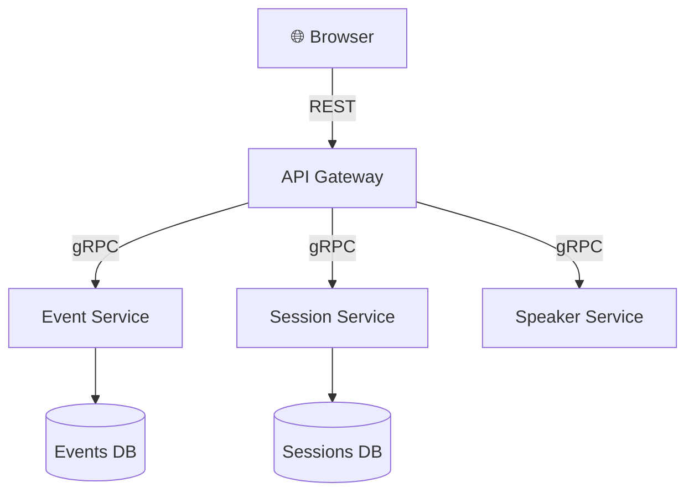

# gRPC — High-Performance RPC for .NET

## Introduction

**gRPC** (Google Remote Procedure Call) is a modern, open-source RPC framework originally developed by Google. It enables efficient, strongly-typed communication between services across languages and platforms.

Unlike REST, where you model everything as resources and HTTP verbs, gRPC models your API as **remote procedure calls** — you define services with methods, and the framework generates client and server code for you.

### Why gRPC?

- **High performance**: Binary serialization (Protobuf) is 5–10× faster and smaller than JSON
- **Strongly typed contracts**: `.proto` files serve as the single source of truth
- **HTTP/2 foundation**: Multiplexed streams, header compression, bidirectional streaming
- **Cross-language**: Generate clients in C#, Go, Python, Java, TypeScript, and more
- **Built-in streaming**: Server, client, and bidirectional streaming out of the box

| Scenario | Recommendation |
|----------|---------------|
| Microservice ↔ Microservice | ✅ gRPC |
| Public API for external consumers | ✅ REST |
| Real-time data streaming | ✅ gRPC streaming |
| Browser-based frontend | ✅ REST (or gRPC-Web) |

> 💡 This document uses the **TechConf Event Management** domain (Events, Sessions, Speakers, Attendees, Registrations) — the same domain used throughout the course.

---

## Protocol Buffers (Protobuf)

Protocol Buffers (Protobuf) is a **language-neutral, platform-neutral** serialization format. It serves as both the **Interface Definition Language (IDL)** and the **wire format** for gRPC.

### `.proto` File — TechConf Example

```protobuf
syntax = "proto3";

option csharp_namespace = "TechConf.Grpc";

import "google/protobuf/timestamp.proto";
import "google/protobuf/empty.proto";

package techconf;

service EventService {
  rpc GetEvents (GetEventsRequest) returns (GetEventsResponse);
  rpc GetEventById (GetEventByIdRequest) returns (EventMessage);
  rpc CreateEvent (CreateEventRequest) returns (EventMessage);
  rpc UpdateEvent (UpdateEventRequest) returns (EventMessage);
  rpc DeleteEvent (DeleteEventRequest) returns (google.protobuf.Empty);
}

message EventMessage {
  string id = 1;
  string title = 2;
  string description = 3;
  google.protobuf.Timestamp start_date = 4;
  google.protobuf.Timestamp end_date = 5;
  string location = 6;
  int32 max_attendees = 7;
  EventStatus status = 8;
}

enum EventStatus {
  EVENT_STATUS_UNSPECIFIED = 0;
  EVENT_STATUS_DRAFT = 1;
  EVENT_STATUS_PUBLISHED = 2;
  EVENT_STATUS_CANCELLED = 3;
}

message GetEventsRequest {
  string search = 1;
  int32 page = 2;
  int32 page_size = 3;
}

message GetEventsResponse {
  repeated EventMessage events = 1;
  int32 total_count = 2;
}

message GetEventByIdRequest { string id = 1; }
message DeleteEventRequest { string id = 1; }

// CreateEventRequest / UpdateEventRequest follow the same pattern —
// include the fields the client needs to send for that operation.
```

### Field Numbering & Compatibility

- Each field has a **unique number** used in binary encoding (numbers 1–15 use 1 byte)
- ⚠️ **Never reuse a deleted field number** — use `reserved` to protect them:
```protobuf
message EventMessage {
  reserved 9, 10;
  reserved "old_field_name";
}
```

### Well-Known Types

| Type | Import | C# Type | Use Case |
|------|--------|---------|----------|
| `Timestamp` | `google/protobuf/timestamp.proto` | `Timestamp` → `DateTime` | Points in time |
| `Duration` | `google/protobuf/duration.proto` | `Duration` → `TimeSpan` | Time spans |
| `Empty` | `google/protobuf/empty.proto` | `Empty` | No-data responses |
| `Any` | `google/protobuf/any.proto` | `Any` | Polymorphic messages |

### Protobuf → C# Type Mapping

| Protobuf | C# | Notes |
|----------|-----|-------|
| `double` / `float` | `double` / `float` | IEEE 754 |
| `int32` / `int64` | `int` / `long` | Variable-length |
| `bool` | `bool` | |
| `string` | `string` | UTF-8 |
| `bytes` | `ByteString` | Binary data |
| `repeated T` | `RepeatedField<T>` | List |
| `map<K,V>` | `MapField<K,V>` | Dictionary |

---

## Setting Up gRPC in ASP.NET Core

### 1. Create the Project

```bash
dotnet new grpc -n TechConf.Grpc
# Or add to existing project:
dotnet add package Grpc.AspNetCore
```

### 2. Add `.proto` to `.csproj`

```xml
<ItemGroup>
  <Protobuf Include="Protos\event.proto" GrpcServices="Server" />
</ItemGroup>
```

Use `GrpcServices="Client"` for client projects or `"Both"` for shared projects.

### 3. Code Generation (Build Time)

At build, the Protobuf tooling generates under `obj/`:
- **Message classes** — C# classes for each `message`
- **Service base class** — abstract class to override
- **Client class** — strongly-typed client stub

> 💡 Generated code lives in `obj/` — never edit it directly.

### 4. Project Structure

```
TechConf.Grpc/
├── Protos/
│   ├── event.proto
│   └── session.proto
├── Services/
│   ├── EventGrpcService.cs
│   └── SessionGrpcService.cs
├── Program.cs
└── TechConf.Grpc.csproj
```

### 5. Register in `Program.cs`

```csharp
var builder = WebApplication.CreateBuilder(args);
builder.Services.AddGrpc();

var app = builder.Build();
app.MapGrpcService<EventGrpcService>();
app.Run();
```

---

## Implementing a gRPC Service

```csharp
public class EventGrpcService : EventService.EventServiceBase
{
    private readonly TechConfDbContext _db;
    private readonly ILogger<EventGrpcService> _logger;

    public EventGrpcService(TechConfDbContext db, ILogger<EventGrpcService> logger)
    {
        _db = db;
        _logger = logger;
    }

    public override async Task<GetEventsResponse> GetEvents(
        GetEventsRequest request, ServerCallContext context)
    {
        var query = _db.Events.AsNoTracking();

        if (!string.IsNullOrEmpty(request.Search))
            query = query.Where(e => e.Title.Contains(request.Search));

        var total = await query.CountAsync(context.CancellationToken);
        var events = await query
            .OrderBy(e => e.StartDate)
            .Skip((request.Page - 1) * request.PageSize)
            .Take(request.PageSize)
            .ToListAsync(context.CancellationToken);

        var response = new GetEventsResponse { TotalCount = total };
        response.Events.AddRange(events.Select(MapToMessage));
        return response;
    }

    public override async Task<EventMessage> GetEventById(
        GetEventByIdRequest request, ServerCallContext context)
    {
        var ev = await _db.Events.FindAsync(
            new object[] { request.Id }, context.CancellationToken);

        if (ev is null)
            throw new RpcException(new Status(StatusCode.NotFound,
                $"Event '{request.Id}' not found"));

        return MapToMessage(ev);
    }

    public override async Task<EventMessage> CreateEvent(
        CreateEventRequest request, ServerCallContext context)
    {
        var ev = new Event
        {
            Id = Guid.NewGuid().ToString(),
            Title = request.Title,
            Description = request.Description,
            StartDate = request.StartDate.ToDateTime(),
            EndDate = request.EndDate.ToDateTime(),
            Location = request.Location,
            MaxAttendees = request.MaxAttendees,
            Status = Domain.EventStatus.Draft
        };

        _db.Events.Add(ev);
        await _db.SaveChangesAsync(context.CancellationToken);
        _logger.LogInformation("Created event {Id}: {Title}", ev.Id, ev.Title);
        return MapToMessage(ev);
    }

    public override async Task<Empty> DeleteEvent(
        DeleteEventRequest request, ServerCallContext context)
    {
        var ev = await _db.Events.FindAsync(
            new object[] { request.Id }, context.CancellationToken)
            ?? throw new RpcException(new Status(StatusCode.NotFound,
                $"Event '{request.Id}' not found"));

        _db.Events.Remove(ev);
        await _db.SaveChangesAsync(context.CancellationToken);
        return new Empty();
    }

    private static EventMessage MapToMessage(Event ev) => new()
    {
        Id = ev.Id, Title = ev.Title, Description = ev.Description ?? "",
        StartDate = Timestamp.FromDateTime(ev.StartDate.ToUniversalTime()),
        EndDate = Timestamp.FromDateTime(ev.EndDate.ToUniversalTime()),
        Location = ev.Location ?? "", MaxAttendees = ev.MaxAttendees,
        Status = (EventStatus)ev.Status
    };
}
```

### Error Handling — gRPC Status Codes

| gRPC Status Code | HTTP Equiv. | When to Use |
|------------------|-------------|-------------|
| `OK` | 200 | Success |
| `NotFound` | 404 | Resource missing |
| `InvalidArgument` | 400 | Bad request data |
| `AlreadyExists` | 409 | Duplicate resource |
| `PermissionDenied` | 403 | Insufficient permissions |
| `Unauthenticated` | 401 | Missing credentials |
| `Internal` | 500 | Unhandled server error |
| `Unavailable` | 503 | Service down |
| `DeadlineExceeded` | 504 | Timeout |

```csharp
throw new RpcException(new Status(StatusCode.InvalidArgument, "Title is required"));
```

---

## gRPC Client

### Basic Usage

```csharp
var channel = GrpcChannel.ForAddress("https://localhost:5001");
var client = new EventService.EventServiceClient(channel);

var response = await client.GetEventsAsync(new GetEventsRequest
{
    Search = "TechConf",
    Page = 1,
    PageSize = 20
});

foreach (var ev in response.Events)
    Console.WriteLine($"{ev.Title} — {ev.Location}");
```

### Client Factory with DI (Production)

```bash
dotnet add package Grpc.Net.ClientFactory
```

```csharp
builder.Services.AddGrpcClient<EventService.EventServiceClient>(options =>
{
    options.Address = new Uri("https://localhost:5001");
})
.ConfigurePrimaryHttpMessageHandler(() => new SocketsHttpHandler
{
    PooledConnectionIdleTimeout = Timeout.InfiniteTimeSpan,
    KeepAlivePingDelay = TimeSpan.FromSeconds(60),
    EnableMultipleHttp2Connections = true
});
```

### Interceptors (Client Middleware)

Interceptors are the gRPC equivalent of HTTP delegating handlers — use them for logging, auth headers, retries, etc.

```csharp
public class LoggingInterceptor : Interceptor
{
    public override AsyncUnaryCall<TResponse> AsyncUnaryCall<TRequest, TResponse>(
        TRequest request, ClientInterceptorContext<TRequest, TResponse> context,
        AsyncUnaryCallContinuation<TRequest, TResponse> continuation)
    {
        Console.WriteLine($"gRPC call: {context.Method.FullName}");
        return continuation(request, context);
    }
}

// Register: .AddGrpcClient<...>(...).AddInterceptor<LoggingInterceptor>();
```

---

## Streaming

gRPC supports three streaming patterns on top of HTTP/2:

### Server Streaming

```protobuf
rpc StreamSessionUpdates (StreamSessionRequest) returns (stream SessionUpdate);
```

```csharp
// Server
public override async Task StreamSessionUpdates(
    StreamSessionRequest request,
    IServerStreamWriter<SessionUpdate> responseStream,
    ServerCallContext context)
{
    while (!context.CancellationToken.IsCancellationRequested)
    {
        var update = await GetLatestUpdate(request.SessionId);
        await responseStream.WriteAsync(update);
        await Task.Delay(TimeSpan.FromSeconds(5), context.CancellationToken);
    }
}

// Client
using var call = client.StreamSessionUpdates(
    new StreamSessionRequest { SessionId = "session-42" });

await foreach (var update in call.ResponseStream.ReadAllAsync())
    Console.WriteLine($"[{update.Timestamp}] {update.Title}: {update.CurrentAttendees}");
```

### Client Streaming

```protobuf
rpc BatchCreateSessions (stream CreateSessionRequest) returns (BatchCreateResponse);
```

```csharp
// Server
public override async Task<BatchCreateResponse> BatchCreateSessions(
    IAsyncStreamReader<CreateSessionRequest> requestStream,
    ServerCallContext context)
{
    var response = new BatchCreateResponse();
    await foreach (var req in requestStream.ReadAllAsync())
    {
        _db.Sessions.Add(new Session { Id = Guid.NewGuid().ToString(), Title = req.Title });
        response.CreatedCount++;
    }
    await _db.SaveChangesAsync(context.CancellationToken);
    return response;
}

// Client
using var call = client.BatchCreateSessions();
foreach (var s in sessionsToCreate)
    await call.RequestStream.WriteAsync(new CreateSessionRequest { Title = s.Title });
await call.RequestStream.CompleteAsync();
var result = await call;
```

### Bidirectional Streaming

```protobuf
rpc LiveChat (stream ChatMessage) returns (stream ChatMessage);
```

```csharp
public override async Task LiveChat(
    IAsyncStreamReader<ChatMessage> requestStream,
    IServerStreamWriter<ChatMessage> responseStream,
    ServerCallContext context)
{
    await foreach (var msg in requestStream.ReadAllAsync())
        await responseStream.WriteAsync(new ChatMessage
        {
            User = "Server", Text = $"Echo: {msg.Text}",
            SentAt = Timestamp.FromDateTime(DateTime.UtcNow)
        });
}
```

### When to Use Each Pattern

| Pattern | Direction | Use Case |
|---------|-----------|----------|
| Unary | 1 → 1 | Standard CRUD operations |
| Server streaming | 1 → N | Live updates, data feeds, logs |
| Client streaming | N → 1 | Batch uploads, file transfers |
| Bidirectional | N ↔ N | Chat, real-time collaboration |

---

## gRPC-Web for Browser Clients

Browsers don't support HTTP/2 trailers that gRPC requires. **gRPC-Web** bridges this gap.

```bash
dotnet add package Grpc.AspNetCore.Web
```

```csharp
builder.Services.AddGrpc();
builder.Services.AddCors(o => o.AddDefaultPolicy(p =>
    p.AllowAnyOrigin().AllowAnyMethod().AllowAnyHeader()
     .WithExposedHeaders("Grpc-Status", "Grpc-Message")));

app.UseCors();
app.UseGrpcWeb();
app.MapGrpcService<EventGrpcService>().EnableGrpcWeb();
```

### TypeScript Client (`grpc-web`)

```typescript
const client = new EventServiceClient('https://localhost:5001');
const request = new GetEventsRequest();
request.setSearch('TechConf');
request.setPage(1);

client.getEvents(request, {}, (err, response) => {
  if (err) { console.error(err.message); return; }
  response.getEventsList().forEach(e => console.log(e.getTitle()));
});
```

### Limitations

| Feature | Native gRPC | gRPC-Web |
|---------|------------|----------|
| Unary calls | ✅ | ✅ |
| Server streaming | ✅ | ✅ |
| Client streaming | ✅ | ❌ |
| Bidirectional | ✅ | ❌ |

> 💡 For full browser streaming, consider **SignalR** instead.

---

## gRPC with .NET Aspire

```csharp
// AppHost
var builder = DistributedApplication.CreateBuilder(args);

var techconfDb = builder.AddPostgres("postgres")
    .AddDatabase("techconfdb");

var grpcService = builder.AddProject<Projects.TechConf_Grpc>("grpc-api")
    .WithReference(techconfDb);

var apiProject = builder.AddProject<Projects.TechConf_Api>("api")
    .WithReference(grpcService);

builder.Build().Run();
```

### Service Discovery

Aspire resolves gRPC addresses automatically — no hard-coded ports:

```csharp
builder.Services.AddGrpcClient<EventService.EventServiceClient>(options =>
{
    options.Address = new Uri("https+http://grpc-api");
});
```

### Health Checks

```csharp
builder.Services.AddGrpcHealthChecks()
    .AddCheck("database", new DbHealthCheck(connectionString));
app.MapGrpcHealthChecksService();
```

---

## gRPC Reflection & Testing

### Reflection (Runtime Discoverability)

```bash
dotnet add package Grpc.AspNetCore.Server.Reflection
```

```csharp
builder.Services.AddGrpcReflection();
// ...
app.MapGrpcReflectionService();
```

### Testing with `grpcurl`

```bash
grpcurl -plaintext localhost:5001 list
grpcurl -plaintext localhost:5001 describe techconf.EventService
grpcurl -plaintext -d '{"search":"","page":1,"page_size":10}' \
  localhost:5001 techconf.EventService/GetEvents
```

### Testing with `grpcui`

```bash
grpcui -plaintext localhost:5001   # Opens a Swagger-like web UI
```

### Integration Testing

```csharp
[Fact]
public async Task GetEvents_ReturnsEvents()
{
    var channel = GrpcChannel.ForAddress(_factory.Server.BaseAddress!, new()
    {
        HttpHandler = _factory.Server.CreateHandler()
    });
    var client = new EventService.EventServiceClient(channel);
    var response = await client.GetEventsAsync(new GetEventsRequest { Page = 1, PageSize = 10 });
    Assert.True(response.TotalCount >= 0);
}
```

---

## gRPC vs REST — Comprehensive Comparison

| Feature | REST (Minimal APIs) | gRPC |
|---------|-------------------|------|
| **Protocol** | HTTP/1.1 or HTTP/2 | HTTP/2 only |
| **Serialization** | JSON (text) | Protobuf (binary) |
| **Contract** | OpenAPI (optional) | `.proto` (required) |
| **Browser support** | Native | Via gRPC-Web |
| **Streaming** | SSE / WebSocket / SignalR | Built-in (3 types) |
| **Code generation** | Optional | Required (built-in) |
| **Performance** | Good | Excellent (5–10×) |
| **Human readability** | High | Low (binary) |
| **Tooling** | curl, Postman, .http | grpcurl, grpcui |
| **Learning curve** | Low | Medium |
| **Caching** | HTTP caching (ETags) | Not natively supported |
| **Best for** | Public APIs, web frontends | Microservice-to-microservice |

### Architecture: Where Each Fits



**Choose gRPC when:** internal services, high performance, polyglot environments, streaming needs

**Stay with REST when:** public APIs, browser clients, simplicity, HTTP caching needed

---

## Common Pitfalls

⚠️ **Proto field numbers must be stable** — never reuse deleted numbers. Changing a field's number silently corrupts data.

⚠️ **No browser support without gRPC-Web** — standard gRPC requires HTTP/2 trailers.

⚠️ **Default 4 MB message limit** — increase or use streaming for large payloads:
```csharp
builder.Services.AddGrpc(o =>
{
    o.MaxReceiveMessageSize = 16 * 1024 * 1024; // 16 MB
    o.MaxSendMessageSize = 16 * 1024 * 1024;
});
```

⚠️ **Always handle `CancellationToken` in streaming** — unchecked loops leak resources when clients disconnect.

💡 **Use proto3** (not proto2) for all new projects.

💡 **Consider JSON transcoding** for dual REST + gRPC support:
```csharp
builder.Services.AddGrpc().AddJsonTranscoding();
```

---

## Try It Yourself

1. **Speaker gRPC Service** — define `speaker.proto` with CRUD, implement `SpeakerGrpcService`
2. **Server Streaming** — stream live attendee count updates for a session
3. **Console Client** — connect, list events, create one, verify it appears
4. **Performance Benchmark** — create 1000 events via REST vs gRPC, compare times

---

## Further Reading

- 📖 [gRPC on .NET — Microsoft Docs](https://learn.microsoft.com/aspnet/core/grpc/)
- 📖 [Protocol Buffers Language Guide (proto3)](https://protobuf.dev/programming-guides/proto3/)
- 📖 [gRPC-Web in ASP.NET Core](https://learn.microsoft.com/aspnet/core/grpc/grpcweb)
- 📖 [.NET Aspire Service Discovery](https://learn.microsoft.com/dotnet/aspire/fundamentals/service-discovery)
- 🛠️ [grpcurl](https://github.com/fullstorydev/grpcurl) / [grpcui](https://github.com/fullstorydev/grpcui) / [Buf](https://buf.build/)
