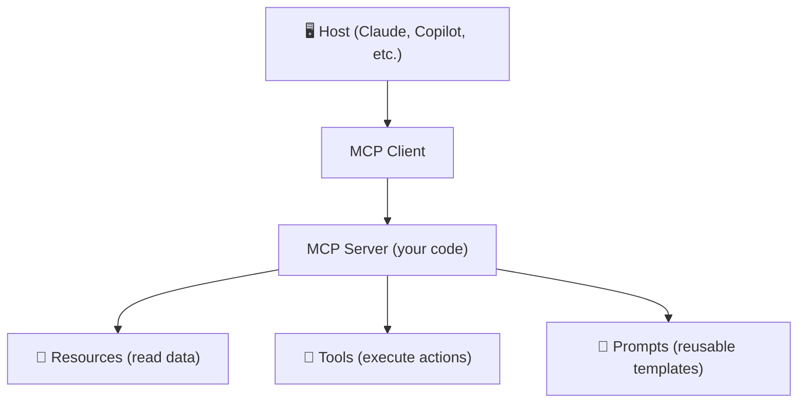
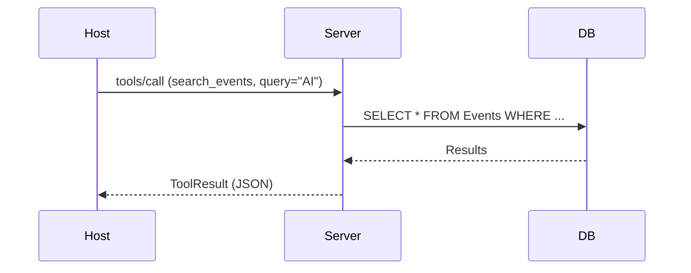

# Model Context Protocol (MCP) — Building AI-Ready APIs

## What Is MCP?

The **Model Context Protocol (MCP)** is an open protocol created by Anthropic that provides a standardized way
for AI assistants (like Claude, GitHub Copilot, or custom agents) to connect to external data sources and tools.

Think of MCP as the **"USB-C for AI"** — just as USB-C gives you one universal connector for all your devices,
MCP gives AI models one universal protocol to interact with any system: databases, APIs, file systems, or services.

### The Paradigm Shift

Traditional APIs are designed for **humans** building applications. MCP flips this:

- **REST/GraphQL**: A developer writes code that calls an API → displays results in a UI
- **MCP**: An AI agent autonomously discovers and calls tools → returns results in natural language

Instead of *you* writing HTTP requests, an AI assistant discovers what's available and calls the right
tool on your behalf. This is the foundation for **agentic AI** — AI that takes actions, not just answers questions.

### When to Use MCP

| Scenario | Use |
|----------|-----|
| Mobile/web app consuming your API | REST or GraphQL |
| Complex data queries with relationships | GraphQL |
| AI assistant interacting with your system | **MCP** |
| AI agent automating workflows | **MCP** |

---

## MCP Architecture



**Host** — The AI application (Claude Desktop, GitHub Copilot). Manages conversation and decides when to call MCP.
**Client** — Protocol handler in the host. Maintains a 1:1 connection with an MCP server via JSON-RPC.
**Server** — **This is what you build.** Exposes capabilities to AI assistants.

### Three Capability Types

| Capability | HTTP Equivalent | Example |
|------------|-----------------|---------|
| **Resources** | `GET /api/events` | List all TechConf events |
| **Tools** | `POST /api/events` | Create a new event |
| **Prompts** | — | "Summarize the event schedule" |

### Transport & Protocol

| Transport | Use Case |
|-----------|----------|
| **stdio** (stdin/stdout) | Local tools, CLI integrations |
| **SSE/HTTP** | Remote servers, web deployments |

Protocol: **JSON-RPC 2.0** over either transport.



---

## Setting Up an MCP Server in C#

```bash
dotnet new console -n TechConf.McpServer
cd TechConf.McpServer
dotnet add package ModelContextProtocol
dotnet add package Microsoft.Extensions.Hosting
```

```csharp
using Microsoft.Extensions.DependencyInjection;
using Microsoft.Extensions.Hosting;
using ModelContextProtocol;

var builder = Host.CreateApplicationBuilder(args);

builder.Services
    .AddMcpServer()
    .WithStdioServerTransport()
    .WithToolsFromAssembly()
    .WithPromptsFromAssembly();

await builder.Build().RunAsync();
```

The SDK discovers all `[McpServerTool]` and `[McpServerPrompt]` classes in your assembly automatically.

### Project Structure

```
TechConf.McpServer/
├── Program.cs              # Host setup
├── Tools/                  # CreateEventTool, SearchEventsTool, RegisterAttendeeTool
├── Prompts/                # SummarizeEventPrompt
├── Models/                 # Event, Session, Speaker
└── Data/                   # TechConfDbContext
```

Registered services are available via DI in tools and prompts:

```csharp
builder.Services.AddDbContext<TechConfDbContext>(options =>
    options.UseSqlite("Data Source=techconf.db"));
```

---

## Resources — Exposing Data

Resources let AI assistants **read data** from your system — like GET endpoints.

```csharp
[McpServerResourceType]
public class EventListResource
{
    private readonly TechConfDbContext _db;
    public EventListResource(TechConfDbContext db) => _db = db;

    [McpServerResource("events://list",
        Name = "Event List",
        Description = "All TechConf events with status and dates",
        MimeType = "application/json")]
    public async Task<ReadResourceResult> GetEventsAsync(
        RequestContext<ReadResourceRequestParams> request, CancellationToken ct)
    {
        var events = await _db.Events
            .OrderBy(e => e.StartDate)
            .Select(e => new {
                e.Id, e.Title, e.StartDate, e.Location, e.Status,
                SessionCount = e.Sessions.Count
            })
            .ToListAsync(ct);

        return new ReadResourceResult
        {
            Contents = [new TextResourceContents
            {
                Uri = "events://list",
                Text = JsonSerializer.Serialize(events),
                MimeType = "application/json"
            }]
        };
    }
}
```

### Resource Templates (Dynamic URIs)

Parameterized URIs work like route parameters in ASP.NET:

```csharp
[McpServerResourceType]
public class EventSessionsResource
{
    private readonly TechConfDbContext _db;
    public EventSessionsResource(TechConfDbContext db) => _db = db;

    [McpServerResource("events://{eventId}/sessions",
        Name = "Event Sessions",
        Description = "All sessions for a specific TechConf event")]
    public async Task<ReadResourceResult> GetSessionsAsync(
        RequestContext<ReadResourceRequestParams> request,
        string eventId, CancellationToken ct)
    {
        var sessions = await _db.Sessions
            .Where(s => s.EventId == Guid.Parse(eventId))
            .Select(s => new { s.Id, s.Title, s.StartTime, Speaker = s.Speaker.Name })
            .ToListAsync(ct);

        return new ReadResourceResult
        {
            Contents = [new TextResourceContents
            {
                Uri = $"events://{eventId}/sessions",
                Text = JsonSerializer.Serialize(sessions),
                MimeType = "application/json"
            }]
        };
    }
}
```

💡 Keep resource responses concise — large payloads consume the AI's context window.

---

## Tools — Executing Actions

Tools are the most powerful MCP capability — they let AI assistants **perform actions**.
Every tool needs a clear name and description because the AI uses these to decide *when* and *how* to call it.

```csharp
[McpServerTool(Name = "create_event")]
public static class CreateEventTool
{
    [McpServerTool,
     Description("Create a new TechConf event with title, dates, location, and capacity")]
    public static async Task<string> ExecuteAsync(
        TechConfDbContext db,
        [Description("The title of the event")] string title,
        [Description("Event description")] string? description,
        [Description("Start date in ISO 8601 format")] DateTime startDate,
        [Description("End date in ISO 8601 format")] DateTime endDate,
        [Description("Event location/venue")] string location,
        [Description("Maximum number of attendees")] int maxAttendees,
        CancellationToken ct)
    {
        var ev = new Event
        {
            Id = Guid.NewGuid(), Title = title, Description = description,
            StartDate = startDate, EndDate = endDate,
            Location = location, MaxAttendees = maxAttendees,
            Status = EventStatus.Draft
        };

        db.Events.Add(ev);
        await db.SaveChangesAsync(ct);
        return $"✅ Event '{title}' created with ID {ev.Id}";
    }
}
```

```csharp
[McpServerTool(Name = "search_events")]
public static class SearchEventsTool
{
    [McpServerTool,
     Description("Search TechConf events by keyword in titles and descriptions")]
    public static async Task<string> ExecuteAsync(
        TechConfDbContext db,
        [Description("Search keyword for event titles or descriptions")] string query,
        [Description("Maximum results to return")] int maxResults = 10,
        CancellationToken ct = default)
    {
        var results = await db.Events
            .Where(e => e.Title.Contains(query) || e.Description!.Contains(query))
            .OrderBy(e => e.StartDate).Take(maxResults)
            .Select(e => new { e.Id, e.Title, e.StartDate, e.Location, e.Status })
            .ToListAsync(ct);

        return results.Count == 0
            ? $"No events found matching '{query}'"
            : JsonSerializer.Serialize(results);
    }
}
```

```csharp
[McpServerTool(Name = "register_attendee")]
public static class RegisterAttendeeTool
{
    [McpServerTool,
     Description("Register an attendee for a TechConf event. Checks capacity limits.")]
    public static async Task<string> ExecuteAsync(
        TechConfDbContext db,
        [Description("The event ID to register for")] Guid eventId,
        [Description("Attendee's full name")] string name,
        [Description("Attendee's email address")] string email,
        CancellationToken ct)
    {
        var ev = await db.Events.Include(e => e.Registrations)
            .FirstOrDefaultAsync(e => e.Id == eventId, ct);

        if (ev is null) return $"❌ Event with ID {eventId} not found";
        if (ev.Registrations.Count >= ev.MaxAttendees)
            return $"❌ Event '{ev.Title}' is full ({ev.MaxAttendees} max)";
        if (ev.Registrations.Any(r => r.Email == email))
            return $"⚠️ {email} is already registered for '{ev.Title}'";

        db.Registrations.Add(new Registration
        {
            Id = Guid.NewGuid(), EventId = eventId,
            AttendeeName = name, Email = email, RegisteredAt = DateTime.UtcNow
        });
        await db.SaveChangesAsync(ct);
        return $"✅ {name} registered for '{ev.Title}'";
    }
}
```

### Best Practices for Tools

⚠️ **Descriptions are critical** — The AI reads `[Description]` attributes to understand parameters.
⚠️ **Validate inputs** — Never trust AI-provided values. Return clear error messages.
💡 **Return structured data** — JSON responses help the AI extract information accurately.
💡 **Keep tools focused** — One tool, one action.

---

## Prompts — Reusable Templates

Prompts provide **pre-built templates** that guide the AI's behavior for common tasks.

```csharp
[McpServerPrompt(
    Name = "summarize_event",
    Description = "Generate a comprehensive summary of a TechConf event")]
public static class SummarizeEventPrompt
{
    [McpServerPrompt]
    public static ChatMessage Execute(
        [Description("The event ID to summarize")] string eventId)
    {
        return new ChatMessage(ChatRole.User,
            $"""
            Please summarize the TechConf event with ID {eventId}.
            Include: title, dates, location, number of sessions,
            key speakers, and registration status.
            Use the available resources and tools to gather this information.
            """);
    }
}
```

```csharp
[McpServerPrompt(Name = "find_sessions_by_topic",
    Description = "Find and recommend sessions matching a topic or interest")]
public static class FindSessionsByTopicPrompt
{
    [McpServerPrompt]
    public static ChatMessage Execute(
        [Description("Topic or area of interest")] string topic,
        [Description("Skill level: beginner, intermediate, advanced")] string level = "any")
    {
        return new ChatMessage(ChatRole.User,
            $"Find TechConf sessions related to \"{topic}\" at the {level} level. " +
            "For each match, include title, speaker, time slot, and why it matches.");
    }
}
```

| Use a **Prompt** when… | Use a **Tool** when… |
|------------------------|---------------------|
| Guiding multi-step AI workflows | Performing a single action |
| Standardizing common user requests | Reading or writing data |
| The AI needs specific instructions | The result is deterministic |

---

## SSE Transport for Remote Servers

For **remote deployment**, use HTTP/SSE transport:

```csharp
var builder = WebApplication.CreateBuilder(args);

builder.Services.AddDbContext<TechConfDbContext>(options =>
    options.UseSqlite("Data Source=techconf.db"));

builder.Services
    .AddMcpServer()
    .WithHttpTransport()
    .WithToolsFromAssembly();

var app = builder.Build();
app.MapMcp();
app.Run();
```

### Transport Comparison

| Feature | stdio | SSE/HTTP |
|---------|-------|----------|
| **Use case** | Local tools, CLI | Remote servers, cloud |
| **Network** | None (same machine) | HTTP required |
| **Setup** | Simple | Needs auth + CORS |
| **Security** | OS-level isolation | TLS + authentication |
| **Scaling** | Single user | Multiple clients |

### Authentication for Remote Servers

```csharp
builder.Services.AddAuthentication().AddJwtBearer(options =>
{
    options.Authority = "https://your-identity-provider.com";
    options.Audience = "techconf-mcp";
});
app.MapMcp().RequireAuthorization();
```

### Connecting from Claude Desktop

Add to `claude_desktop_config.json` — local (stdio):

```json
{ "mcpServers": {
    "techconf": { "command": "dotnet", "args": ["run", "--project", "path/to/TechConf.McpServer"] }
}}
```

Remote (SSE):

```json
{ "mcpServers": {
    "techconf-remote": {
      "url": "https://your-server.com/mcp",
      "headers": { "Authorization": "Bearer YOUR_TOKEN" }
    }
}}
```

---

## Integrating with Existing ASP.NET Core APIs

MCP can run **alongside** your existing REST API, sharing services:

```csharp
var builder = WebApplication.CreateBuilder(args);

// Shared services
builder.Services.AddDbContext<TechConfDbContext>(options =>
    options.UseSqlite("Data Source=techconf.db"));
builder.Services.AddScoped<IEventService, EventService>();
builder.Services.AddOpenApi();

// MCP server
builder.Services.AddMcpServer()
    .WithHttpTransport()
    .WithToolsFromAssembly();

var app = builder.Build();

// REST API
app.MapOpenApi();
app.MapGroup("/api/events").MapEventEndpoints();
app.MapGroup("/api/sessions").MapSessionEndpoints();

// MCP endpoint
app.MapMcp();
app.Run();
```

MCP tools should be **thin wrappers** — reuse your existing service layer:

```csharp
[McpServerTool, Description("Create a new TechConf event")]
public static async Task<string> CreateEvent(
    IEventService eventService,
    [Description("Event title")] string title,
    [Description("Start date (ISO 8601)")] DateTime startDate,
    [Description("End date (ISO 8601)")] DateTime endDate,
    [Description("Venue/location")] string location, CancellationToken ct)
{
    var result = await eventService.CreateEventAsync(
        new CreateEventDto(title, startDate, endDate, location), ct);
    return result.IsSuccess ? $"✅ Created: {result.Value.Id}" : $"❌ {result.Error}";
}
```

💡 Both REST and MCP coexist — REST serves your UI, MCP serves AI agents.

---

## Testing MCP Servers

### MCP Inspector

The [MCP Inspector](https://github.com/modelcontextprotocol/inspector) lets you interactively debug:

```bash
npx @modelcontextprotocol/inspector dotnet run --project TechConf.McpServer
```

### Integration Testing

```csharp
[Fact]
public async Task SearchEvents_ReturnsMatchingEvents()
{
    await using var client = await McpClientFactory.CreateAsync(
        new McpClientOptions { ClientInfo = new("test-client", "1.0.0") },
        new StdioClientTransport(new StdioClientTransportOptions
        {
            Command = "dotnet",
            Arguments = ["run", "--project", "../TechConf.McpServer"]
        }));

    var tools = await client.ListToolsAsync();
    Assert.Contains(tools, t => t.Name == "search_events");

    var result = await client.CallToolAsync("search_events",
        new Dictionary<string, object?> { ["query"] = "AI", ["maxResults"] = 5 });
    Assert.NotNull(result);
}
```

- ✅ Test tools with valid and invalid inputs
- ✅ Test with an actual AI assistant — not just unit tests
- ✅ Verify the AI *understands* your parameter descriptions

---

## MCP vs REST vs GraphQL — Comparison

| Feature | REST | GraphQL | MCP |
|---------|------|---------|-----|
| **Consumer** | Humans/Apps | Humans/Apps | AI Agents |
| **Read data** | GET requests | Queries | Resources |
| **Write data** | POST/PUT/DELETE | Mutations | Tools |
| **Discovery** | OpenAPI/Swagger | Schema introspection | Capability listing |
| **Auth** | JWT / API Keys | JWT / API Keys | Transport-level |
| **Best for** | Web/mobile apps | Complex data queries | AI integrations |

MCP doesn't **replace** REST or GraphQL — it **complements** them. They share the same service layer.

---

## Common Pitfalls

⚠️ **Vague tool descriptions** — Write `"Search TechConf events by keyword in titles and descriptions"` not `"Search events"`.
⚠️ **Destructive tools without guards** — Require explicit confirmation parameters for dangerous operations.
⚠️ **Oversized responses** — Paginate and return summaries first, details on demand.
⚠️ **MCP is evolving** — Pin NuGet package versions and expect breaking changes.

💡 **Test with real AI assistants** — Unit tests verify code; testing with Claude verifies the AI *understands* your tools.
💡 **Thin MCP tools** — Don't duplicate business logic. Call `IEventService.CreateAsync()` from both REST and MCP.
💡 **Start with tools** — Tools are the most impactful capability. Add resources and prompts later.

---

## Try It Yourself

1. **Create the project** — `dotnet new console` + add `ModelContextProtocol` NuGet package
2. **Add tools** — `search_events` and `create_event` with validation
3. **Add a resource** — expose the event list as `events://list`
4. **Add a prompt** — `summarize_event` template for event summaries
5. **Test with MCP Inspector** — `npx @modelcontextprotocol/inspector dotnet run`
6. **Test with Claude Desktop** — add your server to `claude_desktop_config.json`
7. **Bonus**: Add SSE transport and run alongside your existing REST API

---

## Further Reading

- 📖 [MCP Specification](https://modelcontextprotocol.io)
- 💻 [C# SDK](https://github.com/modelcontextprotocol/csharp-sdk)
- 📝 [Building MCP with .NET](https://devblogs.microsoft.com/dotnet/build-a-model-context-protocol-mcp-server-in-csharp/) — Microsoft DevBlog
- 🛠️ [MCP Inspector](https://github.com/modelcontextprotocol/inspector)
- 🎓 [Anthropic MCP Docs](https://docs.anthropic.com/en/docs/agents-and-tools/mcp)
