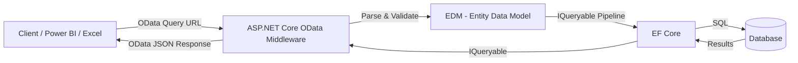

# OData — Standardized Query Protocol for REST APIs

## Introduction

**OData (Open Data Protocol)** is an [OASIS standard](https://www.oasis-open.org/committees/odata/) that defines best practices for building and consuming queryable REST APIs. Originally created by Microsoft, OData layers a **standardized query language** on top of HTTP/REST, allowing API consumers to filter, sort, paginate, and shape data using URL query parameters — without the API developer having to implement each combination manually.

OData is widely adopted in the enterprise world. Products like **Microsoft Power BI**, **Excel**, **SAP**, **Dynamics 365**, and **Azure DevOps** all expose or consume OData endpoints. When your API needs to serve as a **data source** for business intelligence tools or enterprise integrations, OData is often the natural choice.

### Why OData?

| Concern | Without OData | With OData |
|---------|---------------|------------|
| Filtering | Build custom query parameters per endpoint | `$filter` with standardized expression syntax |
| Field selection | Return everything or build custom DTOs | `$select=Id,Title,StartDate` |
| Sorting | Custom `?sort=` parameter | `$orderby=StartDate desc` |
| Pagination | Custom `?page=` / `?limit=` | `$top=10&$skip=20&$count=true` |
| Nested data | Multiple requests or custom `?include=` | `$expand=Sessions` |

> 💡 Think of OData as "SQL for REST APIs" — it gives consumers a powerful, standardized query language over HTTP while the server stays in control of what's allowed.

---

## Core Concepts

### Entity Data Model (EDM)

The **Entity Data Model** is OData's schema layer. It describes your API's data structure — entity types, properties, relationships, and operations — in a machine-readable format. In ASP.NET Core, the EDM is built using `ODataConventionModelBuilder` and served as a metadata document at `$metadata`.

The EDM serves a similar role to a GraphQL schema or an OpenAPI specification: it tells consumers exactly what data is available and how to query it.

### OData URL Conventions

OData defines a standardized set of **system query options**, all prefixed with `$`:

| Query Option | Purpose | Example |
|-------------|---------|---------|
| `$filter` | Server-side filtering with expressions | `$filter=Status eq 'Published'` |
| `$select` | Field projection (return only specific properties) | `$select=Id,Title,StartDate` |
| `$expand` | Include navigation properties (like EF Core `.Include()`) | `$expand=Sessions` |
| `$orderby` | Sort results | `$orderby=StartDate desc` |
| `$top` | Limit number of results | `$top=10` |
| `$skip` | Skip a number of results (for pagination) | `$skip=20` |
| `$count` | Include total count in response | `$count=true` |
| `$apply` | Aggregation and grouping | `$apply=groupby((Status))` |

### Architecture Overview



The key insight: OData query options are translated into **LINQ expressions** applied to `IQueryable<T>`. This means filtering, sorting, and paging happen **in the database** — not in memory.

---

## Setting Up OData in ASP.NET Core

### 1. Install the NuGet Package

```bash
dotnet add package Microsoft.AspNetCore.OData
```

### 2. Define Your Domain Models

```csharp
public class Event
{
    public Guid Id { get; set; }
    public string Title { get; set; } = string.Empty;
    public string? Description { get; set; }
    public DateTime StartDate { get; set; }
    public DateTime EndDate { get; set; }
    public string Location { get; set; } = string.Empty;
    public int MaxAttendees { get; set; }
    public string Status { get; set; } = "Draft"; // Draft, Published, Cancelled
    
    public ICollection<Session> Sessions { get; set; } = [];
    public ICollection<Registration> Registrations { get; set; } = [];
}

public class Session
{
    public Guid Id { get; set; }
    public string Title { get; set; } = string.Empty;
    public DateTime StartTime { get; set; }
    public DateTime EndTime { get; set; }
    public string Room { get; set; } = string.Empty;
    
    public Guid EventId { get; set; }
    public Event Event { get; set; } = null!;
    public Guid SpeakerId { get; set; }
    public Speaker Speaker { get; set; } = null!;
}

public class Speaker
{
    public Guid Id { get; set; }
    public string Name { get; set; } = string.Empty;
    public string Company { get; set; } = string.Empty;
    public string Bio { get; set; } = string.Empty;
    
    public ICollection<Session> Sessions { get; set; } = [];
}

public class Attendee
{
    public Guid Id { get; set; }
    public string Name { get; set; } = string.Empty;
    public string Email { get; set; } = string.Empty;
    
    public ICollection<Registration> Registrations { get; set; } = [];
}

public class Registration
{
    public Guid Id { get; set; }
    public DateTime RegisteredAt { get; set; }
    
    public Guid EventId { get; set; }
    public Event Event { get; set; } = null!;
    public Guid AttendeeId { get; set; }
    public Attendee Attendee { get; set; } = null!;
}
```

### 3. Configure OData in `Program.cs`

```csharp
using Microsoft.AspNetCore.OData;
using Microsoft.OData.ModelBuilder;

var builder = WebApplication.CreateBuilder(args);

// Build the EDM (Entity Data Model)
var modelBuilder = new ODataConventionModelBuilder();
modelBuilder.EntitySet<Event>("Events");
modelBuilder.EntitySet<Session>("Sessions");
modelBuilder.EntitySet<Speaker>("Speakers");
modelBuilder.EntitySet<Attendee>("Attendees");
modelBuilder.EntitySet<Registration>("Registrations");

// Register OData services
builder.Services.AddControllers()
    .AddOData(options => options
        .Select()       // Enable $select
        .Filter()       // Enable $filter
        .OrderBy()      // Enable $orderby
        .SetMaxTop(100) // Limit $top to 100
        .Count()        // Enable $count
        .Expand()       // Enable $expand
        .AddRouteComponents("odata", modelBuilder.GetEdmModel()));

var app = builder.Build();
app.MapControllers();
app.Run();
```

> ⚠️ **OData requires Controllers.** As of .NET 8/9, OData does **not** support Minimal APIs. The `[EnableQuery]` attribute, `ODataController` base class, and `Delta<T>` all rely on the MVC controller pipeline. This is one of OData's main architectural constraints.

### Entity Key Configuration

By convention, OData recognizes properties named `Id` or `{TypeName}Id` as entity keys. For custom keys:

```csharp
modelBuilder.EntityType<Event>().HasKey(e => e.EventCode);
```

---

## OData Controller Implementation

### Full CRUD Controller

```csharp
using Microsoft.AspNetCore.Mvc;
using Microsoft.AspNetCore.OData.Deltas;
using Microsoft.AspNetCore.OData.Query;
using Microsoft.AspNetCore.OData.Routing.Controllers;

public class EventsController : ODataController
{
    private readonly TechConfDbContext _db;

    public EventsController(TechConfDbContext db) => _db = db;

    // GET /odata/Events
    [EnableQuery(PageSize = 50)]
    public IQueryable<Event> Get()
        => _db.Events;

    // GET /odata/Events({key})
    [EnableQuery]
    public async Task<IActionResult> Get([FromRoute] Guid key)
    {
        var ev = await _db.Events.FindAsync(key);
        return ev is null ? NotFound() : Ok(ev);
    }

    // POST /odata/Events
    public async Task<IActionResult> Post([FromBody] Event ev)
    {
        _db.Events.Add(ev);
        await _db.SaveChangesAsync();
        return Created(ev);
    }

    // PATCH /odata/Events({key})
    public async Task<IActionResult> Patch([FromRoute] Guid key,
        [FromBody] Delta<Event> delta)
    {
        var ev = await _db.Events.FindAsync(key);
        if (ev is null) return NotFound();

        delta.Patch(ev);      // Apply only the changed properties
        await _db.SaveChangesAsync();
        return Updated(ev);
    }

    // PUT /odata/Events({key})
    public async Task<IActionResult> Put([FromRoute] Guid key,
        [FromBody] Event update)
    {
        var ev = await _db.Events.FindAsync(key);
        if (ev is null) return NotFound();

        _db.Entry(ev).CurrentValues.SetValues(update);
        await _db.SaveChangesAsync();
        return Updated(ev);
    }

    // DELETE /odata/Events({key})
    public async Task<IActionResult> Delete([FromRoute] Guid key)
    {
        var ev = await _db.Events.FindAsync(key);
        if (ev is null) return NotFound();

        _db.Events.Remove(ev);
        await _db.SaveChangesAsync();
        return NoContent();
    }
}
```

### Key Points

- **`IQueryable<T>` return type**: The `Get()` method returns `IQueryable`, not `IEnumerable`. This is critical — OData applies `$filter`, `$orderby`, etc. as LINQ expressions that translate to SQL. Returning `IEnumerable` would load all data into memory first.

- **`[EnableQuery]`**: This attribute activates OData query processing. Without it, query parameters are ignored. Options include:
  - `PageSize` — maximum results per page (server-driven paging)
  - `MaxTop` — maximum allowed `$top` value
  - `MaxExpansionDepth` — how deep `$expand` can nest
  - `AllowedQueryOptions` — whitelist specific query options
  - `AllowedFunctions` — restrict `$filter` functions (e.g., `contains`, `startswith`)

- **`Delta<T>`**: OData's approach to PATCH (partial update). `Delta<T>` tracks which properties the client sent and applies only those changes. This is more robust than manually checking for nulls.

---

## Query Examples

### Basic Filtering with `$filter`

```http
# Events with status "Published"
GET /odata/Events?$filter=Status eq 'Published'

# Events starting after June 2026
GET /odata/Events?$filter=StartDate gt 2026-06-01T00:00:00Z

# Events with capacity >= 100 AND status Published
GET /odata/Events?$filter=MaxAttendees ge 100 and Status eq 'Published'

# Events in a specific city (string function)
GET /odata/Events?$filter=contains(Location,'Munich')

# Events starting in 2026 (year function)
GET /odata/Events?$filter=year(StartDate) eq 2026
```

**Filter operators**: `eq`, `ne`, `gt`, `ge`, `lt`, `le`, `and`, `or`, `not`
**String functions**: `contains`, `startswith`, `endswith`, `tolower`, `toupper`, `length`
**Date functions**: `year`, `month`, `day`, `hour`, `minute`, `second`

### Field Selection with `$select`

```http
# Return only Id, Title, and StartDate
GET /odata/Events?$select=Id,Title,StartDate,Location

# Combine with filter
GET /odata/Events?$select=Title,StartDate&$filter=Status eq 'Published'
```

> 💡 `$select` reduces response size and can improve query performance — EF Core generates `SELECT` statements with only the requested columns.

### Navigation Property Expansion with `$expand`

```http
# Include sessions for each event
GET /odata/Events?$expand=Sessions

# Expand with nested $select — only session title and time
GET /odata/Events?$expand=Sessions($select=Title,StartTime;$orderby=StartTime)

# Nested expand — sessions with their speakers
GET /odata/Events?$expand=Sessions($expand=Speaker($select=Name,Company))

# Multiple expands
GET /odata/Events?$expand=Sessions,Registrations
```

### Sorting with `$orderby`

```http
# Sort by start date descending
GET /odata/Events?$orderby=StartDate desc

# Multi-level sort
GET /odata/Events?$orderby=Status asc,StartDate desc
```

### Pagination with `$top`, `$skip`, and `$count`

```http
# First page (10 items)
GET /odata/Events?$top=10&$skip=0&$count=true&$orderby=StartDate desc

# Second page
GET /odata/Events?$top=10&$skip=10&$count=true&$orderby=StartDate desc

# Just get the count
GET /odata/Events/$count
```

### Aggregation with `$apply`

```http
# Count events by status
GET /odata/Events?$apply=groupby((Status),aggregate($count as Count))

# Average capacity by status
GET /odata/Events?$apply=groupby((Status),aggregate(MaxAttendees with average as AvgCapacity))
```

### Putting It All Together

```http
# Published events in 2026, with sessions and speakers, sorted, paginated
GET /odata/Events
    ?$filter=Status eq 'Published' and year(StartDate) eq 2026
    &$select=Id,Title,StartDate,Location
    &$expand=Sessions($select=Title,StartTime;$expand=Speaker($select=Name))
    &$orderby=StartDate desc
    &$top=10
    &$skip=0
    &$count=true
```

### OData JSON Response Format

OData responses include metadata annotations:

```json
{
    "@odata.context": "https://localhost:5001/odata/$metadata#Events",
    "@odata.count": 42,
    "value": [
        {
            "Id": "a1b2c3d4-...",
            "Title": "TechConf 2026",
            "StartDate": "2026-09-15T09:00:00Z",
            "Location": "Munich Convention Center"
        }
    ],
    "@odata.nextLink": "https://localhost:5001/odata/Events?$skip=10&$top=10"
}
```

- **`@odata.count`**: Total number of matching entities (when `$count=true`)
- **`@odata.nextLink`**: URL for the next page (server-driven paging)
- **`@odata.context`**: Link to the metadata document describing the response shape

---

## OData Functions & Actions

OData supports custom operations beyond CRUD through **Functions** and **Actions**.

### Functions (GET, No Side Effects)

Functions are read-only operations invoked via GET. They are analogous to database functions.

```csharp
// EDM configuration in Program.cs
var eventType = modelBuilder.EntityType<Event>();

// Bound function — operates on a specific event
eventType
    .Function("AvailableSeats")
    .Returns<int>();

// Unbound function — not tied to a specific entity
modelBuilder
    .Function("UpcomingEventsCount")
    .Returns<int>();
```

```csharp
// Controller implementation
public class EventsController : ODataController
{
    // GET /odata/Events({key})/AvailableSeats
    [HttpGet]
    public async Task<IActionResult> AvailableSeats([FromRoute] Guid key)
    {
        var ev = await _db.Events
            .Include(e => e.Registrations)
            .FirstOrDefaultAsync(e => e.Id == key);
        if (ev is null) return NotFound();

        return Ok(ev.MaxAttendees - ev.Registrations.Count);
    }
}
```

```http
GET /odata/Events(a1b2c3d4-...)/AvailableSeats
```

### Actions (POST, With Side Effects)

Actions perform operations that modify state. They are invoked via POST.

```csharp
// EDM configuration
eventType
    .Action("Cancel")
    .Returns<Event>();

eventType
    .Action("Register")
    .Parameter<Guid>("AttendeeId")
    .EntityType.Collection
    .Action("BulkPublish");
```

```csharp
// Controller implementation
// POST /odata/Events({key})/Cancel
[HttpPost]
public async Task<IActionResult> Cancel([FromRoute] Guid key)
{
    var ev = await _db.Events.FindAsync(key);
    if (ev is null) return NotFound();

    ev.Status = "Cancelled";
    await _db.SaveChangesAsync();
    return Ok(ev);
}
```

### Bound vs Unbound

| Type | Bound | Unbound |
|------|-------|---------|
| Scope | Operates on a specific entity or collection | Standalone operation |
| URL | `/odata/Events({key})/Cancel` | `/odata/UpcomingEventsCount` |
| Defined on | `EntityType<T>()` | `modelBuilder` directly |
| Use case | Entity-specific logic | Global operations |

---

## Security & Query Limits

### Restricting Query Options

Without limits, OData consumers can craft expensive queries that overload your database. Always configure `[EnableQuery]` defensively:

```csharp
[EnableQuery(
    PageSize = 50,                           // Server-driven page size
    MaxTop = 100,                            // Max allowed $top
    MaxExpansionDepth = 3,                   // Prevent deep $expand chains
    AllowedQueryOptions = AllowedQueryOptions.Filter
        | AllowedQueryOptions.Select
        | AllowedQueryOptions.OrderBy
        | AllowedQueryOptions.Top
        | AllowedQueryOptions.Skip
        | AllowedQueryOptions.Count
        | AllowedQueryOptions.Expand,
    AllowedFunctions = AllowedFunctions.Contains
        | AllowedFunctions.StartsWith
        | AllowedFunctions.EndsWith
)]
public IQueryable<Event> Get() => _db.Events;
```

### Authentication & Authorization

OData controllers are standard ASP.NET Core controllers — use `[Authorize]` as usual:

```csharp
[Authorize]
public class EventsController : ODataController
{
    [EnableQuery]
    [Authorize(Policy = "ReadEvents")]
    public IQueryable<Event> Get() => _db.Events;

    [Authorize(Policy = "WriteEvents")]
    public async Task<IActionResult> Post([FromBody] Event ev) { /* ... */ }
}
```

### ⚠️ Security Considerations

- **Query injection**: OData `$filter` expressions are translated to SQL via EF Core. While EF Core parameterizes queries, always validate and limit allowed functions.
- **Data exposure**: `$select` and `$expand` can access any mapped property. Use `[NotMapped]` or `[IgnoreDataMember]` on sensitive fields, or use DTOs.
- **Denial of service**: Without `MaxTop` and `MaxExpansionDepth`, a single request like `$expand=Sessions($expand=Speaker($expand=Sessions($expand=...)))` can generate massive queries.

---

## OData vs REST vs GraphQL

| Feature | REST (Minimal APIs) | OData | GraphQL |
|---------|---------------------|-------|---------|
| **Query flexibility** | Fixed endpoints | URL query params | Query language |
| **Standards body** | None (conventions) | OASIS standard | GraphQL Foundation |
| **Field selection** | Custom implementation | `$select` built-in | By design |
| **Filtering** | Custom params | `$filter` standard | Filter types |
| **Nested data** | Multiple requests | `$expand` | Nested queries |
| **Pagination** | Custom implementation | `$top/$skip` standard | Cursor/offset |
| **Type system** | OpenAPI (optional) | EDM (required) | Schema (required) |
| **.NET integration** | Minimal APIs | Controllers (`ODataController`) | Hot Chocolate |
| **Partial updates** | Custom DTOs | `Delta<T>` built-in | Mutations |
| **Metadata** | OpenAPI doc | `$metadata` endpoint | Introspection |
| **Best for** | Simple CRUD, public APIs | Enterprise, data-heavy, BI tools | Complex nested data, mobile |
| **Learning curve** | Low | Medium | Medium-High |
| **HTTP caching** | Simple | Simple | Complex (POST-based) |
| **Tooling** | Swagger/OpenAPI | Power BI, Excel, SAP | Apollo, Relay |

### Decision Matrix

```
Need to serve Power BI / Excel / SAP?        → OData
Need standardized querying on tabular data?   → OData
Building a public API with simple CRUD?       → REST (Minimal APIs)
Frontend needs flexible nested data fetching? → GraphQL
Microservice-to-microservice communication?   → gRPC
```

---

## When to Use OData

### ✅ Best For

- **Enterprise APIs** consumed by Power BI, Excel, SAP, Dynamics 365 — these tools have native OData support and can query your API directly as a data source
- **Data-heavy applications** with many filter/sort/page combinations — OData provides these features out of the box instead of building dozens of custom endpoints
- **B2B integrations** where a standardized query protocol reduces integration effort — partners can query your API using a well-documented standard
- **Internal line-of-business apps** where users need ad-hoc reporting capabilities without custom endpoints for every query variation
- **Exposing existing EF Core models** — OData's `IQueryable` integration means minimal code to expose rich querying

### ❌ Not Ideal For

- **Simple public APIs** where REST Minimal APIs are simpler and sufficient
- **Complex nested data graphs** where GraphQL's query language is more expressive
- **High-performance microservice communication** where gRPC with Protocol Buffers is faster
- **Mobile apps with bandwidth constraints** where GraphQL's precise data fetching reduces payload sizes
- **APIs that need Minimal API features** — OData currently requires the MVC controller pipeline

---

## Common Pitfalls

### ⚠️ Not Setting `MaxTop`

Without `MaxTop`, a consumer can request `$top=1000000` and pull your entire database:

```csharp
// ❌ Dangerous — no limit on result size
[EnableQuery]
public IQueryable<Event> Get() => _db.Events;

// ✅ Safe — server-driven paging and top limit
[EnableQuery(PageSize = 50, MaxTop = 100)]
public IQueryable<Event> Get() => _db.Events;
```

### ⚠️ Unlimited `$expand` Depth

Deep expansion chains generate expensive JOINs:

```csharp
// ✅ Limit expansion depth
[EnableQuery(MaxExpansionDepth = 3)]
```

### ⚠️ Returning `IEnumerable` Instead of `IQueryable`

```csharp
// ❌ Loads ALL events into memory, then filters
[EnableQuery]
public IEnumerable<Event> Get() => _db.Events.ToList();

// ✅ Filters in the database
[EnableQuery]
public IQueryable<Event> Get() => _db.Events;
```

### ⚠️ Forgetting That OData Requires Controllers

OData does **not** work with Minimal APIs. If your project uses Minimal APIs elsewhere, you can mix both — just ensure `builder.Services.AddControllers()` and `app.MapControllers()` are configured.

### 💡 Always Test with Complex Queries

Before going to production, test queries like:
```http
GET /odata/Events?$expand=Sessions($expand=Speaker)&$filter=year(StartDate) eq 2026&$orderby=Title&$top=50
```
Check the generated SQL (use EF Core logging) to ensure it's efficient.

### 💡 Use the `$metadata` Endpoint

The metadata document at `/odata/$metadata` describes your entire EDM. It's invaluable for debugging and for tools like Power BI that auto-discover your API structure.

---

## Try It Yourself

1. **Set up OData** — Create a new ASP.NET Core project, add `Microsoft.AspNetCore.OData`, configure the EDM with `Event`, `Session`, and `Speaker` entity sets
2. **Query with `$filter`** — Retrieve only published events: `GET /odata/Events?$filter=Status eq 'Published'`
3. **Use `$select`** — Compare the response size of `GET /odata/Events` vs `GET /odata/Events?$select=Id,Title`
4. **Expand navigation properties** — Fetch events with sessions: `GET /odata/Events?$expand=Sessions($select=Title,StartTime)`
5. **Implement PATCH with `Delta<T>`** — Update only the status: `PATCH /odata/Events({key})` with body `{"Status": "Published"}`
6. **Add query limits** — Configure `[EnableQuery(PageSize = 20, MaxTop = 50, MaxExpansionDepth = 2)]` and verify that exceeding limits returns proper error responses
7. **Check the metadata** — Browse `/odata/$metadata` to see your EDM as XML
8. **Inspect generated SQL** — Enable EF Core logging and observe how `$filter` and `$orderby` translate to SQL `WHERE` and `ORDER BY` clauses

---

## Further Reading

- 📖 [OData Official Website](https://www.odata.org/) — specification, tutorials, and ecosystem overview
- 📖 [ASP.NET Core OData Documentation](https://learn.microsoft.com/en-us/odata/webapi-8/overview) — Microsoft's official OData for ASP.NET Core guide
- 📖 [OData Query Options Reference](https://learn.microsoft.com/en-us/odata/concepts/queryoptions-overview) — complete reference for `$filter`, `$select`, `$expand`, etc.
- 📖 [Microsoft.AspNetCore.OData GitHub](https://github.com/OData/AspNetCoreOData) — source code, issues, and samples
- 📖 [OData Connected Service](https://marketplace.visualstudio.com/items?itemName=marketplace.ODataConnectedService) — Visual Studio extension for generating OData client code
- 📖 [Power BI OData Feed Connector](https://learn.microsoft.com/en-us/power-bi/connect-data/desktop-connect-odata) — how Power BI consumes OData endpoints
