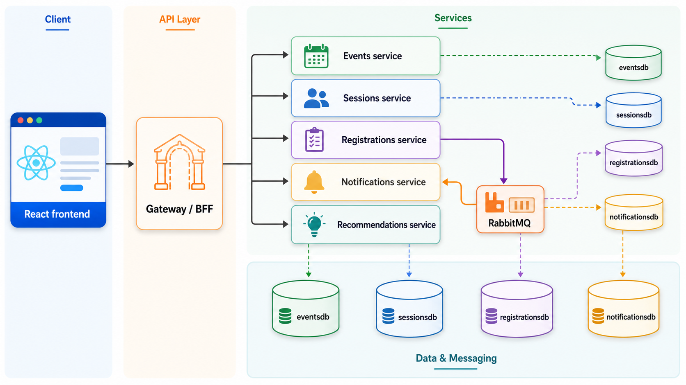

# TechConf Microservices Demo

Runnable reference demo for [Microservices](../../../extras/architecture/08-microservices.md).

The sample intentionally shows both sides of the trade:

- four business services with independent runtime boundaries,
- one simple Node.js microservice to show a polyglot boundary,
- one Gateway/BFF for the React app,
- separate service-owned PostgreSQL databases,
- RabbitMQ for the registration-to-notification handoff,
- Aspire orchestration, health checks, service discovery, logs, and traces.

## Architecture



## Run

```bash
cd demos/architecture/08-microservices/TechConf.Microservices.AppHost
dotnet run
```

Open the Aspire Dashboard, then launch the `web` endpoint.

## Useful Checks

```bash
dotnet build demos/architecture/08-microservices/TechConf.Microservices.slnx
npm --prefix demos/architecture/08-microservices/TechConf.Microservices.Web run build
```

After the app is running:

1. Open the React app from the Aspire Dashboard.
2. Select an event and session.
3. Notice the recommendations coming from the Node.js service.
4. Create a registration.
5. Refresh recent notifications.
6. Inspect Aspire traces and logs for the Gateway, Registrations, RabbitMQ, and Notifications path.

## Notes

- The services share DTO contracts, not tables.
- Each service owns a separate database, even though Aspire runs one local PostgreSQL container.
- The Gateway composes frontend-friendly views without giving the frontend direct access to every internal service.
- The notification workflow is intentionally asynchronous: registration succeeds before the notification service stores its record.
- The recommendations service is intentionally Node.js to show that a microservice boundary can use a different runtime when the contract is HTTP.
- `EnsureCreated` and deterministic seed data keep the demo easy to reset for class.
