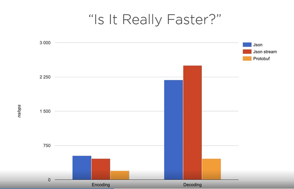
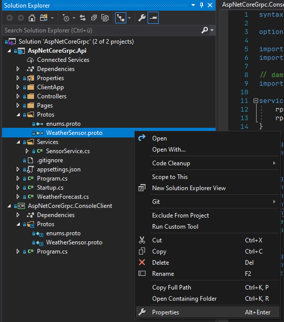
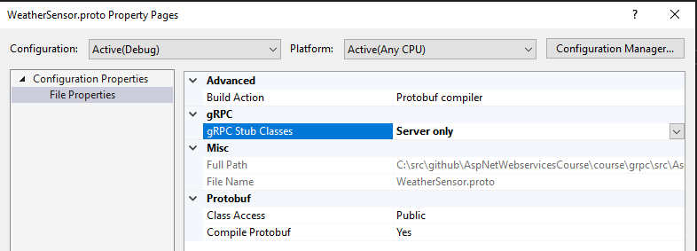
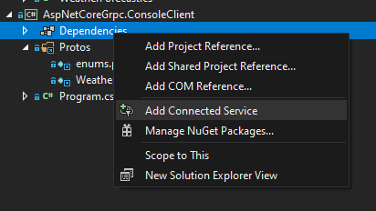

# gRPC

## Ansätze für verteilte APIs

- RPC
- Messaging, Queuing
- COM, DCOM, COBRA, JAVA RMI / .NET Remoting
- SOAP, REST
- GraphQL, ODATA
- gRPC

## gRPC

(Google) Remote Procedure Call


- Binäre Kommunikation
- Plattformübergreifend (Java, JavaScript (Node), Python, Go)
- Unterstützung für bidirektionales Streaming
- Nur über HTTPS/2 => TLS/SSL Zwang

## Wie passt gRPC in bestehende Ansätze?

- SignalR: Multicasting, bi-direktionale Kommunikation
- GraphQL / ODATA: „Web-Query-Language“
- REST: CRUD Web Applikationen
- gRPC: effizientes Streaming / Kommunikation zwischen Service-Komponenten

## Performance



## gRPC und protobuf

- gRPC nutzt Protocol Buffers (protobuf)
- Interface Definition Language
- erweiterbar und serialisierbar
- Sprach- und plattformneutral
- Nicht abhängig von gRPC
- Protobuf-net

https://github.com/protocolbuffers/protobuf/releases

## gRPC und .NET

Wie immer benötigen wir Nuget-Packages.

- `Grpc.AspNetCore`
- `Grpc.AspNetCore.Web`

## Protofiles

In `proto`-Files definieren wir das gewünschte Interface.

```proto
syntax = "proto3";

option csharp_namespace = "AspNetCoreGrpc.Api.Services";

import "google/protobuf/timestamp.proto";
import "google/protobuf/empty.proto";

// damit der Import funktioniert muss in der csproj der Rootfolder gesetzt werden.
import "enums.proto";

service SensorReadingService{
	rpc AddReading(SensorReadingPackage) returns (SensorResponseMessage);
	rpc GetUpdates(google.protobuf.Empty) returns (stream SensorReadingMessage);
}

message SensorReadingPackage{
	repeated SensorReadingMessage readings = 1;
}

message SensorReadingMessage{
	int32 sensorId = 1;
	int32 temperatureInC = 2;
	int32 humidity = 3;
	int32 atmosphericPressure= 4;
	SensorStatus sensorStatus = 5;
	google.protobuf.Timestamp timestamp = 6;
}

message SensorResponseMessage{
	bool success = 1;
	string message = 2;
}
```

## .NET Protogenerierung

Nun müssen wir der .net Build Pipeline mitteilen, was sie mit `.proto` machen soll.





Alternativ kann dies auch direkt in der \*.csproj durchgeführt werden.

```xml
<ItemGroup>
    <Protobuf Include="Protos\enums.proto" GrpcServices="None" ProtoRoot="Protos\" />
    <Protobuf Include="Protos\WeatherSensor.proto" GrpcServices="Server" ProtoRoot="Protos\" />
</ItemGroup>
```

Das setzen von `ProtoRoot` ist erforderlich so das abhängige `.proto` Dateien referenziert werden können.

Nun werden automatisch Typen durch den gRPC Compiler erstellt.
Wir können nun den Service implementieren.

## Implementieren des generierten GRPC-Services

Aus den `.proto` Dateien wird automatisch ein Services-Stub generiert. Dieser muss nun mit Leben gefüllt werden.

```csharp
public class SensorService: SensorReadingService.SensorReadingServiceBase
{

    public override Task<SensorResponseMessage> AddReading(SensorReadingPackage request, ServerCallContext context)
    {
        // Do Stuff
    }

    public override async Task GetUpdates(Empty request, IServerStreamWriter<SensorReadingMessage> responseStream, ServerCallContext context)
    {
        // Stream Stuff to the client
    }
}

```

## .NET Client Generierung

Clients lassen sich für .NET mit Hilfe der `Service References` erstellen.



Bei den Service References können nun alle `.proto` aus dem Service Projekt ausgewählt werden.
Und Visual Studio generiert uns einen Client für den Service.


Den generierten Client können wir nun verwenden, um mit dem Service zu kommunizieren.

```csharp
static async Task Main(string[] args)
{
    var channel = GrpcChannel.ForAddress("https://localhost:5001");
    var client = new SensorReadingService.SensorReadingServiceClient(channel);
    while (true)
    {

        var result = await client.AddReadingAsync(GetSensorReadingPackage());
        await Task.Delay(TimeSpan.FromSeconds(5));
    }
}
```

## JS Client

gRPC kann nicht direkt im Browser verwendet werden, da die Requests nicht fein genug gesteuert werden können, z.B. das zwingend eine HTTP/2 Verbindung aufgebaut werden muss.
web-grpc versucht diesen Umstand bis zur Findung einer geeigneten Lösung durch eine JS-Lib zu umgehen.

Dieser Ansatz wird als **_gRPC-Web_** bezeichnet. Mehr Informationen können hier gefunden werden [Link](https://grpc.io/blog/state-of-grpc-web/).

## Konfiguration in ASP.NET

gRPC ist als Middleware-Komponente verfügbar und kann wie folgt eingehängt werden.

```csharp
//👇 Fügt die benötigten Services hinzu
builder.Services.AddGrpc(options => options.EnableDetailedErrors = true);

//👇 CORS Policy, falls der Aufrufer nicht von der gleichen Domain stammt
builder.Services.AddCors(o => o.AddPolicy("AllowAll", builder =>
{
    builder.AllowAnyOrigin()
           .AllowAnyMethod()
           .AllowAnyHeader()
           .WithExposedHeaders("Grpc-Status", "Grpc-Message", "Grpc-Encoding", "Grpc-Accept-Encoding");
}));

```

Nun noch die Pipeline konfigurieren

```csharp
//👇 Konfiguration der gRPC-Pipeline
app.UseRouting();
app.UseCors();

//👇 Explizites hinzufügen der gRPC-Web-Unterstützung
app.UseGrpcWeb();

//👇 Einhängen von einem oder mehrerer gRPC Endpunkten, inkl. gRPC-Web-Support
app.UseEndpoints(endpoints =>
{
    app.MapGrpcService<SensorService>().EnableGrpcWeb().RequireCors("AllowAll");
});

```

Damit ist gRPC inkl. gRPC-Web für unseren Endpunkt verfügbar.

## gRPC Pro

- Kompakt und performant dankt binärer Messages
- Full-Duplex Streaming dank HTTP/2
- Interoperable zwischen verschiedenen Sprachen
- Perfekt für Service-to-Service Kommunikation

## gRPC Con

- Aufwändiger zu Implementieren wegen (noch) fehlender Tools
- Nur begrenze Anzahl an Sprachen werden aktuell unterstützt
- Browser können noch nicht die vollen Vorteile nutzen

## Ressourcen

Unter `src` findet Ihr eine komplette Beispiel Implementierung.
