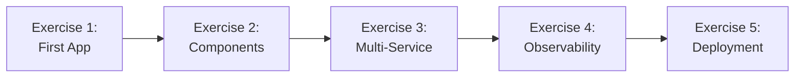

# .NET Aspire Hands-On Exercises

Welcome to the .NET Aspire hands-on exercises! These labs will guide you through building cloud-native applications using .NET Aspire.

## 📚 Learning Objectives

By completing these exercises, you will:

- Understand .NET Aspire architecture and project structure
- Build distributed applications with service defaults
- Integrate databases, caching, and messaging components
- Implement comprehensive observability (logs, metrics, traces)
- Deploy applications to Azure Container Apps
- Apply best practices for cloud-native development

## 🎯 Prerequisites

### Required Software

- **.NET 8.0 SDK** or later ([Download](https://dotnet.microsoft.com/download))
- **Docker Desktop** ([Download](https://www.docker.com/products/docker-desktop))
- **Visual Studio 2022** (17.9+) or **Visual Studio Code** with C# Dev Kit
- **Azure CLI** (for deployment exercises) ([Download](https://docs.microsoft.com/cli/azure/install-azure-cli))

### Required Knowledge

- C# and ASP.NET Core fundamentals
- Basic understanding of REST APIs
- Familiarity with Entity Framework Core
- Basic Docker concepts
- Git version control

### Verify Installation

Run these commands to verify your setup:

```bash
# Check .NET version (should be 8.0 or higher)
dotnet --version

# Check Docker
docker --version

# Install .NET Aspire workload
dotnet workload update
dotnet workload install aspire

# Verify Aspire templates
dotnet new list aspire
```

## 📖 Exercise Overview

### [Exercise 1: Your First Aspire Application](01_first_aspire_app.md)
**Duration:** 45-60 minutes  
**Difficulty:** Beginner

Create your first .NET Aspire application, explore the project structure, and understand the Aspire dashboard.

**Topics covered:**
- Creating an Aspire starter app
- Project structure and app host
- Service defaults and orchestration
- Dashboard exploration
- Basic health checks
- Simple service communication

### [Exercise 2: Adding Aspire Components](02_adding_components.md)
**Duration:** 60-90 minutes  
**Difficulty:** Intermediate

Integrate databases, caching, and messaging using Aspire components.

**Topics covered:**
- PostgreSQL integration with Entity Framework Core
- Redis caching and cache-aside pattern
- RabbitMQ messaging
- Component configuration
- Connection string management
- Testing integrated components

### [Exercise 3: Multi-Service E-Commerce Application](03_multi_service_app.md)
**Duration:** 90-120 minutes  
**Difficulty:** Intermediate to Advanced

Build a complete multi-service e-commerce application with microservices architecture.

**Topics covered:**
- Catalog API with database
- Cart API with caching
- Order API with messaging
- Blazor frontend
- Service-to-service communication
- End-to-end workflows
- Comprehensive observability

### [Exercise 4: Observability Deep Dive](04_observability_lab.md)
**Duration:** 60-90 minutes  
**Difficulty:** Intermediate

Master observability with custom metrics, traces, and structured logging.

**Topics covered:**
- Custom metrics with `Meter`
- Distributed tracing with `Activity`
- Structured logging with `ILogger`
- Dashboard for debugging
- Performance analysis
- Trace visualization

### [Exercise 5: Deployment to Azure](05_deployment_lab.md)
**Duration:** 90-120 minutes  
**Difficulty:** Advanced

Deploy your Aspire application to Azure Container Apps with CI/CD.

**Topics covered:**
- Azure Developer CLI (azd)
- Azure Container Apps deployment
- Azure Key Vault for secrets
- GitHub Actions CI/CD
- Production monitoring
- Blue-green deployment strategy

## 🚀 Getting Started

1. **Start with Exercise 1** and complete exercises sequentially
2. Each exercise builds on previous concepts
3. Read the **entire exercise** before starting
4. Follow verification steps to confirm your work
5. Reference [troubleshooting.md](troubleshooting.md) if you encounter issues

## 📁 Working Directory

Create a workspace for your exercises:

```bash
mkdir aspire-labs
cd aspire-labs
```

Each exercise will guide you to create new projects in this directory.

## ✅ Completion Checklist

Track your progress:

- [ ] Exercise 1: First Aspire Application
- [ ] Exercise 2: Adding Components
- [ ] Exercise 3: Multi-Service E-Commerce App
- [ ] Exercise 4: Observability Deep Dive
- [ ] Exercise 5: Deployment to Azure

## 📚 Additional Resources

- [troubleshooting.md](troubleshooting.md) - Common issues and solutions
- [faq.md](faq.md) - Frequently asked questions
- [resources.md](resources.md) - Additional learning materials

## 💡 Tips for Success

1. **Read error messages carefully** - They often contain the solution
2. **Use the Aspire dashboard** - It's your primary debugging tool
3. **Check Docker** - Ensure containers are running properly
4. **Commit frequently** - Use Git to save your progress
5. **Experiment** - Try modifying code to understand how things work
6. **Ask questions** - Use the discussion board or community channels

## 🆘 Getting Help

If you get stuck:

1. Check [troubleshooting.md](troubleshooting.md) for common issues
2. Review [faq.md](faq.md) for frequently asked questions
3. Consult the [official .NET Aspire documentation](https://learn.microsoft.com/dotnet/aspire/)
4. Ask in the course discussion forum
5. Check the [.NET Aspire GitHub repository](https://github.com/dotnet/aspire)

## 🎓 Learning Path



---

**Ready to start?** Head to [Exercise 1: Your First Aspire Application](01_first_aspire_app.md)!
